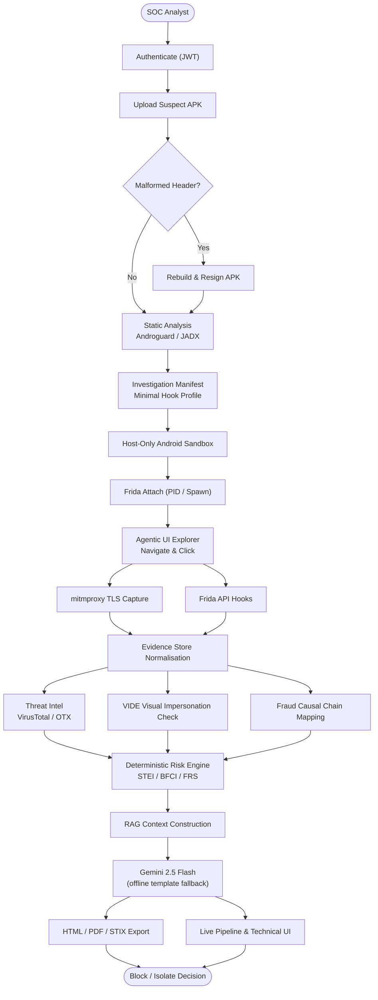

<div align="center">

# SUDARSHAN

**AI-Assisted Autonomous Mobile Fraud Investigation Platform**

*Prepared and Submitted for Bank of India and IIT Hyderabad under the BOI Hackathon 2026*

[](LICENSE)
[](backend/Dockerfile)
[](frontend/package.json)
[](docs/architecture/04_DYNAMIC_ANALYSIS_ENGINE.md)
[](docs/evaluation/11_EVALUATION.md)
[](docs/evaluation/CORPUS_STATIC_VALIDATION.md)

[github.com/SanTiwari07/Sudarshan](https://github.com/SanTiwari07/Sudarshan)

</div>

---

## The problem

A malicious Android app can complete account takeover, OTP theft, or overlay phishing **within 90 seconds** of installation. A fraud analyst typically opens the investigation days later.

Sudarshan closes that gap: upload an APK, and it decompiles the binary, detonates it in an instrumented sandbox, watches what it actually does at runtime, scores the behaviour deterministically, and hands the analyst a written case — end to end, unattended.

**The scores are never generated by an LLM.** Risk is computed by fixed formulas over observed evidence; the language model only explains what the maths already decided. That boundary is enforced by a determinism test that fails if identical evidence ever produces a different verdict.

---

## Measured detection accuracy

Against a labelled corpus of **17 real samples** — 8 live Android banking trojans (Anubis, Cerberus, Drinik, FluBot, Hook, Octo, SharkBot, Teabot) and 9 controls:

| Metric | Result |
| :--- | :--- |
| Malware flagged | **8 / 8** (missed 0) |
| False positives | **0 / 9** |
| Precision / Recall | **1.00 / 1.00** |

Reproduce it yourself with `python scripts/validate_corpus.py` — the results table is a build artifact, not a claim in prose. Full methodology, per-sample scores and limitations: **[docs/evaluation/CORPUS_STATIC_VALIDATION.md](docs/evaluation/CORPUS_STATIC_VALIDATION.md)**.

Two caveats stated up front, because they matter more than the headline:

- **These are static-only figures.** The dynamic axis — the one carrying the largest weight in a full analysis — contributes nothing to them.
- **The score ranges overlap.** Benign samples reach 25.95 while the lowest-scoring trojan sits at 14.00, so no numeric threshold separates the classes. Separation comes from the verdict floors, which refuse to certify a sample as safe when its code was never observed.

---

## Table of Contents

- [Architecture](#architecture)
- [Key capabilities](#key-capabilities)
- [Technology stack](#technology-stack)
- [Repository structure](#repository-structure)
- [Deterministic risk scoring](#deterministic-risk-scoring)
- [API overview](#api-overview)
- [Installation](#installation)
- [Documentation](#documentation)
- [Current limitations](#current-limitations)
- [License](#license)

---

## Architecture



Every stage has a fallback. A malformed APK is rebuilt and resigned; Androguard failure drops to regex manifest parsing; a Frida attach failure retries as a spawn; missing threat-intel keys cause that axis to be **excluded and the remaining weights renormalised** rather than scored as zero; and an unavailable Gemini key falls back to a static report template. The pipeline degrades instead of failing.

---

## Key capabilities

**Static analysis** — Dual decompilation via APKTool (resources, obfuscated assets) and JADX (DEX-to-Java across 10 fraud patterns), alongside MobSF and a native Androguard analyzer. A concealed-payload detector catches droppers whose manifests declare nothing: a nested APK/DEX shipped as a resource, or a max-entropy blob large relative to `classes.dex`.

**Dynamic sandbox** — Frida 17 instrumentation with ART boot-image deoptimization, an agentic UI explorer that navigates a 15-stage fraud goal DAG with screen-hash loop detection, and a mitmproxy sidecar decrypting TLS into merged HAR evidence.

**VIDE (Visual Impersonation Detection)** — Deterministic comparison of UI fingerprints against banking baselines, plus a signer registry that is *fail-closed*: a package with no provisioned certificate has its identity claim rejected rather than trusted.

**Deterministic scoring** — 5-axis STEI, volume-aware logarithmic BFCI v2, and a 4-axis FRS, with verdict floors that refuse to certify unobserved code as safe.

**Causal reconstruction** — Temporal chains (Overlay Phishing → SMS Theft → Account Takeover) mapped to MITRE ATT&CK for Mobile and rendered as an interactive timeline.

**Evidence-constrained RAG** — Gemini 2.5 Flash guarded by input sanitization so app-controlled strings cannot steer the narrative or invent a verdict.

---

## Technology stack

| Layer | Component | Technologies |
| :--- | :--- | :--- |
| **Frontend** | React 18 SPA | TypeScript, Vite, Tailwind CSS, React Router v6 |
| **API Gateway** | FastAPI | Python 3.11, Pydantic v2, PyJWT, Uvicorn, asyncio |
| **Storage** | Case store | SQLite WAL (`sudarshan.db`), async worker pool, file artifact store |
| **Shared core** | Domain engines | [`shared/sudarshan_core/`](shared/sudarshan_core/) mounted at `/opt/sudarshan-core` |
| **Static analysis** | Decompilers | MobSF (8008), Androguard, APKTool, JADX |
| **Visual detection** | VIDE pipeline | [`engines/vide/`](shared/sudarshan_core/engines/vide/) — UI profiles, baseline compare, VIDE-F001 |
| **Dynamic sandbox** | Instrumentation | Android emulator via `SandboxProvider`, ADB, Frida 17.16.4 |
| **Network** | Transparent proxy | mitmproxy sidecar (8080), HAR parser |
| **Risk** | Scoring engine | 5-axis STEI, BFCI v2, 4-axis FRS |
| **AI** | RAG + LLM | Gemini 2.5 Flash, in-memory knowledge base, offline fallback |

---

## Repository structure

```text
Sudarshan/
├── analysis-engine/              # Analysis microservice (Ubuntu 24.04, JDK 17, Python 3.12)
├── backend/
│   ├── app/
│   │   ├── ai/                   # Gemini RAG indexer & client
│   │   ├── auth/                 # JWT authentication & RBAC
│   │   ├── db/                   # SQLite persistence
│   │   ├── routes/               # upload, cases, report, intelligence, runtime
│   │   └── workers/              # Async analysis queue
│   └── tests/                    # Gateway pytest suite (CI-enforced)
├── shared/sudarshan_core/
│   ├── analyzers/                # Native APK analyzer
│   ├── engines/                  # Frida sandbox, risk engine, BFCI, workflow
│   ├── engines/vide/             # Visual impersonation pipeline
│   ├── validation/               # Labelled-corpus resolver & static scoring harness
│   ├── models/                   # Pydantic schemas
│   └── services/                 # MobSF client, threat correlator
├── frontend/src/                 # React SPA (pages, investigation panels)
├── tests/                        # Root pytest suite (unit + integration)
├── scripts/                      # validate_corpus.py, health checks, bootstrap
├── docs/                         # Documentation portal
└── docker-compose.yml            # frontend, backend, analysis-engine, MobSF, mitmproxy
```

---

## Deterministic risk scoring

AI writes the narrative; mathematics decides the score.

**Fraud Risk Score (FRS)** — nominal weights `0.25·STEI + 0.35·Dynamic + 0.20·ThreatCorrelation + 0.20·BankingImpact`, renormalised across whichever axes actually have data, then `min(base_frs × ai_confidence_multiplier, 100)`. See [`risk_engine.py`](shared/sudarshan_core/engines/risk_engine.py).

**Static Threat & Environmental Index (STEI)**

$$STEI = 0.60 \times CT + 0.20 \times BT + 0.10 \times PR + 0.05 \times OB + 0.05 \times IR$$

- **CT** — Credential theft: accessibility abuse, SMS read/write, overlay windows
- **BT** — Banking targeting: matches against 21 Indian banking package prefixes
- **PR** — Permission risk: ratio of dangerous permissions
- **OB** — Obfuscation: entropy of `classes.dex`, reflection, concealed payloads
- **IR** — Infrastructure: C2 domains and IPs recovered from bytecode

**Behavioural Fraud Confidence Index (BFCI v2)**

$$BFCI_{v2} = \min\left(100, \sum_{c} W_c \cdot \min\left(1, \frac{\ln(1 + N_c)}{\ln(1 + M_c)}\right) \times 100 + S_{seq}\right)$$

where $N_c$ is the observed event count for category $c$, $M_c$ its saturation threshold, $W_c$ its weight, and $S_{seq}$ a +15 bonus when a causal chain completes inside 30 seconds.

**Risk bands** — Safe ≤ 30, Suspicious ≤ 60, High Risk ≤ 89, Critical ≥ 90.

---

## API overview

FastAPI exposes versioned REST endpoints under `/api/v1`:

| Method | Endpoint | Description |
| :--- | :--- | :--- |
| `POST` | `/auth/login` | Authenticate and issue a JWT |
| `POST` | `/analyze` | Upload an APK, run synchronous analysis |
| `POST` | `/analyze/async` | Enqueue a job; poll `GET /status/{job_id}` |
| `GET` | `/cases` | Paginated case history |
| `GET` | `/cases/{sha256}` | Full stored case by hash |
| `GET` | `/cases/{sha256}/evidence` | Structured Frida evidence records |
| `GET` / `POST` | `/cases/{sha256}/notes` | Read or append analyst notes |
| `GET` | `/intelligence/{sha256}` | Threat-intel correlation |
| `GET` | `/report/html/{sha256}` | Standalone HTML report |
| `GET` | `/report/pdf/{sha256}` | PDF export |
| `POST` | `/chat/stream` | RAG-grounded AI investigator (SSE) |
| `GET` | `/api/runtime/status` | Live pipeline / instrumentation snapshot |

Interactive docs at `http://localhost:8000/docs` once running.

---

## Installation

### Prerequisites

- **Docker Desktop** with Compose
- **A rooted Android emulator** — Android Studio AVD or Genymotion, x86_64, with `frida-server` running
- **ADB** on your host PATH (the containers talk to the host's ADB server)
- *Optional:* Python 3.11+ and Node 18+ for local development

> [!NOTE]
> APKTool, JADX, Java 17, Androguard and Frida are all containerised inside `sudarshan-analysis-engine`. The only host tool required is **ADB**, which must be present because the emulator runs on the host while analysis runs in a container.

### Quick start

```bash
docker compose up -d --build
```

Or use the bootstrapper, which additionally provisions the emulator and pushes `frida-server`:

```powershell
.\start.ps1
```

Compose requires a root `.env` — copy `.env.example` and set `JWT_SECRET_KEY` at minimum. `GEMINI_API_KEY` is optional; without it the platform falls back to a static report template.

### Running the tests

```bash
docker compose exec backend python -m pytest backend/tests tests/unit -q
```

**920 tests collected**, of which **525 are enforced in CI** — CI currently runs only `backend/tests`, so the root `tests/` suite must be run locally. That gap is tracked in [`docs/FEATURE.md`](docs/FEATURE.md) §29.

### Interfaces

| Interface | URL |
| :--- | :--- |
| Analyst dashboard | `http://localhost:5173` |
| API docs | `http://localhost:8000/docs` |
| MobSF | `http://localhost:8008` |
| mitmproxy | `127.0.0.1:8080` |

---

## Documentation

The full portal lives in [`docs/`](docs/README.md).

| Document | Contents |
| :--- | :--- |
| [**Master Knowledge Base**](docs/SUDARSHAN_MASTER.md) | 58-section consolidated reference |
| [**Feature & Capability Doc**](docs/FEATURE.md) | Complete feature catalogue with per-item implementation status and evidence |
| [**Corpus Detection Validation**](docs/evaluation/CORPUS_STATIC_VALIDATION.md) | Measured accuracy against 17 labelled samples |
| [**Architecture**](docs/ARCHITECTURE.md) | Container topology, data flow, module map |
| [**Dynamic Analysis Engine**](docs/architecture/04_DYNAMIC_ANALYSIS_ENGINE.md) | Frida attach ladder, ART deopt, mitmproxy, agentic explorer |
| [**Deterministic Risk Engine**](docs/architecture/08_DETERMINISTIC_RISK_ENGINE.md) | STEI, BFCI v2, FRS derivations |
| [**VIDE**](docs/architecture/VIDE.md) | Baseline compare, VIDE-F001, signer registry |
| [**Evaluation Strategy**](docs/evaluation/11_EVALUATION.md) | Test suite, benchmarks, determinism baselines |
| [**How to Run**](docs/HOW_TO_RUN.md) | Full installation and operations guide |

---

## Current limitations

Stated here rather than buried, because a reviewer will find them anyway:

- **Single node.** Persistence is one SQLite file and the queue is in-process. Horizontal scaling needs Postgres and a real broker — see [`SUDARSHAN_MASTER.md`](docs/SUDARSHAN_MASTER.md) §40.
- **YARA scanning is not implemented.** The scanner is wired in but ships with zero rules and logs that it is disabled.
- **VIDE baselines are lab-scope.** Three demo bank baselines; the signer registry is deliberately unprovisioned and fail-closed.
- **Threat-intel caching misses 404s**, so unknown-to-VirusTotal samples are re-queried each run.
- **The agentic explorer completes 2–3 actions** inside its 90-second budget, bounded by per-iteration latency rather than the action budget.

A per-feature status table with evidence for each claim is maintained in [`docs/FEATURE.md`](docs/FEATURE.md) §31–32.

---

## License

Distributed under the [MIT License](LICENSE). Prepared for Bank of India and IIT Hyderabad, BOI Hackathon 2026.
