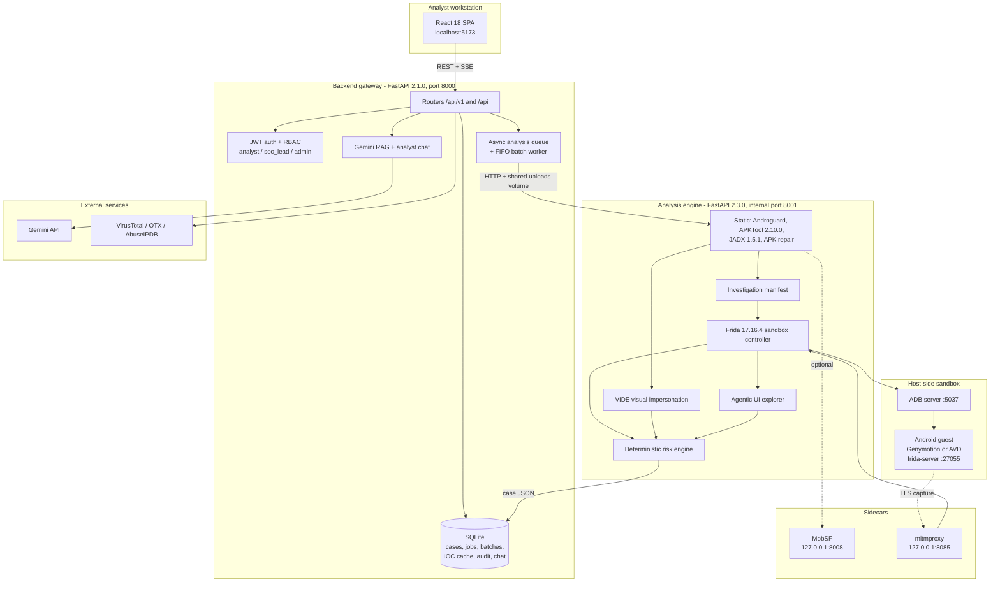
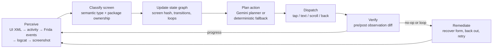
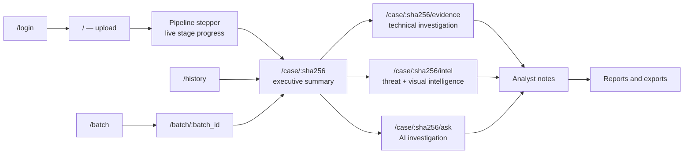

<div align="center">


# SUDARSHAN

**Autonomous Android fraud investigation platform for banking security teams**

SUDARSHAN ingests a suspect APK, decompiles it, detonates it on an instrumented Android sandbox, records what it does at runtime, scores the observed behaviour with fixed formulas, and produces an evidence-linked case file. The language model writes the narrative; it never computes the score.

[Overview](#overview) ·
[Architecture](#architecture) ·
[Pipeline](#analysis-pipeline) ·
[Dynamic analysis](#dynamic-analysis) ·
[Risk model](#deterministic-risk-model) ·
[Install](#installation) ·
[Docs](#documentation-map)

[](LICENSE)
[](backend/Dockerfile)
[](frontend/package.json)
[](docs/architecture/04_DYNAMIC_ANALYSIS_ENGINE.md)

</div>

---

## Contents

- [Overview](#overview)
- [Core capabilities](#core-capabilities)
- [Architecture](#architecture)
- [Analysis pipeline](#analysis-pipeline)
- [Detection coverage](#detection-coverage)
- [Dynamic analysis](#dynamic-analysis)
- [Deterministic risk model](#deterministic-risk-model)
- [AI investigation](#ai-investigation)
- [Enterprise batch scanning](#enterprise-batch-scanning)
- [Analyst workflow](#analyst-workflow)
- [Reports and exports](#reports-and-exports)
- [Security architecture](#security-architecture)
- [Technology stack](#technology-stack)
- [Repository structure](#repository-structure)
- [Installation](#installation)
- [Quick start](#quick-start)
- [Dynamic sandbox setup](#dynamic-sandbox-setup)
- [Configuration](#configuration)
- [API overview](#api-overview)
- [Testing](#testing)
- [Measured detection accuracy](#measured-detection-accuracy)
- [Documentation map](#documentation-map)
- [Limitations](#limitations)
- [Development](#development)
- [License](#license)
- [Project status](#project-status)

---

## Overview

An Android banking trojan can complete overlay phishing, credential capture and OTP interception within the first minutes after install. A fraud analyst usually opens the case days later, working from a hash and a screenshot.

SUDARSHAN closes that gap. It is an analyst-facing platform, not a scanner: a submitted APK produces a case with a verdict, a numeric risk score, the evidence records behind each finding, a reconstructed fraud workflow mapped to MITRE ATT&CK for Mobile, and an exportable report.

**Who it is for.** Bank fraud and SOC teams triaging suspicious mobile applications; CERT and threat-intelligence analysts who need indicators and attribution evidence; malware researchers who need reproducible dynamic runs.

**What it analyses.** Android banking trojans and the fraud primitives they share — accessibility-service abuse, screen overlays, SMS and OTP interception, credential harvesting, dynamic code loading, C2 beaconing, sandbox evasion, and visual impersonation of banking brands.

**What distinguishes the architecture.**

1. **The score is deterministic.** Risk is computed by fixed weighted formulas over observed evidence in [`risk_engine.py`](shared/sudarshan_core/engines/risk_engine.py). The Gemini layer explains the result; it has no path into the numbers. Replay of identical evidence produces an identical verdict, and a determinism test asserts it.
2. **Absence of evidence is not treated as evidence of absence.** A sandbox run that observes nothing does not certify a sample as safe. Four safety floors and an Execution Assertion Matrix distinguish "we watched and it was clean" from "we never got the sample to run".
3. **Every axis degrades independently.** A missing threat-intel key excludes that axis and renormalises the remaining weights rather than scoring it zero. A malformed APK is repaired and resigned. A Frida attach failure retries down a launch ladder. An unavailable model key falls back to a deterministic narrative.

---

## Core capabilities

<details>
<summary><b>Ingestion and static analysis</b></summary>

<br>

| Capability | Implementation |
| :--- | :--- |
| APK upload with ZIP magic validation, size cap, server-side SHA-256 | [`backend/app/routes/upload.py`](backend/app/routes/upload.py) |
| Malformed AXML / string-table repair and resign | [`engines/apk_repair.py`](shared/sudarshan_core/engines/apk_repair.py) |
| Native Androguard analysis — manifest, permissions, components, entropy, hardcoded indicators | [`analyzers/apk_analyzer.py`](shared/sudarshan_core/analyzers/apk_analyzer.py) |
| APKTool 2.10.0 resource and smali extraction | [`engines/apktool_engine.py`](shared/sudarshan_core/engines/apktool_engine.py) |
| JADX 1.5.1 DEX-to-Java decompilation and fraud-pattern scanning | [`engines/jadx_engine.py`](shared/sudarshan_core/engines/jadx_engine.py) |
| MobSF enrichment (optional; pipeline runs without it) | [`services/mobsf_client.py`](shared/sudarshan_core/services/mobsf_client.py) |
| Investigation manifest — the minimal hook profile for the dynamic run | [`models/manifest.py`](shared/sudarshan_core/models/manifest.py) |
| Concealed-payload detection — nested APK/DEX in assets, high-entropy blobs | [`analyzers/apk_analyzer.py`](shared/sudarshan_core/analyzers/apk_analyzer.py) |
| URL/domain discovery and crawler-based APK ingestion | [`backend/app/services/discovery/`](backend/app/services/discovery/) |

</details>

<details>
<summary><b>Dynamic sandbox and deep exploration</b></summary>

<br>

| Capability | Implementation |
| :--- | :--- |
| Sandbox provider abstraction — Genymotion, Android Studio AVD, physical, auto-detect | [`sandbox/factory.py`](shared/sudarshan_core/sandbox/factory.py) |
| Frida 17 instrumentation with a pre-compiled Java-bridge hook bundle | [`engines/frida_hooks/banking_trojan.bundle.js`](shared/sudarshan_core/engines/frida_hooks/) |
| ART deoptimization gate before hook installation | [`engines/frida_sandbox.py`](shared/sudarshan_core/engines/frida_sandbox.py) |
| Exact PID resolution and stability check before attach | [`engines/frida_sandbox.py`](shared/sudarshan_core/engines/frida_sandbox.py) |
| Explicit 16-state DAE pipeline with logged transitions | [`engines/dae_pipeline.py`](shared/sudarshan_core/engines/dae_pipeline.py) |
| Five-level perception pipeline (UI XML → activity → Frida events → logcat → screenshot) | [`agentic/perception.py`](shared/sudarshan_core/engines/agentic/perception.py) |
| Semantic screen classification with package-ownership context | [`agentic/screen_classifier.py`](shared/sudarshan_core/engines/agentic/screen_classifier.py) |
| Screen-hash state graph, transition DAG, loop detection | [`agentic/screen_graph.py`](shared/sudarshan_core/engines/agentic/screen_graph.py) |
| Canonical action dispatch and post-action verification | [`agentic/action_dispatch.py`](shared/sudarshan_core/engines/agentic/action_dispatch.py), [`action_verifier.py`](shared/sudarshan_core/engines/agentic/action_verifier.py) |
| Synthetic victim profile and persona seeding | [`agentic/victim_profile.py`](shared/sudarshan_core/engines/agentic/victim_profile.py), [`engines/persona.py`](shared/sudarshan_core/engines/persona.py) |
| Anti-evasion probing and device-state simulation | [`engines/anti_evasion.py`](shared/sudarshan_core/engines/anti_evasion.py), [`device_state_simulator.py`](shared/sudarshan_core/engines/device_state_simulator.py) |
| Execution Assertion Matrix — which fraud trigger conditions were reached | [`engines/execution_assertions.py`](shared/sudarshan_core/engines/execution_assertions.py) |
| mitmproxy sidecar with HAR ingest | [`engines/network_capture.py`](shared/sudarshan_core/engines/network_capture.py) |

</details>

<details>
<summary><b>Evidence, intelligence and scoring</b></summary>

<br>

| Capability | Implementation |
| :--- | :--- |
| Runtime event bus and normalised evidence store | [`engines/event_bus.py`](shared/sudarshan_core/engines/event_bus.py), [`evidence_store.py`](shared/sudarshan_core/engines/evidence_store.py) |
| Screenshot capture, dedup policy, captions, audit | [`engines/screenshot_manager.py`](shared/sudarshan_core/engines/screenshot_manager.py) |
| Fraud workflow reconstruction into causal stages | [`engines/workflow_reconstructor.py`](shared/sudarshan_core/engines/workflow_reconstructor.py) |
| MITRE ATT&CK for Mobile technique mapping | [`engines/mitre_mapper.py`](shared/sudarshan_core/engines/mitre_mapper.py) |
| VirusTotal / AlienVault OTX / AbuseIPDB correlation with a 24-hour SQLite IOC cache | [`services/threat_correlator.py`](shared/sudarshan_core/services/threat_correlator.py) |
| Deterministic malware-family classifier | [`engines/classification_engine.py`](shared/sudarshan_core/engines/classification_engine.py) |
| VIDE — visual impersonation detection against a banking baseline corpus | [`engines/vide/`](shared/sudarshan_core/engines/vide/) |
| Visual evidence linking — findings to screenshots and claims | [`visual_evidence/`](shared/sudarshan_core/visual_evidence/) |
| STEI, BFCI v2, FRS, safety floors, escalation rules | [`engines/risk_engine.py`](shared/sudarshan_core/engines/risk_engine.py), [`bfci_scorer.py`](shared/sudarshan_core/engines/bfci_scorer.py) |

</details>

<details>
<summary><b>AI, reporting and operations</b></summary>

<br>

| Capability | Implementation |
| :--- | :--- |
| Gemini provider manager — primary/fallback slots, circuit breaker, cooldown, retries | [`ai/gemini_provider.py`](shared/sudarshan_core/ai/gemini_provider.py) |
| Evidence-grounded RAG index and streaming analyst chat | [`backend/app/ai/gemini_rag.py`](backend/app/ai/gemini_rag.py) |
| Banking knowledge base (MITRE, RBI, CERT-In, NPCI, family profiles) | [`backend/app/rag/knowledge_base.py`](backend/app/rag/knowledge_base.py) |
| Prompt-injection sanitizer at the single untrusted-content choke point | [`agentic/sanitizer.py`](shared/sudarshan_core/engines/agentic/sanitizer.py) |
| ReportLab PDF and standalone HTML reports | [`engines/pdf_generator.py`](shared/sudarshan_core/engines/pdf_generator.py), [`report_generator.py`](shared/sudarshan_core/engines/report_generator.py) |
| STIX 2.1, IOC CSV/TXT, YARA, Suricata, Snort, MITRE JSON exports | [`backend/app/routes/report.py`](backend/app/routes/report.py) |
| Enterprise batch scanning with a FIFO worker | [`backend/app/routes/batch.py`](backend/app/routes/batch.py), [`workers/batch_worker.py`](backend/app/workers/batch_worker.py) |
| JWT auth, three-tier RBAC, session revocation, audit log | [`backend/app/auth/auth.py`](backend/app/auth/auth.py), [`services/audit_service.py`](backend/app/services/audit_service.py) |
| Case history, analyst notes, verdict override, assignment | [`backend/app/routes/cases.py`](backend/app/routes/cases.py) |
| Runtime telemetry API for live pipeline observation | [`backend/app/routes/runtime_api.py`](backend/app/routes/runtime_api.py) |

</details>

---

## Architecture



The frontend, backend, analysis engine, MobSF and mitmproxy run as Docker Compose services. The Android guest runs on the host, not in a container; the analysis engine reaches it through the host ADB server. Only the frontend and backend publish ports on all interfaces — MobSF and mitmproxy bind to loopback, and the analysis engine is not published at all.

The bundled `frontend` image runs the Vite dev server (`npm run dev -- --host`) against a bind-mounted source tree. It is a development and demonstration container, not a production static build.

---

## Analysis pipeline

```mermaid
flowchart TD
    A["APK upload or crawler ingest"] --> B["Validation<br/>ZIP magic, size cap, SHA-256"]
    B --> C{"Manifest parseable?"}
    C -->|No| D["APK repair<br/>rebuild AXML, resign"]
    C -->|Yes| E
    D --> E["Static analysis<br/>Androguard + APKTool + JADX<br/>(+ MobSF if reachable)"]
    E --> F["Investigation manifest<br/>minimal hook profile"]
    F --> G{"Sandbox reachable?"}
    G -->|No| M
    G -->|Yes| H["Sandbox preparation<br/>install, permissions, launch ladder"]
    H --> I["Frida attach<br/>exact PID, ART deopt, hook verify"]
    I --> J["Deep UI exploration<br/>perceive, classify, act, verify"]
    J --> K["Runtime evidence<br/>event bus, evidence store, screenshots"]
    K --> L["Execution assertions<br/>which triggers were reached"]
    L --> M["Threat intelligence correlation<br/>VT / OTX / AbuseIPDB"]
    M --> N["Visual intelligence<br/>VIDE baseline + corpus compare"]
    N --> O["Workflow reconstruction<br/>causal chain + MITRE mapping"]
    O --> P["Deterministic scoring<br/>STEI, BFCI v2, FRS"]
    P --> Q["Safety floors<br/>visibility, static evidence, evasion,<br/>incomplete exercise"]
    Q --> R["Grounded AI narrative<br/>or deterministic fallback"]
    R --> S["Persistence<br/>case, IOCs, runtime events, artifacts"]
    S --> T["Reporting<br/>PDF, HTML, STIX, IOC, rules"]
    T --> U["Analyst investigation<br/>evidence, intel, chat, notes"]
```

<details open>
<summary><b>End-to-end flow</b></summary>

<br>



</details>

The dynamic branch is optional at every step. When the sandbox is unreachable, the run proceeds static-only, the dynamic axis is excluded from the score, and the remaining weights are renormalised — see [Deterministic risk model](#deterministic-risk-model).

---

## Detection coverage

Detection categories below are those the codebase actually implements, with their primary evidence source.

| Category | Static evidence | Runtime evidence |
| :--- | :--- | :--- |
| Accessibility-service abuse | `BIND_ACCESSIBILITY_SERVICE`, service declarations, JADX pattern hits | `AccessibilityService`, `AccessibilityNodeInfo`, `performGlobalAction` hooks |
| SMS and OTP interception | `READ_SMS` / `RECEIVE_SMS` / `SEND_SMS`, `SMS_RECEIVED` receivers | `SmsMessage.createFromPdu`, `content://sms`, OTP text signals |
| Screen overlays | `SYSTEM_ALERT_WINDOW`, overlay window types | `WindowManager.addView`, `TYPE_APPLICATION_OVERLAY` |
| Banking-app targeting | Bank package prefixes referenced in manifest and DEX | Foreground package transitions into targeted apps |
| Dynamic code loading and reflection | `DexClassLoader`, `PathClassLoader`, reflection strings | `DexClassLoader`, `InMemoryDexClassLoader` hook hits (scored via the `code_execution` axis) |
| Native library loading | `System.loadLibrary`, `.so` inventory, entropy | `execve`, `Runtime.exec`, `ProcessBuilder.start` |
| C2 communication | Hardcoded URLs, domains and IPs recovered from bytecode | Socket and HTTP hooks, mitmproxy HAR |
| Anti-analysis and evasion | Emulator/debugger/root check strings | `anti_analysis` events, device-fingerprint reads |
| Credential and PII theft | Credential-shaped strings, contact/call-log permissions | Form entry observation, `ContactsContract`, `CallLog` reads |
| Visual impersonation | Layout AST, UI strings, palette vs. banking baselines (VIDE) | WebView HTML overlays captured by the live probe |
| Brand identity fraud | Signer registry — an unprovisioned certificate fails closed | — |
| Fraud workflows | — | Temporal chains: OTP theft, overlay-banking, account takeover, dropper |

Concealed payloads (nested APK/DEX in assets, high-entropy blobs sized relative to `classes.dex`) are flagged statically and drive the visibility floor.

---

## Dynamic analysis

The dynamic engine is the part of the platform most sensitive to environment, and it is documented here in the terms it actually behaves.

### Sandbox provider abstraction

`SandboxProvider` ([`sandbox/provider.py`](shared/sudarshan_core/sandbox/provider.py)) isolates device lifecycle from analysis logic. Registered providers:

| `SANDBOX_PROVIDER` value | Provider class | Notes |
| :--- | :--- | :--- |
| `auto` (default) | `AutoDetectProvider` | Probes `adb devices` and selects Genymotion or AVD |
| `genymotion` | `GenymotionProvider` | VM on a VirtualBox host-only adapter, e.g. `192.168.56.101:5555` |
| `android_avd`, `android_studio`, `avd`, `emulator` | `AndroidStudioProvider` | Standard `emulator-5554` style serials |
| `physical` | `PhysicalDeviceProvider` | Attached rooted device |
| `corellium`, `waydroid`, `future` | Placeholder classes | Not usable backends; present as extension points |

### Instrumentation

- **Frida 17.16.4** on host and guest. The version is pinned in both Dockerfiles and both `requirements.txt` files; the pushed `frida-server` must match exactly.
- Frida 17 removed the built-in `Java` global, so classic `Java.perform` scripts do not run. The controller loads the **pre-compiled bundle** `banking_trojan.bundle.js`, built with `frida-compile` against `frida-java-bridge`. Raw `.js` hook sources are kept for authoring only.
- Frida 16 is not an option here: it cannot link on 16 KB page-size devices.
- **ART deoptimization** is performed before hooks are installed so that AOT-compiled framework methods are interceptable.
- **Exact PID attachment.** The controller resolves the process id and requires a stability window before attaching, rather than attaching to a name and racing the launch.
- **Launch ladder.** Launcher intent → explicit `am start` → `monkey`, with headless fallbacks; each rung is recorded as a DAE transition.

### Pipeline states

`DAEStage` ([`dae_pipeline.py`](shared/sudarshan_core/engines/dae_pipeline.py)) is an explicit 16-state machine. Transitions carry a reason and are exposed through `GET /api/runtime/pipeline`:

```
INITIALIZING → INSTALLING → VERIFY_INSTALL → RESOLVE_ACTIVITY → LAUNCHING
→ WAIT_FOR_PID → WAIT_FOR_UI → ATTACH_FRIDA → VERIFY_HOOKS → START_EXPLORER
→ CAPTURE_RUNTIME → COLLECT_EVIDENCE → BUILD_WORKFLOW → GENERATE_REPORT → COMPLETE
                                                                          ↘ FAILED
```

### Deep UI exploration



Screenshot capture (perception level 5) is deliberately conditional — it fires only when the XML is empty or unparseable, no clickable nodes exist, the labelled-node fraction is below threshold, the activity is a known WebView/browser class, or the previous action failed for lack of UI understanding.

### Fallback behaviour and inconclusive runs

There is no claim anywhere in this system that dynamic analysis always detects malware. What happens when it does not:

| Situation | Engine response |
| :--- | :--- |
| Sandbox unreachable / static-only run | `dynamic_available = false`; dynamic axis excluded; remaining FRS weights renormalised |
| Sandbox ran but observed no fraud-relevant behaviour | `dynamic_conclusive = false`; axis excluded rather than scored 0.0; `dynamic_exclusion_reason` records why |
| Sample fingerprinted the sandbox and stopped | Evasion floor: a `Safe` band is raised to `Suspicious`, score untouched |
| Concealed payload never deployed in-window | Visibility floor: `Safe` raised to `Suspicious` unless BFCI ≥ 20 was actually observed |
| Strong static capability, empty run | Static evidence floor: STEI ≥ 50 with a zero dynamic axis blocks a `Safe` verdict |
| No fraud trigger condition was ever reached | `verdict = INCOMPLETE_EXERCISE`; confidence halved; suggested triggers returned |

"We could not see the code" and "the code is safe" are represented as different states throughout the API, the UI and the reports.

---

## Deterministic risk model

Numerical risk is computed entirely in [`risk_engine.py`](shared/sudarshan_core/engines/risk_engine.py) and [`bfci_scorer.py`](shared/sudarshan_core/engines/bfci_scorer.py). No model output participates.

### Fraud Risk Score (FRS)

Nominal axis weights:

```
FRS = 0.25 · STEI + 0.35 · Dynamic + 0.20 · ThreatCorrelation + 0.20 · BankingImpact
```

Axes are included only when they have data. `stei` and `banking_impact` are always live; `dynamic` requires a conclusive run; `correlation` requires at least one threat-intel source to have answered. Live weights are renormalised over their own sum, so an excluded axis dilutes nothing:

```
FRS = Σ(wᵢ · vᵢ) / Σ(wᵢ)      for live axes i
final = min(FRS × ai_confidence_multiplier, 100)
```

`axes_used` and `axes_excluded` are returned on every case so the renormalisation is auditable.

### Static Threat and Environmental Index (STEI)

```
STEI = 0.60·CT + 0.20·BT + 0.10·PR + 0.05·OB + 0.05·IR
```

| Axis | Meaning |
| :--- | :--- |
| CT | Credential theft — accessibility abuse, SMS read/write, overlay windows |
| BT | Banking targeting — matches against Indian banking package prefixes |
| PR | Permission risk — dangerous-permission ratio |
| OB | Obfuscation — `classes.dex` entropy, reflection, concealed payloads |
| IR | Infrastructure — C2 domains and IPs recovered from bytecode |

STEI applies the same exclusion-and-renormalise rule to its own axes.

### Behavioural Fraud Confidence Index (BFCI v2)

Seven weighted categories, summing to 1.0. `code_execution` carries 0.10; the six original categories are scaled by 0.90 so their relative ordering is unchanged:

| Category | Weight | Event cap |
| :--- | ---: | ---: |
| `accessibility` | 0.315 | 3 |
| `sms` | 0.225 | 2 |
| `overlay` | 0.180 | 2 |
| `banking` | 0.090 | 3 |
| `network` | 0.045 | 10 |
| `persistence` | 0.045 | 2 |
| `code_execution` | 0.100 | 2 |

Each component is volume-aware on a logarithmic scale, so one event is not equivalent to many:

```
componentᶜ = min( ln(1 + Nᶜ) / ln(1 + capᶜ), 1 ) × 100
raw_BFCI   = Σ Wᶜ · componentᶜ
```

When events from a defined fraud sequence (`OTP_THEFT_CHAIN`, `OVERLAY_BANKING_CHAIN`, `ACCOUNT_TAKEOVER_CHAIN`, `DROPPER_CHAIN`) fall inside a 30-second window, BFCI is multiplied by **1.25** and capped at 100.

Categories collected as evidence but deliberately unscored: `dangerous_apis`, `files_accessed`, `anti_analysis`, `device_fingerprint`, `app_telemetry`, `notification`. Adding a weight to any of them is a model change and requires re-validation against the labelled corpus.

### Risk bands

| Band | Final score |
| :--- | :--- |
| Safe | ≤ 30 |
| Suspicious | 31 – 60 |
| High Risk | 61 – 89 |
| Critical | ≥ 90 |

### Escalation rules

VIDE findings escalate the floor of the final score directly:

| Condition | Effect |
| :--- | :--- |
| CH27 triad — visual clone confidence > 0.85 **and** signer mismatch **and** accessibility capability | score ≥ 95, band forced `Critical` |
| Signer impersonation detected | score ≥ 92, band forced `Critical` |
| Critical visual cluster | score ≥ 88, band forced `Critical` |
| Visual impersonation detected | score ≥ `min(55 + confidence × 35, 75)` |

### Safety floors

Floors change the **band**, never the score, and each writes its reason into the evidence lines.

| Floor | Trigger | Flag |
| :--- | :--- | :--- |
| Visibility | Concealed payload and no substantive payload behaviour observed (BFCI < 20) | `verdict_floored_for_visibility` |
| Static evidence | STEI ≥ 50 with a zero dynamic axis and zero reported BFCI | `verdict_floored_for_static_evidence` |
| Evasion | Anti-analysis events present and the run was inconclusive | `verdict_floored_for_evasion` |
| Incomplete exercise | No fraud trigger condition reached; `verdict = INCOMPLETE_EXERCISE`, confidence × 0.50 | `verdict_floored_for_incomplete_exercise` |

Each floor raises a `Safe` band to `Suspicious`. None of them assert that the sample is malicious.

> **AI-assisted investigation vs. deterministic risk authority.** The risk engine is the sole authority on `base_score`, `final_risk_score`, `risk_band` and `verdict`. The AI layer reads those values and writes prose about them. It cannot set, adjust or veto them, and no code path allows model output to reach the scoring functions.

---

## AI investigation

### Provider architecture

[`gemini_provider.py`](shared/sudarshan_core/ai/gemini_provider.py) manages up to two provider slots and one circuit breaker per slot.

| Concern | Behaviour |
| :--- | :--- |
| Slots | `primary` and `fallback`, each with its own API key and model |
| Modes | `failover`, `primary_only`, `fallback_only`, `unconfigured` — resolved at load time |
| Identical keys | A fallback identical to primary is dropped; the manager will not "fail over to itself" |
| Retries | `GEMINI_MAX_RETRIES` (default 3) with exponential backoff from `GEMINI_RETRY_BASE_SECONDS` (default 0.5 s) |
| Circuit breaker | Per-slot `CLOSED` / `OPEN`; a failing slot opens for `GEMINI_PRIMARY_COOLDOWN_SECONDS` (default 60 s), then probes |
| All slots open | Raises `GeminiAllProvidersFailed`; callers fall back to deterministic output |
| Model compatibility | Gemini 3.x thinking knobs are stripped automatically when failing over to a 2.5 model |
| Token budget | `SUDARSHAN_AGENT_MAX_OUTPUT_TOKENS` (default 2048) — a thinking model spends part of the budget before emitting JSON, so 512 truncates planner actions |

Default configuration in `.env.example`: primary `gemini-3.6-flash`, fallback `gemini-2.5-flash`. `DEFAULT_MODEL` in code is `gemini-2.5-flash`.

### Grounding and RAG

[`gemini_rag.py`](backend/app/ai/gemini_rag.py) builds a per-SHA-256 investigation graph over the stored case, detects question intent, retrieves by keyword and section, and compresses the result into a bounded prompt. Design rules enforced in that module:

- The model never receives the raw APK or a full report — only indexed evidence chunks.
- The model never decides risk; it explains deterministic engine output.
- Absent evidence is stated as absent rather than inferred.
- Conversation history is read from the server-side `chat_messages` table, not from the client, so a caller cannot fabricate a prior assistant turn.
- Replayed history is bounded to 20 turns.

[`knowledge_base.py`](backend/app/rag/knowledge_base.py) adds reference context (MITRE ATT&CK for Mobile, RBI Master Directions, CERT-In advisories, NPCI guidance, family profiles). It runs in ChromaDB mode when that package is installed and in a keyword-lookup mode otherwise.

### Prompt-injection defence

Every attacker-controlled string — UI labels, content descriptions, resource ids, activity and package names, notifications, logcat lines, clipboard, OCR text, hook names, network payloads — passes through the single sanitizer in [`agentic/sanitizer.py`](shared/sudarshan_core/engines/agentic/sanitizer.py) before it can enter a prompt. The sanitizer neutralises the `<UNTRUSTED_APP_CONTENT>` fence delimiters themselves, defangs rather than drops, bounds output length, and never raises. It performs no scoring and is never consulted by the risk engine.

### Deterministic fallback

With no key configured, or with every provider in cooldown, the platform still completes: the agentic explorer switches to the deterministic `FallbackPlanner` (shallower exploration, fewer actions) and reporting emits a template narrative built from engine output. The verdict and score are unaffected because they never depended on the model.

---

## Enterprise batch scanning

For teams receiving several suspect APKs at once.

| Property | Behaviour |
| :--- | :--- |
| Upload | 2–50 APKs in one multipart request; fewer than 2 or more than 50 is rejected with HTTP 400 |
| Ordering | Strict FIFO by `queue_position`; one `SCANNING` job per batch at a time |
| Persistence | Batches and jobs live in SQLite, not in browser state — navigation, refresh and logout do not affect progress |
| Progress | Per-job status polled by [`useBatchProgress.ts`](frontend/src/components/batch/useBatchProgress.ts) |
| Controls | Pause, resume, cancel, and per-job retry |
| Cancellation | A job already running always completes naturally; only queued jobs are cancelled |
| Batch states | `QUEUED → RUNNING → COMPLETED \| PARTIAL \| FAILED \| CANCELLED`, plus `PAUSED` |
| Job states | `QUEUED → SCANNING → COMPLETED \| FAILED \| CANCELLED` |
| Role scoping | Analysts see their own batches; `soc_lead` and `admin` see all |
| Emulator contention | The sandbox controller holds a per-device-serial lock, so batch jobs serialise on the single emulator rather than colliding |
| Restart recovery | A job left `SCANNING` by a process exit is marked `FAILED` at startup and the queue continues; durable crash recovery is not implemented |

Each completed job records the `case_sha256` it produced, so a batch row deep-links straight into the full individual investigation. Jobs are not deduplicated against previously analysed hashes — every batch member runs the pipeline.

---

## Analyst workflow



Routes registered in [`App.tsx`](frontend/src/App.tsx):

| Route | View |
| :--- | :--- |
| `/login` | Authentication (redirects away when already signed in) |
| `/` | Upload and live pipeline |
| `/case/:sha256` | Case summary — verdict, score gauge, risk influence, recommended action |
| `/case/:sha256/evidence` | Technical view — findings registry, evidence drawers, screenshots, runtime behaviour |
| `/case/:sha256/intel` | Threat intelligence and visual impersonation |
| `/case/:sha256/ask` | Grounded AI investigation chat |
| `/history` | Case registry |
| `/history/:sha256` | Redirects to that case's summary |
| `/batch` | Batch scan queue |
| `/batch/:batch_id` | Batch detail |
| `/fraud-card`, `/technical`, `/threat-intel`, `/chat` | Legacy case-less paths, permanently redirected to the active case |

The SHA-256 in the URL is authoritative, so a link to an investigation is a link to that investigation rather than to whatever the recipient last opened.

---

## Reports and exports

All export routes require an authenticated analyst and are recorded by the export-ledger middleware.

| Format | Endpoint | Contents |
| :--- | :--- | :--- |
| PDF | `GET /api/v1/report/pdf/{sha256}` | ReportLab dossier — executive summary, verdict and score with FRS breakdown, findings, evidence provenance, screenshot gallery, workflow timeline |
| PDF (alias) | `GET /api/v1/report/technical-pdf/{sha256}` | Delegates to the PDF route and returns the same `application/pdf` bytes |
| HTML | `GET /api/v1/report/html/{sha256}` | Self-contained single-file report for sharing without the platform |
| STIX 2.1 | `GET /api/v1/report/stix/{sha256}` | Bundle of indicator, malware and relationship objects with deterministic UUIDv5 identifiers |
| IOC CSV | `GET /api/v1/report/iocs/{sha256}` | Indicator, type, confidence and family, for SIEM ingest |
| IOC TXT | `GET /api/v1/report/iocs-txt/{sha256}` | Plain indicator list |
| YARA | `GET /api/v1/report/yara/{sha256}` | Generated rule for the sample |
| Suricata | `GET /api/v1/report/suricata/{sha256}` | Network rules from observed C2 indicators |
| Snort | `GET /api/v1/report/snort/{sha256}` | Same indicators in Snort syntax |
| MITRE JSON | `GET /api/v1/report/mitre/{sha256}` | Technique mapping for the case |

The full case object is available as JSON from `GET /api/v1/cases/{sha256}`; there is no separate `/report/json` route.

> Documentation note: `/report/technical-pdf/{sha256}` is declared with `response_class=HTMLResponse` and a docstring describing print-ready HTML, but it returns the PDF response produced by `export_pdf_report`. The declared response class is not what the route emits. Recorded here as an observed inconsistency; the code is unchanged.

---

## Security architecture

| Control | Implementation | Boundary |
| :--- | :--- | :--- |
| Authentication | JWT bearer, `python-jose`, bcrypt password hashing | Startup refuses to run without `JWT_SECRET_KEY` |
| RBAC | `analyst` → `soc_lead` → `admin`, enforced by `require_role` dependencies | Self-registration always yields `analyst`; elevation is admin-only |
| Case scoping | [`case_access.py`](backend/app/case_access.py) | Analysts see only their own cases; `soc_lead` and `admin` see all |
| Session control | `jti`-tracked tokens, `/auth/logout`, `/auth/logout-all`, admin session revocation | — |
| Rate limiting | `slowapi` — 10/min on analysis, 30/min on login, 10/hour on registration | Disable only via `SUDARSHAN_RATE_LIMIT_DISABLED` in local development |
| Auth hardening | Account and IP lockout thresholds with a configurable window | `AUTH_ACCOUNT_LOCK_THRESHOLD`, `AUTH_IP_LOCK_THRESHOLD`, `AUTH_LOCKOUT_WINDOW_MINUTES` |
| CORS | Explicit allow-list, default `http://localhost:5173,http://127.0.0.1:5173` | Wildcard-with-credentials is deliberately not used |
| Internal service auth | [`security/internal_auth.py`](shared/sudarshan_core/security/internal_auth.py), `ANALYSIS_ENGINE_INTERNAL_TOKEN` | The analysis engine has no user auth and is never published |
| ADB choke point | [`security/adb_gateway.py`](shared/sudarshan_core/security/adb_gateway.py) | `tcpip`, `usb`, `pair`, `unpair`, `kill-server`, `start-server` are blocked |
| Sandbox containment | [`security/sandbox_containment.py`](shared/sudarshan_core/security/sandbox_containment.py) | Rejects control-plane routes that bridge the guest onto the host LAN or the Docker host ADB multiplexer |
| Production fail-closed | `SUDARSHAN_ENV=production` + `SANDBOX_CONTAINMENT_STRICT=true` | Startup validation aborts on a non-compliant containment posture |
| Gateway dynamic gate | `SUDARSHAN_ALLOW_GATEWAY_DYNAMIC` | The backend container must not drive the device directly in production |
| Export audit | [`middleware/export_ledger.py`](backend/app/middleware/export_ledger.py) | Every report, IOC and rule export is recorded |
| Container hardening | [`docker-compose.hardened.yml`](docker-compose.hardened.yml) | `read_only` rootfs, `cap_drop: ALL`, `no-new-privileges`, seccomp profile for the analysis engine, dev bind-mounts removed, `~/.android` not mounted |
| Network exposure | `docker-compose.yml` | Published on all interfaces: frontend 5173, backend 8000. Loopback only: MobSF 8008, mitmproxy 8085. Not published: analysis engine 8001 |

The Android guest is treated as fully compromised after every session — it requires root and permissive SELinux for Frida to work, and no containment claim is made about the guest itself. Containment is about the control plane between the engine and the guest.

---

## Technology stack

| Layer | Component | Technology and version |
| :--- | :--- | :--- |
| Frontend | Analyst SPA | React 18.2, TypeScript 5.2, Vite 5.2, Tailwind CSS 3.4, React Router 6.22, Lucide, react-markdown 10 |
| Frontend testing | Unit and component tests | Vitest 2.1, Testing Library 16, jsdom 25 |
| Backend | API gateway | FastAPI (`v2.1.0` app), Python 3.11-slim, Pydantic v2, Uvicorn, `python-jose`, `passlib`/bcrypt, `slowapi`, `sse-starlette` |
| Analysis engine | Analysis microservice | FastAPI (`v2.3.0` app), Ubuntu 24.04, OpenJDK 17, Python 3.12 |
| Static analysis | Decompilation and parsing | Androguard 4.1.x, APKTool 2.10.0, JADX 1.5.1, `aapt`, `apksigner`, `zipalign` |
| Static enrichment | Optional | MobSF (`opensecurity/mobile-security-framework-mobsf:latest`) |
| Dynamic analysis | Instrumentation | Frida 17.16.4, frida-tools 14.10.4, `uiautomator2` 3.7.0, ADB platform-tools |
| Sandbox | Android guest | Genymotion Desktop or Android Studio AVD, rooted, x86_64 |
| Network | TLS interception | mitmproxy (`mitmproxy/mitmproxy:latest`), HAR ingest |
| Database | Case and job store | SQLite via `aiosqlite` (no ORM), WAL mode |
| Threat intelligence | External correlation | VirusTotal, AlienVault OTX, AbuseIPDB |
| AI | Model access | `google-genai`, Gemini 3.x Flash primary / Gemini 2.5 Flash fallback |
| Visual detection | VIDE | Layout AST comparison, CIE76 ΔE colour matching, `rapidfuzz` string axis |
| Reporting | Document generation | ReportLab, `stix2`, Pillow, `pytesseract` |
| Containerisation | Orchestration | Docker Compose, seccomp profile, hardened overlay |
| Testing | Python | pytest (async via `asyncio.run`, not `pytest-asyncio`) |

---

## Repository structure

```text
Sudarshan/
├── analysis-engine/              # Analysis microservice (Ubuntu 24.04, JDK 17, Python 3.12)
│   ├── app/
│   │   ├── main.py               # FastAPI app v2.3.0, internal port 8001
│   │   └── adb_bootstrap.py      # ADB/device bootstrap for the container
│   ├── Dockerfile
│   ├── entrypoint.sh
│   └── requirements.txt
├── backend/                      # API gateway and case store
│   ├── app/
│   │   ├── ai/                   # Gemini client and RAG investigation engine
│   │   ├── auth/                 # JWT auth, RBAC, sessions
│   │   ├── db/                   # aiosqlite persistence, migrations, IOC/intel tables
│   │   ├── middleware/           # Export ledger
│   │   ├── rag/                  # Banking knowledge base
│   │   ├── routes/               # upload, batch, cases, report, intelligence, screenshots,
│   │   │                         # baselines, discovery, resilience, runtime_api, audit
│   │   ├── services/             # Audit, IOC extraction, discovery, resilience, run recorder
│   │   └── workers/              # Analysis queue, batch worker, baseline refresh, retention
│   ├── tests/                    # Gateway pytest suite
│   ├── Dockerfile
│   ├── README.md
│   ├── README_FRIDA.md
│   └── requirements.txt
├── shared/sudarshan_core/        # Shared domain package, mounted at /opt/sudarshan-core
│   ├── ai/                       # Gemini provider manager, settings, artifact explainer
│   ├── analyzers/                # Native APK analyzer
│   ├── brand/                    # Brand marks used by generated reports
│   ├── engines/                  # Sandbox, risk, BFCI, workflow, reporting, VIDE, agentic
│   │   ├── agentic/              # Perception, planning, dispatch, verification, memory
│   │   ├── frida_hooks/          # Frida agent sources and compiled bundles
│   │   └── vide/                 # Visual impersonation pipeline
│   ├── ingest/                   # APK record model
│   ├── models/                   # Pydantic schemas and investigation manifest
│   ├── sandbox/                  # SandboxProvider implementations and device channel
│   ├── security/                 # ADB gateway, containment policy, internal auth
│   ├── services/                 # MobSF client, threat correlator
│   ├── validation/               # Labelled corpus, static scoring, coverage, stress
│   ├── visual_evidence/          # Finding-to-screenshot linking and claims
│   └── README.md
├── frontend/                     # React 18 analyst dashboard
│   ├── public/brand/             # Project logo assets
│   ├── src/
│   │   ├── components/           # batch, discovery, investigation, layout, threatIntel, ui, upload
│   │   ├── context/              # Auth and analysis providers
│   │   ├── hooks/                # Investigation model, resilience, screenshots
│   │   ├── lib/                  # View models, evidence mappers, routing helpers
│   │   ├── pages/                # Login, Upload, FraudCard, TechnicalView, ThreatIntelView,
│   │   │                         # History, InvestigationChat, BatchScan, BatchDetail
│   │   └── theme/                # Colour, severity and typography tokens
│   ├── Dockerfile
│   ├── README.md
│   └── package.json
├── tests/                        # Root pytest suite
│   ├── unit/                     # Engine, sandbox, VIDE, agentic, risk unit tests
│   ├── integration/              # Pipeline and dynamic regression tests
│   ├── apks/                     # Corpus manifest and validation run artifacts
│   └── README.md
├── scripts/                      # Operational and validation scripts
│   └── README.md
├── deploy/security/              # seccomp profile for the analysis engine
├── docs/                         # Documentation portal
├── CyberSecurity Bible/          # Standalone reference material (not platform documentation)
├── docker-compose.yml            # frontend, backend, analysis-engine, mitmproxy, mobsf
├── docker-compose.hardened.yml   # Production overlay
├── start.ps1                     # Windows one-command bootstrap
├── .env.example                  # Annotated configuration reference
├── CHANGELOG.md
└── LICENSE
```

---

## Installation

### Prerequisites

| Requirement | Purpose |
| :--- | :--- |
| Docker Desktop (WSL 2 backend on Windows) | Runs frontend, backend, analysis engine, MobSF and mitmproxy |
| Rooted Android emulator on the host | Genymotion Desktop or Android Studio AVD, x86_64, root and permissive SELinux |
| ADB on `PATH` | Host bridge to the emulator; containers reach it via `host.docker.internal:5037` |
| Python 3.11+ on the host | Runs `start.ps1` sandbox bootstrap, `scripts/preflight.py` and local test runs |
| Node 18+ | Only for frontend development outside Docker |

APKTool, JADX, Java 17, Androguard and Frida are installed inside the `sudarshan-analysis-engine` image. Nothing beyond Docker, ADB and Python is required on the host.

`frida-server` is roughly 106 MB and exceeds GitHub's file limit, so `tools/` is gitignored. The analysis engine downloads the ABI-matched binary into the bind-mounted host cache (`FRIDA_SERVER_DIR`, default `/opt/frida-cache` → `./tools`) on first use and reuses it thereafter.

### Windows

```powershell
# 1. Configure
Copy-Item .env.example .env
notepad .env
```

Set at minimum:

- `JWT_SECRET_KEY` — `python -c "import secrets; print(secrets.token_urlsafe(48))"`
- `ADMIN_USERNAME` / `ADMIN_PASSWORD` — the bootstrap admin account
- `GEMINI_PRIMARY_API_KEY` — without it the agentic planner disables itself and exploration falls back to the deterministic planner

Leave `ADB_HOST` empty on Docker Desktop for Windows; the default `ADB_SERVER_SOCKET=tcp:host.docker.internal:5037` route proxies the host ADB server correctly. Set `ADB_HOST` only for Linux Docker or a Genymotion VM on a host-only network — see the annotated routes in `.env.example`.

```powershell
# 2. Start the emulator, then confirm ADB sees it
adb devices
#   Genymotion:  192.168.56.101:5555   device
#   AVD:         emulator-5554         device

# 3. Pin the serial when more than one device is attached
#    DEVICE_SERIAL=192.168.56.101:5555   (in .env)

# 4. Launch
Set-ExecutionPolicy -Scope CurrentUser RemoteSigned   # first run only
.\start.ps1 -Detach
```

`start.ps1` creates `.env` if missing, generates a `JWT_SECRET_KEY`, locates Docker and a usable Python, auto-detects Genymotion or AVD, pushes `frida-server`, and brings up Compose.

| Command | Use |
| :--- | :--- |
| `.\start.ps1` | Foreground; logs stream in the terminal |
| `.\start.ps1 -Detach` | Background; recommended for daily use |
| `.\start.ps1 -SkipSandbox` | Static analysis only — no emulator or Frida required |

### Linux and macOS

```bash
cp .env.example .env      # set JWT_SECRET_KEY, ADMIN_PASSWORD, GEMINI_PRIMARY_API_KEY
docker compose up -d --build
```

On Linux with a Genymotion VM, set `ADB_HOST` to the VM IP (route B in `.env.example`).

### Production overlay

```bash
docker compose -f docker-compose.yml -f docker-compose.hardened.yml up -d
```

This removes the development bind-mounts, sets a read-only rootfs, drops all capabilities, applies the seccomp profile to the analysis engine, and sets `SUDARSHAN_ENV=production` with `SANDBOX_CONTAINMENT_STRICT=true`. Startup validation will refuse a non-compliant containment posture.

---

## Quick start

<details open>
<summary><b>Verified startup path</b></summary>

<br>

```bash
cp .env.example .env          # set JWT_SECRET_KEY and ADMIN_PASSWORD
docker compose up -d --build
docker compose ps
curl http://localhost:8000/health
```

| Check | Command or URL |
| :--- | :--- |
| Containers healthy | `docker compose ps` |
| API liveness | `http://localhost:8000/health` |
| API reference | `http://localhost:8000/docs` |
| Analyst dashboard | `http://localhost:5173` — sign in with `ADMIN_USERNAME` / `ADMIN_PASSWORD` |
| Sandbox preflight | `python scripts/preflight.py --container` |
| Runtime telemetry | `http://localhost:8000/api/runtime/status` (requires a bearer token) |
| MobSF | `http://127.0.0.1:8008` |
| mitmproxy | `127.0.0.1:8085` (override with `MITMPROXY_PORT`) |

Stop with `docker compose down`. The case database lives on the `dbdata` volume and survives `down`, rebuilds and the hardened overlay.

</details>

---

## Dynamic sandbox setup

The Android guest runs on the **host**, never inside a container. Both supported providers need root and permissive SELinux for Frida to attach.

<details>
<summary><b>Genymotion Desktop</b></summary>

<br>

1. Create an x86_64 virtual device (Android 10 or 11). Genymotion images are rooted by default.
2. Start the device and confirm the endpoint:

   ```bash
   adb devices -l
   # 192.168.56.101:5555   device   product:vbox86p ...
   ```

3. Genymotion VMs sit on a VirtualBox host-only adapter, which is **not** reachable through `host.docker.internal`. Configure:

   ```ini
   SANDBOX_PROVIDER=genymotion
   DEVICE_SERIAL=192.168.56.101:5555
   # Linux Docker only — leave empty on Docker Desktop for Windows/macOS:
   # ADB_HOST=192.168.56.101
   ADB_PORT=5555
   ```

4. If ADB ships with Genymotion rather than Android Studio, point `GENYMOTION_ADB` at `Genymotion\tools\adb.exe`.

</details>

<details>
<summary><b>Android Studio AVD</b></summary>

<br>

1. Create an x86_64 AVD **without** Google Play — Play images cannot be rooted. Google APIs images can.
2. Start it and verify root:

   ```bash
   adb devices           # emulator-5554   device
   adb root
   adb shell getenforce  # Permissive
   ```

3. Configure:

   ```ini
   SANDBOX_PROVIDER=android_avd
   DEVICE_SERIAL=emulator-5554
   SUDARSHAN_AVD=<avd_name>
   ADB_SERVER_SOCKET=tcp:host.docker.internal:5037
   ```

</details>

<details>
<summary><b>Shared sandbox configuration</b></summary>

<br>

| Variable | Default | Meaning |
| :--- | :--- | :--- |
| `SANDBOX_PROVIDER` | `auto` | `auto`, `genymotion`, `android_avd`, `physical` |
| `DEVICE_SERIAL` | — | Pin the target when several devices are attached |
| `ADB_SERVER_SOCKET` | `tcp:host.docker.internal:5037` | How containers reach the host ADB server |
| `FRIDA_PORT` / `SUDARSHAN_FRIDA_PORT` | `27055` | frida-server listen port on the guest |
| `FRIDA_VERSION` | `17.16.4` | Must match the pinned host `frida` package exactly |
| `FRIDA_SERVER_DIR` | `/opt/frida-cache` | Host-side cache of the downloaded frida-server binary |
| `FRIDA_LISTEN_HOST` | `127.0.0.1` | Loopback binding; do not widen in production |
| `ROOT_REQUIRED` | `true` | Refuse to run dynamic analysis on an unrooted guest |
| `FRIDA_ANALYSIS_DURATION` | `240` | Exploration window in seconds |
| `SUDARSHAN_PREGRANT_PERMISSIONS` | `1` | Pre-grant manifest permissions so legacy targetSdk apps can launch |
| `SUDARSHAN_ACTION_DELAY_SCALE` | `1.0` | Raise on a slow sandbox; scales every UI action delay |

Verify the whole chain before analysing anything:

```bash
python scripts/preflight.py --container
```

</details>

---

## Configuration

Configuration is one root `.env`, read by every service. `.env.example` is the annotated reference and documents each variable's failure mode. Never commit real keys.

<details>
<summary><b>Environment variables by area</b></summary>

<br>

**Required**

| Variable | Notes |
| :--- | :--- |
| `JWT_SECRET_KEY` | Startup aborts if unset. Generate with `secrets.token_urlsafe(48)` |

**Admin and demo accounts**

| Variable | Notes |
| :--- | :--- |
| `ADMIN_USERNAME`, `ADMIN_PASSWORD` | Bootstrap admin, seeded at startup |
| `SUDARSHAN_SEED_DEMO_USERS` | Enable optional demo accounts |
| `DEMO_ANALYST_USERNAME` / `DEMO_ANALYST_PASSWORD` | Demo analyst credentials |
| `DEMO_SOCLEAD_USERNAME` / `DEMO_SOCLEAD_PASSWORD` | Demo SOC lead credentials |
| `DEMO_SEED_BOI_ALIASES` | Seed demonstration case aliases |
| `SUDARSHAN_ALLOW_REGISTRATION` | Public self-registration policy |

**AI**

| Variable | Default |
| :--- | :--- |
| `GEMINI_PRIMARY_API_KEY` / `GEMINI_PRIMARY_MODEL` | — / `gemini-3.6-flash` |
| `GEMINI_FALLBACK_API_KEY` / `GEMINI_FALLBACK_MODEL` | — / `gemini-2.5-flash` |
| `GEMINI_API_KEY` / `GEMINI_MODEL` | Legacy aliases for the primary slot |
| `GEMINI_PRIMARY_COOLDOWN_SECONDS` | `60` |
| `GEMINI_MAX_RETRIES` / `GEMINI_RETRY_BASE_SECONDS` | `3` / `0.5` |
| `SUDARSHAN_AGENT_MAX_OUTPUT_TOKENS` | `2048` |
| `SUDARSHAN_AGENT_ACTION_BUDGET` | Planner action budget per session |

**Threat intelligence** — correlation is skipped and the axis excluded when these are unset.

`VIRUSTOTAL_API_KEY`, `VIRUSTOTAL_RATE_LIMIT_PER_MIN`, `OTX_API_KEY`, `ABUSEIPDB_API_KEY`

**Sandbox** — see [Dynamic sandbox setup](#dynamic-sandbox-setup).

`SANDBOX_PROVIDER`, `ANDROID_SANDBOX_PROVIDER`, `DEVICE_SERIAL`, `ANDROID_DEVICE_SERIAL`, `SUDARSHAN_AVD`, `GENYMOTION_ADB`, `ADB_HOST`, `ADB_PORT`, `ADB_SERVER_SOCKET`, `AUTO_CONNECT`, `ROOT_REQUIRED`, `FRIDA_PORT`, `SUDARSHAN_FRIDA_PORT`, `FRIDA_SERVER_PORT`, `FRIDA_VERSION`, `FRIDA_SERVER_DIR`, `FRIDA_LISTEN_HOST`, `SUDARSHAN_FRIDA_BIN`, `SUDARSHAN_FRIDA_AUTO_DOWNLOAD`

**Exploration pacing and evidence**

`FRIDA_ANALYSIS_DURATION`, `SUDARSHAN_ACTION_DELAY_SCALE`, `SUDARSHAN_APP_OPEN_SETTLE`, `SUDARSHAN_SCREEN_WIDTH`, `SUDARSHAN_SCREEN_HEIGHT`, `SUDARSHAN_MAX_STATE_HIERARCHIES`, `SUDARSHAN_MAX_BOUNDARY_ACTIONS`, `SUDARSHAN_NOOP_RETRY_ATTEMPTS`, `SUDARSHAN_SCROLL_FAIRNESS_VISITS`, `SUDARSHAN_MAX_LOGIN_ATTEMPTS`, `SUDARSHAN_PIN_ENTRY_LENGTH`, `SUDARSHAN_PREGRANT_PERMISSIONS`, `SUDARSHAN_DISABLE_SCREENSHOTS`, `INVESTIGATION_MAX_ACTIONS_PER_GOAL`

**Storage and services**

`SUDARSHAN_DB_PATH`, `MOBSF_HOST`, `MOBSF_API_KEY`, `MITMPROXY_PORT`, `ANALYSIS_ENGINE_INTERNAL_TOKEN`

**Security posture**

`SUDARSHAN_ENV`, `SANDBOX_CONTAINMENT_STRICT`, `SUDARSHAN_ALLOW_GATEWAY_DYNAMIC`, `CORS_ALLOW_ORIGINS`, `TRUST_PROXY_HEADERS`, `JWT_EXPIRE_HOURS`, `AUTH_ACCOUNT_LOCK_THRESHOLD`, `AUTH_IP_LOCK_THRESHOLD`, `AUTH_LOCKOUT_WINDOW_MINUTES`, `SUDARSHAN_RATE_LIMIT_DISABLED`

</details>

---

## API overview

Backend routers are mounted under `/api/v1`, except runtime telemetry which is mounted under `/api`. Interactive reference at `http://localhost:8000/docs`.

| Group | Prefix | Purpose |
| :--- | :--- | :--- |
| Authentication | `/api/v1/auth` | Login, registration, sessions, role and account administration |
| Analysis | `/api/v1` | Synchronous and asynchronous APK analysis, job status, sandbox status |
| Enterprise batch scan | `/api/v1/batches`, `/api/v1/batch-jobs` | Batch creation, listing, pause/resume/cancel, job retry |
| Case history | `/api/v1/cases` | Case listing and retrieval, evidence, IOCs, notes, status, verdict, assignment |
| Reports and export | `/api/v1/report`, `/api/v1/chat`, `/api/v1/explain` | PDF, HTML, STIX, IOC, YARA, Suricata, Snort, MITRE; analyst chat and artifact explanation |
| Threat intelligence | `/api/v1/intelligence` | Per-case correlation result |
| Screenshots | `/api/v1/screenshots` | Runtime screenshot manifest and image serving |
| VIDE baselines | `/api/v1/baselines` | Banking baseline listing and admin refresh |
| APK discovery | `/api/v1/discovery` | Crawl, results, and ingest of discovered candidates |
| Investigation resilience | `/api/v1/analysis` | Personas, assertions, suggestions, time warp, anti-evasion, checkpoints, event stream and WebSocket |
| Runtime telemetry | `/api/runtime` | Health, status, hooks, events, pipeline, metrics, evidence, diagnostics |
| Audit | `/api/v1/audit` | Audit event query (SOC lead and above) |

Full route-by-route reference, including methods, required role, request bodies and response shapes: **[docs/api/ENDPOINTS.md](docs/api/ENDPOINTS.md)**.

---

## Testing

```bash
# From the repository root. sudarshan_core is not installed into the host
# interpreter, so PYTHONPATH must carry both backend and shared.
PYTHONPATH="backend:shared" JWT_SECRET_KEY=test_secret python -m pytest tests/ backend/tests -q
```

```powershell
# Windows
$env:PYTHONPATH="backend;shared"
$env:JWT_SECRET_KEY="test_secret_key_for_pytest"
python -m pytest tests/ backend/tests -q
```

```bash
# Inside Docker
docker compose exec backend python -m pytest tests/ backend/tests -q
```

**2,622 tests collected** on 2026-08-27 (`tests/unit` 1,813; `tests/integration` 12; `backend/tests` 797). There is **no CI workflow in this repository** — no `.github/` directory exists — so the suite is developer-run. The only automated git-side gate is `.githooks/pre-push`, which blocks pushes carrying Cursor Agent attribution.

Frontend tests: `cd frontend && npm test` (Vitest).

Notes that affect collection:

- `PYTHONPATH` must include both `backend` and `shared`. Running a test file without it fails with `ModuleNotFoundError: No module named 'sudarshan_core'`.
- Async code is exercised with `asyncio.run(...)`. `pytest-asyncio` is not installed, so `@pytest.mark.asyncio` silently does nothing.
- `requests` and a working `bcrypt` backend must be present. A single import error during collection aborts the whole session, and the symptom (`0 tests collected, N errors`) does not name the missing package clearly.
- `google.genai` may be absent locally; guard those imports with `pytest.importorskip`.

---

## Measured detection accuracy

The static-only corpus result is a build artifact, regenerated by `scripts/validate_corpus.py` and written to [`docs/evaluation/corpus_static_validation.json`](docs/evaluation/corpus_static_validation.json).

Measured 2026-08-15 at commit `ce30610`, Androguard 4.1.4, over 17 labelled samples — 8 banking trojans (Anubis, Cerberus, Drinik, FluBot, Hook, Octo, SharkBot, Teabot) and 9 controls (4 MAS crackmes, 4 benign apps, 1 deliberately vulnerable app):

| Metric | Result |
| :--- | ---: |
| Malware flagged (`band ≥ Suspicious`) | 8 / 8 |
| False positives | 0 / 9 |
| Precision / recall / F1 | 1.00 / 1.00 / 1.00 |

Three qualifications, stated because they change how the number should be read:

1. **Static-only.** `dynamic: not_run`, `correlation: unavailable`, `vide: not_run` in that run. The dynamic axis — the heaviest in a full analysis — contributed nothing.
2. **The scores do not separate.** Benign FRS ranged 9.16–25.95; malware ranged 14.00–70.26. No numeric threshold divides the classes. Separation came from the band floors: the visibility floor fired on Anubis, Drinik and Hook. Under a stricter `band ≥ High Risk` rule, recall drops to 0.125.
3. **Family attribution is weak.** Of the eight trojans, five were labelled `Unknown` and three were misattributed. The classifier confirms known families; it does not discover them.

Reproduction requires the labelled corpus, which is gitignored (it contains live banking trojans) and never runs in CI:

```bash
docker run --rm \
  -v "$PWD/shared:/opt/sudarshan-core" -v "$PWD/scripts:/scripts" \
  -v "/path/to/corpus:/corpus:ro" \
  -e PYTHONPATH=/opt/sudarshan-core -e SUDARSHAN_LABELLED_CORPUS_DIR=/corpus \
  --entrypoint python sudarshan-analysis-engine:latest /scripts/validate_corpus.py
```

Exit code 2 means "could not run" and is deliberately distinct from exit code 1, "something regressed". Method and per-sample scores: [docs/evaluation/CORPUS_STATIC_VALIDATION.md](docs/evaluation/CORPUS_STATIC_VALIDATION.md).

---

## Documentation map

| Document | Purpose |
| :--- | :--- |
| [Documentation portal](docs/README.md) | Entry point and navigation |
| [Introduction](docs/01_INTRODUCTION.md) | Problem statement, threat model, scope |
| [System overview](docs/02_SYSTEM_OVERVIEW.md) | Service topology and end-to-end data flow |
| [Architecture](docs/ARCHITECTURE.md) | Engineering architecture and module map |
| [Current architecture](docs/CURRENT_ARCHITECTURE.md) | Authoritative container topology and formulas |
| [Codebase map](docs/CODEBASE_MAP.md) | Directory, module and responsibility index |
| [Static threat intelligence](docs/architecture/03_STATIC_THREAT_INTELLIGENCE.md) | Static pipeline and STEI |
| [Dynamic analysis engine](docs/architecture/04_DYNAMIC_ANALYSIS_ENGINE.md) | Frida, launch ladder, exploration |
| [AI investigation engine](docs/architecture/05_AI_INVESTIGATION_ENGINE.md) | Provider failover, RAG, prompt safety |
| [Evidence processing](docs/architecture/06_EVIDENCE_PROCESSING.md) | Event bus, evidence store, workflow reconstruction |
| [Fraud intelligence engine](docs/architecture/07_FRAUD_INTELLIGENCE_ENGINE.md) | Threat correlation, IOC cache, attribution |
| [Deterministic risk engine](docs/architecture/08_DETERMINISTIC_RISK_ENGINE.md) | STEI, BFCI v2, FRS, floors |
| [AI report generation](docs/architecture/09_AI_REPORT_GENERATION.md) | PDF, HTML, STIX and IOC exporters |
| [VIDE](docs/architecture/VIDE.md) | Visual impersonation detection |
| [Analyst dashboard](docs/dashboard/10_DASHBOARD.md) | Frontend views and workflows |
| [API endpoints](docs/api/ENDPOINTS.md) | Full REST reference |
| [Database](docs/DATABASE.md) | Schema and persistence model |
| [How to run](docs/HOW_TO_RUN.md) | Installation and operations |
| [Feature status](docs/FEATURE_STATUS.md) | Implementation status matrix with evidence |
| [Known limitations](docs/KNOWN_LIMITATIONS.md) | Operational boundaries and workarounds |
| [Evaluation strategy](docs/evaluation/11_EVALUATION.md) | Test suites, benchmarks, determinism |
| [Corpus validation](docs/evaluation/CORPUS_STATIC_VALIDATION.md) | Measured static detection accuracy |
| [Security incidents](docs/security/) | Sandbox escape remediation and red-team findings |
| [Contributing](docs/CONTRIBUTING.md) | Development workflow and expectations |

Component-level READMEs: [`backend/`](backend/README.md) · [`analysis-engine/`](analysis-engine/README.md) · [`shared/`](shared/README.md) · [`frontend/`](frontend/README.md) · [`scripts/`](scripts/README.md) · [`tests/`](tests/README.md)

---

## Limitations

Summarised here; each entry is expanded with impact and workaround in [docs/KNOWN_LIMITATIONS.md](docs/KNOWN_LIMITATIONS.md).

- **Dormant and trigger-gated malware.** Samples that wait for a C2 command, a targeted bank app in the foreground, an incoming OTP, or an accessibility grant may produce zero weighted events inside the analysis window. The run is marked inconclusive or `INCOMPLETE_EXERCISE` rather than clean.
- **Sandbox evasion.** A sample that fingerprints the emulator and stops has defeated observation. The evasion floor refuses a `Safe` verdict but cannot recover the behaviour.
- **Incomplete exercise.** The explorer reaches a bounded number of screens per run. Deep flows behind authentication, payment or device-specific state may never be reached.
- **Single-device concurrency.** The controller holds a per-serial lock, so concurrent analyses against one emulator serialise. Scaling requires more emulators.
- **Pre-granted permissions.** With `SUDARSHAN_PREGRANT_PERMISSIONS=1` (the default, needed for legacy targetSdk apps to launch) Android never shows runtime permission dialogs, so the explorer cannot observe the grant interaction.
- **Frida constraints.** Frida 17 removed the `Java` global; only the compiled bundle runs. Host and guest versions must match exactly. Timers and `rpc` are unreliable inside the agent, so recurring work is driven from Java hooks.
- **Emulator and network limits.** Genymotion host-only networking is not reachable via `host.docker.internal`. TLS capture requires the mitmproxy CA in the system store and fails against certificate-pinned traffic.
- **Microservice job state is in-memory.** Analysis-engine jobs are held in process with TTL eviction; an engine restart loses in-flight jobs. The gateway keeps durable records.
- **AI provider limits.** Quota exhaustion opens the circuit for the cooldown window. Thinking models consume part of the output budget before emitting JSON. With no key, exploration degrades to the deterministic planner.
- **Threat-intel rate limits.** VirusTotal free tier is 4 requests/minute. A 24-hour SQLite IOC cache absorbs repeats; unknown-to-VirusTotal indicators are re-queried.
- **Packed and native-only samples.** Commercial packers and logic held entirely in `.so` libraries produce stub Java decompilation. The analyser flags concealment and entropy and defers to runtime hooks.
- **YARA ships with no rules.** The scanner is wired in but has an empty rule set and logs that it is disabled.
- **VIDE baselines are lab-scope.** A small demonstration baseline set, with an intentionally unprovisioned, fail-closed signer registry.
- **Single node.** One SQLite file and an in-process queue. Horizontal scale needs Postgres and an external broker.

---

## Development

Contribution workflow, code standards and review expectations: [docs/CONTRIBUTING.md](docs/CONTRIBUTING.md).

Changes to scoring weights, BFCI categories or safety floors are model changes: they move existing verdicts and must be validated against the labelled corpus before merge, not adjusted by intuition.

---

## License

MIT — see [LICENSE](LICENSE).

---

## Project status

Actively developed. The platform runs end to end: static analysis, dynamic sandbox with deep exploration, deterministic scoring, AI-assisted investigation, reporting and batch operation are all implemented and exercised by the test suite.

It is not a hardened multi-tenant deployment. Persistence is a single SQLite file, the queue is in-process, there is no CI pipeline in this repository, and dynamic analysis depends on a correctly configured host-side emulator. Per-feature status with source evidence is maintained in [docs/FEATURE_STATUS.md](docs/FEATURE_STATUS.md); the boundaries are catalogued in [docs/KNOWN_LIMITATIONS.md](docs/KNOWN_LIMITATIONS.md).

*Prepared for Bank of India and IIT Hyderabad, BOI Hackathon 2026.*
