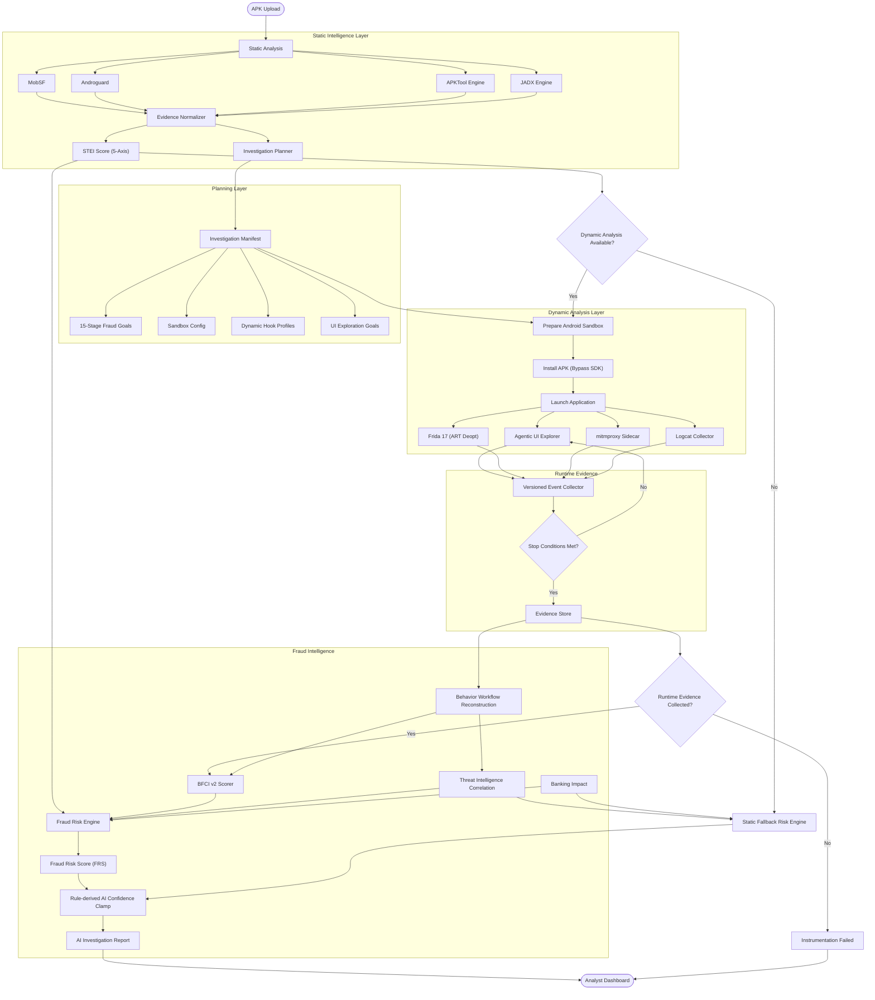

<div align="center">
  
  <h1>SUDARSHAN</h1>
  <p><b>AI-Assisted Autonomous Mobile Fraud Investigation Platform</b></p>
  <p><i>Prepared and Submitted for Bank of India and IIT Hyderabad under the BOI Hackathon 2026</i></p>
  
  <p>
    <b>80M+</b> Customers Protected &nbsp;&nbsp;|&nbsp;&nbsp; 
    <b>47</b> Banking Apps Monitored &nbsp;&nbsp;|&nbsp;&nbsp; 
    <b>302 / 302</b> Passing Tests (100%) &nbsp;&nbsp;|&nbsp;&nbsp;
    <b>Containerized Microservice Architecture</b>
  </p>
</div>

---

## Table of Contents
- [Executive Overview](#executive-overview)
- [Master Architecture Flowchart](#master-architecture-flowchart)
- [Key Platform Features](#key-platform-features)
- [System Architecture & Technology Stack](#system-architecture--technology-stack)
- [Repository Structure](#repository-structure)
- [Deterministic Risk Engine & Scoring](#deterministic-risk-scoring)
- [Complete API Documentation Overview](#complete-api-documentation-overview)
- [Installation & Setup Guide](#installation--setup-guide)
- [Documentation Portal Index](#documentation-portal-index)
- [License & Governance](#license--governance)

---

## Executive Overview

A malicious Android application can execute account takeover (ATO), OTP theft, or overlay phishing within **90 seconds** of installation. Conversely, a financial fraud analyst typically begins an investigation days later. **Sudarshan** bridges this critical time gap by delivering an end-to-end autonomous mobile threat intelligence platform specifically tailored for banking fraud operations.

Rather than producing generic static vulnerability summaries, Sudarshan performs deep static code decompilation (via **MobSF**, **Androguard**, **APKTool**, and **JADX**), autonomous dynamic runtime sandbox execution (via **Frida 17** with ART deoptimization and **mitmproxy** transparent HTTPS decryption), deterministic multi-axis risk scoring ($STEI$, $BFCI\text{ v2}$, $FRS$), and causal workflow reconstruction. Structured findings are indexed into an evidence-constrained Large Language Model (**Gemini 2.5 Flash** / **Ollama**) to generate analyst-actionable threat intelligence cards, MITRE ATT&CK mappings, regulatory customer advisories, and STIX 2.1 feeds.

---

## Master Architecture Flowchart

The flowchart below represents the verified operational data flow of the Sudarshan platform. **All 25 core nodes and failure paths are fully operational in the codebase.**



---

## Key Platform Features

- **Dual Static Decompilation Pipeline**: Combines **APKTool** (xml/asset decompilation & obfuscated resource extraction) and **JADX** (DEX-to-Java source scanning across 10 fraud patterns) to complement MobSF & Androguard.
- **Pre-Sandbox Investigation Manifest (`manifest.py`)**: Produces a standardized `manifest.json` artifact before dynamic execution to dynamically select hook profiles (`canary`, `accessibility`, `sms`, `overlay`, `banking`, `dynamic_code`, `persistence`, `network`) and weigh goal priorities.
- **Frida 17 ART Deoptimization**: Executes `Java.deoptimizeEverything()` unconditionally upon attachment to guarantee hook execution on JIT-compiled Android system methods.
- **mitmproxy Sidecar Interception**: Intercepts transparent HTTPS traffic via Docker sidecar and merges decrypted HAR dumps (headers, status codes, payload sizes) with Frida socket hooks.
- **Agentic Dynamic Explorer**: LLM-guided autonomous UI navigation engine operating over a 15-stage fraud goal DAG with screen-hash loop detection and deterministic action fallbacks.
- **Behavioral Fraud Confidence Index (BFCI v2)**: Calculates volume-aware logarithmic event scoring with a 30-second temporal sequence bonus.
- **Causal Workflow Reconstructor (`workflow_reconstructor.py`)**: Reconstructs temporal causal chains (e.g., Overlay Phishing $\rightarrow$ SMS Theft $\rightarrow$ Account Takeover) mapped directly to MITRE ATT&CK for Mobile techniques.
- **Interactive UI Workflow Timeline (`WorkflowDiagram.tsx`)**: Displays expandable causal chain stages, confidence levels, hook badges, and MITRE technique links in the Analyst Dashboard.
- **Evidence-Constrained RAG Core**: Gemini 2.5 Flash / Ollama integration guarded by input sanitization (`sanitizer.py`) preventing prompt injection and hallucinated verdicts.

---

## System Architecture & Technology Stack

| Layer | Component | Technologies Used |
| :--- | :--- | :--- |
| **Frontend UI** | React 18 SPA | TypeScript, Vite, Tailwind CSS, Lucide React, React Router v6 |
| **API & Gateway** | FastAPI Backend | Python 3.10+, Pydantic v2, PyJWT, Uvicorn, Asyncio |
| **Storage & Queue** | Persistent Case Store | SQLite (`sudarshan.db`), Async Worker Pool, File Artifact Store |
| **Static Analysis** | Decompilation Engines | MobSF Docker (Port 8001), Androguard 4.x, APKTool CLI, JADX CLI |
| **Dynamic Sandbox** | Execution Environment | Android Studio AVD (Android 13, 16KB Page Size), ADB TCP (Port 5555), Frida 17.16.4 |
| **Network Intercept**| Transparent Proxy | mitmproxy Docker Sidecar (Ports 8080 / 8081), HAR Dump Parser |
| **Risk & Scoring** | Math Scoring Engine | 5-Axis STEI, Volume Logarithmic BFCI v2, 4-Axis FRS, Threat Scenario Matrix |
| **AI Intelligence** | RAG & LLM Engine | Gemini 2.5 Flash, Ollama (Llama-3/Mistral/Qwen3), FAISS Vector RAG |

---

## Repository Structure

```text
Sudarshan BOI/
├── backend/
│   ├── app/
│   │   ├── ai/                      # Gemini 2.5 RAG indexer & Ollama client
│   │   ├── analyzers/               # Androguard static analyzer engine
│   │   ├── auth/                    # JWT authentication & bcrypt user management
│   │   ├── db/                      # SQLite database initialization & case persistence
│   │   ├── engines/
│   │   │   ├── agentic/             # Goal tracker DAG, LLM planner, prompt sanitizer
│   │   │   ├── frida_hooks/         # Frida JavaScript hooks (banking_trojan.bundle.js)
│   │   │   ├── agentic_explorer.py  # Autonomous UI explorer loop
│   │   │   ├── apktool_engine.py    # APKTool CLI resource decompilation engine
│   │   │   ├── bfci_scorer.py       # BFCI v2 logarithmic volume scoring engine
│   │   │   ├── event_bus.py         # Runtime event pub/sub bus
│   │   │   ├── evidence_store.py    # Structured evidence record storage
│   │   │   ├── frida_sandbox.py     # ADB controller, PID attach & Frida orchestrator
│   │   │   ├── jadx_engine.py       # JADX DEX-to-Java source pattern scanner
│   │   │   ├── network_capture.py   # mitmproxy HAR dump & Frida hook merger
│   │   │   ├── risk_engine.py       # Deterministic STEI, BFCI, FRS risk engine
│   │   │   ├── ui_explorer.py       # Deterministic UI node clicker & bounds parser
│   │   │   └── workflow_reconstructor.py # Causal chain workflow engine
│   │   ├── models/                  # Pydantic v2 schemas & InvestigationManifest model
│   │   ├── routes/                  # FastAPI endpoints (upload, report, cases, auth)
│   │   ├── services/                # MobSF REST client & Threat Correlator (VT/OTX)
│   │   └── workers/                 # Async job queue dispatcher & worker pool
│   ├── tests/                       # 320 automated unit & integration tests
│   ├── Dockerfile                   # FastAPI backend container configuration
│   └── requirements.txt             # Python dependencies
├── frontend/
│   ├── src/
│   │   ├── components/              # Reusable UI primitives & WorkflowDiagram.tsx
│   │   ├── pages/                   # Upload, FraudCard, TechnicalView, ThreatIntel, Chat
│   │   ├── utils/                   # Data derivation helpers & export formatting
│   │   ├── App.tsx                  # Primary router, layout & FraudCardData interfaces
│   │   └── main.tsx                 # React entry point
│   ├── Dockerfile                   # Nginx frontend container configuration
│   └── package.json                 # Node.js dependencies
├── docs/                            # Enterprise documentation portal
├── docker-compose.yml               # Multi-container orchestration (Backend, Frontend, MobSF, mitmproxy)
└── start.ps1                        # One-command bootstrapper script
```

---

## Deterministic Risk Scoring

Sudarshan enforces a strict **Determinism Invariant**: AI models generate narrative explanations downstream, but mathematical risk scores are strictly computed by deterministic formulas.

### 1. Fraud Risk Score ($FRS$)
$$FRS = 0.25 \times STEI + 0.35 \times BFCI_{\text{v2}} + 0.20 \times \text{ThreatCorrelation} + 0.20 \times \text{BankingImpact}$$

### 2. Static Threat and Environmental Index ($STEI$)
$$STEI = 0.60 \times CT + 0.20 \times BT + 0.10 \times PR + 0.05 \times OB + 0.05 \times IR$$
- **Credential Theft ($CT$)**: Accessibility, SMS read/write, overlay window abuse.
- **Banking Targeting ($BT$)**: Matches against 47 Indian banking package signatures (SBI, HDFC, ICICI, etc.).
- **Permission Risk ($PR$)**: Ratio of dangerous Android permissions.
- **Obfuscation ($OB$)**: Shannon entropy ratio of classes.dex & reflection usage.
- **Infrastructure Risk ($IR$)**: Malicious C2 domains/IPs extracted from bytecode.

### 3. Behavioral Fraud Confidence Index ($BFCI\text{ v2}$)
$$BFCI_{\text{v2}} = \min\left(100.0, \sum_{c} W_c \cdot \min\left(1.0, \frac{\ln(1 + N_c)}{\ln(1 + M_c)}\right) \times 100 + S_{\text{sequence}}\right)$$
Where $N_c$ is the observed event count for category $c$, $M_c$ is the category saturation threshold, $W_c$ is category weight, and $S_{\text{sequence}}$ is a +15 bonus when a temporal causal chain (e.g., Overlay $\rightarrow$ SMS Intercept) completes within 30 seconds.

---

## Complete API Documentation Overview

The FastAPI backend exposes versioned REST API endpoints (`/api/v1`):

| Method | Endpoint | Authorization | Description |
| :--- | :--- | :--- | :--- |
| `POST` | `/api/v1/auth/login` | None | Authenticate user & issue JWT Access Token. |
| `POST` | `/api/v1/analyze` | Bearer Token | Synchronous analysis pipeline; returns full `AnalysisResponse` JSON. |
| `POST` | `/api/v1/analyze/async` | Bearer Token | Asynchronous analysis; enqueues job and returns `job_id`. |
| `GET` | `/api/v1/status/{job_id}` | Bearer Token | Poll status of asynchronous analysis job. |
| `GET` | `/api/v1/sandbox/status` | Bearer Token | Check ADB connectivity and Frida sandbox readiness. |
| `GET` | `/api/v1/cases` | Bearer Token | Retrieve paginated historical analysis cases from SQLite. |
| `GET` | `/api/v1/report/stix/{sha256}` | Bearer Token | Export complete STIX 2.1 structured JSON report. |
| `GET` | `/api/v1/report/iocs/{sha256}` | Bearer Token | Export extracted Indicators of Compromise (IOCs) as CSV. |
| `POST` | `/api/v1/auth/register` | None | Self-registration. Always yields the `analyst` role — the caller cannot request a role. |
| `GET` | `/api/v1/cases/{sha256}` | Bearer Token | Retrieve a single stored case by hash. |
| `GET` | `/api/v1/auth/me` | Bearer Token | Return the authenticated user's profile. |
| `PATCH` | `/api/v1/auth/users/{user_id}/role` | Bearer Token (admin) | Grant or revoke a role. The only way to create a `soc_lead` or `admin`. |
| `GET` | `/api/v1/cases/{sha256}/notes` | Bearer Token | List analyst notes attached to a case. |
| `POST` | `/api/v1/cases/{sha256}/notes` | Bearer Token | Attach an analyst note to a case. |
| `POST` | `/api/v1/chat` | Bearer Token | RAG-grounded AI assistant query (non-streaming). |
| `POST` | `/api/v1/chat/stream` | Bearer Token | Same, as an SSE stream. This is what the dashboard uses. |

---

## Installation & Setup Guide

### Prerequisites
- **Docker**: Docker Desktop with Docker Compose
- **Android Emulator (AVD)**: Running Android Studio AVD (Android 13, x86_64)
- **ADB**: Installed and added to system PATH (`adb tcpip 5555`)
- **Python** *(Optional for dev/tests)*: Version 3.12 or higher (`pytest backend/tests`)
- **Node.js** *(Optional for UI dev)*: Version 18.x or higher & `npm`

> [!NOTE]
> **Containerized Toolchain**: APKTool, JADX CLI, Java 17, Frida 17, Androguard, and ADB worker processes are **100% containerized** inside `sudarshan-analysis-engine`. Zero binary installations are required on your host machine.

### Quick Start (Single Command)
Run the automated bootstrapper script from PowerShell:
```powershell
.\start.ps1
```

### Manual Docker Deployment
```bash
# 1. Set environment variables in .env (or export)
JWT_SECRET_KEY="generate_with_python_secrets_token_urlsafe_48"
GEMINI_API_KEY="your_api_key_here"
GEMINI_MODEL="gemini-2.5-flash"

# 2. Build and launch services
docker compose up --build -d
```

### Accessing Platform Interfaces
- **Fraud Analyst Dashboard**: `http://localhost:5173`
- **FastAPI Interactive API Docs**: `http://localhost:8000/docs`
- **Analysis Engine Microservice**: `http://localhost:8001/health` (internal)
- **MobSF Static Engine**: `http://localhost:8008`
- **mitmproxy Proxy Endpoint**: `127.0.0.1:8080`

---

## Documentation Portal Index

The detailed documentation portal is available under [`docs/`](docs/README.md):

| Guide / Document | Summary |
| :--- | :--- |
| [**Docs Portal Index**](docs/README.md) | Central entry point, component inventory, data flow specifications. |
| [**01 — Introduction**](docs/01_INTRODUCTION.md) | Problem statement, threat model, target banking operational scope. |
| [**02 — System Overview**](docs/02_SYSTEM_OVERVIEW.md) | Platform architecture, microservices layout, container topology. |
| [**03 — Static Threat Intelligence**](docs/architecture/03_STATIC_THREAT_INTELLIGENCE.md) | APKTool, JADX, MobSF, Androguard, Manifest serialization, STEI formula. |
| [**04 — Dynamic Analysis Engine**](docs/architecture/04_DYNAMIC_ANALYSIS_ENGINE.md) | Frida 17 PID attach, ART deopt, mitmproxy HAR, Agentic Explorer 15-stage DAG. |
| [**05 — AI Investigation Engine**](docs/architecture/05_AI_INVESTIGATION_ENGINE.md) | RAG graph index, Gemini 2.5 Flash, Ollama, prompt sanitization. |
| [**06 — Evidence Processing**](docs/architecture/06_EVIDENCE_PROCESSING.md) | EventBus, EvidenceStore, WorkflowReconstructor causal chain engine. |
| [**07 — Fraud Intelligence Engine**](docs/architecture/07_FRAUD_INTELLIGENCE_ENGINE.md) | Threat correlation (VirusTotal/OTX/AbuseIPDB) & family classifier. |
| [**08 — Deterministic Risk Engine**](docs/architecture/08_DETERMINISTIC_RISK_ENGINE.md) | Math formulas for 5-axis STEI, BFCI v2, FRS, Threat Scenario Matrix. |
| [**09 — AI Report Generation**](docs/architecture/09_AI_REPORT_GENERATION.md) | HTML security reports, STIX 2.1 exporter, CSV IOC feeds. |
| [**10 — Analyst Dashboard**](docs/dashboard/10_DASHBOARD.md) | React 18 SPA workflow, Executive Fraud Card, Technical View, Workflow UI. |
| [**11 — Evaluation Strategy**](docs/evaluation/11_EVALUATION.md) | Automated testing suite (`pytest backend/tests`), benchmarks, determinism baselines. |
| [**How to Run Guide**](docs/HOW_TO_RUN.md) | Comprehensive installation, configuration, and execution guide. |
| [**DAE Current State**](docs/DAE_CURRENT_STATE.md) | Complete resolution audit and technical current state document. |
| [**Documentation Audit Report**](docs/DOCUMENTATION_AUDIT_REPORT.md) | Formal documentation audit, file mapping, and verification report. |

---

## License & Governance

Distributed under the MIT License. Prepared for Bank of India and IIT Hyderabad (BOI Hackathon 2026).
