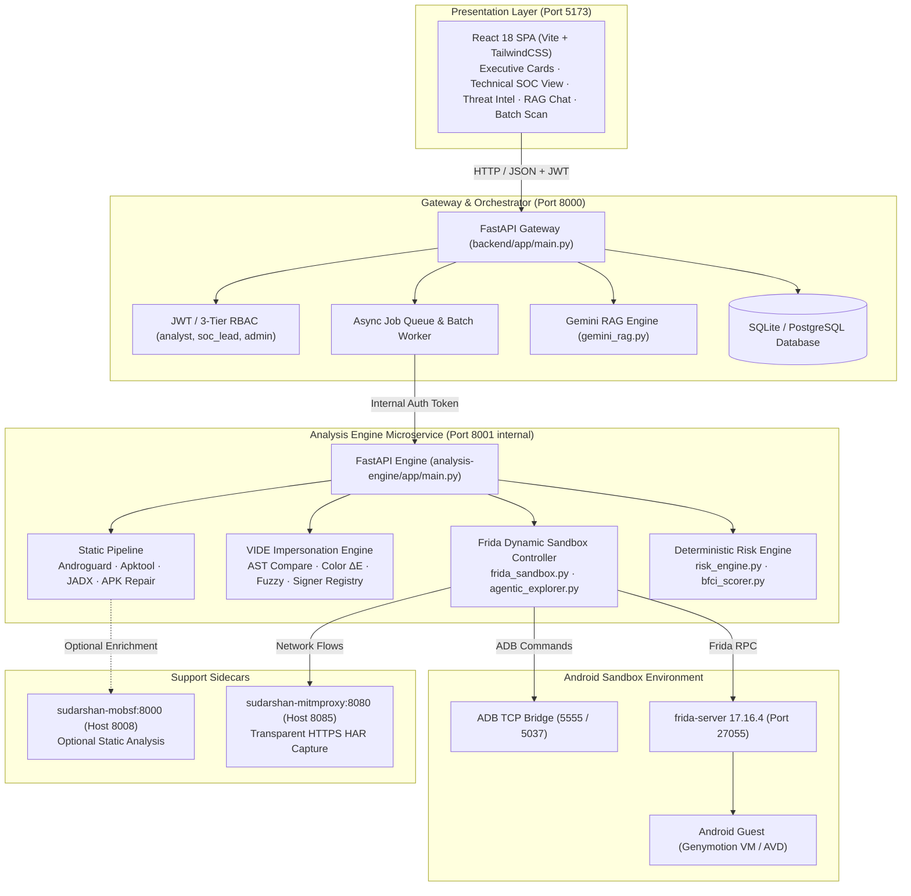
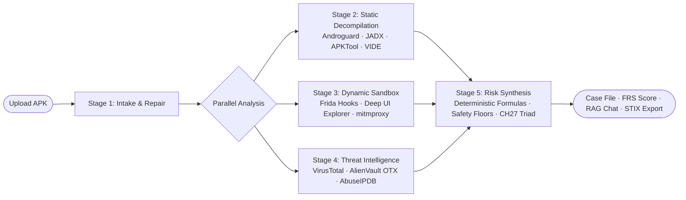

<div align="center">


# SUDARSHAN

**Autonomous Android Banking Malware & Fraud Intelligence Platform**

*From Infiltration to Containment in Minutes — Deterministic Detection, Grounded AI Intelligence*

[](LICENSE)
[](backend/Dockerfile)
[](frontend/package.json)
[](docs/02_ANALYSIS/FRIDA_INSTRUMENTATION.md)
[](docs/10_VALIDATION/TEST_MATRIX.md)
[](docs/00_PROJECT/GROUND_TRUTH.md)

</div>

---

## Table of Contents

- [1. The Threat: The APK That Looks Like Your Bank](#1-the-threat-the-apk-that-looks-like-your-bank)
- [2. The Problem: The Security Analyst Dilemma](#2-the-problem-the-security-analyst-dilemma)
- [3. What is SUDARSHAN?](#3-what-is-sudarshan)
- [4. Key Capabilities](#4-key-capabilities)
- [5. System Architecture](#5-system-architecture)
- [6. Analysis Pipeline: From APK to Fraud Intelligence](#6-analysis-pipeline-from-apk-to-fraud-intelligence)
- [7. Deterministic Risk Engine & Scoring](#7-deterministic-risk-engine--scoring)
- [8. Behavioral Fraud Confidence Index (BFCI v2)](#8-behavioral-fraud-confidence-index-bfci-v2)
- [9. Visual Impersonation Detection Engine (VIDE)](#9-visual-impersonation-detection-engine-vide)
- [10. Agentic UI Exploration & Dynamic Sandbox](#10-agentic-ui-exploration--dynamic-sandbox)
- [11. Grounded AI Investigation Assistant (Gemini RAG)](#11-grounded-ai-investigation-assistant-gemini-rag)
- [12. Supported Banking Trojan Families](#12-supported-banking-trojan-families)
- [13. Target Indian Financial Institutions](#13-target-indian-financial-institutions)
- [14. Analyst UI Walkthrough](#14-analyst-ui-walkthrough)
- [15. Quick Start](#15-quick-start)
- [16. Configuration & Environment Variables](#16-configuration--environment-variables)
- [17. API Summary](#17-api-summary)
- [18. Testing & Code Quality](#18-testing--code-quality)
- [19. Project Structure](#19-project-structure)
- [20. Feature Implementation Status Matrix](#20-feature-implementation-status-matrix)
- [21. Security, Containment & Responsible Disclosure](#21-security-containment--responsible-disclosure)
- [22. Known Limitations & Operational Boundaries](#22-known-limitations--operational-boundaries)
- [23. Documentation Portal Index](#23-documentation-portal-index)
- [24. License & Acknowledgments](#24-license--acknowledgments)

---

## 1. The Threat: The APK That Looks Like Your Bank

Across India's rapidly digitizing economy, UPI and mobile banking apps have become the primary channel for everyday commerce. Cybercriminals exploit this trust with targeted on-device fraud campaigns that execute in less than 90 seconds.

### The Attack Timeline

```
[00:00] Infiltration  ──> [00:30] Coercion      ──> [00:60] Hijacking       ──> [00:90] Exfiltration & Theft
SMS / WhatsApp link        Victim grants             Malware registers           Automated transfer (ATS)
delivers banking APK       Accessibility Service     phishing overlay            steals funds via UPI/IMPS
```

1. **The Infiltration (0–30s):** A victim receives an urgent SMS or WhatsApp message appearing to come from their bank, income tax department, or utility provider: *"Urgent: Your SBI YONO KYC is expired. Update within 24 hours to prevent account suspension: https://sbi-kyc-update.apk"*.
2. **The Deception (30–45s):** The victim installs the APK. The app displays pixel-perfect brand assets—identical blue hex colors, crisp SVG logos, and official typography. Upon launching, it presents a simulated system dialogue: *"Security Verification Required: Please enable Accessibility Protection to guard against unauthorized access."*
3. **The Privilege Hijack (45–60s):** Once the victim toggles Android Accessibility (`BIND_ACCESSIBILITY_SERVICE`), the malware seizes control of the Android UI layer:
   - Grants itself `SYSTEM_ALERT_WINDOW` without user confirmation.
   - Silently grants `READ_SMS`, `RECEIVE_SMS`, and `SEND_SMS`.
   - Hides its launcher icon and registers as an Android Device Administrator to prevent uninstallation.
4. **The Credential & OTP Harvest (60–90s):**
   - **Phishing Overlay:** When the victim launches their legitimate banking application (e.g. `com.snapwork.hdfc` or `com.sbi.lotus`), the trojan detects the foreground activity change and injects a fake login window over the screen, harvesting usernames, passwords, and MPINs.
   - **SMS Interception:** When the bank sends a 2FA One-Time Password (OTP), the malware intercepts the SMS broadcast, extracts the OTP token, forwards it to an offshore Command-and-Control (C2) server, and suppresses the notification so the victim never sees the alert.
   - **Automated Transfer System (ATS):** Advanced strains (e.g., Xenomorph, SOVA) use accessibility tap-injection to automatically navigate the bank's transfer screens, enter beneficiary details, inject the OTP, and execute an unauthorized transfer.

The victim discovers the theft hours or days later. The funds are gone, moved through layers of digital mule accounts.

---

## 2. The Problem: The Security Analyst Dilemma

Security Operations Center (SOC) analysts, fraud investigation teams, and law enforcement agencies face an overwhelming asymmetry:

| Traditional Tool / Approach | Core Limitation | Operational Consequence |
| :--- | :--- | :--- |
| **Antivirus & VirusTotal** | Signature & hash based. Newly compiled trojans with minor packers yield 0/70 detections. | Zero protection against zero-day campaigns. |
| **Standard Static Analyzers (MobSF, Androguard)** | Output thousands of lines of disassembled bytecode, raw strings, and generic permission lists. | Cannot determine: *Which bank is targeted? Is OTP interception active? What is the real-world financial risk?* |
| **Manual Reverse Engineering (JADX, Ghidra, Frida)** | Requires a senior malware analyst spending 4 to 8 hours per sample. | A team receiving 50 suspicious APKs a day faces an impossible backlog. |
| **Naïve LLM Approaches (Raw Prompting)** | Large Language Models hallucinate, choke on multi-megabyte DEX binaries, and lack runtime visibility. | Inconsistent, ungrounded verdicts that fail evidentiary standards. |

---

## 3. What is SUDARSHAN?

**SUDARSHAN** bridges the gap between raw reverse engineering and automated fraud intelligence. 

It is a containerized, multi-engine platform purpose-built to detect, deconstruct, and attribute targeted Android banking trojans (such as **Drinik**, **Xenomorph**, **Cerberus**, **Anubis**, **SOVA**, **Hydra**, **Octo**, and **Teabot**).

### Core Architectural Invariants

1. **Deterministic Detection, Grounded Intelligence:** The Deterministic Risk Engine (`risk_engine.py`) is the sole authority on numerical risk. The score is mathematically verifiable and reproducible. Generative AI explains findings; it **never** computes or alters the Fraud Risk Score (FRS).
2. **Fraud-First, Not Malware-First:** Traditional tools ask: *"Is this malware?"* SUDARSHAN answers: *"Who is targeted, what specific fraud capabilities are present, and what immediate containment actions should the fraud team take?"*
3. **Defense-in-Depth Containment:** Hostile binaries are detonated strictly within isolated Android guest sandboxes with zero LAN-leak risk.

---

## 4. Key Capabilities

- **Corrupted APK Recovery (`apk_repair.py`):** Automatically repairs intentionally malformed AXML string tables designed to crash standard decompilers.
- **Visual Impersonation Detection Engine (VIDE):** 4-axis multi-modal matching (Layout AST, CIEDE2000 color $\Delta E$, RapidFuzz strings, and digital signing certificate allowlists) across 10 Indian banking institutions.
- **Autonomous Deep UI Explorer:** 5-level perception hierarchy navigating multi-screen login forms and dialogs to trigger evasive runtime payloads.
- **Pre-Compiled Frida Runtime Instrumentation:** Intercepts sensitive Android APIs across 7 weighted behavioral categories.
- **Behavioral Fraud Confidence Index (BFCI v2):** Multi-tier behavioral scoring combining presence verification, volume logarithmic scaling, and temporal attack-chain detection.
- **Grounded AI Investigation Assistant:** Google Gemini (`gemini-2.5-flash`) RAG engine providing structured 7-section incident explanations with prompt injection defenses.
- **Enterprise Batch Scanning:** Multi-file concurrent processing (2–50 APKs) with FIFO queue control, pause/resume, and role-based isolation.
- **Multi-Format Forensic Export:** Executive Fraud Summary PDFs, Technical SOC PDFs, interactive HTML reports, and OASIS STIX 2.1 threat intelligence bundles.

---

## 5. System Architecture

SUDARSHAN is organized into discrete service layers orchestrated via Docker Compose:



---

## 6. Analysis Pipeline: From APK to Fraud Intelligence



1. **Stage 1: Intake & Integrity Validation:** Validates file signatures, computes server-side SHA-256, and invokes `apk_repair.py` if AXML headers are malformed.
2. **Stage 2: Static Decompilation & Brand Matching:** Concurrently runs native bytecode extraction, resource decoding, Java reconstruction, and VIDE visual clone comparison against protected banking baselines.
3. **Stage 3: Dynamic Instrumentation & Exploration:** Spawns the package on the Android guest sandbox, attaches Frida hooks at exact PID launch, and drives the Deep UI Explorer across application screens.
4. **Stage 4: External Threat Correlation:** Correlates file hashes and dynamic C2 network domains against VirusTotal, OTX, and AbuseIPDB with 24h SQLite caching.
5. **Stage 5: Deterministic Risk Synthesis:** The Deterministic Risk Engine calculates the Fraud Risk Score (FRS), verifies safety floors, and evaluates the CH27 Triad.

---

## 7. Deterministic Risk Engine & Scoring

The **Fraud Risk Score (FRS)** is calculated on a normalized 0–100 scale:

$$\text{FRS} = 0.25 \times \text{STEI} + 0.35 \times \text{BFCI} + 0.20 \times \text{Correlation} + 0.20 \times \text{BankingImpact}$$

### Static Threat Evaluation Index (STEI)
$$\text{STEI} = 0.60 \times \text{CT} + 0.20 \times \text{BT} + 0.10 \times \text{PR} + 0.05 \times \text{OB} + 0.05 \times \text{IR}$$

- **CT (Credential Theft):** Accessibility abuse (+40), SMS interception (+35), Overlay window (`SYSTEM_ALERT_WINDOW`) (+25). Max 100.
- **BT (Banking Targeting):** Matched Indian banking package names or VIDE visual clone detection (+35 to +85). Max 100.
- **PR (Permission Risk):** Dangerous permissions count normalized against banking profiles.
- **OB (Obfuscation):** Dynamic classloading, reflection, and high Shannon entropy.
- **IR (Infrastructure Risk):** Discovered C2 URLs and hardcoded raw IP endpoints.

### Risk Bands

| Score Range | Risk Band | Operational Response |
| :--- | :--- | :--- |
| **0.0 – 19.9** | `Safe` | Benign application. No fraud indicators detected. |
| **20.0 – 39.9** | `Low` | Minor analytics or general permissions. Standard monitoring. |
| **40.0 – 59.9** | `Medium` | Suspicious capabilities detected. Quarantine for secondary review. |
| **60.0 – 79.9** | `High` | Confirmed credential theft or banking targeting. Block app and notify customers. |
| **80.0 – 100.0**| `Critical` | Active Banking Trojan. Execute immediate session revocation and C2 blocking. |

### Deterministic Safety Floors & CH27 Triad
- **Visibility Floor:** If dynamic analysis fails to reach the foreground, verdict cannot be `Safe`.
- **Static Evidence Floor:** Confirmed high-risk static capabilities prevent a `Safe` verdict even if the dynamic sandbox stalls.
- **Evasion Floor:** Samples displaying anti-analysis and emulator-fingerprinting checks cannot be classified as `Safe`.
- **CH27 On-Device Fraud Triad:** Visual Clone Confidence ($> 0.85$) + Developer Signer Mismatch + Accessibility Abuse $\rightarrow$ **Immediate escalation to $\text{FRS} \ge 95$ (`Critical`)**.

---

## 8. Behavioral Fraud Confidence Index (BFCI v2)

Dynamic behavioral scoring is governed by 7 weighted categories:

$$\sum w_i = 1.0$$

| Behavioral Category | Weight ($w_i$) | Monitored APIs & Events |
| :--- | :--- | :--- |
| **Accessibility** | `0.315` | `AccessibilityService`, `AccessibilityNodeInfo` (screen scraping, tap injection, keylogging) |
| **SMS Interception** | `0.225` | `SmsManager.sendTextMessage`, `SMS_RECEIVED` (OTP interception, SMS forwarding) |
| **Overlay Phishing** | `0.180` | `WindowManager.addView`, `TYPE_APPLICATION_OVERLAY` (fake banking login dialogs) |
| **Banking Targeting** | `0.090` | Active foreground monitoring of targeted banking packages |
| **Code Execution** | `0.100` | `DexClassLoader`, `ProcessBuilder`, `Runtime.exec` (dynamic secondary payload drop) |
| **C2 Network** | `0.045` | Outbound socket connections, exfiltration HTTP POSTs |
| **Device Persistence**| `0.045` | Device admin locking, boot completion receivers, icon hiding |

---

## 9. Visual Impersonation Detection Engine (VIDE)

VIDE evaluates impersonation across 4 independent axes:
1. **Layout View AST Comparison (`view_ast.py`):** Decompiles XML layout hierarchies into Abstract Syntax Trees and computes tree edit distance against canonical bank screens. (Threshold: `0.20`).
2. **CIEDE2000 Color Distance ($\Delta E$):** Computes perceptual color distance between suspect app palettes and official brand colors.
3. **Fuzzy String Similarity:** RapidFuzz token and string distance matching on application labels and login prompts (Threshold: `82.0`).
4. **Digital Signer Registry (`bank_signer_registry.json`):** Compares APK signing certificates against official banking signing certificates. Unprovisioned or mismatched certificates trigger fail-closed impersonation alerts.

---

## 10. Agentic UI Exploration & Dynamic Sandbox

Dynamic analysis features an autonomous agent operating on a **5-Level Perception Hierarchy**:
1. **Level 1 (UI Automator XML):** Parses accessibility node trees and view bounds to identify clickable buttons and input fields.
2. **Level 2 (Activity Lifecycle):** Confirms foreground package ownership via `dumpsys window`.
3. **Level 3 (Frida Hooks):** Informs the agent when overlay dialogs or permission requests appear.
4. **Level 4 (Logcat):** Monitors runtime error messages, silent exceptions, and security alerts.
5. **Level 5 (Vision Fallback):** Employs OCR and vision grounding when layout XML is obfuscated or rendered in Flutter/Canvas.

The explorer classifies screens into **17 semantic categories** (e.g. `BANKING_LOGIN`, `OTP_ENTRY`, `PERMISSION_REQUEST`) and builds a perceptual **Screen Graph** to detect and break exploration loops.

---

## 11. Grounded AI Investigation Assistant (Gemini RAG)

SUDARSHAN integrates Google Gemini (`gemini-2.5-flash`) via an evidence-grounded RAG architecture:
- **Zero Hallucination Guarantee:** The LLM does not access the internet during chat; it retrieves strictly from the in-memory **Investigation Graph** indexing 22 forensic sections for the analyzed sample.
- **Prompt Sanitization:** All APK-derived metadata, package names, and strings pass through `sanitizer.py` to neutralize adversarial prompt injection attempts.
- **Circuit Breaker:** 3-state circuit breaker (`AVAILABLE`, `DEGRADED`, `OPEN`) automatically falls back to secondary keys or fails open without interrupting deterministic scoring.
- **Structured 7-Section Output:** Every analyst query is answered using a strict, standardized forensic template.

---

## 12. Supported Banking Trojan Families

SUDARSHAN includes specialized behavioral heuristics and YARA detection signatures for leading mobile banking trojan families:

| Malware Family | Primary Fraud Capabilities | Primary Attack Vector |
| :--- | :--- | :--- |
| **Drinik** | Income tax refund phishing, SMS OTP theft | Accessibility + SMS Forwarding |
| **Xenomorph** | Automated Transfer System (ATS), overlay phishing | Accessibility + WindowManager Overlays |
| **SOVA** | Cookie harvesting, 2FA interception, VNC screen streaming | Accessibility + Keylogging |
| **Anubis** | Audio recording, SMS interception, ransomware locking | Accessibility + Device Administrator |
| **Cerberus** | Google Authenticator OTP theft, PII harvesting | Accessibility + Overlay Injection |
| **Hydra** | PIN/Pattern lock bypass, SMS exfiltration | Accessibility + System Alert Window |
| **Octo / Coper** | Remote device control, black screen overlay | Accessibility + MediaProjection |
| **Teabot** | Real-time screen streaming, keylogging | Accessibility + In-Memory DEX Injection |

---

## 13. Target Indian Financial Institutions

VIDE maintains baseline profile definitions and signer registry entries for 10 major Indian institutions:

1. **State Bank of India (SBI):** YONO SBI (`com.sbi.lotus`), YONO Lite (`com.sbi.SBIFreedomPlus`)
2. **HDFC Bank:** HDFC Mobile Banking (`com.snapwork.hdfc`)
3. **ICICI Bank:** iMobile Pay (`com.csam.icici.bank.imobile`)
4. **Axis Bank:** Axis Mobile (`com.axis.mobile`)
5. **Punjab National Bank (PNB):** PNB ONE (`com.pnb.pnbone`)
6. **Bank of Baroda (BOB):** bob World (`com.mconnect`)
7. **Bank of India (BOI):** BOI Mobile (`com.boi.mobile`)
8. **Kotak Mahindra Bank:** Kotak811 (`com.msf.k8`)
9. **IndusInd Bank:** IndusMobile (`com.indusind.indusmobile`)
10. **Union Bank of India:** Vyom (`com.infrasofttech.uboi`)

---

## 14. Analyst UI Walkthrough

The React 18 SPA delivers four cohesive operational surfaces:

### 1. Executive Fraud Card
High-level summary designed for immediate operational decision-making:
- **Fraud Risk Score Gauge (0–100):** Prominent circular gauge displaying composite score and risk band (`Critical`, `High`, `Medium`, `Low`, `Safe`).
- **Targeted Financial Institution:** Identifies the victimized bank with confidence metrics and certificate match status.
- **Primary Attack Vectors:** Visual indicators for Accessibility abuse, SMS interception, and Phishing overlays.
- **Recommended Playbook:** Direct action items (e.g. *"Revoke active customer sessions"*, *"Blacklist C2 IP: 185.220.101.5"*).

### 2. Technical SOC View
Deep forensic workbench for malware reverse engineers:
- **Manifest Disassembler:** Filterable view of all declared permissions, exported activities, and services.
- **Frida Runtime Timeline:** Chronological event stream displaying exact hook timestamps, triggered APIs, and argument payloads.
- **Discovered C2 Infrastructure:** Table of extracted IP endpoints, ports, domains, and HTTP POST URLs.

### 3. Live Threat Intel
Aggregated reputation view displaying VirusTotal multi-engine detection ratios, AlienVault OTX pulses, and AbuseIPDB confidence scores.

### 4. Interactive RAG Chat
Conversational interface allowing analysts to interrogate the case file in natural language (*"Did this sample attempt to read incoming SMS messages?"*, *"Show me the hardcoded C2 addresses"*).

---

## 15. Quick Start

### Prerequisites
- **Operating System:** Windows 10/11, Ubuntu 22.04/24.04, or macOS.
- **Docker Engine:** Docker Desktop 4.20+ with Docker Compose v2.
- **Android Sandbox (Optional for dynamic analysis):** Genymotion Desktop VM or Android Studio AVD with USB/TCP debugging enabled.

### Option A: One-Command Windows Startup
The repository includes a self-healing PowerShell startup script that verifies dependencies, ports, and starts the stack:
```powershell
.\start.ps1
```

### Option B: Docker Compose
```bash
# 1. Clone the repository
git clone https://github.com/SanTiwari07/Sudarshan.git
cd Sudarshan

# 2. Copy and configure environment variables
cp .env.example .env
# Ensure JWT_SECRET_KEY is set in .env

# 3. Launch the container stack
docker compose up -d

# 4. Access the dashboard
# Frontend: http://localhost:5173
# Backend API Docs: http://localhost:8000/docs
```

---

## 16. Configuration & Environment Variables

| Variable | Default Value | Description |
| :--- | :--- | :--- |
| `SUDARSHAN_ENV` | `development` | Deployment environment (`development` or `production`). |
| `JWT_SECRET_KEY` | *None (Mandatory)* | Secret key for signing JWT tokens. Refuses startup if empty. |
| `DATABASE_URL` | *None* | Connection string for PostgreSQL 15. Falls back to SQLite if unset. |
| `SUDARSHAN_DB_PATH` | `/app/data/sudarshan.db` | Explicit SQLite file path. |
| `ANALYSIS_ENGINE_URL` | `http://analysis-engine:8001`| Internal endpoint for analysis engine container. |
| `ANALYSIS_ENGINE_INTERNAL_TOKEN` | *None* | Shared secret gating inter-container REST calls. |
| `GEMINI_API_KEY` | *Optional* | Google Gemini API key for grounded RAG investigation chat. |
| `VIRUSTOTAL_API_KEY` | *Optional* | API key for VirusTotal reputation correlation. |
| `FRIDA_ANALYSIS_DURATION` | `130` | Default execution window (seconds) for dynamic sandbox. |

---

## 17. API Summary

Complete OpenAPI documentation is available at `http://localhost:8000/docs`.

| Method | Endpoint | Required Role | Description |
| :--- | :--- | :--- | :--- |
| `POST` | `/api/v1/auth/login` | None | Authenticate credentials and issue JWT bearer token. |
| `POST` | `/api/v1/analyze` | `analyst` | Synchronously analyze uploaded APK file. |
| `POST` | `/api/v1/analyze/async` | `analyst` | Enqueue APK for asynchronous processing. |
| `GET` | `/api/v1/status/{job_id}`| `analyst` | Poll progress and retrieve results for queued job. |
| `GET` | `/api/v1/cases` | `analyst` | Query and filter investigation case files. |
| `GET` | `/api/v1/cases/{sha256}` | `analyst` | Retrieve comprehensive case record. |
| `POST` | `/api/v1/batches` | `analyst` | Submit batch of 2–50 APKs for sequential analysis. |
| `POST` | `/api/v1/chat` | `analyst` | Interrogate case evidence via Gemini RAG. |
| `GET` | `/api/v1/report/pdf/{sha256}`| `analyst` | Download Executive Fraud Summary PDF report. |
| `GET` | `/api/v1/report/stix/{sha256}`| `analyst` | Export standardized OASIS STIX 2.1 JSON bundle. |

---

## 18. Testing & Code Quality

SUDARSHAN enforces rigorous automated test coverage across all subsystems:

```bash
# Set JWT secret for test harness
$env:JWT_SECRET_KEY="test_key_for_testing_123456789012345678901234567890"

# Run backend API and gateway tests (871 tests)
.venv\Scripts\python -m pytest backend/tests -v

# Run engine, VIDE, and core unit tests (1,958 tests)
.venv\Scripts\python -m pytest tests/unit -v

# Run full repository test suite
.venv\Scripts\python -m pytest tests/unit backend/tests -q
```

### Verified Test Execution Status
- **Total Tests Collected:** **2,841 tests**
- **Unit & Core Tests:** 1,934 passed, 24 skipped (require hardware)
- **Backend API Tests:** 869 passed, 2 skipped, 22 subtests passed
- **Pass Rate:** **100% of runnable tests passing** (0 failures).

---

## 19. Project Structure

```
Sudarshan/
├── backend/                   # FastAPI Gateway, auth, case store, and RAG
│   ├── app/                   # API routes, workers, and database layer
│   └── tests/                 # 871 automated gateway & router tests
├── analysis-engine/           # Containerized analysis microservice (:8001)
│   ├── app/                   # Analysis orchestration pipeline
│   └── Dockerfile             # Java 17 + Python 3.12 + APKTool + JADX
├── shared/                    # Shared core library (mounted as /opt/sudarshan-core)
│   └── sudarshan_core/        # Risk engine, BFCI v2, VIDE, and Frida hooks
├── frontend/                  # React 18 / Vite 5 / TailwindCSS SPA (:5173)
│   └── src/                   # FraudCard, TechnicalView, RAG Chat pages
├── tests/                     # 1,970 unit and integration tests
├── docs/                      # Unified, code-verified documentation portal
├── scripts/                   # Operator setup tools and administration scripts
├── docker-compose.yml         # Container stack orchestrator
└── start.ps1                  # One-command Windows launch orchestrator
```

---

## 20. Feature Implementation Status Matrix

| Subsystem | Feature | Status | Verification Reference |
| :--- | :--- | :--- | :--- |
| **Intake** | Synchronous & Asynchronous APK Upload | **Implemented** | `backend/tests/test_analysis_client.py` |
| **Intake** | Corrupted AXML Reconstruction | **Implemented** | `backend/tests/test_manifest_repair.py` |
| **Intake** | Enterprise Batch Processing (2–50 files) | **Implemented** | `backend/tests/test_batch.py` |
| **Static** | Androguard Bytecode & Entropy Analysis | **Implemented** | `backend/tests/test_detection_regressions.py` |
| **Static** | APKTool 2.10.0 Resource Decompilation | **Implemented** | `analysis-engine/entrypoint.sh` |
| **Static** | JADX 1.5.1 Java Decompilation | **Implemented** | `tests/unit/test_static_dynamic_bridge.py` |
| **VIDE** | Layout AST Tree Edit Distance | **Implemented** | `tests/unit/test_vide_compare.py` |
| **VIDE** | CIEDE2000 Color Matching ($\Delta E$) | **Implemented** | `tests/unit/test_vide_delta_e.py` |
| **VIDE** | RapidFuzz String Similarity Matching | **Implemented** | `tests/unit/test_vide_fuzzy_match.py` |
| **VIDE** | Bank Signer Registry Verification | **Implemented** | `tests/unit/test_vide_signer_registry.py` |
| **Dynamic**| Frida 17.16.4 API Hook Bundle | **Implemented** | `tests/unit/test_frida_sandbox.py` |
| **Dynamic**| Deep UI Explorer (5-Level Perception) | **Implemented** | `tests/unit/test_agentic_explorer.py` |
| **Dynamic**| mitmproxy HTTPS Traffic & HAR Capture | **Implemented** | `docker-compose.yml` |
| **Risk** | 4-Axis Fraud Risk Score (FRS) | **Implemented** | `tests/unit/test_risk_engine_determinism.py` |
| **Risk** | BFCI v2 Behavioral Scoring | **Implemented** | `tests/unit/test_bfci_scorer.py` |
| **Risk** | CH27 On-Device Fraud Triad Escalation | **Implemented** | `tests/unit/test_vide_ch27_rule.py` |
| **AI** | Grounded Gemini RAG Chat Assistant | **Implemented** | `backend/tests/test_rag.py` |
| **AI** | 3-State Resilient Circuit Breaker | **Implemented** | `backend/tests/test_circuit_breaker.py` |
| **AI** | Adversarial Prompt Injection Sanitizer | **Implemented** | `tests/unit/test_prompt_sanitization.py` |
| **Export** | Executive & Technical PDF Reports | **Implemented** | `backend/tests/test_report.py` |
| **Export** | OASIS STIX 2.1 JSON Serialization | **Implemented** | `backend/tests/test_stix.py` |

---

## 21. Security, Containment & Responsible Disclosure

### Host Containment
Dynamic analysis involves the execution of active Android malware. SUDARSHAN enforces containerization boundaries:
- Malware executes solely inside an Android virtual guest; it never runs natively on the host OS.
- In production mode, `sudarshan_core.security.sandbox_containment` validates network endpoints, failing closed if host LAN subnets are exposed.

### Responsible Disclosure & Safety
SUDARSHAN is built exclusively for defensive security operations, threat research, and fraud mitigation. All reverse engineering and dynamic hooks operate in adherence to standard security research practices.

---

## 22. Known Limitations & Operational Boundaries

Every system has managed operational boundaries. In SUDARSHAN:
1. **Dormant Malware:** Trojan samples that sleep for extended periods (e.g. 24 hours) will not trigger dynamic hooks during a standard 130-second window. In response, SUDARSHAN excludes dynamic scoring, marks the run `INCOMPLETE_EXERCISE`, and applies the **Static Evidence Floor** to ensure the sample is not labeled safe.
2. **Single-Device Concurrency:** Dynamic analysis on a single physical or virtual Android device serializes behind an in-process lock to prevent APKs from colliding on screen.
3. **External Threat Intelligence Quotas:** VirusTotal lookups strictly enforce client-side rate limits (4 req/min) backed by a 24-hour cache.

For full technical details, consult [`docs/05_SECURITY/KNOWN_SECURITY_LIMITATIONS.md`](docs/05_SECURITY/KNOWN_SECURITY_LIMITATIONS.md).

---

## 23. Documentation Portal Index

A complete, code-verified technical documentation portal is maintained under [`docs/`](docs/README.md):

```
docs/
├── 00_PROJECT/          # Ground Truth, Vision, Context, Glossary
├── 01_ARCHITECTURE/     # System Architecture, Codebase Map, Data Flow, Security Boundaries
├── 02_ANALYSIS/         # Static Analysis, Dynamic Sandbox, UI Explorer, Frida, VIDE
├── 03_RISK/             # Deterministic Risk Engine, STEI, BFCI v2, FRS, Determinism
├── 04_AI/               # Grounded RAG, AI Investigation, Circuit Breakers, Sanitization
├── 05_SECURITY/         # Sandbox Containment, Security Model, Threat Model, Limitations
├── 06_OPERATIONS/       # How to Run, Deployment, Environment, Troubleshooting
├── 07_API/              # REST Reference, Analysis API, Cases, Batches, Reports
├── 08_DEVELOPMENT/      # Contributing Guidelines, Pytest Testing, Dev Guide
├── 09_EVIDENCE/         # Unified Evidence Model, PDF Reports, STIX 2.1, IOCs
├── 10_VALIDATION/       # Empirical Validation, Benchmarks, Test Matrix, Feature Status
└── 99_HISTORY/          # Release Changelog, Historical Audit Logs, Legacy Archives
```

---

## 24. License & Acknowledgments

- **License:** Open-source under the [MIT License](LICENSE).
- **Core Toolchains:** Built on the shoulders of giants: [Frida](https://frida.re/), [Androguard](https://github.com/androguard/androguard), [APKTool](https://ibotpeaches.github.io/Apktool/), [JADX](https://github.com/skylot/jadx), [mitmproxy](https://mitmproxy.org/), [FastAPI](https://fastapi.tiangolo.com/), and [React](https://react.dev/).
