<div align="center">

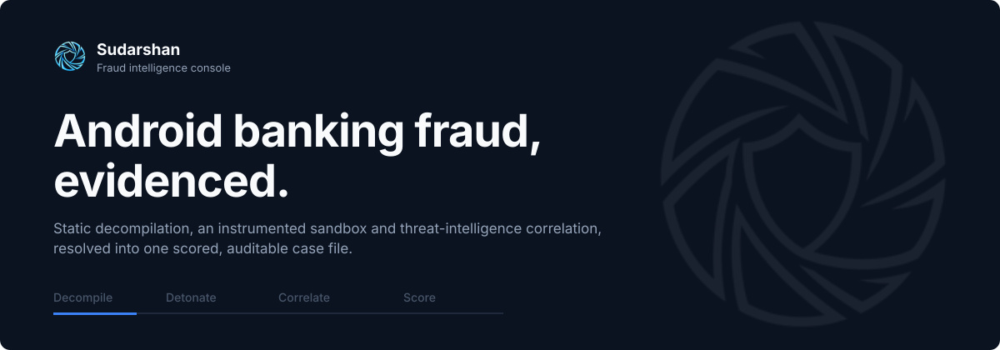

<br>

**Your bank's app has a twin. It looks the same, it asks for the same PIN, and it empties the account in 90 seconds.**<br>
**Sudarshan finds the twin, takes it apart, and tells the bank exactly what to do next.**

<br>

[](LICENSE)
[](backend/Dockerfile)
[](frontend/package.json)
[](docs/02_ANALYSIS/FRIDA_INSTRUMENTATION.md)
[](docs/10_VALIDATION/TEST_MATRIX.md)

[**The story**](#-it-starts-with-a-text-message) ·
[**See it**](#-a-walk-through-the-console) ·
[**Run it**](#-run-it-yourself) ·
[**Under the hood**](#-under-the-hood) ·
[**Docs**](docs/README.md)

</div>

<br>

## 💬 It starts with a text message

It's 9:47 PM. Your phone buzzes.

> **SBI:** *Your YONO KYC has expired. Update within 24 hours to avoid account suspension:* `sbi-kyc-update.apk`

The app you install looks right. It has the same blue, the same logo and the same fonts. It politely asks you to *"enable Accessibility protection to keep your account safe."* You tap **Allow**.

Ninety seconds later, it's over.

<p align="center">
  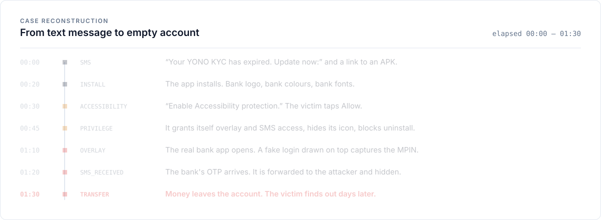
</p>

That one permission lets the app read everything on your screen and tap buttons for you. It draws a fake login over your real banking app and catches your PIN. It swallows the OTP text before you see it. Families like **Drinik, Xenomorph, SOVA, Anubis, Cerberus, Hydra, Octo** and **Teabot** have made this routine across India's UPI-first economy.

<br>

## 🕵️ Meanwhile, at the bank

A fraud analyst has **50 suspicious APKs** in the queue, and the tools they have don't help much:

| | The tool | What it tells them | What they actually needed |
|:--:|:--|:--|:--|
| 🛡️ | Antivirus / VirusTotal | *"0 / 70 engines detected this."* It's a fresh build, so nothing has seen it yet. | Is it dangerous **anyway**? |
| 📜 | Static analyzers | Ten thousand lines of bytecode and a permission list. | **Which bank** is it after? |
| 🔧 | Manual reverse engineering | The right answer, after **4–8 hours** per sample. | The answer **in minutes**. |
| 🤖 | "Just ask an LLM" | A confident verdict that changes each time you ask. | A verdict that **holds up in an audit**. |

Every hour spent on the backlog is an hour the trojan keeps spreading.

<br>

## 🌀 Enter Sudarshan

> In Indian tradition, the **Sudarshana Chakra** is a spinning discus that never misses its mark. The name itself means *"auspicious vision"*, or simply *the one that sees clearly*.

Sudarshan is a fraud-intelligence platform for exactly this fight. Give it an APK, or even just the suspicious link, and it answers the three questions a fraud team actually asks:

<table>
<tr>
<td width="33%" align="center">
<h3>🎯 Who is targeted?</h3>
Which bank, which app, which customers. It finds visual clones of <b>10 major Indian banks</b> by comparing layouts, colours, text and signing certificates.
</td>
<td width="33%" align="center">
<h3>⚠️ What can it do?</h3>
OTP interception, fake login overlays, automated transfers, remote control. Every capability is <b>proven with evidence</b>, not guessed.
</td>
<td width="33%" align="center">
<h3>🚨 What do we do now?</h3>
A <b>0–100 fraud risk score</b> and a playbook: revoke sessions, block the C2 server, warn customers, export IOCs.
</td>
</tr>
</table>

<br>

## ⚙️ How it hunts

<p align="center">
  
</p>

1. **🔬 Decompile.** It rips the APK open with Androguard, JADX and APKTool. It even **repairs APKs that were deliberately corrupted** to crash analysis tools. Then it asks whether the app is pretending to be a bank.
2. **💣 Detonate.** It launches the app inside a **sealed Android sandbox**, with Frida hooks on every sensitive API. An autonomous agent taps through login screens and dialogs to coax out hidden behaviour.
3. **🌐 Correlate.** It checks hashes and every contacted domain against VirusTotal, AlienVault OTX and AbuseIPDB, and matches behaviour to known trojan families.
4. **⚖️ Score.** A **deterministic** engine turns all of that evidence into one Fraud Risk Score. Same APK, same score, every time, and every point traces back to a piece of evidence.

<br>

## 🧭 The one rule Sudarshan never breaks

<table>
<tr>
<td width="50%" valign="top">

### ⚖️ The engine decides
The risk score comes from a **fixed, auditable formula** and nothing else. It is reproducible to the decimal, and safety floors stop a sample from being called *Safe* just because it played dead in the sandbox.

</td>
<td width="50%" valign="top">

### 🤖 The AI explains
The built-in assistant, **"Ask Sudarshan"**, answers questions like *"Did this app read incoming SMS?"* It answers **only from this case's evidence** and cites the records it used. It can never change the score.

</td>
</tr>
</table>

> Fraud decisions can't rest on a hallucination. So the AI is a translator, never a judge.

<br>

## 🖥️ A walk through the console

Follow an analyst through one investigation, from sign-in to a signed-off report.

<table>
<tr>
<td width="50%">
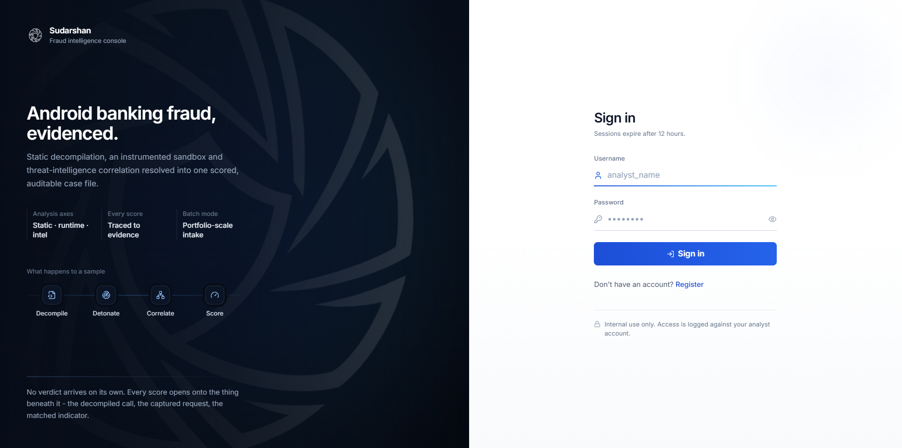<br>
<sub><b>1 · Sign in.</b> JWT sessions with three roles (analyst, SOC lead, admin). Every action is logged to an account.</sub>
</td>
<td width="50%">
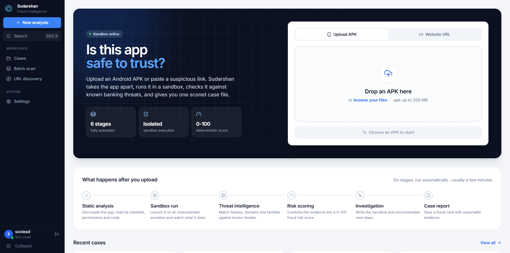<br>
<sub><b>2 · "Is this app safe to trust?"</b> Drop an APK or paste a link. The six stages then run on their own.</sub>
</td>
</tr>
<tr>
<td width="50%">
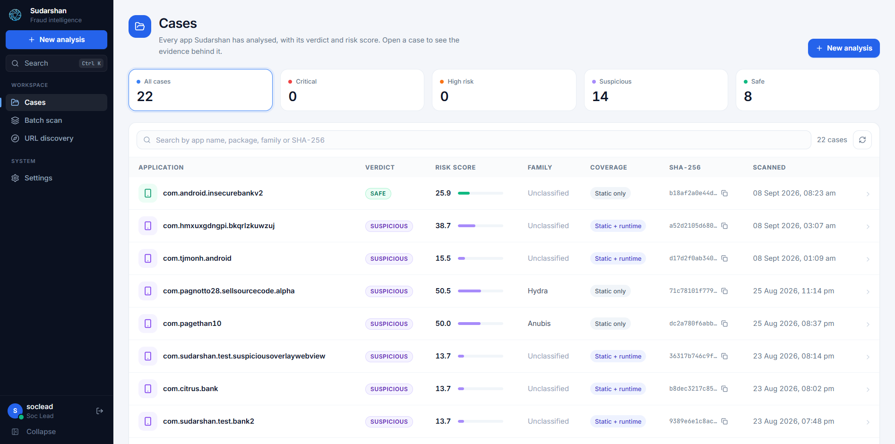<br>
<sub><b>3 · Every case, scored.</b> Verdict, risk score, malware family and coverage at a glance.</sub>
</td>
<td width="50%">
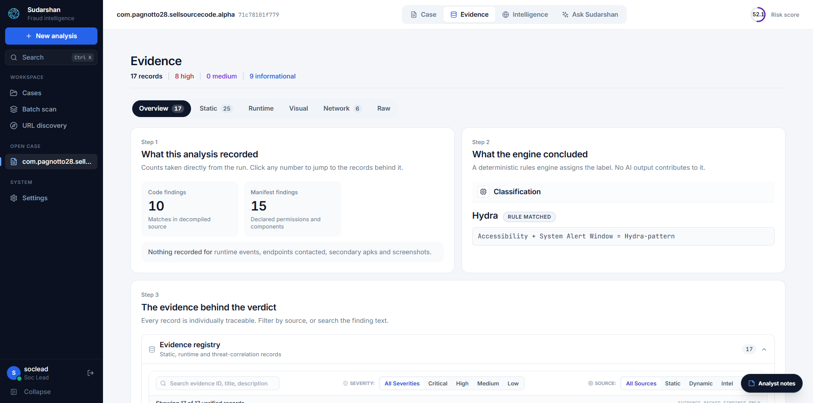<br>
<sub><b>4 · The evidence behind the verdict.</b> Here a <i>Hydra</i> pattern was caught by a deterministic rule, and each record can be traced.</sub>
</td>
</tr>
<tr>
<td width="50%">
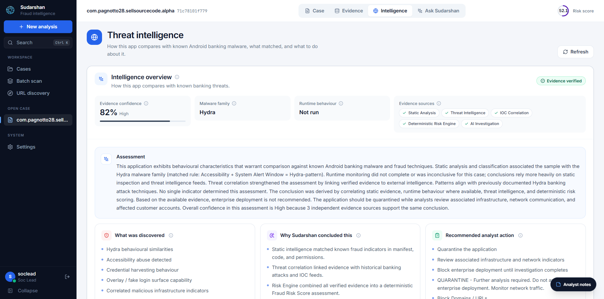<br>
<sub><b>5 · Threat intelligence.</b> What was found, why Sudarshan concluded it, and what the analyst should do next.</sub>
</td>
<td width="50%">
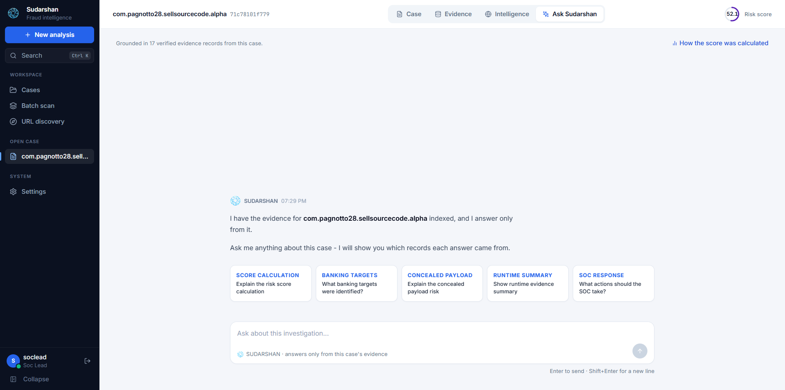<br>
<sub><b>6 · Ask Sudarshan.</b> Question the case in plain English. Answers stay grounded in the verified records.</sub>
</td>
</tr>
<tr>
<td width="50%">
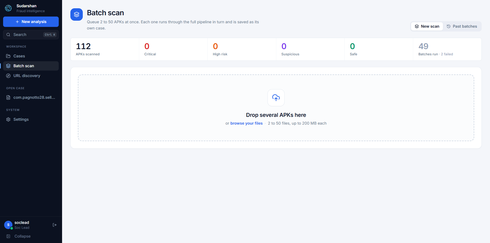<br>
<sub><b>7 · Batch scan.</b> Queue 2–50 APKs at once, and each one becomes its own case.</sub>
</td>
<td width="50%">
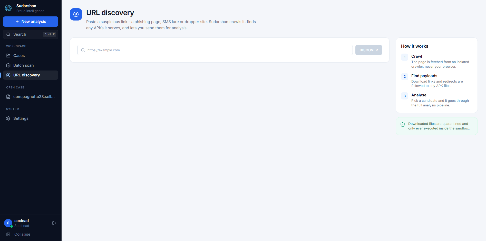<br>
<sub><b>8 · URL discovery.</b> Paste the SMS link. Sudarshan crawls it in isolation and pulls out any APKs it serves.</sub>
</td>
</tr>
<tr>
<td colspan="2" align="center">
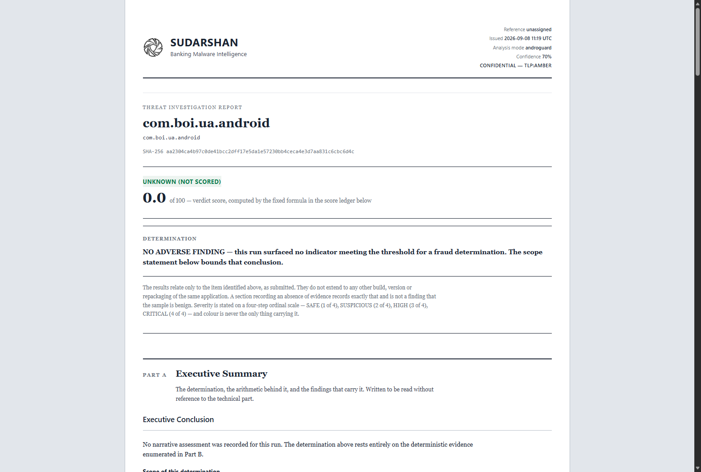<br>
<sub><b>9 · The dossier.</b> An executive PDF, a technical SOC report, interactive HTML or a STIX 2.1 bundle, ready for the people who have to act.</sub>
</td>
</tr>
</table>

<br>

## 🚀 Run it yourself

> [!WARNING]
> Sudarshan's dynamic engine **runs live malware**. Run it only on a machine you control, with the Android sandbox isolated as described in [Sandbox Containment](docs/05_SECURITY/SANDBOX_CONTAINMENT.md).

**You'll need:** Docker Desktop 4.20+ (Compose v2). For dynamic analysis you'll also need an Android emulator (Genymotion or an AVD).

```bash
git clone https://github.com/SanTiwari07/Sudarshan.git
cd Sudarshan
cp .env.example .env          # set JWT_SECRET_KEY; add GEMINI / VirusTotal keys if you have them
docker compose up -d
```

Then open **http://localhost:5173** for the console. API docs live at http://localhost:8000/docs.

On Windows, one command checks your dependencies and ports, then starts everything:

```powershell
.\start.ps1
```

📘 Full guide: [How to Run](docs/06_OPERATIONS/HOW_TO_RUN.md) · [Troubleshooting](docs/06_OPERATIONS/TROUBLESHOOTING.md)

<br>

## 🔭 Under the hood

For the curious, the reviewers and the reverse engineers. Click any section to expand it.

<details>
<summary><b>🏗️ System architecture</b></summary>

<br>

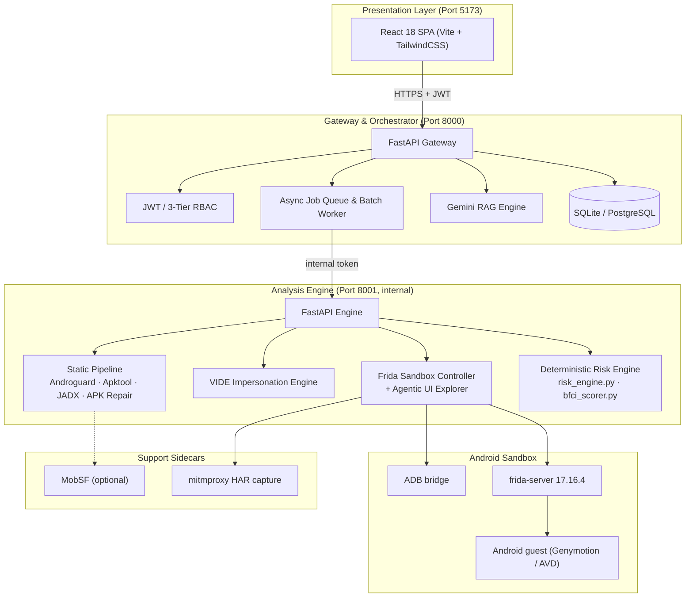
```mermaid
graph TB
    subgraph Client_Layer["Presentation Layer (Port 5173)"]
        UI["React 18 SPA (Vite + TailwindCSS)"]
    end

    subgraph Gateway_Layer["Gateway & Orchestrator (Port 8000)"]
        API["FastAPI Gateway"]
        AUTH["JWT / 3-Tier RBAC"]
        QUEUE["Async Job Queue & Batch Worker"]
        RAG["Gemini RAG Engine"]
        DB[(SQLite / PostgreSQL)]
    end

    subgraph Microservice_Layer["Analysis Engine (Port 8001, internal)"]
        ENG["FastAPI Engine"]
        STATIC["Static Pipeline<br/>Androguard · Apktool · JADX · APK Repair"]
        VIDE_ENG["VIDE Impersonation Engine"]
        DYNAMIC["Frida Sandbox Controller<br/>+ Agentic UI Explorer"]
        RISK["Deterministic Risk Engine<br/>risk_engine.py · bfci_scorer.py"]
    end

    subgraph Sidecar_Layer["Support Sidecars"]
        MOBSF["MobSF (optional)"]
        MITM["mitmproxy HAR capture"]
    end

    subgraph Sandbox_Layer["Android Sandbox"]
        ADB["ADB bridge"]
        FRIDA["frida-server 17.16.4"]
        GUEST["Android guest (Genymotion / AVD)"]
    end

    UI -->|HTTPS + JWT| API
    API --> AUTH & QUEUE & RAG & DB
    QUEUE -->|internal token| ENG
    ENG --> STATIC & VIDE_ENG & DYNAMIC & RISK
    STATIC -.-> MOBSF
    DYNAMIC --> MITM & ADB & FRIDA
    FRIDA --> GUEST
```

| Folder | What lives there |
|:--|:--|
| [`backend/`](backend) | FastAPI gateway, auth, case store, batch queue, RAG assistant |
| [`analysis-engine/`](analysis-engine) | Static and dynamic analysis microservice, Frida and ADB drivers |
| [`shared/`](shared) | Core library: risk engine, BFCI v2, VIDE, Frida hooks |
| [`frontend/`](frontend) | React 18 + Vite analyst console |
| [`tests/`](tests) | Unit and integration suites |
| [`docs/`](docs/README.md) | Code-verified documentation portal |

More: [System Architecture](docs/01_ARCHITECTURE/SYSTEM_ARCHITECTURE.md) · [Codebase Map](docs/01_ARCHITECTURE/CODEBASE_MAP.md) · [Data Flow](docs/01_ARCHITECTURE/DATA_FLOW.md)
</details>

<details>
<summary><b>⚖️ The Fraud Risk Score, formula by formula</b></summary>

<br>

$$\text{FRS} = 0.25 \times \text{STEI} + 0.35 \times \text{BFCI} + 0.20 \times \text{Correlation} + 0.20 \times \text{BankingImpact}$$

**STEI, the Static Threat Evaluation Index**

$$\text{STEI} = 0.60 \times \text{CT} + 0.20 \times \text{BT} + 0.10 \times \text{PR} + 0.05 \times \text{OB} + 0.05 \times \text{IR}$$

- **CT, Credential Theft:** Accessibility abuse (+40), SMS interception (+35), overlay window (+25)
- **BT, Banking Targeting:** matched Indian banking packages or a VIDE clone hit (+35 to +85)
- **PR / OB / IR:** permission risk, obfuscation, hardcoded C2 infrastructure

**Risk bands**

| Score | Band | Response |
|:--|:--|:--|
| 0 – 19.9 | 🟢 `Safe` | No fraud indicators |
| 20 – 39.9 | 🔵 `Low` | Standard monitoring |
| 40 – 59.9 | 🟣 `Medium` | Quarantine for review |
| 60 – 79.9 | 🟠 `High` | Block and notify customers |
| 80 – 100 | 🔴 `Critical` | Active trojan: revoke sessions, block C2 |

**Safety floors.** A sample can't be called `Safe` if it hid from the sandbox (visibility floor), if strong static evidence exists (static evidence floor), or if it tried to detect the emulator (evasion floor).

**The CH27 on-device fraud triad.** Visual clone confidence > 0.85, a signer mismatch and Accessibility abuse together escalate straight to **FRS ≥ 95 (Critical)**.

More: [Risk Engine](docs/03_RISK/RISK_ENGINE.md) · [STEI](docs/03_RISK/STEI.md) · [Determinism](docs/03_RISK/DETERMINISM.md)
</details>

<details>
<summary><b>🧬 BFCI v2, the behavioural fingerprint</b></summary>

<br>

Runtime behaviour is scored across seven weighted categories (Σw = 1.0), with log-scaled volume and a bonus for temporal attack chains.

| Behaviour | Weight | What Frida watches |
|:--|:--:|:--|
| Accessibility | `0.315` | Screen scraping, tap injection, keylogging |
| SMS interception | `0.225` | `SMS_RECEIVED`, `SmsManager.sendTextMessage` |
| Overlay phishing | `0.180` | `WindowManager.addView`, `TYPE_APPLICATION_OVERLAY` |
| Code execution | `0.100` | `DexClassLoader`, `Runtime.exec` |
| Banking targeting | `0.090` | Foreground monitoring of banking apps |
| C2 network | `0.045` | Exfiltration sockets and POSTs |
| Persistence | `0.045` | Device admin, boot receivers, icon hiding |

More: [BFCI](docs/03_RISK/BFCI.md) · [Frida Instrumentation](docs/02_ANALYSIS/FRIDA_INSTRUMENTATION.md)
</details>

<details>
<summary><b>🎭 VIDE, catching the bank look-alikes</b></summary>

<br>

The **Visual Impersonation Detection Engine** asks *"Is this pretending to be a bank?"* along four independent axes:

1. **Layout AST:** tree-edit distance between decompiled layouts and real bank screens
2. **Colour:** CIEDE2000 ΔE against official brand palettes
3. **Text:** RapidFuzz similarity on labels and login prompts
4. **Signer registry:** the certificate must match the real bank's key, and it fails closed

**Protected institutions:** SBI · HDFC · ICICI · Axis · PNB · Bank of Baroda · Bank of India · Kotak · IndusInd · Union Bank

More: [Visual Impersonation](docs/02_ANALYSIS/VISUAL_IMPERSONATION.md)
</details>

<details>
<summary><b>🤖 The agentic sandbox explorer</b></summary>

<br>

Many trojans do nothing until you reach the login screen. So Sudarshan drives the app with an agent that sees through a **5-level perception hierarchy**: UI Automator XML, activity lifecycle, Frida hook signals, logcat, and an OCR/vision fallback for Flutter or canvas UIs. It classifies screens into 17 semantic types (such as `BANKING_LOGIN`, `OTP_ENTRY` and `PERMISSION_REQUEST`) and keeps a screen graph so it never loops.

More: [Agentic Exploration](docs/02_ANALYSIS/AGENTIC_EXPLORATION.md) · [Dynamic Analysis](docs/02_ANALYSIS/DYNAMIC_ANALYSIS.md)
</details>

<details>
<summary><b>💬 Ask Sudarshan, the grounded AI assistant</b></summary>

<br>

- Google Gemini (`gemini-2.5-flash`) over an in-memory **investigation graph** of the case's evidence, with no web access during chat
- Every APK-derived string is **sanitised** to defuse prompt-injection planted by malware authors
- A 3-state **circuit breaker** degrades gracefully, and scoring never depends on the AI being up
- Answers follow a fixed 7-section forensic template

More: [AI Investigation](docs/04_AI/AI_INVESTIGATION.md) · [Prompt Sanitization](docs/04_AI/PROMPT_SANITIZATION.md) · [AI Safety](docs/04_AI/AI_SAFETY.md)
</details>

<details>
<summary><b>🦠 Trojan families it knows</b></summary>

<br>

| Family | Signature move |
|:--|:--|
| **Drinik** | Income-tax refund phishing, SMS OTP theft |
| **Xenomorph** | Automated Transfer System (ATS), overlays |
| **SOVA** | Cookie theft, 2FA interception, VNC streaming |
| **Anubis** | SMS interception, audio recording, ransomware lock |
| **Cerberus** | Authenticator OTP theft, PII harvesting |
| **Hydra** | PIN / pattern bypass, SMS exfiltration |
| **Octo / Coper** | Remote control behind a black-screen overlay |
| **Teabot** | Live screen streaming, keylogging |
</details>

<details>
<summary><b>🔌 API, configuration and tests</b></summary>

<br>

**Key endpoints** (full OpenAPI at `http://localhost:8000/docs`)

| Method | Endpoint | Purpose |
|:--|:--|:--|
| `POST` | `/api/v1/auth/login` | Get a JWT |
| `POST` | `/api/v1/analyze/async` | Queue an APK |
| `GET` | `/api/v1/status/{job_id}` | Poll progress |
| `GET` | `/api/v1/cases/{sha256}` | Full case record |
| `POST` | `/api/v1/batches` | Submit 2–50 APKs |
| `POST` | `/api/v1/chat` | Ask Sudarshan |
| `GET` | `/api/v1/report/pdf/{sha256}` | Executive PDF |
| `GET` | `/api/v1/report/stix/{sha256}` | STIX 2.1 bundle |

**Essential environment variables:** `JWT_SECRET_KEY` (required), `DATABASE_URL` (PostgreSQL, otherwise SQLite), `ANALYSIS_ENGINE_INTERNAL_TOKEN`, `GEMINI_API_KEY`, `VIRUSTOTAL_API_KEY`, `FRIDA_ANALYSIS_DURATION` (default 130 s). The full list is in [Environment](docs/06_OPERATIONS/ENVIRONMENT.md).

**Tests:** 2,841 collected, 2,813 passed, 28 skipped (these need hardware or a live sandbox), 0 failed.

```powershell
$env:JWT_SECRET_KEY="test_key_for_testing_123456789012345678901234567890"
.venv\Scripts\python -m pytest tests/unit backend/tests -q
```

More: [API Reference](docs/07_API/API_REFERENCE.md) · [Testing](docs/08_DEVELOPMENT/TESTING.md) · [Feature Status](docs/10_VALIDATION/FEATURE_STATUS.md)
</details>

<br>

## 🧱 Honest limits

No sandbox catches everything. Here is where Sudarshan's edges are:

- **Sleeper malware.** A trojan that waits 24 hours won't fire in a 130-second run. The run is marked `INCOMPLETE_EXERCISE`, and the static evidence floor keeps it from being labelled *Safe*.
- **One device, one sample.** Dynamic runs on a single emulator are serialised so that apps don't collide on screen.
- **Threat-intel quotas.** VirusTotal is rate-limited to 4 requests a minute, backed by a 24-hour cache.

See [Known Limitations](docs/05_SECURITY/KNOWN_SECURITY_LIMITATIONS.md).

<br>

## 📚 Keep reading

| If you want to… | Start here |
|:--|:--|
| Understand *why* Sudarshan exists | [Vision](docs/00_PROJECT/VISION.md) · [Project Context](docs/00_PROJECT/PROJECT_CONTEXT.md) |
| Check what's real vs. planned | [Ground Truth](docs/00_PROJECT/GROUND_TRUTH.md) · [Feature Status](docs/10_VALIDATION/FEATURE_STATUS.md) |
| Run or deploy it | [How to Run](docs/06_OPERATIONS/HOW_TO_RUN.md) · [Deployment](docs/06_OPERATIONS/DEPLOYMENT.md) |
| Audit the scoring | [Risk Engine](docs/03_RISK/RISK_ENGINE.md) · [Determinism](docs/03_RISK/DETERMINISM.md) |
| Contribute | [CONTRIBUTING.md](CONTRIBUTING.md) · [Development Guide](docs/08_DEVELOPMENT/DEVELOPMENT_GUIDE.md) |

<br>

<div align="center">

**Built for defenders.** Sudarshan is for fraud teams, SOCs and researchers, used only in isolated, authorised environments.

Released under the [MIT License](LICENSE). It stands on the shoulders of [Frida](https://frida.re/), [Androguard](https://github.com/androguard/androguard), [APKTool](https://ibotpeaches.github.io/Apktool/), [JADX](https://github.com/skylot/jadx), [mitmproxy](https://mitmproxy.org/), [FastAPI](https://fastapi.tiangolo.com/) and [React](https://react.dev/).

<br>


<sub><i>The one that sees clearly.</i></sub>

</div>
