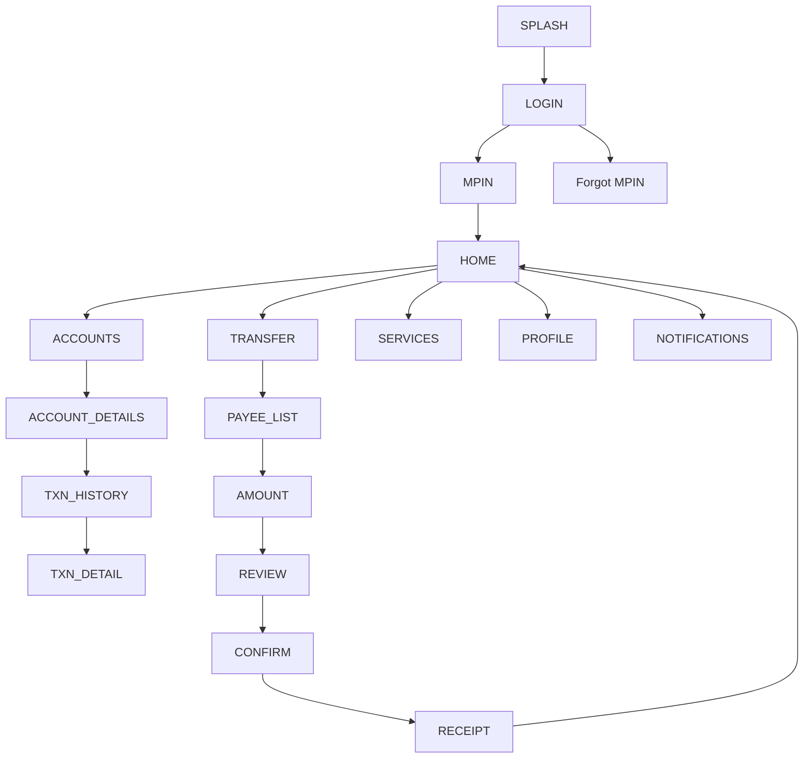

# 01 — YONO SBI — Design Specification

> **Reference exemplar for the corpus.** This file establishes the full section
> depth and conventions every other design spec follows.

# APP IDENTITY

- **Bank:** State Bank of India (public sector)
- **Exact Application Name:** YONO SBI *(You Only Need One)*
- **Baseline ID:** `BASE-01-SBI` · **Shortcode:** `SBI`
- **Research Date:** 2026-08-12
- **Platform:** Android (Capacitor target); iOS listing exists
- **Official Sources:** SBI YONO product positioning; industry roundups; store
  listing (package `com.sbi.lotusintouch` commonly cited, `NOT VERIFIED THIS PASS`)
- **Research Confidence:** Identity HIGH; visual detail PARTIAL (APPROXIMATED)

# PURPOSE OF THIS SPECIFICATION

This is a **research-grounded frontend prototype specification** for a controlled
testing corpus. It describes a **local, mock-data, client-side** reconstruction of
publicly observable UI patterns of YONO SBI, to be used as a **trusted baseline**
for SUDARSHAN's Visual Identity & Deception Engine (VIDE). It is **not** a
reproduction of SBI's banking infrastructure and involves **no** real
authentication, backend, credentials, or transactions. Brand colors are
approximations from public brand identity; unverified details are labelled.

# SOURCE EVIDENCE

| Source | Type | What It Supports | Confidence |
|---|---|---|---|
| SBI YONO product positioning (super-app) | [PUBLIC OBSERVATION] | App purpose, unified banking+lifestyle framing | HIGH |
| Industry "best banking apps 2025" roundups | [PUBLIC OBSERVATION] | Popularity, YONO as flagship | MED |
| Store listing (rating ~4.3★) | [PUBLIC OBSERVATION] | App exists, scale signal | MED |
| Public brand identity (SBI blue; YONO blue/green) | [PUBLIC OBSERVATION] | Brand color approximation | MED |
| Common Indian mobile-banking UX conventions | [INFERENCE] | Screen structure/flows | LOW–MED |

> Post-login screens (dashboard/transfer) are only partially observable publicly;
> their layouts here are **representative reconstructions** (`[INFERENCE]`).

# BRAND AND VISUAL IDENTITY

## Logo Treatment
SBI's mark is a recognizable keyhole/circle; YONO uses a wordmark. **Do not bundle
the real logo.** → **ORIGINAL TEST ASSET REQUIRED:** use a neutral placeholder mark
(e.g. a stylized "Y" or a generic keyhole glyph) tinted with the brand-approximate
palette, clearly a test asset. No claim of authorization to reuse SBI assets.

## Color System

| Token | Value | Confidence | Evidence |
|---|---|---|---|
| primary | `#1B4AA0` (deep blue) | APPROXIMATED | SBI brand blue (public identity) |
| secondary | `#2E9E4B` (green) | APPROXIMATED | YONO green accent (public identity) |
| accent | `#6C4BB6` (violet) | APPROXIMATED | YONO gradient hint (public observation) |
| background | `#F4F6FA` | APPROXIMATED | common light banking bg |
| surface | `#FFFFFF` | APPROXIMATED | card surfaces |
| text-primary | `#16213A` | APPROXIMATED | high-contrast text |
| text-secondary | `#5B6472` | APPROXIMATED | secondary text |
| divider | `#E3E7EE` | APPROXIMATED | hairlines |
| success | `#2E9E4B` | APPROXIMATED | credit/positive |
| warning | `#E8A100` | APPROXIMATED | caution |
| error | `#D0342C` | APPROXIMATED | debit/error |

## Typography
- **Observed style:** clean humanist sans (system-like). Exact bundled font **UNKNOWN**.
- **Implementation font:** system stack (`Roboto`/`Inter` fallback), labelled APPROXIMATED.
- **Weight hierarchy:** 700 headings, 500 emphasis, 400 body.
- **Approx sizes:** display 32 / headline 24 / title 20 / subtitle 16 / body 14 / caption 12.
- **Confidence:** APPROXIMATED.

# DESIGN PRINCIPLES
- **Visual density:** medium; card-based dashboard with grouped services.
- **Hierarchy:** balance/account prominence at top, quick actions below, activity list.
- **Card usage:** rounded surfaces (radius ~16) with soft elevation.
- **Whitespace:** generous 16px gutters.
- **Interaction style:** tap-forward navigation; bottom nav for primary sections.
- **Navigation philosophy:** hub-and-spoke from Home; modal for confirmations.

# SCREEN INVENTORY

**MUST IMPLEMENT (13):** `SPLASH`, `LOGIN`, `MPIN`, `HOME`, `ACCOUNTS`,
`ACCOUNT_DETAILS`, `TXN_HISTORY`, `TRANSFER`, `AMOUNT`, `REVIEW`, `CONFIRM`/`RECEIPT`,
`SERVICES`, `PROFILE`.

**OPTIONAL:** `ONBOARDING`, `BIOMETRIC`, `CARDS`, `DEPOSITS`, `REWARDS`, `OFFERS`,
`NOTIFICATIONS`, `SETTINGS`.

**NOT VERIFIED / EXCLUDED:** YONO 2.0-specific redesign screens, lifestyle
marketplace internals (flagged `[UNKNOWN]`).

# INFORMATION ARCHITECTURE

## 1. Mermaid navigation graph


## 2. Human-readable flow map
Splash → Login (MPIN entry) → Home hub. From Home: Accounts (→ details → history),
Transfer (→ payee → amount → review → confirm → receipt), Services, Profile.

## 3. Screen-to-screen relationship table
| From | To | Trigger |
|---|---|---|
| SPLASH | LOGIN | timeout |
| LOGIN | MPIN | tap Login (mock) |
| MPIN | HOME | 6-digit entered (mock) |
| HOME | ACCOUNTS | tap account card |
| ACCOUNTS | ACCOUNT_DETAILS | tap account |
| ACCOUNT_DETAILS | TXN_HISTORY | tap "View all" |
| HOME | TRANSFER | tap Transfer quick action |
| TRANSFER | AMOUNT | select payee |
| AMOUNT | REVIEW | tap Continue |
| REVIEW | CONFIRM | tap Confirm |
| CONFIRM | RECEIPT | mock success |

# SCREEN SPECIFICATIONS

## SCREEN: SPLASH
- **Screen ID:** `SBI-SPLASH` · **Route:** `/` · **Purpose:** brand entry ·
  **Evidence:** [INFERENCE]
### Semantic UI Hierarchy
```
ROOT
├── STATUS_REGION
└── CENTER
    ├── BRAND_MARK (test asset)
    └── TAGLINE
```
### Layout Centered brand mark on primary-tinted background; auto-advances.
### Components `BrandMark`, timed redirect.
### Text Features "YONO" (test wordmark).
### Visual Features primary background, white mark.
### Interactions auto → LOGIN after ~1.5s (mock timer).
### Prototype Behavior SIMULATED / LOCAL ONLY.

## SCREEN: LOGIN
- **Screen ID:** `SBI-LOGIN` · **Route:** `/login` · **Purpose:** mock auth entry ·
  **Evidence:** [PUBLIC OBSERVATION] (auth-first pattern) / [INFERENCE] (details)
- **Structural signature:** `AUTH_FORM_VERTICAL_PRIMARY_CTA`
### Semantic UI Hierarchy
```
ROOT
├── HEADER (brand mark)
├── PRIMARY_CONTENT
│   ├── USERNAME_FIELD
│   ├── PASSWORD/MPIN_HINT
│   └── PRIMARY_CTA (Login)
└── FOOTER
    ├── FORGOT (secondary action)
    └── REGISTER (secondary action)
```
### Layout Brand at top; vertically stacked fields; primary CTA full-width;
recovery link below.
### Components `Header`, `InputField`×2, `PrimaryButton`, text links.
### Text Features "Username", "Login", "Forgot MPIN?", "New user? Register".
### Visual Features white surface, primary CTA, subtle divider.
### Interactions tap Login → MPIN; tap Forgot → FORGOT (mock); tap Register → ONBOARDING (mock).
### Prototype Behavior No credential validation; any input advances. MOCK DATA.

## SCREEN: MPIN
- **Screen ID:** `SBI-MPIN` · **Route:** `/mpin` · **Purpose:** mock PIN entry ·
  **Evidence:** [PUBLIC OBSERVATION] (MPIN is standard) 
- **Structural signature:** `PINPAD_NUMERIC_ENTRY`
### Semantic UI Hierarchy
```
ROOT
├── HEADER (title + optional biometric icon)
├── PIN_DOTS (6)
└── PINPAD (0-9, delete)
```
### Layout Title, 6 dot indicators, numeric keypad.
### Components `PINPad`, dot indicators, `BiometricHint` (visual only).
### Text Features "Enter MPIN".
### Interactions 6 digits entered → HOME (mock); biometric icon = visual only.
### Prototype Behavior No real PIN; **no credential capture**. SIMULATED.

## SCREEN: HOME (Dashboard)
- **Screen ID:** `SBI-HOME` · **Route:** `/home` · **Purpose:** primary hub ·
  **Evidence:** [PUBLIC OBSERVATION] (card dashboard) / [INFERENCE] (exact layout)
- **Structural signature:** `DASHBOARD_CARD_GRID_QUICKACTIONS` + `TAB_HOST_BOTTOMNAV`
### Semantic UI Hierarchy
```
ROOT
├── STATUS_REGION
├── HEADER (greeting + brand + notifications + profile)
├── PRIMARY_CONTENT
│   ├── ACCOUNT_SUMMARY_CARD (balance, masked no.)
│   ├── QUICK_ACTIONS (Transfer, Pay, Scan, Services)
│   ├── PROMO/REWARDS_STRIP (visual only)
│   └── RECENT_ACTIVITY (transaction preview)
└── BOTTOM_NAVIGATION (Home, Accounts, Pay, Services, Profile)
```
### Layout Header greeting; hero balance card; 4-tile quick actions; recent
activity list; bottom nav.
### Components `Header`, `AccountCard`, `QuickAction`×4, `TransactionRow`×N,
`BottomNavigation`.
### Text Features "Good morning", "Available Balance", "Transfer", "Pay",
"Scan & Pay", "Services", "Recent Activity", "View all".
### Visual Features hero card in primary tint; white surfaces; green/red txn amounts.
### Interactions account card → ACCOUNT_DETAILS; Transfer → TRANSFER; notifications
→ NOTIFICATIONS; bottom nav switches tabs.
### Prototype Behavior All data from local mock JSON. MOCK DATA.

## SCREEN: ACCOUNTS
- **Screen ID:** `SBI-ACCOUNTS` · **Route:** `/accounts` · **Evidence:** [INFERENCE]
- **Signature:** `LIST_TRANSACTIONS_CHRONO` (account list variant)
### Hierarchy `HEADER → ACCOUNT_LIST(cards) → BOTTOM_NAV`.
### Components `Header`, `AccountCard`×N.
### Interactions tap account → ACCOUNT_DETAILS.
### Prototype Behavior MOCK DATA.

## SCREEN: ACCOUNT_DETAILS
- **Screen ID:** `SBI-ACCOUNT_DETAILS` · **Route:** `/accounts/:id` · **Signature:** `DETAIL_HEADER_METADATA_LIST`
### Hierarchy `HEADER(back) → BALANCE_BLOCK → META(acct no, IFSC, type) → RECENT_TXN → CTA(View all)`.
### Text "Balance", "Account Number", "IFSC", "View all transactions".
### Interactions View all → TXN_HISTORY.

## SCREEN: TXN_HISTORY
- **Screen ID:** `SBI-TXN_HISTORY` · **Route:** `/accounts/:id/transactions` · **Signature:** `LIST_TRANSACTIONS_CHRONO`
### Hierarchy `HEADER(back,filter) → DATE_GROUPS → TRANSACTION_ROWS`.
### Components `TransactionRow`×N grouped by date; `EmptyState` when none.
### Interactions row → TXN_DETAIL (modal or route).

## SCREEN: TRANSFER → AMOUNT → REVIEW → CONFIRM → RECEIPT (payment flow)
- **Screen IDs:** `SBI-TRANSFER`, `SBI-AMOUNT`, `SBI-REVIEW`, `SBI-CONFIRM`, `SBI-RECEIPT`
- **Signatures:** `LIST_TRANSACTIONS_CHRONO` (payee), `FORM_AMOUNT_ENTRY_NUMERIC`,
  `SUMMARY_REVIEW_CONFIRM`, `RECEIPT_SUCCESS_STATE`
### TRANSFER Hierarchy `HEADER → PAYEE_LIST(cards) → ADD_PAYEE(cta)`. Tap payee → AMOUNT.
### AMOUNT Hierarchy `HEADER(payee summary) → AMOUNT_INPUT(numeric) → NOTE_FIELD → CONTINUE_CTA`.
### REVIEW Hierarchy `HEADER → SUMMARY(from, to, amount, note) → CONFIRM_CTA`.
### CONFIRM Hierarchy `MPIN/confirm modal (mock)` → RECEIPT.
### RECEIPT Hierarchy `SUCCESS_ICON → SUMMARY → DONE_CTA → SHARE(visual only)`. Done → HOME.
### Text "Send money", "Amount", "Add a note", "Continue", "Confirm", "Payment successful".
### Prototype Behavior **No real transfer**; amounts adjust only local mock state. SIMULATED.

## SCREEN: SERVICES
- **Screen ID:** `SBI-SERVICES` · **Route:** `/services` · **Signature:** `SETTINGS_LIST_GROUPED`
### Hierarchy `HEADER → SERVICE_GRID/LIST (grouped tiles)`.
### Text "Cards", "Deposits", "Cheque", "Requests", "Support" (short labels).
### Interactions tiles → placeholder/visual screens; some `EmptyState`.

## SCREEN: PROFILE
- **Screen ID:** `SBI-PROFILE` · **Route:** `/profile` · **Signature:** `SETTINGS_LIST_GROUPED`
### Hierarchy `HEADER → USER_BLOCK(mock name) → SETTINGS_LIST → LOGOUT`.
### Text "Profile", "Settings", "Security", "Logout".
### Interactions Logout → LOGIN (reset mock session).

# REUSABLE COMPONENT SYSTEM
`AppShell`, `Header`, `BottomNavigation`, `AccountCard`, `QuickAction`,
`TransactionRow`, `PrimaryButton`, `SecondaryButton`, `InputField`, `PINPad`,
`Modal`, `Toast`, `EmptyState`, `ListSection`, `Chip/Badge`. (Shared corpus set.)

# DESIGN TOKEN MAP
```css
--color-primary:#1B4AA0;         /* APPROXIMATED */
--color-secondary:#2E9E4B;       /* APPROXIMATED */
--color-accent:#6C4BB6;          /* APPROXIMATED */
--color-bg:#F4F6FA;              /* APPROXIMATED */
--color-surface:#FFFFFF;         /* APPROXIMATED */
--color-text-primary:#16213A;    /* APPROXIMATED */
--color-text-secondary:#5B6472;  /* APPROXIMATED */
--color-divider:#E3E7EE;         /* APPROXIMATED */
--color-success:#2E9E4B; --color-warning:#E8A100; --color-error:#D0342C; /* APPROXIMATED */
--radius-card:16px; --radius-md:12px; --radius-pill:999px; /* INFERENCE */
--space-16:16px; --space-8:8px; --space-24:24px;           /* system */
--font-heading:'Inter',system-ui;  /* APPROXIMATED (real font UNKNOWN) */
```

# NAVIGATION MANIFEST (JSON example)
```json
{
  "baselineId":"BASE-01-SBI","entry":"SBI-SPLASH",
  "nodes":[
    {"id":"SBI-SPLASH","route":"/","type":"system"},
    {"id":"SBI-LOGIN","route":"/login","type":"auth"},
    {"id":"SBI-MPIN","route":"/mpin","type":"auth"},
    {"id":"SBI-HOME","route":"/home","type":"primary"},
    {"id":"SBI-ACCOUNTS","route":"/accounts","type":"primary"},
    {"id":"SBI-TRANSFER","route":"/transfer","type":"flow"},
    {"id":"SBI-AMOUNT","route":"/transfer/amount","type":"flow"},
    {"id":"SBI-REVIEW","route":"/transfer/review","type":"flow"},
    {"id":"SBI-RECEIPT","route":"/transfer/receipt","type":"flow"}
  ],
  "edges":[
    {"from":"SBI-SPLASH","to":"SBI-LOGIN","trigger":"timeout"},
    {"from":"SBI-LOGIN","to":"SBI-MPIN","trigger":"submit-mock"},
    {"from":"SBI-MPIN","to":"SBI-HOME","trigger":"mpin-complete-mock"},
    {"from":"SBI-HOME","to":"SBI-TRANSFER","trigger":"tap-transfer"},
    {"from":"SBI-TRANSFER","to":"SBI-AMOUNT","trigger":"select-payee"},
    {"from":"SBI-AMOUNT","to":"SBI-REVIEW","trigger":"continue"},
    {"from":"SBI-REVIEW","to":"SBI-RECEIPT","trigger":"confirm-mock"}
  ]
}
```

# SCREEN FINGERPRINT MAP (semantic, authored — not extracted)
```
SCREEN_ID: SBI-LOGIN
STRUCTURAL_SIGNATURE: AUTH_FORM_VERTICAL_PRIMARY_CTA
FEATURES: [auth-focused, vertical fields, single primary CTA, recovery action, brand header]
REGION_ORDER: [STATUS, HEADER, PRIMARY_CONTENT, FOOTER_CTA]

SCREEN_ID: SBI-HOME
STRUCTURAL_SIGNATURE: DASHBOARD_CARD_GRID_QUICKACTIONS
FEATURES: [hero balance card, quick-action grid, recent activity list, bottom nav]
REGION_ORDER: [STATUS, HEADER, PRIMARY_CONTENT, BOTTOM_NAV]

SCREEN_ID: SBI-AMOUNT
STRUCTURAL_SIGNATURE: FORM_AMOUNT_ENTRY_NUMERIC
FEATURES: [payee summary, large numeric amount input, note field, continue CTA]
REGION_ORDER: [HEADER, PRIMARY_CONTENT, FOOTER_CTA]
```

# MOCK DATA REQUIREMENTS
Local JSON (fictional): `accounts` (2–3, masked `XXXXXX1234`), `transactions`
(15–25, mixed credit/debit), `payees` (4–6), `cards` (1–2), `notifications` (3–5).
All names/amounts/IFSC invented; no real PII.

# PROTOTYPE EXCLUSIONS
- no real login · no credential transmission · no real bank backend · no financial
  transactions · no live OTP · no production security · no collection of personal
  data · no real logo/trademark reuse (original test assets).

# RESEARCH GAPS AND LIMITATIONS
- Exact YONO color hex values: **UNKNOWN** (approximated from brand identity).
- Exact bundled typeface: **UNKNOWN**.
- YONO 2.0 redesign specifics: **UNKNOWN / NOT VERIFIED**.
- Post-login layouts: **[INFERENCE]** representative reconstructions.
- Package ID: commonly cited, **NOT VERIFIED THIS PASS**.

# IMPLEMENTATION HANDOFF SUMMARY
Build a 13-screen mock prototype: splash → login → mpin → home hub with bottom nav
→ accounts/details/history → transfer→amount→review→confirm→receipt → services →
profile. Blue/green approximated palette, card dashboard, deterministic mock data,
no real backend. Grade colors/layout as APPROXIMATED/representative in the fidelity
audit. See `03-implementation-plans/01_sbi_yono_implementation.md`.
