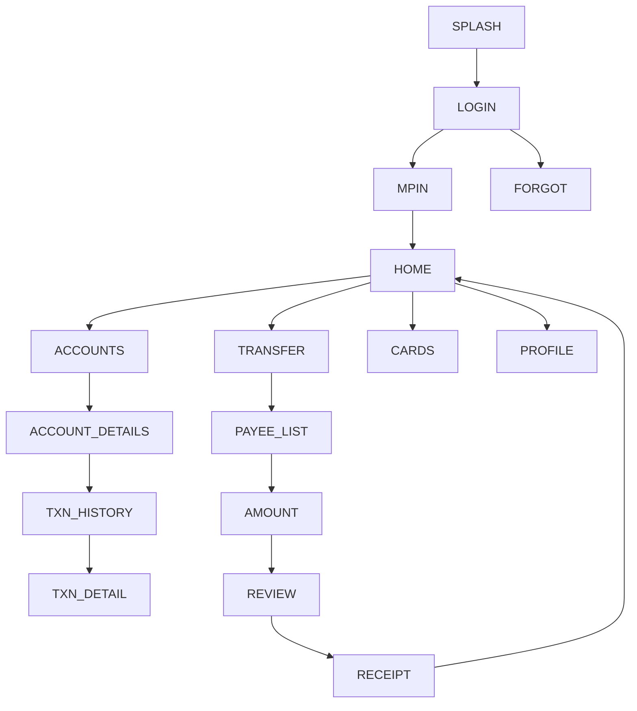

# 02 — HDFC Bank MobileBanking — Design Specification

*Follows the corpus schema (see `01_sbi_yono.md` for the fully-annotated exemplar
and `04-baseline-architecture/APP_CORPUS_SCHEMA.md` for shared conventions).*

# APP IDENTITY
- **Bank:** HDFC Bank (private sector)
- **Exact Application Name:** HDFC Bank MobileBanking App
- **Baseline ID:** `BASE-02-HDFC` · **Shortcode:** `HDFC`
- **Research Date:** 2026-08-12
- **Platform:** Android (Capacitor target); iOS exists
- **Official Sources:** industry roundups (HDFC as market leader); store listing
  (package `com.snapwork.hdfc` commonly cited, `NOT VERIFIED THIS PASS`)
- **Research Confidence:** Identity HIGH; visual detail PARTIAL (APPROXIMATED)
- **Naming note:** PayZapp (payments) and SmartHub (merchant) are **out of scope**;
  baseline is the core MobileBanking app.

# PURPOSE OF THIS SPECIFICATION
Research-grounded, local, mock-data frontend prototype spec of publicly observable
HDFC MobileBanking UI patterns, as a VIDE trusted baseline. No real auth/backend/
credentials/transactions. Brand colors approximated from public brand identity.

# SOURCE EVIDENCE
| Source | Type | What It Supports | Confidence |
|---|---|---|---|
| Industry roundups (2025) | [PUBLIC OBSERVATION] | Market leadership, app existence | MED |
| Store listing (~3.9★) | [PUBLIC OBSERVATION] | Scale signal | MED |
| HDFC public brand (blue + red) | [PUBLIC OBSERVATION] | Color approximation | MED |
| Common banking UX conventions | [INFERENCE] | Screen structure/flows | LOW–MED |

# BRAND AND VISUAL IDENTITY
## Logo Treatment
HDFC uses a blue square with red band motif. **Do not bundle real logo.** →
**ORIGINAL TEST ASSET REQUIRED:** neutral placeholder mark in approximated palette.
## Color System
| Token | Value | Confidence | Evidence |
|---|---|---|---|
| primary | `#004C8F` (HDFC blue) | APPROXIMATED | public brand identity |
| secondary | `#ED232A` (HDFC red) | APPROXIMATED | public brand identity |
| accent | `#0072BC` | APPROXIMATED | lighter blue accent |
| background | `#F2F5F9` | APPROXIMATED | light bg |
| surface | `#FFFFFF` | APPROXIMATED | cards |
| text-primary | `#12233B` | APPROXIMATED | text |
| text-secondary | `#5A6577` | APPROXIMATED | secondary |
| divider | `#E1E6EE` | APPROXIMATED | hairlines |
| success `#178C4E` / warning `#E8A100` / error `#ED232A` | APPROXIMATED | states |
## Typography
Humanist sans; exact font **UNKNOWN**. Implement system/`Inter`. 700/500/400.
Sizes per corpus scale. APPROXIMATED.

# DESIGN PRINCIPLES
Medium density; blue-dominant header, red used sparingly for emphasis/alerts;
card dashboard; bottom nav; tap-forward navigation; modal confirmations.

# SCREEN INVENTORY
**MUST IMPLEMENT (12):** `SPLASH`, `LOGIN`, `MPIN`, `HOME`, `ACCOUNTS`,
`ACCOUNT_DETAILS`, `TXN_HISTORY`, `TRANSFER`, `AMOUNT`, `REVIEW`, `RECEIPT`, `PROFILE`.
**OPTIONAL:** `BIOMETRIC`, `CARDS`, `PAY_BILLS`, `SERVICES`, `NOTIFICATIONS`, `SETTINGS`.
**NOT VERIFIED:** exact quick-action set, PayZapp cross-links (excluded).

# INFORMATION ARCHITECTURE
## Mermaid navigation graph

## Flow map
Splash → Login → MPIN → Home. Home → Accounts (→details→history); Transfer
(→payee→amount→review→receipt); Cards; Profile.
## Relationship table
| From | To | Trigger |
|---|---|---|
| LOGIN | MPIN | tap Login (mock) |
| MPIN | HOME | 6 digits (mock) |
| HOME | TRANSFER | quick action |
| AMOUNT | REVIEW | Continue |
| REVIEW | RECEIPT | Confirm (mock) |

# SCREEN SPECIFICATIONS
## SCREEN: SPLASH — `HDFC-SPLASH` `/` — [INFERENCE]
Centered test mark on blue bg; auto→LOGIN. SIMULATED.
## SCREEN: LOGIN — `HDFC-LOGIN` `/login` — signature `AUTH_FORM_VERTICAL_PRIMARY_CTA`
Hierarchy `HEADER(brand) → USERNAME → CTA(Login) → FORGOT/REGISTER`. Text
"Customer ID/Username", "Login", "Forgot?". Any input → MPIN. No validation. MOCK.
## SCREEN: MPIN — `HDFC-MPIN` `/mpin` — signature `PINPAD_NUMERIC_ENTRY`
6 dots + numeric pad + biometric hint (visual). "Enter MPIN". 6 digits→HOME.
**No credential capture.** SIMULATED.
## SCREEN: HOME — `HDFC-HOME` `/home` — signatures `DASHBOARD_CARD_GRID_QUICKACTIONS`+`TAB_HOST_BOTTOMNAV`
Hierarchy `HEADER(greeting,notifications) → ACCOUNT_SUMMARY_CARD → QUICK_ACTIONS(Transfer,Pay,Cards,Deposits) → RECENT_ACTIVITY → BOTTOM_NAV`.
Blue hero card; red used for alerts only. account card→ACCOUNT_DETAILS; Transfer→TRANSFER. MOCK DATA.
## SCREEN: ACCOUNTS — `HDFC-ACCOUNTS` `/accounts` — list of `AccountCard`; tap→details.
## SCREEN: ACCOUNT_DETAILS — `HDFC-ACCOUNT_DETAILS` `/accounts/:id` — signature `DETAIL_HEADER_METADATA_LIST`
Balance block; meta (acct no, IFSC, type); recent txn; "View all"→TXN_HISTORY.
## SCREEN: TXN_HISTORY — `HDFC-TXN_HISTORY` `/accounts/:id/transactions` — signature `LIST_TRANSACTIONS_CHRONO`
Date-grouped `TransactionRow`s; filter icon (visual); `EmptyState`.
## SCREEN: TRANSFER→AMOUNT→REVIEW→RECEIPT — `HDFC-TRANSFER/AMOUNT/REVIEW/RECEIPT`
Signatures `FORM_AMOUNT_ENTRY_NUMERIC`,`SUMMARY_REVIEW_CONFIRM`,`RECEIPT_SUCCESS_STATE`.
Payee list→amount (numeric)+note→review summary→confirm modal (mock)→success receipt→HOME.
**No real transfer**; local mock only. SIMULATED.
## SCREEN: CARDS (optional) — `HDFC-CARDS` `/cards` — card carousel (mock), tap→CARD_DETAIL (visual).
## SCREEN: PROFILE — `HDFC-PROFILE` `/profile` — signature `SETTINGS_LIST_GROUPED`
User block (mock) + settings list + Logout→LOGIN.

# REUSABLE COMPONENT SYSTEM
Shared corpus set (AppShell, Header, BottomNavigation, AccountCard, QuickAction,
TransactionRow, PrimaryButton, SecondaryButton, InputField, PINPad, Modal, Toast,
EmptyState, ListSection, Chip/Badge).

# DESIGN TOKEN MAP
```css
--color-primary:#004C8F; --color-secondary:#ED232A; --color-accent:#0072BC; /* APPROXIMATED */
--color-bg:#F2F5F9; --color-surface:#FFFFFF; /* APPROXIMATED */
--color-text-primary:#12233B; --color-text-secondary:#5A6577; --color-divider:#E1E6EE; /* APPROXIMATED */
--color-success:#178C4E; --color-warning:#E8A100; --color-error:#ED232A; /* APPROXIMATED */
--radius-card:16px; --space-16:16px; --font-heading:'Inter',system-ui; /* APPROXIMATED */
```

# NAVIGATION MANIFEST (JSON)
```json
{"baselineId":"BASE-02-HDFC","entry":"HDFC-SPLASH",
 "nodes":[{"id":"HDFC-SPLASH","route":"/"},{"id":"HDFC-LOGIN","route":"/login"},
 {"id":"HDFC-MPIN","route":"/mpin"},{"id":"HDFC-HOME","route":"/home"},
 {"id":"HDFC-TRANSFER","route":"/transfer"},{"id":"HDFC-AMOUNT","route":"/transfer/amount"},
 {"id":"HDFC-REVIEW","route":"/transfer/review"},{"id":"HDFC-RECEIPT","route":"/transfer/receipt"}],
 "edges":[{"from":"HDFC-SPLASH","to":"HDFC-LOGIN","trigger":"timeout"},
 {"from":"HDFC-LOGIN","to":"HDFC-MPIN","trigger":"submit-mock"},
 {"from":"HDFC-MPIN","to":"HDFC-HOME","trigger":"mpin-complete-mock"},
 {"from":"HDFC-AMOUNT","to":"HDFC-REVIEW","trigger":"continue"},
 {"from":"HDFC-REVIEW","to":"HDFC-RECEIPT","trigger":"confirm-mock"}]}
```

# SCREEN FINGERPRINT MAP (authored, not extracted)
```
SCREEN_ID: HDFC-LOGIN  SIGNATURE: AUTH_FORM_VERTICAL_PRIMARY_CTA
FEATURES: [auth-first, vertical fields, primary CTA, recovery, blue brand header]
SCREEN_ID: HDFC-HOME   SIGNATURE: DASHBOARD_CARD_GRID_QUICKACTIONS
FEATURES: [blue hero balance card, quick-action grid, recent activity, bottom nav]
SCREEN_ID: HDFC-RECEIPT SIGNATURE: RECEIPT_SUCCESS_STATE
FEATURES: [success icon, transfer summary, done CTA, share (visual)]
```

# MOCK DATA REQUIREMENTS
Fictional: 2–3 accounts (masked), 15–25 transactions, 4–6 payees, 1–2 cards,
3–5 notifications. No real PII.

# PROTOTYPE EXCLUSIONS
no real login · no credential transmission · no real backend · no transactions ·
no live OTP · no production security · no personal-data collection · no logo reuse.

# RESEARCH GAPS AND LIMITATIONS
Exact colors/typeface UNKNOWN (approximated); post-login layouts [INFERENCE];
package ID NOT VERIFIED THIS PASS; exact quick-action set UNKNOWN.

# IMPLEMENTATION HANDOFF SUMMARY
12-screen mock prototype, blue-primary/red-accent, card dashboard + bottom nav,
transfer flow, deterministic mock data, no backend. Colors/layout graded
APPROXIMATED/representative. See `03-implementation-plans/02_hdfc_implementation.md`.
