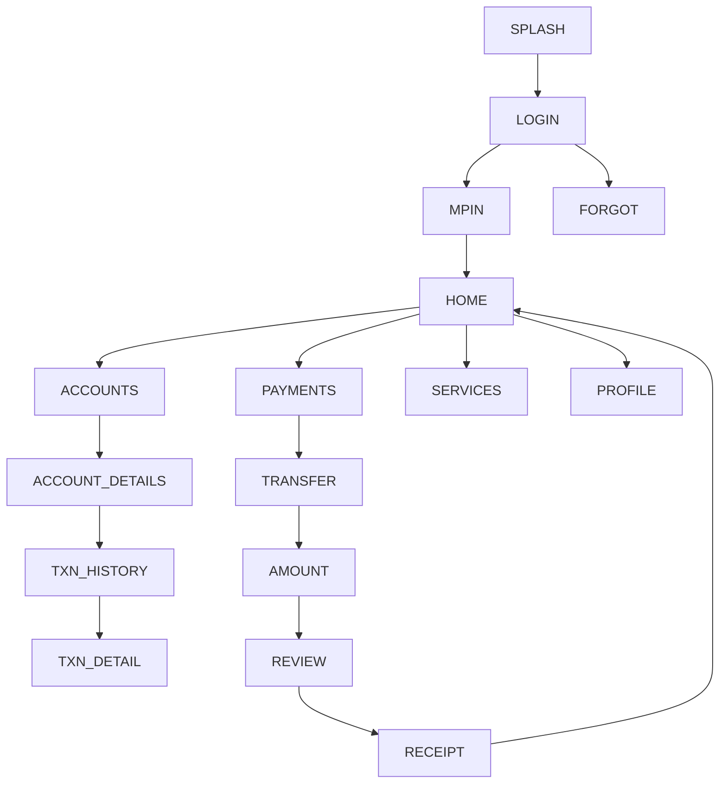

# 03 — ICICI iMobile Pay — Design Specification

*Follows the corpus schema (exemplar: `01_sbi_yono.md`).*

# APP IDENTITY
- **Bank:** ICICI Bank (private sector)
- **Exact Application Name:** iMobile Pay (Play title: "iMobile: Loan, Cards & Banking")
- **Baseline ID:** `BASE-03-ICICI` · **Shortcode:** `ICICI`
- **Research Date:** 2026-08-12
- **Platform:** Android (Capacitor target); iOS exists
- **Official Sources:** Google Play listing `com.csam.icici.bank.imobile` **VERIFIED**;
  Apple listing; product framing "400+ services", usable by non-ICICI customers
- **Research Confidence:** Identity HIGH; visual detail PARTIAL (APPROXIMATED)
- **Naming note:** "iMobile" (legacy) → "iMobile Pay" (interbank-capable current).

# PURPOSE OF THIS SPECIFICATION
Research-grounded, local, mock-data frontend prototype spec of publicly observable
iMobile Pay UI patterns, as a VIDE trusted baseline. No real auth/backend/
credentials/transactions. Colors approximated from public brand identity.

# SOURCE EVIDENCE
| Source | Type | What It Supports | Confidence |
|---|---|---|---|
| Google Play listing (VERIFIED) | [OFFICIAL SOURCE] | Name, package, 400+ services, interbank use | HIGH |
| Apple App Store listing | [OFFICIAL SOURCE] | iOS identity | HIGH |
| ICICI public brand (orange + maroon) | [PUBLIC OBSERVATION] | Color approximation | MED |
| Banking UX conventions | [INFERENCE] | Screen structure | LOW–MED |

# BRAND AND VISUAL IDENTITY
## Logo Treatment
ICICI mark uses orange + dark red/maroon "i". **Do not bundle real logo.** →
**ORIGINAL TEST ASSET REQUIRED.**
## Color System
| Token | Value | Confidence | Evidence |
|---|---|---|---|
| primary | `#AE1C27` (ICICI maroon/red) | APPROXIMATED | public brand identity |
| secondary | `#F37920` (ICICI orange) | APPROXIMATED | public brand identity |
| accent | `#F58220` | APPROXIMATED | orange highlight |
| background | `#F5F3F1` | APPROXIMATED | warm light bg |
| surface | `#FFFFFF` | APPROXIMATED | cards |
| text-primary | `#2A1D1E` | APPROXIMATED | text |
| text-secondary | `#6A5D5E` | APPROXIMATED | secondary |
| divider | `#EBE4E1` | APPROXIMATED | hairlines |
| success `#1E8E4E` / warning `#E8A100` / error `#C0392B` | APPROXIMATED | states |
## Typography
Sans; exact font UNKNOWN. System/`Inter`, 700/500/400, corpus scale. APPROXIMATED.

# DESIGN PRINCIPLES
Medium-high density (feature-rich, "pay"-forward). Orange for primary CTAs, maroon
for brand/header; prominent Pay/Scan actions; card dashboard; bottom nav.

# SCREEN INVENTORY
**MUST IMPLEMENT (13):** `SPLASH`, `LOGIN`, `MPIN`, `HOME`, `ACCOUNTS`,
`ACCOUNT_DETAILS`, `TXN_HISTORY`, `PAYMENTS`, `TRANSFER`, `AMOUNT`, `REVIEW`,
`RECEIPT`, `PROFILE`.
**OPTIONAL:** `BIOMETRIC`, `CARDS`, `SERVICES`, `OFFERS`, `NOTIFICATIONS`, `SETTINGS`.
**NOT VERIFIED:** exact interbank/UPI entry composition (flagged).

# INFORMATION ARCHITECTURE

## Relationship table
| From | To | Trigger |
|---|---|---|
| MPIN | HOME | 6 digits (mock) |
| HOME | PAYMENTS | Pay quick action |
| PAYMENTS | TRANSFER | choose "To account/payee" |
| AMOUNT | REVIEW | Continue |
| REVIEW | RECEIPT | Confirm (mock) |

# SCREEN SPECIFICATIONS
## SPLASH — `ICICI-SPLASH` `/` — maroon bg, test mark, auto→LOGIN. SIMULATED.
## LOGIN — `ICICI-LOGIN` `/login` — `AUTH_FORM_VERTICAL_PRIMARY_CTA`
`HEADER → USER_ID → CTA(Login) → FORGOT/REGISTER`. Any input→MPIN. MOCK.
## MPIN — `ICICI-MPIN` `/mpin` — `PINPAD_NUMERIC_ENTRY`
6 dots + pad + biometric hint (visual). 6 digits→HOME. **No credential capture.** SIMULATED.
## HOME — `ICICI-HOME` `/home` — `DASHBOARD_CARD_GRID_QUICKACTIONS`+`TAB_HOST_BOTTOMNAV`
`HEADER(greeting,notif) → ACCOUNT_SUMMARY_CARD → QUICK_ACTIONS(Pay,Scan,Transfer,Recharge) → OFFERS_STRIP(visual) → RECENT_ACTIVITY → BOTTOM_NAV(Home,Pay,Accounts,Services,Profile)`.
Orange CTAs, maroon header. MOCK DATA.
## PAYMENTS — `ICICI-PAYMENTS` `/payments` — `SETTINGS_LIST_GROUPED`
Grid of payment types (To account, To UPI/mobile — mock label, Bills, Recharge). Tap→TRANSFER.
## ACCOUNTS / ACCOUNT_DETAILS / TXN_HISTORY — as corpus pattern (`DETAIL_HEADER_METADATA_LIST`, `LIST_TRANSACTIONS_CHRONO`).
## TRANSFER→AMOUNT→REVIEW→RECEIPT — payment flow, mock only. SIMULATED.
## PROFILE — `ICICI-PROFILE` `/profile` — `SETTINGS_LIST_GROUPED`; Logout→LOGIN.

# REUSABLE COMPONENT SYSTEM
Shared corpus set.

# DESIGN TOKEN MAP
```css
--color-primary:#AE1C27; --color-secondary:#F37920; --color-accent:#F58220; /* APPROXIMATED */
--color-bg:#F5F3F1; --color-surface:#FFFFFF; /* APPROXIMATED */
--color-text-primary:#2A1D1E; --color-text-secondary:#6A5D5E; --color-divider:#EBE4E1; /* APPROXIMATED */
--color-success:#1E8E4E; --color-warning:#E8A100; --color-error:#C0392B; /* APPROXIMATED */
--radius-card:16px; --space-16:16px; --font-heading:'Inter',system-ui; /* APPROXIMATED */
```

# NAVIGATION MANIFEST (JSON)
```json
{"baselineId":"BASE-03-ICICI","entry":"ICICI-SPLASH",
 "nodes":[{"id":"ICICI-SPLASH","route":"/"},{"id":"ICICI-LOGIN","route":"/login"},
 {"id":"ICICI-MPIN","route":"/mpin"},{"id":"ICICI-HOME","route":"/home"},
 {"id":"ICICI-PAYMENTS","route":"/payments"},{"id":"ICICI-TRANSFER","route":"/transfer"},
 {"id":"ICICI-AMOUNT","route":"/transfer/amount"},{"id":"ICICI-REVIEW","route":"/transfer/review"},
 {"id":"ICICI-RECEIPT","route":"/transfer/receipt"}],
 "edges":[{"from":"ICICI-SPLASH","to":"ICICI-LOGIN","trigger":"timeout"},
 {"from":"ICICI-LOGIN","to":"ICICI-MPIN","trigger":"submit-mock"},
 {"from":"ICICI-MPIN","to":"ICICI-HOME","trigger":"mpin-complete-mock"},
 {"from":"ICICI-HOME","to":"ICICI-PAYMENTS","trigger":"tap-pay"},
 {"from":"ICICI-AMOUNT","to":"ICICI-REVIEW","trigger":"continue"},
 {"from":"ICICI-REVIEW","to":"ICICI-RECEIPT","trigger":"confirm-mock"}]}
```

# SCREEN FINGERPRINT MAP (authored)
```
SCREEN_ID: ICICI-HOME  SIGNATURE: DASHBOARD_CARD_GRID_QUICKACTIONS
FEATURES: [balance card, pay-forward quick actions, offers strip, recent activity, bottom nav]
SCREEN_ID: ICICI-PAYMENTS SIGNATURE: SETTINGS_LIST_GROUPED
FEATURES: [grouped payment-type grid, pay-to-account/UPI entries]
SCREEN_ID: ICICI-LOGIN SIGNATURE: AUTH_FORM_VERTICAL_PRIMARY_CTA
```

# MOCK DATA REQUIREMENTS
Fictional accounts/transactions/payees/cards/notifications (as corpus shapes). No real PII.

# PROTOTYPE EXCLUSIONS
no real login · no credential transmission · no backend · no transactions · no live
OTP · no production security · no personal-data collection · no logo reuse.

# RESEARCH GAPS AND LIMITATIONS
Exact colors/typeface UNKNOWN (approximated); interbank/UPI internals [INFERENCE];
post-login layouts representative.

# IMPLEMENTATION HANDOFF SUMMARY
13-screen mock prototype, maroon+orange palette, pay-forward dashboard, payments
hub + transfer flow, deterministic mock data, no backend. See
`03-implementation-plans/03_icici_implementation.md`.
