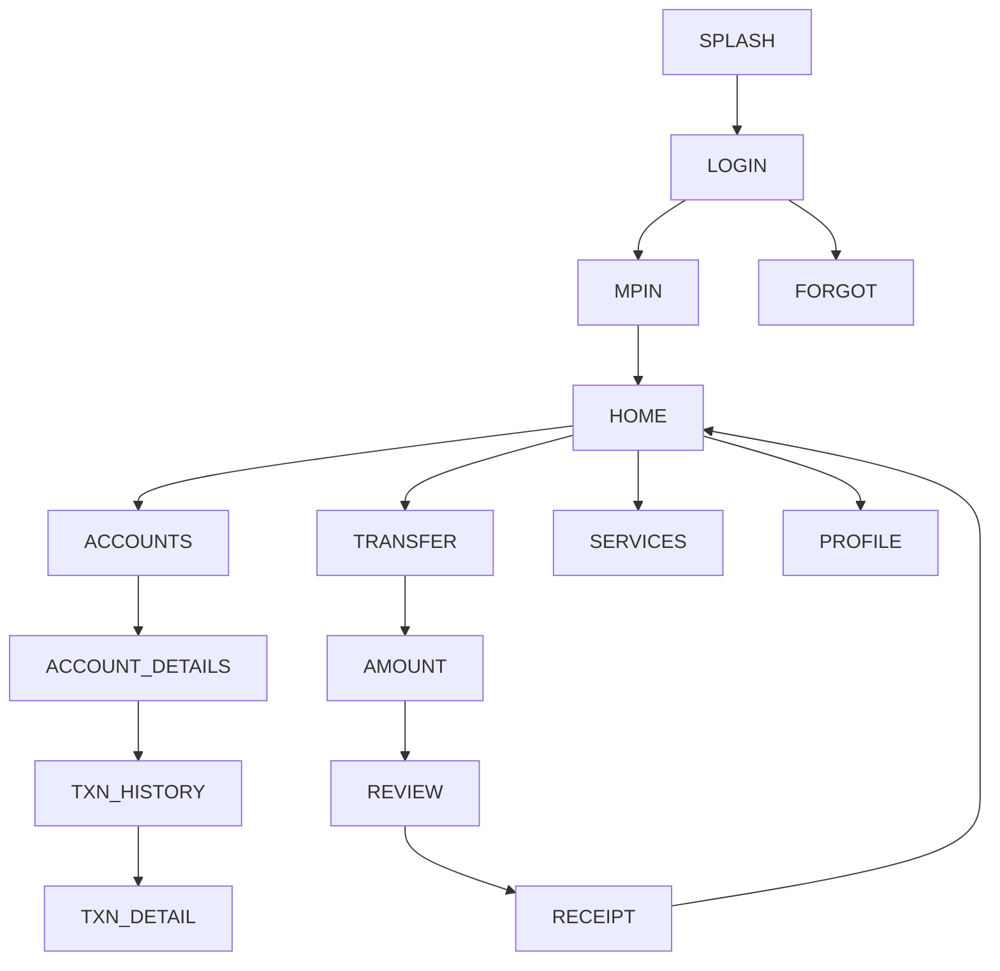

# 04 — Axis Mobile ("open") — Design Specification

*Follows the corpus schema (exemplar: `01_sbi_yono.md`).*

# APP IDENTITY
- **Bank:** Axis Bank (private sector)
- **Exact Application Name:** Axis Mobile (Play title: "Axis Mobile: Pay, Invest &
  UPI"); marketed under the **"open by Axis Bank"** brand
- **Baseline ID:** `BASE-04-AXIS` · **Shortcode:** `AXIS`
- **Research Date:** 2026-08-12
- **Platform:** Android (Capacitor target); iOS exists
- **Official Sources:** Google Play `com.axis.mobile` **VERIFIED**; Axis "open"
  brand pages; developer portfolio (scope exclusions)
- **Research Confidence:** Identity HIGH; brand-vs-title relationship MED; visual PARTIAL
- **Naming note (IMPORTANT):** "open" is Axis's product/marketing brand for its
  mobile banking; the store title is "Axis Mobile". Axis has also historically
  shipped a separate app literally named "open". This baseline documents the
  retail **Axis Mobile / "open" (`com.axis.mobile`)** app. Axis Go / Axis Mobile –
  Corporate are out of scope.

# PURPOSE OF THIS SPECIFICATION
Research-grounded, local, mock-data prototype spec of publicly observable Axis
Mobile/"open" UI patterns, as a VIDE trusted baseline. No real auth/backend/
credentials/transactions. Colors approximated from public brand identity.

# SOURCE EVIDENCE
| Source | Type | What It Supports | Confidence |
|---|---|---|---|
| Google Play listing (VERIFIED) | [OFFICIAL SOURCE] | Name, package, store title | HIGH |
| Axis "open" brand pages | [OFFICIAL SOURCE] | Brand relationship, 250+ features | MED |
| Axis public brand (burgundy/maroon + magenta) | [PUBLIC OBSERVATION] | Color approximation | MED |
| Banking UX conventions | [INFERENCE] | Screen structure | LOW–MED |

# BRAND AND VISUAL IDENTITY
## Logo Treatment
Axis mark is a deep burgundy/maroon "Axis" with a magenta accent. **Do not bundle
real logo.** → **ORIGINAL TEST ASSET REQUIRED.**
## Color System
| Token | Value | Confidence | Evidence |
|---|---|---|---|
| primary | `#97144D` (Axis burgundy) | APPROXIMATED | public brand identity |
| secondary | `#DA1884` (magenta) | APPROXIMATED | public brand identity |
| accent | `#E4572E` (coral) | APPROXIMATED | "open" accent (observation) |
| background | `#F6F2F4` | APPROXIMATED | light bg |
| surface | `#FFFFFF` | APPROXIMATED | cards |
| text-primary | `#2A1622` | APPROXIMATED | text |
| text-secondary | `#6C5761` | APPROXIMATED | secondary |
| divider | `#EBE0E5` | APPROXIMATED | hairlines |
| success `#1E8E4E` / warning `#E8A100` / error `#C0392B` | APPROXIMATED | states |
## Typography
Sans; exact font UNKNOWN. System/`Inter`, 700/500/400. APPROXIMATED.

# DESIGN PRINCIPLES
Medium density; burgundy header, magenta/coral accents; "open" leans modern with
personalized cards; card dashboard; bottom nav.

# SCREEN INVENTORY
**MUST IMPLEMENT (12):** `SPLASH`, `LOGIN`, `MPIN`, `HOME`, `ACCOUNTS`,
`ACCOUNT_DETAILS`, `TXN_HISTORY`, `TRANSFER`, `AMOUNT`, `REVIEW`, `RECEIPT`, `PROFILE`.
**OPTIONAL:** `BIOMETRIC`, `CARDS`, `SERVICES`, `OFFERS`, `NOTIFICATIONS`, `SETTINGS`.
**NOT VERIFIED:** exact "open" personalization widgets (flagged).

# INFORMATION ARCHITECTURE

| From | To | Trigger |
|---|---|---|
| MPIN | HOME | 6 digits (mock) |
| HOME | TRANSFER | quick action |
| REVIEW | RECEIPT | Confirm (mock) |

# SCREEN SPECIFICATIONS
## SPLASH — `AXIS-SPLASH` `/` — burgundy bg, test mark, auto→LOGIN. SIMULATED.
## LOGIN — `AXIS-LOGIN` `/login` — `AUTH_FORM_VERTICAL_PRIMARY_CTA`
`HEADER → USER_ID → CTA(Login) → FORGOT/REGISTER`. Any input→MPIN. MOCK.
## MPIN — `AXIS-MPIN` `/mpin` — `PINPAD_NUMERIC_ENTRY`; 6 digits→HOME. **No capture.** SIMULATED.
## HOME — `AXIS-HOME` `/home` — `DASHBOARD_CARD_GRID_QUICKACTIONS`+`TAB_HOST_BOTTOMNAV`
`HEADER(greeting,notif) → ACCOUNT_SUMMARY_CARD → QUICK_ACTIONS(Transfer,Pay,Invest,Scan) → PERSONALIZED_STRIP(visual) → RECENT_ACTIVITY → BOTTOM_NAV`. Burgundy/magenta. MOCK DATA.
## ACCOUNTS / ACCOUNT_DETAILS / TXN_HISTORY — corpus patterns.
## TRANSFER→AMOUNT→REVIEW→RECEIPT — mock payment flow. SIMULATED.
## PROFILE — `AXIS-PROFILE` `/profile` — `SETTINGS_LIST_GROUPED`; Logout→LOGIN.

# REUSABLE COMPONENT SYSTEM
Shared corpus set.

# DESIGN TOKEN MAP
```css
--color-primary:#97144D; --color-secondary:#DA1884; --color-accent:#E4572E; /* APPROXIMATED */
--color-bg:#F6F2F4; --color-surface:#FFFFFF; /* APPROXIMATED */
--color-text-primary:#2A1622; --color-text-secondary:#6C5761; --color-divider:#EBE0E5; /* APPROXIMATED */
--color-success:#1E8E4E; --color-warning:#E8A100; --color-error:#C0392B; /* APPROXIMATED */
--radius-card:16px; --space-16:16px; --font-heading:'Inter',system-ui; /* APPROXIMATED */
```

# NAVIGATION MANIFEST (JSON)
```json
{"baselineId":"BASE-04-AXIS","entry":"AXIS-SPLASH",
 "nodes":[{"id":"AXIS-SPLASH","route":"/"},{"id":"AXIS-LOGIN","route":"/login"},
 {"id":"AXIS-MPIN","route":"/mpin"},{"id":"AXIS-HOME","route":"/home"},
 {"id":"AXIS-TRANSFER","route":"/transfer"},{"id":"AXIS-AMOUNT","route":"/transfer/amount"},
 {"id":"AXIS-REVIEW","route":"/transfer/review"},{"id":"AXIS-RECEIPT","route":"/transfer/receipt"}],
 "edges":[{"from":"AXIS-SPLASH","to":"AXIS-LOGIN","trigger":"timeout"},
 {"from":"AXIS-LOGIN","to":"AXIS-MPIN","trigger":"submit-mock"},
 {"from":"AXIS-MPIN","to":"AXIS-HOME","trigger":"mpin-complete-mock"},
 {"from":"AXIS-AMOUNT","to":"AXIS-REVIEW","trigger":"continue"},
 {"from":"AXIS-REVIEW","to":"AXIS-RECEIPT","trigger":"confirm-mock"}]}
```

# SCREEN FINGERPRINT MAP (authored)
```
SCREEN_ID: AXIS-HOME  SIGNATURE: DASHBOARD_CARD_GRID_QUICKACTIONS
FEATURES: [burgundy header, balance card, quick actions incl. Invest, personalized strip, bottom nav]
SCREEN_ID: AXIS-LOGIN SIGNATURE: AUTH_FORM_VERTICAL_PRIMARY_CTA
```

# MOCK DATA REQUIREMENTS
Fictional accounts/transactions/payees/cards/notifications (corpus shapes). No real PII.

# PROTOTYPE EXCLUSIONS
no real login · no credential transmission · no backend · no transactions · no live
OTP · no production security · no personal-data collection · no logo reuse.

# RESEARCH GAPS AND LIMITATIONS
Exact colors/typeface UNKNOWN (approximated); "open" personalization widgets
[UNKNOWN]; brand-vs-store-title nuance documented; post-login layouts representative.

# IMPLEMENTATION HANDOFF SUMMARY
12-screen mock prototype, burgundy+magenta palette, modern card dashboard, transfer
flow, deterministic mock data, no backend. See
`03-implementation-plans/04_axis_implementation.md`.
