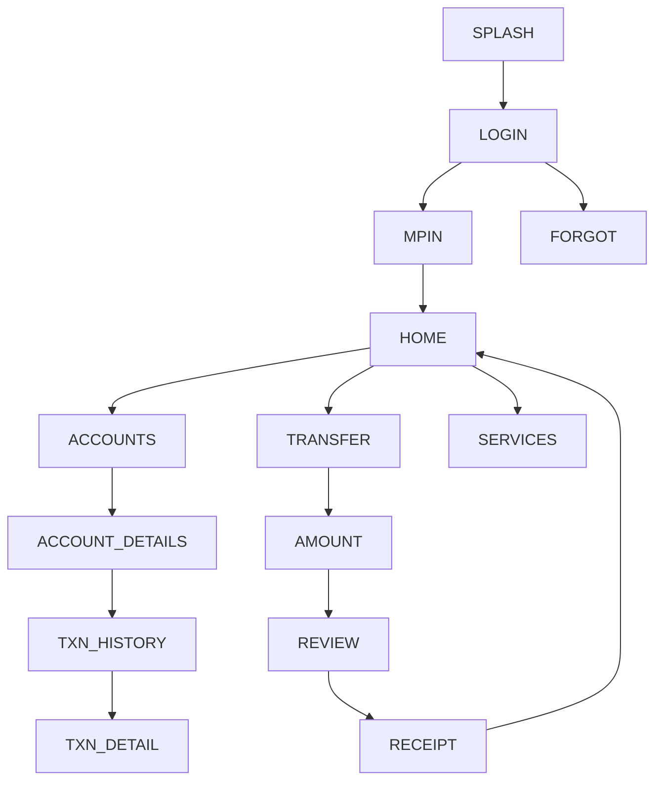

# 05 — bob World (Bank of Baroda) — Design Specification

*Follows the corpus schema (exemplar: `01_sbi_yono.md`).*

# APP IDENTITY
- **Bank:** Bank of Baroda (public sector)
- **Exact Application Name:** bob World: Banking & Experience
- **Baseline ID:** `BASE-05-BOB` · **Shortcode:** `BOB`
- **Research Date:** 2026-08-12
- **Platform:** Android (Capacitor target); iOS exists
- **Official Sources:** Google Play `com.bankofbaroda.mconnect` **VERIFIED**; BoB
  digital-banking pages ("240+ services")
- **Research Confidence:** Identity HIGH; visual detail PARTIAL (APPROXIMATED)
- **Naming note:** legacy "Baroda Connect / M-Connect Plus" → "bob World" (legacy
  `mconnect` package persists). bob World Business / bob इ Pay are out of scope.

# PURPOSE OF THIS SPECIFICATION
Research-grounded, local, mock-data prototype spec of publicly observable bob World
UI patterns, as a VIDE trusted baseline. No real auth/backend/credentials/
transactions. Colors approximated from public brand identity.

# SOURCE EVIDENCE
| Source | Type | What It Supports | Confidence |
|---|---|---|---|
| Google Play listing (VERIFIED) | [OFFICIAL SOURCE] | Name, package, "240+ services" | HIGH |
| BoB digital-banking FAQ pages | [OFFICIAL SOURCE] | Official app identity | MED |
| BoB public brand (orange) | [PUBLIC OBSERVATION] | Color approximation | MED |
| Banking UX conventions | [INFERENCE] | Screen structure | LOW–MED |

# BRAND AND VISUAL IDENTITY
## Logo Treatment
BoB "baroda sun" mark is orange. **Do not bundle real logo.** →
**ORIGINAL TEST ASSET REQUIRED.**
## Color System
| Token | Value | Confidence | Evidence |
|---|---|---|---|
| primary | `#EB6E1F` (Baroda orange) | APPROXIMATED | public brand identity |
| secondary | `#B23A18` (deep orange) | APPROXIMATED | brand variant |
| accent | `#F4A81D` (amber) | APPROXIMATED | highlight |
| background | `#FBF6F1` | APPROXIMATED | warm light bg |
| surface | `#FFFFFF` | APPROXIMATED | cards |
| text-primary | `#2B211A` | APPROXIMATED | text |
| text-secondary | `#6E6157` | APPROXIMATED | secondary |
| divider | `#EEE4DA` | APPROXIMATED | hairlines |
| success `#1E8E4E` / warning `#E8A100` / error `#C0392B` | APPROXIMATED | states |
## Typography
Sans; exact font UNKNOWN. System/`Inter`, 700/500/400. APPROXIMATED.

# DESIGN PRINCIPLES
Medium density; orange header/CTAs; service-rich grid (240+ services framing);
card dashboard; bottom nav.

# SCREEN INVENTORY
**MUST IMPLEMENT (12):** `SPLASH`, `LOGIN`, `MPIN`, `HOME`, `ACCOUNTS`,
`ACCOUNT_DETAILS`, `TXN_HISTORY`, `TRANSFER`, `AMOUNT`, `REVIEW`, `RECEIPT`, `SERVICES`.
**OPTIONAL:** `BIOMETRIC`, `CARDS`, `DEPOSITS`, `PROFILE`, `NOTIFICATIONS`, `SETTINGS`.
**NOT VERIFIED:** exact service-grid taxonomy (flagged).

# INFORMATION ARCHITECTURE

| From | To | Trigger |
|---|---|---|
| MPIN | HOME | 6 digits (mock) |
| HOME | SERVICES | Services quick action |
| REVIEW | RECEIPT | Confirm (mock) |

# SCREEN SPECIFICATIONS
## SPLASH — `BOB-SPLASH` `/` — orange bg, test mark, auto→LOGIN. SIMULATED.
## LOGIN — `BOB-LOGIN` `/login` — `AUTH_FORM_VERTICAL_PRIMARY_CTA`; any input→MPIN. MOCK.
## MPIN — `BOB-MPIN` `/mpin` — `PINPAD_NUMERIC_ENTRY`; 6 digits→HOME. **No capture.** SIMULATED.
## HOME — `BOB-HOME` `/home` — `DASHBOARD_CARD_GRID_QUICKACTIONS`+`TAB_HOST_BOTTOMNAV`
`HEADER(greeting,notif) → ACCOUNT_SUMMARY_CARD → QUICK_ACTIONS(Transfer,Pay,Services,Scan) → SERVICE_STRIP(visual) → RECENT_ACTIVITY → BOTTOM_NAV`. Orange. MOCK DATA.
## SERVICES — `BOB-SERVICES` `/services` — `SETTINGS_LIST_GROUPED`; grouped service tiles (240+ framing); tiles→placeholder/EmptyState.
## ACCOUNTS / ACCOUNT_DETAILS / TXN_HISTORY — corpus patterns.
## TRANSFER→AMOUNT→REVIEW→RECEIPT — mock flow. SIMULATED.

# REUSABLE COMPONENT SYSTEM
Shared corpus set.

# DESIGN TOKEN MAP
```css
--color-primary:#EB6E1F; --color-secondary:#B23A18; --color-accent:#F4A81D; /* APPROXIMATED */
--color-bg:#FBF6F1; --color-surface:#FFFFFF; /* APPROXIMATED */
--color-text-primary:#2B211A; --color-text-secondary:#6E6157; --color-divider:#EEE4DA; /* APPROXIMATED */
--color-success:#1E8E4E; --color-warning:#E8A100; --color-error:#C0392B; /* APPROXIMATED */
--radius-card:16px; --space-16:16px; --font-heading:'Inter',system-ui; /* APPROXIMATED */
```

# NAVIGATION MANIFEST (JSON)
```json
{"baselineId":"BASE-05-BOB","entry":"BOB-SPLASH",
 "nodes":[{"id":"BOB-SPLASH","route":"/"},{"id":"BOB-LOGIN","route":"/login"},
 {"id":"BOB-MPIN","route":"/mpin"},{"id":"BOB-HOME","route":"/home"},
 {"id":"BOB-SERVICES","route":"/services"},{"id":"BOB-TRANSFER","route":"/transfer"},
 {"id":"BOB-AMOUNT","route":"/transfer/amount"},{"id":"BOB-REVIEW","route":"/transfer/review"},
 {"id":"BOB-RECEIPT","route":"/transfer/receipt"}],
 "edges":[{"from":"BOB-SPLASH","to":"BOB-LOGIN","trigger":"timeout"},
 {"from":"BOB-LOGIN","to":"BOB-MPIN","trigger":"submit-mock"},
 {"from":"BOB-MPIN","to":"BOB-HOME","trigger":"mpin-complete-mock"},
 {"from":"BOB-AMOUNT","to":"BOB-REVIEW","trigger":"continue"},
 {"from":"BOB-REVIEW","to":"BOB-RECEIPT","trigger":"confirm-mock"}]}
```

# SCREEN FINGERPRINT MAP (authored)
```
SCREEN_ID: BOB-HOME  SIGNATURE: DASHBOARD_CARD_GRID_QUICKACTIONS
FEATURES: [orange header, balance card, service-rich quick actions, service strip, bottom nav]
SCREEN_ID: BOB-SERVICES SIGNATURE: SETTINGS_LIST_GROUPED
FEATURES: [grouped service tiles, many categories]
```

# MOCK DATA REQUIREMENTS
Fictional accounts/transactions/payees/cards/notifications (corpus shapes). No real PII.

# PROTOTYPE EXCLUSIONS
no real login · no credential transmission · no backend · no transactions · no live
OTP · no production security · no personal-data collection · no logo reuse.

# RESEARCH GAPS AND LIMITATIONS
Exact colors/typeface UNKNOWN (approximated); service taxonomy [UNKNOWN];
post-login layouts representative.

# IMPLEMENTATION HANDOFF SUMMARY
12-screen mock prototype, orange palette, service-rich dashboard + services hub +
transfer flow, deterministic mock data, no backend. See
`03-implementation-plans/05_bob_world_implementation.md`.
