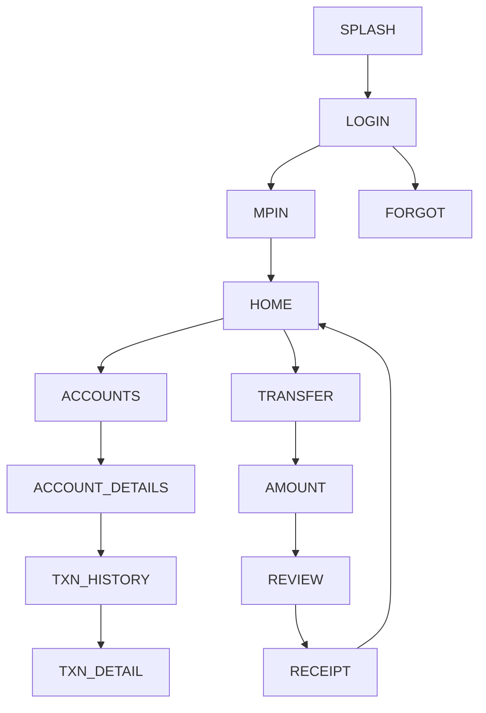

# 06 — PNB ONE (Punjab National Bank) — Design Specification

*Follows the corpus schema (exemplar: `01_sbi_yono.md`).*

# APP IDENTITY
- **Bank:** Punjab National Bank (public sector)
- **Exact Application Name:** PNB ONE
- **Baseline ID:** `BASE-06-PNB` · **Shortcode:** `PNB`
- **Research Date:** 2026-08-12
- **Platform:** Android (Capacitor target); iOS exists
- **Official Sources:** Google Play `com.Version1` **VERIFIED** (~4.3★); PNB scale
  (180M+ customers, 12,000+ branches)
- **Research Confidence:** Identity HIGH; visual detail PARTIAL (APPROXIMATED)
- **Naming note:** PNB ONE consolidates older separate PNB retail apps.

# PURPOSE OF THIS SPECIFICATION
Research-grounded, local, mock-data prototype spec of publicly observable PNB ONE
UI patterns, as a VIDE trusted baseline. No real auth/backend/credentials/
transactions. Colors approximated from public brand identity.

# SOURCE EVIDENCE
| Source | Type | What It Supports | Confidence |
|---|---|---|---|
| Google Play listing (VERIFIED) | [OFFICIAL SOURCE] | Name, package, features, rating | HIGH |
| PNB scale figures | [PUBLIC OBSERVATION] | Selection relevance | MED |
| PNB public brand (maroon/plum + gold) | [PUBLIC OBSERVATION] | Color approximation | MED |
| Banking UX conventions | [INFERENCE] | Screen structure | LOW–MED |

# BRAND AND VISUAL IDENTITY
## Logo Treatment
PNB mark uses maroon/plum with gold. **Do not bundle real logo.** →
**ORIGINAL TEST ASSET REQUIRED.**
## Color System
| Token | Value | Confidence | Evidence |
|---|---|---|---|
| primary | `#8B1D41` (PNB maroon/plum) | APPROXIMATED | public brand identity |
| secondary | `#C49A3A` (gold) | APPROXIMATED | public brand identity |
| accent | `#A6093D` (crimson) | APPROXIMATED | highlight |
| background | `#F7F3F4` | APPROXIMATED | light bg |
| surface | `#FFFFFF` | APPROXIMATED | cards |
| text-primary | `#271620` | APPROXIMATED | text |
| text-secondary | `#6A5860` | APPROXIMATED | secondary |
| divider | `#EBE1E5` | APPROXIMATED | hairlines |
| success `#1E8E4E` / warning `#E8A100` / error `#C0392B` | APPROXIMATED | states |
## Typography
Sans; exact font UNKNOWN. System/`Inter`, 700/500/400. APPROXIMATED.

# DESIGN PRINCIPLES
Medium density; maroon header, gold accents; utilitarian public-sector feel; card
dashboard; bottom nav.

# SCREEN INVENTORY
**MUST IMPLEMENT (11):** `SPLASH`, `LOGIN`, `MPIN`, `HOME`, `ACCOUNTS`,
`ACCOUNT_DETAILS`, `TXN_HISTORY`, `TRANSFER`, `AMOUNT`, `REVIEW`, `RECEIPT`.
**OPTIONAL:** `BIOMETRIC`, `SERVICES`, `CARDS`, `PROFILE`, `NOTIFICATIONS`, `SETTINGS`.
**NOT VERIFIED:** exact home widget composition (flagged).

# INFORMATION ARCHITECTURE

| From | To | Trigger |
|---|---|---|
| MPIN | HOME | 6 digits (mock) |
| HOME | TRANSFER | quick action |
| REVIEW | RECEIPT | Confirm (mock) |

# SCREEN SPECIFICATIONS
## SPLASH — `PNB-SPLASH` `/` — maroon bg, test mark, auto→LOGIN. SIMULATED.
## LOGIN — `PNB-LOGIN` `/login` — `AUTH_FORM_VERTICAL_PRIMARY_CTA`; any input→MPIN. MOCK.
## MPIN — `PNB-MPIN` `/mpin` — `PINPAD_NUMERIC_ENTRY`; 6 digits→HOME. **No capture.** SIMULATED.
## HOME — `PNB-HOME` `/home` — `DASHBOARD_CARD_GRID_QUICKACTIONS`+`TAB_HOST_BOTTOMNAV`
`HEADER(greeting,notif) → ACCOUNT_SUMMARY_CARD → QUICK_ACTIONS(Transfer,Pay,Bills,Services) → RECENT_ACTIVITY → BOTTOM_NAV`. Maroon/gold. MOCK DATA.
## ACCOUNTS / ACCOUNT_DETAILS / TXN_HISTORY — corpus patterns.
## TRANSFER→AMOUNT→REVIEW→RECEIPT — mock flow. SIMULATED.

# REUSABLE COMPONENT SYSTEM
Shared corpus set.

# DESIGN TOKEN MAP
```css
--color-primary:#8B1D41; --color-secondary:#C49A3A; --color-accent:#A6093D; /* APPROXIMATED */
--color-bg:#F7F3F4; --color-surface:#FFFFFF; /* APPROXIMATED */
--color-text-primary:#271620; --color-text-secondary:#6A5860; --color-divider:#EBE1E5; /* APPROXIMATED */
--color-success:#1E8E4E; --color-warning:#E8A100; --color-error:#C0392B; /* APPROXIMATED */
--radius-card:16px; --space-16:16px; --font-heading:'Inter',system-ui; /* APPROXIMATED */
```

# NAVIGATION MANIFEST (JSON)
```json
{"baselineId":"BASE-06-PNB","entry":"PNB-SPLASH",
 "nodes":[{"id":"PNB-SPLASH","route":"/"},{"id":"PNB-LOGIN","route":"/login"},
 {"id":"PNB-MPIN","route":"/mpin"},{"id":"PNB-HOME","route":"/home"},
 {"id":"PNB-TRANSFER","route":"/transfer"},{"id":"PNB-AMOUNT","route":"/transfer/amount"},
 {"id":"PNB-REVIEW","route":"/transfer/review"},{"id":"PNB-RECEIPT","route":"/transfer/receipt"}],
 "edges":[{"from":"PNB-SPLASH","to":"PNB-LOGIN","trigger":"timeout"},
 {"from":"PNB-LOGIN","to":"PNB-MPIN","trigger":"submit-mock"},
 {"from":"PNB-MPIN","to":"PNB-HOME","trigger":"mpin-complete-mock"},
 {"from":"PNB-AMOUNT","to":"PNB-REVIEW","trigger":"continue"},
 {"from":"PNB-REVIEW","to":"PNB-RECEIPT","trigger":"confirm-mock"}]}
```

# SCREEN FINGERPRINT MAP (authored)
```
SCREEN_ID: PNB-HOME  SIGNATURE: DASHBOARD_CARD_GRID_QUICKACTIONS
FEATURES: [maroon header, balance card, quick actions, recent activity, bottom nav]
SCREEN_ID: PNB-LOGIN SIGNATURE: AUTH_FORM_VERTICAL_PRIMARY_CTA
```

# MOCK DATA REQUIREMENTS
Fictional accounts/transactions/payees/cards/notifications (corpus shapes). No real PII.

# PROTOTYPE EXCLUSIONS
no real login · no credential transmission · no backend · no transactions · no live
OTP · no production security · no personal-data collection · no logo reuse.

# RESEARCH GAPS AND LIMITATIONS
Exact colors/typeface UNKNOWN (approximated); home widget composition [UNKNOWN];
post-login layouts representative.

# IMPLEMENTATION HANDOFF SUMMARY
11-screen mock prototype, maroon+gold palette, card dashboard + transfer flow,
deterministic mock data, no backend. See
`03-implementation-plans/06_pnb_one_implementation.md`.
