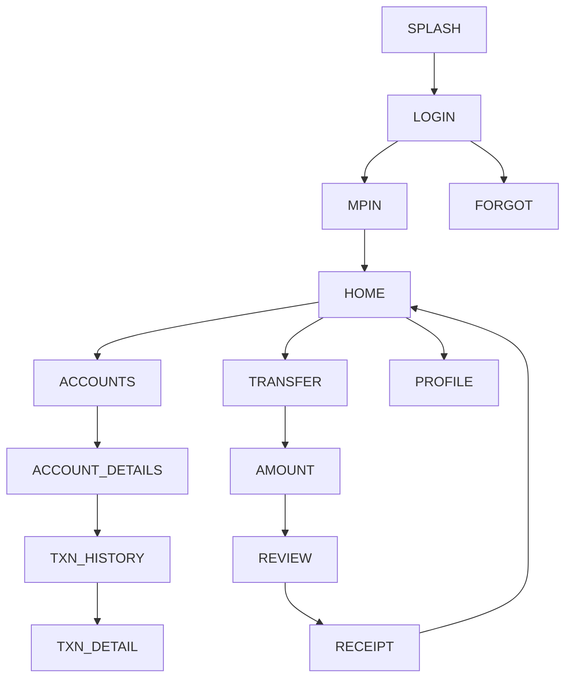

# 08 — Kotak811 & Mobile Banking — Design Specification

*Follows the corpus schema (exemplar: `01_sbi_yono.md`).*

# APP IDENTITY
- **Bank:** Kotak Mahindra Bank (private sector)
- **Exact Application Name:** Kotak811 & Mobile Banking (Play title: "Kotak Bank:
  811 Mobile App")
- **Baseline ID:** `BASE-08-KOTAK` · **Shortcode:** `KOTAK`
- **Research Date:** 2026-08-12
- **Platform:** Android (Capacitor target); iOS exists
- **Official Sources:** Google Play current `com.kotak811mobilebankingapp.instantsavingsupiscanandpayrecharge`
  **VERIFIED**; legacy `com.msf.kbank.mobile` **VERIFIED**; Kotak mobile-banking page
- **Research Confidence:** Identity HIGH; visual detail PARTIAL (APPROXIMATED)
- **Naming note (IMPORTANT):** Kotak **merged** its "811" digital-account app with
  its classic mobile-banking app; current retail app is the "811 Mobile App".
  Legacy package still appears in listings.

# PURPOSE OF THIS SPECIFICATION
Research-grounded, local, mock-data prototype spec of publicly observable Kotak811
UI patterns, as a VIDE trusted baseline. No real auth/backend/credentials/
transactions. Colors approximated from public brand identity.

# SOURCE EVIDENCE
| Source | Type | What It Supports | Confidence |
|---|---|---|---|
| Google Play (current + legacy, VERIFIED) | [OFFICIAL SOURCE] | Names, packages, 811 merge | HIGH |
| Kotak mobile-banking official page | [OFFICIAL SOURCE] | Official app identity | MED |
| Industry reporting (top-downloaded H1 2025) | [PUBLIC OBSERVATION] | Scale signal | MED |
| Kotak public brand (red + navy) | [PUBLIC OBSERVATION] | Color approximation | MED |
| Banking UX conventions | [INFERENCE] | Screen structure | LOW–MED |

# BRAND AND VISUAL IDENTITY
## Logo Treatment
Kotak mark uses red + dark navy. **Do not bundle real logo.** →
**ORIGINAL TEST ASSET REQUIRED.**
## Color System
| Token | Value | Confidence | Evidence |
|---|---|---|---|
| primary | `#EF3E23` (Kotak red) | APPROXIMATED | public brand identity |
| secondary | `#003D5B` (Kotak navy) | APPROXIMATED | public brand identity |
| accent | `#F26A2E` | APPROXIMATED | highlight |
| background | `#F4F6F8` | APPROXIMATED | light bg |
| surface | `#FFFFFF` | APPROXIMATED | cards |
| text-primary | `#132330` | APPROXIMATED | text |
| text-secondary | `#5A6773` | APPROXIMATED | secondary |
| divider | `#E2E7EC` | APPROXIMATED | hairlines |
| success `#1E8E4E` / warning `#E8A100` / error `#EF3E23` | APPROXIMATED | states |
## Typography
Sans; exact font UNKNOWN. System/`Inter`, 700/500/400. APPROXIMATED.

# DESIGN PRINCIPLES
Medium density, modern/youthful (811 digital-first); red CTAs, navy header text;
prominent scan/pay + savings entry; card dashboard; bottom nav.

# SCREEN INVENTORY
**MUST IMPLEMENT (12):** `SPLASH`, `LOGIN`, `MPIN`, `HOME`, `ACCOUNTS`,
`ACCOUNT_DETAILS`, `TXN_HISTORY`, `TRANSFER`, `AMOUNT`, `REVIEW`, `RECEIPT`, `PROFILE`.
**OPTIONAL:** `BIOMETRIC`, `CARDS`, `SERVICES`, `OFFERS`, `NOTIFICATIONS`, `SETTINGS`.
**NOT VERIFIED:** exact 811 savings/upgrade entry composition (flagged).

# INFORMATION ARCHITECTURE

| From | To | Trigger |
|---|---|---|
| MPIN | HOME | 6 digits (mock) |
| HOME | TRANSFER | quick action |
| REVIEW | RECEIPT | Confirm (mock) |

# SCREEN SPECIFICATIONS
## SPLASH — `KOTAK-SPLASH` `/` — red/navy bg, test mark, auto→LOGIN. SIMULATED.
## LOGIN — `KOTAK-LOGIN` `/login` — `AUTH_FORM_VERTICAL_PRIMARY_CTA`; any input→MPIN. MOCK.
## MPIN — `KOTAK-MPIN` `/mpin` — `PINPAD_NUMERIC_ENTRY`; 6 digits→HOME. **No capture.** SIMULATED.
## HOME — `KOTAK-HOME` `/home` — `DASHBOARD_CARD_GRID_QUICKACTIONS`+`TAB_HOST_BOTTOMNAV`
`HEADER(greeting,notif) → ACCOUNT_SUMMARY_CARD → QUICK_ACTIONS(Scan,Pay,Transfer,Recharge) → OFFERS_STRIP(visual) → RECENT_ACTIVITY → BOTTOM_NAV`. Red CTAs, navy accents. MOCK DATA.
## ACCOUNTS / ACCOUNT_DETAILS / TXN_HISTORY — corpus patterns.
## TRANSFER→AMOUNT→REVIEW→RECEIPT — mock flow. SIMULATED.
## PROFILE — `KOTAK-PROFILE` `/profile` — `SETTINGS_LIST_GROUPED`; Logout→LOGIN.

# REUSABLE COMPONENT SYSTEM
Shared corpus set.

# DESIGN TOKEN MAP
```css
--color-primary:#EF3E23; --color-secondary:#003D5B; --color-accent:#F26A2E; /* APPROXIMATED */
--color-bg:#F4F6F8; --color-surface:#FFFFFF; /* APPROXIMATED */
--color-text-primary:#132330; --color-text-secondary:#5A6773; --color-divider:#E2E7EC; /* APPROXIMATED */
--color-success:#1E8E4E; --color-warning:#E8A100; --color-error:#EF3E23; /* APPROXIMATED */
--radius-card:16px; --space-16:16px; --font-heading:'Inter',system-ui; /* APPROXIMATED */
```

# NAVIGATION MANIFEST (JSON)
```json
{"baselineId":"BASE-08-KOTAK","entry":"KOTAK-SPLASH",
 "nodes":[{"id":"KOTAK-SPLASH","route":"/"},{"id":"KOTAK-LOGIN","route":"/login"},
 {"id":"KOTAK-MPIN","route":"/mpin"},{"id":"KOTAK-HOME","route":"/home"},
 {"id":"KOTAK-TRANSFER","route":"/transfer"},{"id":"KOTAK-AMOUNT","route":"/transfer/amount"},
 {"id":"KOTAK-REVIEW","route":"/transfer/review"},{"id":"KOTAK-RECEIPT","route":"/transfer/receipt"}],
 "edges":[{"from":"KOTAK-SPLASH","to":"KOTAK-LOGIN","trigger":"timeout"},
 {"from":"KOTAK-LOGIN","to":"KOTAK-MPIN","trigger":"submit-mock"},
 {"from":"KOTAK-MPIN","to":"KOTAK-HOME","trigger":"mpin-complete-mock"},
 {"from":"KOTAK-AMOUNT","to":"KOTAK-REVIEW","trigger":"continue"},
 {"from":"KOTAK-REVIEW","to":"KOTAK-RECEIPT","trigger":"confirm-mock"}]}
```

# SCREEN FINGERPRINT MAP (authored)
```
SCREEN_ID: KOTAK-HOME  SIGNATURE: DASHBOARD_CARD_GRID_QUICKACTIONS
FEATURES: [red CTAs, balance card, scan/pay quick actions, offers strip, bottom nav]
SCREEN_ID: KOTAK-LOGIN SIGNATURE: AUTH_FORM_VERTICAL_PRIMARY_CTA
```

# MOCK DATA REQUIREMENTS
Fictional accounts/transactions/payees/cards/notifications (corpus shapes). No real PII.

# PROTOTYPE EXCLUSIONS
no real login · no credential transmission · no backend · no transactions · no live
OTP · no production security · no personal-data collection · no logo reuse.

# RESEARCH GAPS AND LIMITATIONS
Exact colors/typeface UNKNOWN (approximated); 811 savings/upgrade entries [UNKNOWN];
811-vs-classic merge documented; post-login layouts representative.

# IMPLEMENTATION HANDOFF SUMMARY
12-screen mock prototype, red+navy palette, modern card dashboard + transfer flow,
deterministic mock data, no backend. See
`03-implementation-plans/08_kotak_811_implementation.md`.
