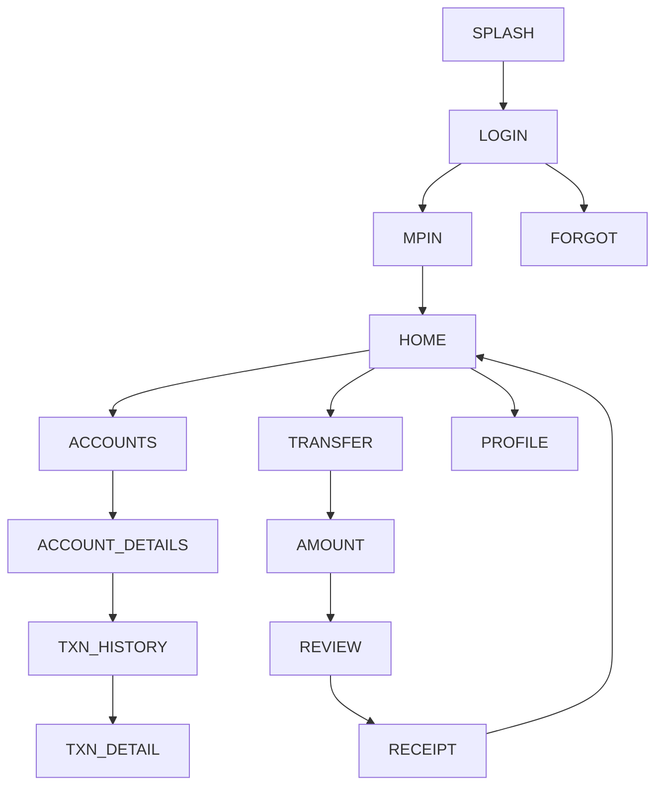

# 09 — IndusMobile / INDIE (IndusInd Bank) — Design Specification

*Follows the corpus schema (exemplar: `01_sbi_yono.md`).*

# APP IDENTITY
- **Bank:** IndusInd Bank (private sector)
- **Exact Application Names:** IndusMobile: Digital Banking (`com.fss.indus`);
  flagship **INDIE by IndusInd Bank** (`com.indusind.indie`)
- **Baseline ID:** `BASE-09-INDUS` · **Shortcode:** `INDUS`
- **Research Date:** 2026-08-12
- **Platform:** Android (Capacitor target); iOS exists
- **Official Sources:** Google Play both packages **VERIFIED**; IndusInd "our apps" page
- **Research Confidence:** Identity HIGH; visual detail PARTIAL (APPROXIMATED)
- **Naming note (IMPORTANT):** IndusInd runs **two** concurrent retail apps.
  Baseline = **IndusMobile** (per file slug); **INDIE** recorded as the newer
  flagship and may be represented as an alternate skin.

# PURPOSE OF THIS SPECIFICATION
Research-grounded, local, mock-data prototype spec of publicly observable
IndusMobile/INDIE UI patterns, as a VIDE trusted baseline. No real auth/backend/
credentials/transactions. Colors approximated from public brand identity.

# SOURCE EVIDENCE
| Source | Type | What It Supports | Confidence |
|---|---|---|---|
| Google Play (both apps, VERIFIED) | [OFFICIAL SOURCE] | Names, packages, dual-app | HIGH |
| IndusInd "our apps" page | [OFFICIAL SOURCE] | App portfolio, INDIE flagship | MED |
| IndusInd public brand (maroon/crimson) | [PUBLIC OBSERVATION] | Color approximation | MED |
| Banking UX conventions | [INFERENCE] | Screen structure | LOW–MED |

# BRAND AND VISUAL IDENTITY
## Logo Treatment
IndusInd mark uses deep maroon/crimson. INDIE leans more contemporary. **Do not
bundle real logo.** → **ORIGINAL TEST ASSET REQUIRED.**
## Color System
| Token | Value | Confidence | Evidence |
|---|---|---|---|
| primary | `#9E1B32` (IndusInd maroon) | APPROXIMATED | public brand identity |
| secondary | `#C0223B` (crimson) | APPROXIMATED | brand variant |
| accent | `#E0803A` (amber, INDIE) | APPROXIMATED | INDIE accent (observation) |
| background | `#F7F3F4` | APPROXIMATED | light bg |
| surface | `#FFFFFF` | APPROXIMATED | cards |
| text-primary | `#271620` | APPROXIMATED | text |
| text-secondary | `#6A585F` | APPROXIMATED | secondary |
| divider | `#EBE1E4` | APPROXIMATED | hairlines |
| success `#1E8E4E` / warning `#E8A100` / error `#C0392B` | APPROXIMATED | states |
## Typography
Sans; exact font UNKNOWN. System/`Inter`, 700/500/400. APPROXIMATED.

# DESIGN PRINCIPLES
Medium density; maroon header/CTAs; INDIE variant more modern/personalized;
card dashboard; bottom nav.

# SCREEN INVENTORY
**MUST IMPLEMENT (12):** `SPLASH`, `LOGIN`, `MPIN`, `HOME`, `ACCOUNTS`,
`ACCOUNT_DETAILS`, `TXN_HISTORY`, `TRANSFER`, `AMOUNT`, `REVIEW`, `RECEIPT`, `PROFILE`.
**OPTIONAL:** `BIOMETRIC`, `CARDS`, `SERVICES`, `OFFERS`, `NOTIFICATIONS`, `SETTINGS`.
**NOT VERIFIED:** INDIE-specific personalization widgets (flagged `[UNKNOWN]`).

# INFORMATION ARCHITECTURE

| From | To | Trigger |
|---|---|---|
| MPIN | HOME | 6 digits (mock) |
| HOME | TRANSFER | quick action |
| REVIEW | RECEIPT | Confirm (mock) |

# SCREEN SPECIFICATIONS
## SPLASH — `INDUS-SPLASH` `/` — maroon bg, test mark, auto→LOGIN. SIMULATED.
## LOGIN — `INDUS-LOGIN` `/login` — `AUTH_FORM_VERTICAL_PRIMARY_CTA`; any input→MPIN. MOCK.
## MPIN — `INDUS-MPIN` `/mpin` — `PINPAD_NUMERIC_ENTRY`; 6 digits→HOME. **No capture.** SIMULATED.
## HOME — `INDUS-HOME` `/home` — `DASHBOARD_CARD_GRID_QUICKACTIONS`+`TAB_HOST_BOTTOMNAV`
`HEADER(greeting,notif) → ACCOUNT_SUMMARY_CARD → QUICK_ACTIONS(Transfer,Pay,Scan,Deposits) → PERSONALIZED_STRIP(visual) → RECENT_ACTIVITY → BOTTOM_NAV`. Maroon. MOCK DATA.
## ACCOUNTS / ACCOUNT_DETAILS / TXN_HISTORY — corpus patterns.
## TRANSFER→AMOUNT→REVIEW→RECEIPT — mock flow. SIMULATED.
## PROFILE — `INDUS-PROFILE` `/profile` — `SETTINGS_LIST_GROUPED`; Logout→LOGIN.

# REUSABLE COMPONENT SYSTEM
Shared corpus set.

# DESIGN TOKEN MAP
```css
--color-primary:#9E1B32; --color-secondary:#C0223B; --color-accent:#E0803A; /* APPROXIMATED */
--color-bg:#F7F3F4; --color-surface:#FFFFFF; /* APPROXIMATED */
--color-text-primary:#271620; --color-text-secondary:#6A585F; --color-divider:#EBE1E4; /* APPROXIMATED */
--color-success:#1E8E4E; --color-warning:#E8A100; --color-error:#C0392B; /* APPROXIMATED */
--radius-card:16px; --space-16:16px; --font-heading:'Inter',system-ui; /* APPROXIMATED */
```

# NAVIGATION MANIFEST (JSON)
```json
{"baselineId":"BASE-09-INDUS","entry":"INDUS-SPLASH",
 "nodes":[{"id":"INDUS-SPLASH","route":"/"},{"id":"INDUS-LOGIN","route":"/login"},
 {"id":"INDUS-MPIN","route":"/mpin"},{"id":"INDUS-HOME","route":"/home"},
 {"id":"INDUS-TRANSFER","route":"/transfer"},{"id":"INDUS-AMOUNT","route":"/transfer/amount"},
 {"id":"INDUS-REVIEW","route":"/transfer/review"},{"id":"INDUS-RECEIPT","route":"/transfer/receipt"}],
 "edges":[{"from":"INDUS-SPLASH","to":"INDUS-LOGIN","trigger":"timeout"},
 {"from":"INDUS-LOGIN","to":"INDUS-MPIN","trigger":"submit-mock"},
 {"from":"INDUS-MPIN","to":"INDUS-HOME","trigger":"mpin-complete-mock"},
 {"from":"INDUS-AMOUNT","to":"INDUS-REVIEW","trigger":"continue"},
 {"from":"INDUS-REVIEW","to":"INDUS-RECEIPT","trigger":"confirm-mock"}]}
```

# SCREEN FINGERPRINT MAP (authored)
```
SCREEN_ID: INDUS-HOME  SIGNATURE: DASHBOARD_CARD_GRID_QUICKACTIONS
FEATURES: [maroon header, balance card, quick actions, personalized strip, bottom nav]
SCREEN_ID: INDUS-LOGIN SIGNATURE: AUTH_FORM_VERTICAL_PRIMARY_CTA
```

# MOCK DATA REQUIREMENTS
Fictional accounts/transactions/payees/cards/notifications (corpus shapes). No real PII.

# PROTOTYPE EXCLUSIONS
no real login · no credential transmission · no backend · no transactions · no live
OTP · no production security · no personal-data collection · no logo reuse.

# RESEARCH GAPS AND LIMITATIONS
Exact colors/typeface UNKNOWN (approximated); INDIE personalization widgets
[UNKNOWN]; dual-app (IndusMobile/INDIE) documented; post-login layouts representative.

# IMPLEMENTATION HANDOFF SUMMARY
12-screen mock prototype, maroon palette, card dashboard + transfer flow,
deterministic mock data, no backend. Optionally provide an INDIE alternate skin.
See `03-implementation-plans/09_indusmobile_implementation.md`.
