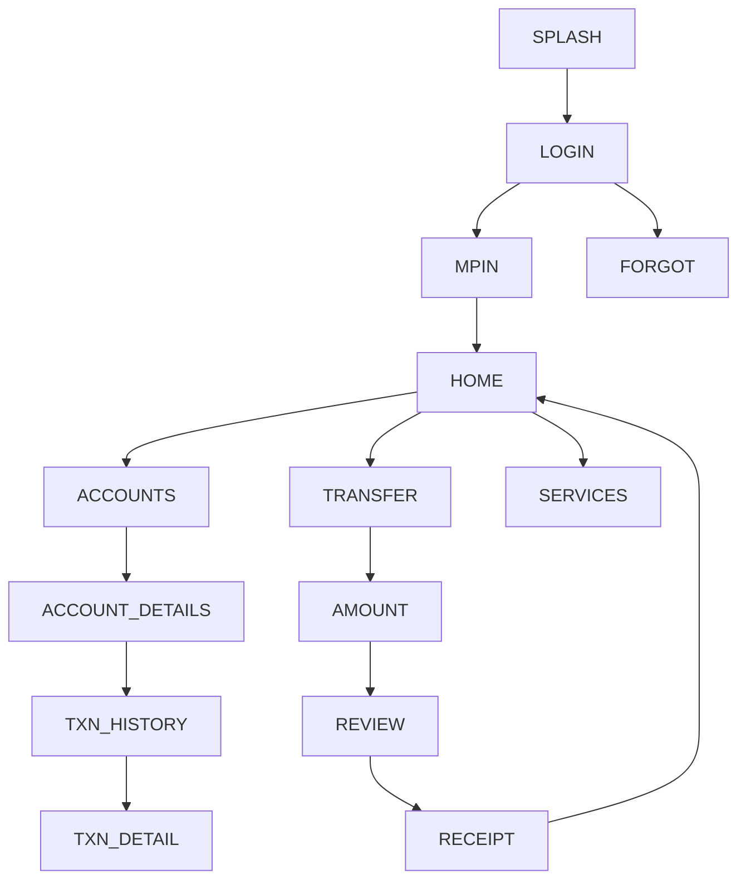

# 10 — Vyom (Union Bank of India) — Design Specification

*Follows the corpus schema (exemplar: `01_sbi_yono.md`).*

# APP IDENTITY
- **Bank:** Union Bank of India (public sector)
- **Exact Application Name:** Vyom – Union Bank of India *(rebranding to "Union
  ease")*
- **Baseline ID:** `BASE-10-UNION` · **Shortcode:** `UNION`
- **Research Date:** 2026-08-12
- **Platform:** Android (Capacitor target); iOS exists
- **Official Sources:** Google Play `com.infrasoft.uboi` **VERIFIED**; Apple
  listing; UBI Vyom/Union ease official page
- **Research Confidence:** Identity HIGH; Vyom→Union ease rebrand state MED; visual PARTIAL
- **Naming note (IMPORTANT):** a **Vyom → "Union ease"** rebrand (refreshed logo/
  design) is in progress. Baseline = **Vyom**; Union-ease-specific visuals flagged
  `[UNKNOWN]` unless verified. Chosen as the verified 10th app for a 5/5 public/
  private sector balance.

# PURPOSE OF THIS SPECIFICATION
Research-grounded, local, mock-data prototype spec of publicly observable Vyom UI
patterns, as a VIDE trusted baseline. No real auth/backend/credentials/
transactions. Colors approximated from public brand identity.

# SOURCE EVIDENCE
| Source | Type | What It Supports | Confidence |
|---|---|---|---|
| Google Play listing (VERIFIED) | [OFFICIAL SOURCE] | Name, package, feature breadth | HIGH |
| Apple App Store listing | [OFFICIAL SOURCE] | iOS identity | HIGH |
| UBI Vyom/Union ease official page | [OFFICIAL SOURCE] | Rebrand, positioning | MED |
| UBI public brand (red + blue) | [PUBLIC OBSERVATION] | Color approximation | MED |
| Banking UX conventions | [INFERENCE] | Screen structure | LOW–MED |

# BRAND AND VISUAL IDENTITY
## Logo Treatment
UBI mark uses red + blue. **Do not bundle real logo.** →
**ORIGINAL TEST ASSET REQUIRED.**
## Color System
| Token | Value | Confidence | Evidence |
|---|---|---|---|
| primary | `#C8102E` (UBI red) | APPROXIMATED | public brand identity |
| secondary | `#1B3F8B` (UBI blue) | APPROXIMATED | public brand identity |
| accent | `#E0803A` (amber) | APPROXIMATED | highlight |
| background | `#F5F5F8` | APPROXIMATED | light bg |
| surface | `#FFFFFF` | APPROXIMATED | cards |
| text-primary | `#1B2233` | APPROXIMATED | text |
| text-secondary | `#5C6472` | APPROXIMATED | secondary |
| divider | `#E4E6EC` | APPROXIMATED | hairlines |
| success `#1E8E4E` / warning `#E8A100` / error `#C8102E` | APPROXIMATED | states |
## Typography
Sans; exact font UNKNOWN. System/`Inter`, 700/500/400. APPROXIMATED.

# DESIGN PRINCIPLES
Medium density; red header/CTAs, blue accents; feature-broad public-sector
super-app framing; card dashboard; bottom nav.

# SCREEN INVENTORY
**MUST IMPLEMENT (12):** `SPLASH`, `LOGIN`, `MPIN`, `HOME`, `ACCOUNTS`,
`ACCOUNT_DETAILS`, `TXN_HISTORY`, `TRANSFER`, `AMOUNT`, `REVIEW`, `RECEIPT`, `SERVICES`.
**OPTIONAL:** `BIOMETRIC`, `CARDS`, `PROFILE`, `OFFERS`, `NOTIFICATIONS`, `SETTINGS`.
**NOT VERIFIED:** Union-ease redesign screens; lifestyle/booking modules (flagged `[UNKNOWN]`).

# INFORMATION ARCHITECTURE

| From | To | Trigger |
|---|---|---|
| MPIN | HOME | 6 digits (mock) |
| HOME | SERVICES | Services quick action |
| REVIEW | RECEIPT | Confirm (mock) |

# SCREEN SPECIFICATIONS
## SPLASH — `UNION-SPLASH` `/` — red bg, test mark, auto→LOGIN. SIMULATED.
## LOGIN — `UNION-LOGIN` `/login` — `AUTH_FORM_VERTICAL_PRIMARY_CTA`; any input→MPIN. MOCK.
## MPIN — `UNION-MPIN` `/mpin` — `PINPAD_NUMERIC_ENTRY`; 6 digits→HOME. **No capture.** SIMULATED.
## HOME — `UNION-HOME` `/home` — `DASHBOARD_CARD_GRID_QUICKACTIONS`+`TAB_HOST_BOTTOMNAV`
`HEADER(greeting,notif) → ACCOUNT_SUMMARY_CARD → QUICK_ACTIONS(Transfer,Pay,Services,Scan) → SERVICE_STRIP(visual) → RECENT_ACTIVITY → BOTTOM_NAV`. Red/blue. MOCK DATA.
## SERVICES — `UNION-SERVICES` `/services` — `SETTINGS_LIST_GROUPED`; grouped service tiles; tiles→placeholder/EmptyState.
## ACCOUNTS / ACCOUNT_DETAILS / TXN_HISTORY — corpus patterns.
## TRANSFER→AMOUNT→REVIEW→RECEIPT — mock flow. SIMULATED.

# REUSABLE COMPONENT SYSTEM
Shared corpus set.

# DESIGN TOKEN MAP
```css
--color-primary:#C8102E; --color-secondary:#1B3F8B; --color-accent:#E0803A; /* APPROXIMATED */
--color-bg:#F5F5F8; --color-surface:#FFFFFF; /* APPROXIMATED */
--color-text-primary:#1B2233; --color-text-secondary:#5C6472; --color-divider:#E4E6EC; /* APPROXIMATED */
--color-success:#1E8E4E; --color-warning:#E8A100; --color-error:#C8102E; /* APPROXIMATED */
--radius-card:16px; --space-16:16px; --font-heading:'Inter',system-ui; /* APPROXIMATED */
```

# NAVIGATION MANIFEST (JSON)
```json
{"baselineId":"BASE-10-UNION","entry":"UNION-SPLASH",
 "nodes":[{"id":"UNION-SPLASH","route":"/"},{"id":"UNION-LOGIN","route":"/login"},
 {"id":"UNION-MPIN","route":"/mpin"},{"id":"UNION-HOME","route":"/home"},
 {"id":"UNION-SERVICES","route":"/services"},{"id":"UNION-TRANSFER","route":"/transfer"},
 {"id":"UNION-AMOUNT","route":"/transfer/amount"},{"id":"UNION-REVIEW","route":"/transfer/review"},
 {"id":"UNION-RECEIPT","route":"/transfer/receipt"}],
 "edges":[{"from":"UNION-SPLASH","to":"UNION-LOGIN","trigger":"timeout"},
 {"from":"UNION-LOGIN","to":"UNION-MPIN","trigger":"submit-mock"},
 {"from":"UNION-MPIN","to":"UNION-HOME","trigger":"mpin-complete-mock"},
 {"from":"UNION-AMOUNT","to":"UNION-REVIEW","trigger":"continue"},
 {"from":"UNION-REVIEW","to":"UNION-RECEIPT","trigger":"confirm-mock"}]}
```

# SCREEN FINGERPRINT MAP (authored)
```
SCREEN_ID: UNION-HOME  SIGNATURE: DASHBOARD_CARD_GRID_QUICKACTIONS
FEATURES: [red header, balance card, service-rich quick actions, service strip, bottom nav]
SCREEN_ID: UNION-SERVICES SIGNATURE: SETTINGS_LIST_GROUPED
SCREEN_ID: UNION-LOGIN SIGNATURE: AUTH_FORM_VERTICAL_PRIMARY_CTA
```

# MOCK DATA REQUIREMENTS
Fictional accounts/transactions/payees/cards/notifications (corpus shapes). No real PII.

# PROTOTYPE EXCLUSIONS
no real login · no credential transmission · no backend · no transactions · no live
OTP · no production security · no personal-data collection · no logo reuse.

# RESEARCH GAPS AND LIMITATIONS
Exact colors/typeface UNKNOWN (approximated); **Union ease redesign UI UNKNOWN**;
Vyom→Union ease rebrand documented; lifestyle modules [UNKNOWN]; post-login layouts representative.

# IMPLEMENTATION HANDOFF SUMMARY
12-screen mock prototype, red+blue palette, service-rich dashboard + services hub +
transfer flow, deterministic mock data, no backend. See
`03-implementation-plans/10_union_bank_vyom_implementation.md`.
