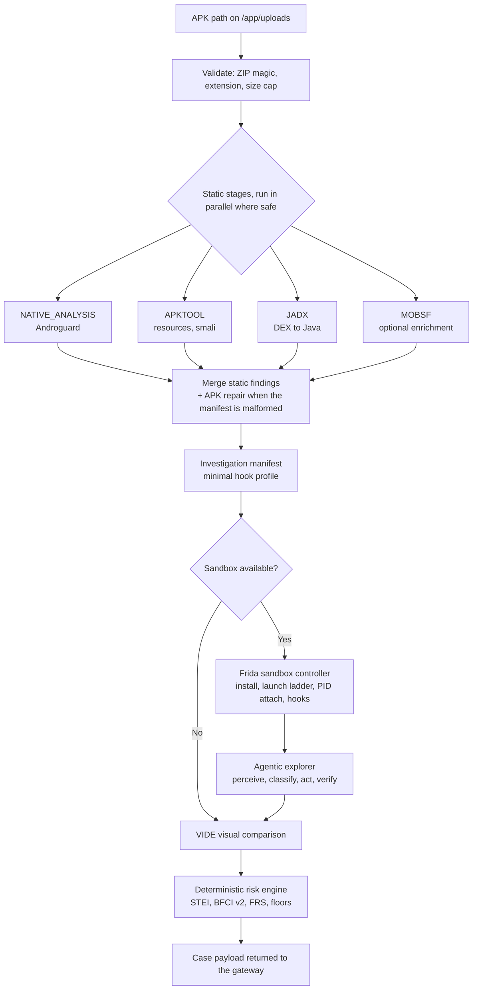

# Analysis engine — analysis microservice

The container that actually performs analysis. It decompiles the APK, drives the Android sandbox through Frida, runs deep UI exploration, computes the deterministic score and returns a complete case payload to the backend gateway.

The app is declared in [`app/main.py`](app/main.py) as `Sudarshan APK Analysis Engine Microservice`, version **2.3.0**, and listens on port **8001**.

- Platform overview: [`../README.md`](../README.md)
- Dynamic analysis design: [`../docs/architecture/04_DYNAMIC_ANALYSIS_ENGINE.md`](../docs/architecture/04_DYNAMIC_ANALYSIS_ENGINE.md)

> This service has **no authentication of its own** and is deliberately **not published** in `docker-compose.yml`. The backend reaches it at `http://analysis-engine:8001` on the internal Compose network. Do not expose port 8001.

---

## Container

Built from [`Dockerfile`](Dockerfile) with the repository root as build context so `shared/` is reachable.

| Component | Version | Source |
| :--- | :--- | :--- |
| Base image | Ubuntu 24.04 | `FROM ubuntu:24.04` |
| Java runtime | OpenJDK 17 (headless) | apt |
| Python | 3.12 | apt, symlinked to `python` |
| APKTool | 2.10.0 | Pinned release JAR, wrapped at `/usr/local/bin/apktool` |
| JADX | 1.5.1 | Pinned release zip, unpacked to `/opt/jadx` |
| Android tooling | `adb`, `aapt`, `apksigner`, `zipalign`, `android-framework-res` | apt |
| Frida | 17.16.4 (`frida-tools` 14.10.4) | Installed in a dedicated pip layer |
| Device channel | `uiautomator2` 3.7.0 | Optional at runtime; falls back to raw ADB |
| Shared core | `sudarshan_core` | Installed editable at `/opt/sudarshan-core` |

Resource limits in Compose: `mem_limit: 4g`, `cpus: 2.0`, `security_opt: no-new-privileges:true`. Health check polls `GET /health` every 10 s with a 60 s start period.

### Entrypoint

[`entrypoint.sh`](entrypoint.sh) verifies the toolchain, starts a background policy-validated ADB bootstrap (`python -m app.adb_bootstrap`), then launches:

```bash
uvicorn app.main:app --host 0.0.0.0 --port 8001 --workers 1
```

`--workers 1` is required. The async job store `JOBS` is an in-process dict, so a second worker would return 404 from `/api/v1/status/{job_id}` for a job created in the other process.

---

## Endpoints

| Method | Path | Purpose |
| :--- | :--- | :--- |
| `GET` | `/health` | Liveness probe |
| `GET` | `/status` | Toolchain readiness, ADB connectivity, concurrency settings |
| `POST` | `/api/v1/analyze` | Synchronous analysis of a file already on the shared uploads volume (`AnalyzePathRequest`) |
| `POST` | `/api/v1/analyze/upload` | Synchronous analysis of a directly uploaded APK |
| `POST` | `/api/v1/analyze/async` | Enqueue an analysis; returns a `job_id` |
| `GET` | `/api/v1/status/{job_id}` | Poll an async job |

The primary path is `POST /api/v1/analyze` against the shared `uploads` volume — the backend writes the APK there, so no bytes cross the network twice.

---

## Pipeline

[`_execute_analysis_pipeline`](app/main.py) runs under a hard timeout and is instrumented by `PipelineTimer`, which records per-stage start, completion and failure.



Every optional stage degrades rather than failing the request:

- **MobSF** is wrapped so an unreachable `MOBSF_HOST` logs a warning and the pipeline continues. Bound it with `MOBSF_MAX_SECONDS` (`0` = no budget).
- **APKTool** and **JADX** are skipped when `is_available()` reports the binary missing.
- **Androguard** failure falls back to regex manifest parsing.
- **Sandbox** failure yields a static-only result with the dynamic axis excluded from scoring.

---

## Concurrency and job state

| Control | Default | Notes |
| :--- | :--- | :--- |
| `MAX_CONCURRENT_ANALYSES` | `2` | Backing `asyncio.Semaphore`; concurrent analyses beyond this queue |
| Per-device lock | — | The sandbox controller holds a lock per device serial, so two analyses never drive one emulator at once |
| `JOB_RETENTION_SECONDS` | `3600` | Finished jobs evicted from the in-memory store after this |
| `MAX_RETAINED_JOBS` | `200` | Hard cap on retained job records |
| `MAX_UPLOAD_BYTES` | `200 MB` | Upload ceiling |
| `ANALYSIS_TIMEOUT_SECONDS` | `300` in code, `1200` in Compose | Hard pipeline timeout |

Job state is **not durable**. An engine restart loses in-flight jobs; the gateway keeps the authoritative record in `analysis_jobs`.

---

## Runtime dependencies

The engine talks to three things outside its own container:

| Dependency | Reached via | Failure behaviour |
| :--- | :--- | :--- |
| Android guest | Host ADB server at `ADB_SERVER_SOCKET` (default `tcp:host.docker.internal:5037`), then frida-server on `FRIDA_PORT` (default 27055) | Static-only analysis |
| MobSF | `MOBSF_HOST` (`http://mobsf:8000` in Compose) | Skipped, warning logged |
| mitmproxy HAR | Read-only mount at `MITMPROXY_HAR_PATH` (`/mitmproxy_har/dump.har`) | Network evidence omitted |
| Gemini | `GEMINI_*` keys | Agentic planner disables itself; the deterministic `FallbackPlanner` takes over |

`frida-server` is roughly 106 MB and is not committed. The engine downloads the ABI-matched binary into `FRIDA_SERVER_DIR` (`/opt/frida-cache`, bind-mounted from the host `./tools`) on first use, so it is fetched once per machine rather than once per image build.

The pushed `frida-server` version **must match** the pinned host `frida` package exactly (17.16.4). Frida 17 removed the built-in `Java` global, so only the pre-compiled `banking_trojan.bundle.js` runs; Frida 16 cannot link on 16 KB page-size devices, which is why 17 is mandatory.

---

## Containment

`_sandbox_containment_startup` in [`app/main.py`](app/main.py) evaluates the control-plane posture at boot. With `SUDARSHAN_ENV=production` and `SANDBOX_CONTAINMENT_STRICT=true`, a non-compliant configuration aborts startup rather than degrading silently.

All ADB invocation goes through `sudarshan_core.security.adb_gateway.run_adb`, which validates against the containment policy. `tcpip`, `usb`, `pair`, `unpair`, `kill-server` and `start-server` are blocked.

Under the hardened overlay this service gets a read-only rootfs, `cap_drop: ALL`, a seccomp profile from [`../deploy/security/seccomp-analysis-engine.json`](../deploy/security/seccomp-analysis-engine.json), `FRIDA_LISTEN_HOST=127.0.0.1`, and no `~/.android` mount.

---

## Local development

`./analysis-engine` and `./shared` are bind-mounted, so edits are live:

```bash
docker compose up -d analysis-engine
docker compose logs -f analysis-engine
docker compose exec analysis-engine curl -s localhost:8001/status
```

Verify the whole sandbox chain from inside the container:

```bash
python scripts/preflight.py --container
```

### Loose Frida probe scripts

`test_frida*.py`, `restart_frida.py` and `restart_frida_no_l.py` in this directory are hand-run diagnostic probes from dynamic-analysis debugging — attach-by-name, attach-by-PID, spawn, TCP-first transport. They are **not** part of the pytest suite and are not exercised by CI. The maintained tests live in [`../tests/`](../tests/README.md) and [`../backend/tests/`](../backend/README.md).
