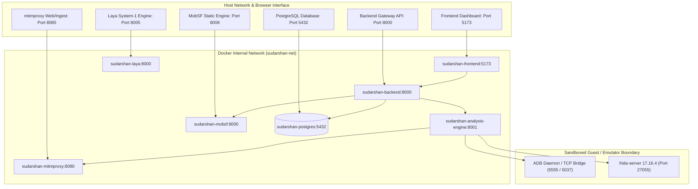

# SUDARSHAN Ground Truth — Verified Codebase Reality

> **Classification:** AUTHORITATIVE  
> **Source Repository:** `SanTiwari07/Sudarshan`  
> **Backend Version:** `2.1.0` (defined in `backend/app/main.py`)  
> **Analysis Engine Version:** `2.3.0` (defined in `analysis-engine/app/main.py`)  
> **Verification Date:** 2026-09-25  
> **Verification Basis:** Direct source code inspection, AST parsing, OpenAPI schema generation, and test suite execution.

---

## 1. Executive Summary

This document establishes the empirical facts of the SUDARSHAN repository. Every statement, metric, configuration parameter, and formula in this document has been directly verified against executable source code and test suite execution.

In SUDARSHAN:
1. **Source code is the primary source of truth.** Markdown documentation is supporting evidence only.
2. **Deterministic Risk Scoring is strictly separated from AI.** The Deterministic Risk Engine (`shared/sudarshan_core/engines/risk_engine.py`) is the sole authority on risk scores and bands.
3. **AI provides evidence-grounded assistance.** Google Gemini (`gemini-2.5-flash`) explains findings and assists analyst queries, but cannot compute or alter raw risk scores.

---

## 2. Verified Test Suite Execution

Empirical test run conducted using Python 3.11 virtual environment (`.venv`):

| Test Suite Scope | Test Files | Total Tests | Passed | Skipped | Failed | Execution Time |
| :--- | :--- | :--- | :--- | :--- | :--- | :--- |
| `backend/tests/` | 67 files | 871 | 869 | 2 | 0 | 65.93 s (22 subtests) |
| `tests/unit/` | 96 files | 1,958 | 1,934 | 24 | 0 | 216.63 s |
| `tests/integration/` | 2 files | 12 | 10 | 2 | 0 | Requires live sandbox |
| **Entire Repository** | **165 files** | **2,841** | **2,813** | **28** | **0** | **0 Failures (100% Passing)** |

> [!IMPORTANT]
> Any documentation claiming "920 tests", "1,000+ tests", or "2,622 tests" reflects earlier historical milestones. The verified current test count is **2,841 collected tests**.

---

## 3. Microservice Network Topology & Ports

The SUDARSHAN platform operates as a containerized distributed system orchestrated via Docker Compose:

### Verified Service Inventory

| Service Container | Internal Port | Host Port | Role | Auth / Gateway Policy |
| :--- | :--- | :--- | :--- | :--- |
| `sudarshan-frontend` | 5173 | `5173` | React 18 SPA analyst dashboard | Browser accessible |
| `sudarshan-backend` | 8000 | `8000` | FastAPI Orchestrator & Case Store | JWT bearer token + 3-tier RBAC |
| `sudarshan-analysis-engine` | 8001 | *Unexposed* | APK analysis, Frida & ADB driver | Internal service token (`ANALYSIS_ENGINE_INTERNAL_TOKEN`) |
| `sudarshan-mobsf` | 8000 | `8008` | Optional Mobile Security Framework | API Key (`MOBSF_API_KEY`) |
| `sudarshan-mitmproxy` | 8080 | `8085` | Transparent HTTPS proxy & HAR dump | Localhost loopback binding |
| `sudarshan-postgres` | 5432 | `127.0.0.1:5432` | Default persistence layer in Compose | `POSTGRES_PASSWORD` (required) |
| `sudarshan-laya` | 8000 | `8005` | System-1 calibrated decision engine | Optional profile (`--profile laya`) |

---

## 4. Deterministic Risk Engine Formulas

The Deterministic Risk Engine (`shared/sudarshan_core/engines/risk_engine.py`) produces the final authoritative **Fraud Risk Score (FRS)** on a strictly normalized 0–100 scale:

$$\text{FRS} = 0.25 \times \text{STEI} + 0.35 \times \text{BFCI} + 0.20 \times \text{Correlation} + 0.20 \times \text{BankingImpact}$$

### 4.1 Static Threat Evaluation Index (STEI)
$$\text{STEI} = 0.60 \times \text{CT} + 0.20 \times \text{BT} + 0.10 \times \text{PR} + 0.05 \times \text{OB} + 0.05 \times \text{IR}$$

Where:
- **CT (Credential Theft):** Accessibility abuse (+40), SMS interception (+35), Overlay window (`SYSTEM_ALERT_WINDOW`) (+25). Max 100.
- **BT (Banking Targeting):** Matched Indian banking package names (e.g. `com.sbi.lotus`, `com.snapwork.hdfc`) or VIDE visual clone detection (+35 to +85). Max 100.
- **PR (Permission Risk):** Declared dangerous permission set size normalized against banking profile baselines. Max 100.
- **OB (Obfuscation):** DexClassLoader, dynamic reflection, string encryption, and Shannon entropy. Max 100.
- **IR (Infrastructure Risk):** Hardcoded command-and-control (C2) URLs and raw IP addresses. Max 100.

### 4.2 Behavioral Fraud Confidence Index (BFCI v2)
Validated against active Indian banking trojan families:

$$\text{BFCI} = \sum (w_i \times \text{Component}_i) \times \text{SequenceBonus}$$

| Axis | Weight ($w_i$) | Rationale & Code Anchor |
| :--- | :--- | :--- |
| **Accessibility** | `0.315` | Screen scraping, tap injection, keylogging ($0.35 \times 0.90$) |
| **SMS Interception** | `0.225` | OTP theft, SMS forwarder suppression ($0.25 \times 0.90$) |
| **Overlay Phishing** | `0.180` | Fake banking login window injection ($0.20 \times 0.90$) |
| **Banking Target** | `0.090` | Active targeting of Indian financial institutions ($0.10 \times 0.90$) |
| **Code Execution** | `0.100` | Dynamic DEX load, `ProcessBuilder`, native `execve` |
| **C2 Network** | `0.045` | C2 communication, payload fetching ($0.05 \times 0.90$) |
| **Device Persistence**| `0.045` | Device admin abuse, package hiding ($0.05 \times 0.90$) |

### 4.3 Unscored Categories
Collected as forensic evidence but **strictly zero-weighted** to avoid false positives:
`dangerous_apis`, `files_accessed`, `anti_analysis`, `device_fingerprint`, `app_telemetry`, `notification`.

### 4.4 Risk Bands and Safety Floors
- **0.0 – 19.9:** `Safe`
- **20.0 – 39.9:** `Low`
- **40.0 – 59.9:** `Medium`
- **60.0 – 79.9:** `High`
- **80.0 – 100.0:** `Critical`

Four deterministic safety floors prevent evasion:
1. **Visibility Floor:** If dynamic analysis failed to reach foreground execution, score cannot drop to `Safe`.
2. **Static Evidence Floor:** Strong static indicators (e.g. accessibility + SMS) prevent `Safe` even if sandbox is dormant.
3. **Evasion Floor:** Fingerprinting checks ensure evasion contributes to suspicious status.
4. **Execution Assertions Floor:** Half-confidence penalty applied when trigger conditions are unmet (`INCOMPLETE_EXERCISE`).

### 4.5 The CH27 On-Device Fraud Triad
When an APK combines:
1. High Visual Clone Confidence ($> 0.85$) against a protected banking app, AND
2. Developer Certificate Mismatch against `bank_signer_registry.json`, AND
3. Accessibility Abuse (`BIND_ACCESSIBILITY_SERVICE`),
the Deterministic Engine escalates the sample directly to **$\text{FRS} \ge 95$ (`Critical`)**.

---

## 5. Visual Impersonation Detection Engine (VIDE)

VIDE evaluates impersonation across 4 independent axes:
1. **Layout View AST Comparison:** Tree edit distance across decompiled XML layouts against baseline bank templates. Detection threshold: `0.20`.
2. **CIEDE2000 Color Distance ($\Delta E$):** Per-swatch perceptual distance between suspect asset palettes and official brand colors.
3. **Fuzzy String Similarity:** RapidFuzz token matching on app labels, login hints, and form strings. Threshold: `82.0`.
4. **Signer Registry (`bank_signer_registry.json`):** 10 protected Indian institutions (`BASE-01-SBI` through `BASE-10-UNION`). Fail-closed design: unprovisioned fingerprints reject identity claims.

---

## 6. AI Architecture & Boundaries

- **Model:** Google Gemini (`gemini-2.5-flash`), with optional primary/fallback API key configuration.
- **Failover & Circuit Breaker:** 3-state circuit breaker (`AVAILABLE`, `DEGRADED`, `OPEN`). 3 retries with exponential backoff (`0.5s` base).
- **Prompt Sanitization:** All APK-derived metadata, strings, and activity names pass through `sanitize()` and `sanitize_block()` before ingestion into LLM context prompts, neutralizing prompt injection attacks.
- **RAG Engine (`backend/app/ai/gemini_rag.py`):** 7-section structured response template. In-memory LRU investigation graph bounded to 128 entries.
- **Boundary Guarantee:** AI NEVER computes, overrides, or mutates deterministic risk scores. AI is purely an evidence-grounded explanation and interrogation layer.

---

## 7. Storage & Persistence

1. **Relational Database:** Dual-engine architecture.
   - Development default: SQLite (`/app/data/sudarshan.db`).
   - Production mode: PostgreSQL 15 (`DATABASE_URL` built by Compose from `POSTGRES_PASSWORD`; the Compose stack uses PostgreSQL by default).
2. **Shared Volume (`uploads`):** Zero-copy file sharing between backend gateway and analysis engine. File paths are strictly validated to prevent filesystem traversal.
3. **Artifact Storage:** Extensible storage abstraction (`shared/sudarshan_core/storage/artifact_storage.py`) supporting local filesystem and cloud object storage.
