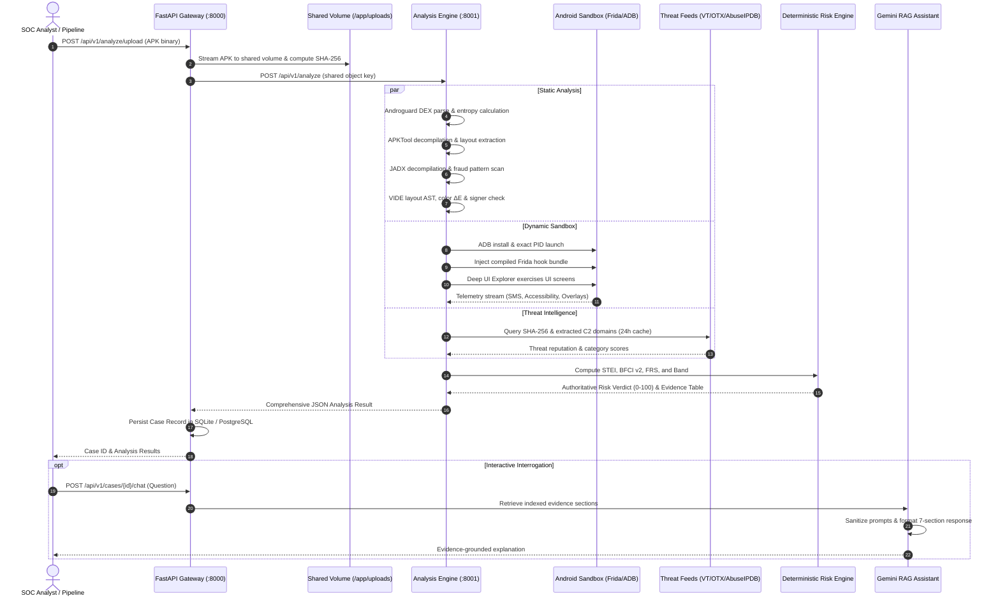

# SUDARSHAN — End-to-End Data Flow

> **Classification:** AUTHORITATIVE  
> **Last Verified:** 2026-09-25  

---

## 1. High-Level Lifecycle of an Investigation

---

## 2. Stage-by-Stage Processing Details

### Stage 1: Intake & Validation
- APK uploaded via `/api/v1/analyze` (synchronous) or `/api/v1/analyze/async` (queued).
- Input verification checks:
  1. Filename extension (`.apk`).
  2. ZIP archive magic header (`PK`, `PK`, or `PK`).
  3. Size limitation: default maximum 200 MB.
- Server-side SHA-256 calculation guarantees tamper-evident sample identification.

### Stage 2: Parallel Static Decompilation
- **Androguard:** Parses `AndroidManifest.xml` and `classes.dex` without unpacking the entire file on disk. Extracts declared permissions, components (Activities, Services, Broadcast Receivers), hardcoded IP addresses, and entropy.
- **APKTool:** Unpacks layout XML files (`res/layout/*.xml`) and string tables (`res/values/strings.xml`) for VIDE visual impersonation inspection.
- **JADX:** Decompiles DEX bytecode into Java classes; scans for targeted strings such as bank package names and reflection calls.
- **VIDE:** Compares suspect layout hierarchies against 10 protected bank templates.

### Stage 3: Dynamic Sandbox Instrumentation
- Target APK is installed onto the sandbox device via ADB.
- Launched using Android `am start` command. PID is monitored to ensure instrumentation attaches before initial execution.
- Compiled Frida script (`banking_trojan.bundle.js`) hooks into Android runtime APIs:
  - Accessibility event interception
  - SMS broadcast receiver reads
  - WindowManager overlay additions
  - File system reads/writes to sensitive storage
  - Network socket connections
- Deep UI Explorer interacts with UI components to trigger hidden fraud paths.

### Stage 4: External Threat Correlation
- SHA-256 hash and dynamic network domains are queried against VirusTotal, AlienVault OTX, and AbuseIPDB.
- Responses are cached in SQLite with a 24-hour TTL to prevent external API rate-limit exhaustion.

### Stage 5: Deterministic Risk Synthesis
- All findings are passed to `calculate_risk_score()` in `shared/sudarshan_core/engines/risk_engine.py`.
- Final Fraud Risk Score (FRS) and risk band are derived mathematically.
- CH27 On-Device Fraud Triad evaluated.
