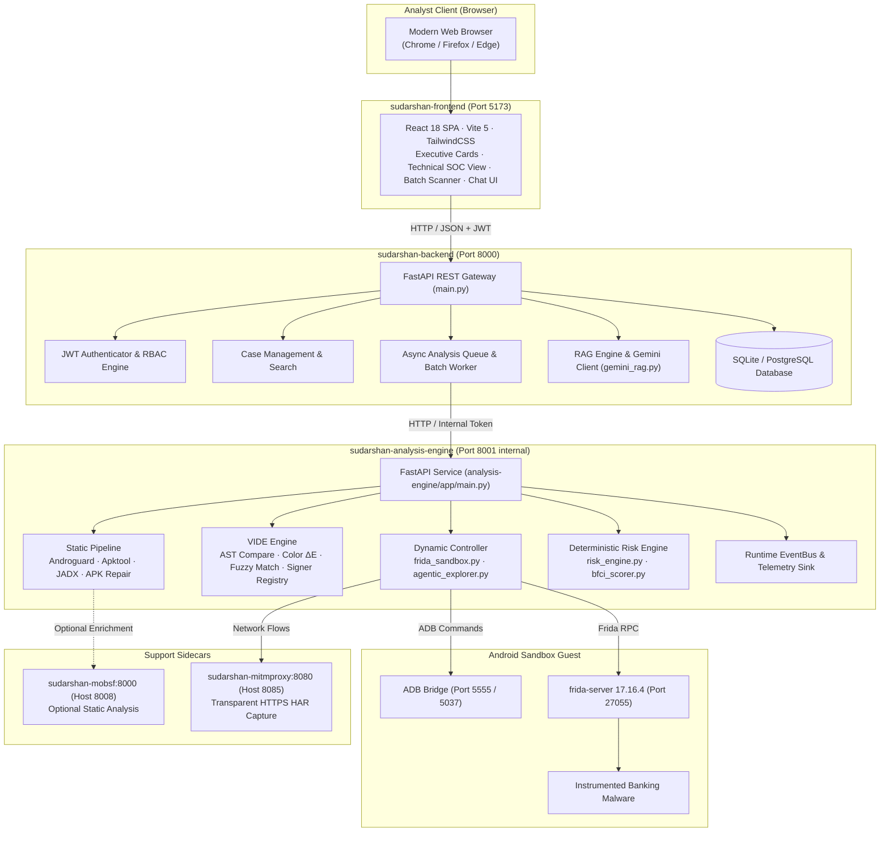

# SUDARSHAN — System Architecture & Component Interactions

> **Classification:** AUTHORITATIVE  
> **Backend Version:** 2.1.0  
> **Analysis Engine Version:** 2.3.0  
> **Last Verified:** 2026-09-25  

---

## 1. Architectural Principles

SUDARSHAN is built as a distributed, containerized platform with strict separation of concerns across presentation, orchestration, deep analysis, and containment layers:

1. **Zero-Copy File Exchange:** Heavy APK files and analysis artifacts reside on a shared volume (`/app/uploads`), eliminating duplicate network file transfers between the gateway and analysis engine.
2. **Process and Privilege Isolation:** Hostile APKs are executed solely within isolated guest Android instances (Genymotion Desktop VM or Android Studio AVD). The host machine never executes APK bytecode.
3. **Deterministic Final Authority:** All risk metrics are computed by numerical algorithms with mathematical determinism guarantees.
4. **Resilient AI Pipeline:** Generative AI is deployed as a supplementary RAG layer protected by circuit breakers and strict input sanitization.

---

## 2. Distributed Component Topology

---

## 3. Subsystem Breakdown

### 3.1 Presentation Layer (`frontend/`)
- Built on **React 18**, **TypeScript**, and **Vite 5**.
- Uses **TailwindCSS** and **Lucide React** icons.
- Delivers 4 operational views:
  - **Executive Fraud Card:** High-level overview, composite FRS score, risk band, affected financial institution, and recommended containment actions.
  - **Technical SOC View:** Granular telemetry breakdown: permissions matrix, disassembled manifest, detected dangerous APIs, C2 network connections, and Frida timeline.
  - **Live Threat Intel:** Correlated threat reputation from VirusTotal, AlienVault OTX, and AbuseIPDB.
  - **Interactive Investigation Chat:** Evidence-grounded conversational interface querying case data via RAG.

### 3.2 Gateway Orchestrator (`backend/`)
- Developed with **FastAPI** (`backend/app/main.py`) running on Python 3.11.
- Manages user lifecycle, JWT issuance, and 3-tier Role-Based Access Control (`analyst`, `soc_lead`, `admin`).
- Hosts the asynchronous job queue (`backend/app/workers/analysis_queue.py`) and multi-file batch processor (`backend/app/workers/batch_worker.py`).
- Manages relational state via raw SQL queries (`backend/app/db/`) supporting both SQLite (`sudarshan.db`) and PostgreSQL 15.

### 3.3 Containerized Analysis Engine (`analysis-engine/`)
- Encapsulated inside Ubuntu 24.04 with Java 17 and Python 3.12.
- Executes heavy bytecode decompilation and static extraction:
  - **Androguard:** DEX/AXML structure, permissions, entropy, reflection checks.
  - **APKTool 2.10.0:** Resource decompilation, layout XML decoding, AndroidManifest reconstruction.
  - **JADX 1.5.1:** Java decompilation, string decryption search, targeted fraud class identification.
- Drives dynamic instrumentation via **Frida 17.16.4** and **ADB TCP** commands.
- Contains the authoritative **Deterministic Risk Engine** (`shared/sudarshan_core/engines/risk_engine.py`).

### 3.4 Shared Core (`shared/sudarshan_core/`)
- Python package mounted into both backend and analysis engine containers as `/opt/sudarshan-core`.
- Defines shared domain models, schemas, Frida hook scripts (`shared/sudarshan_core/engines/frida_hooks/`), VIDE algorithms, and threat intelligence aggregators.
