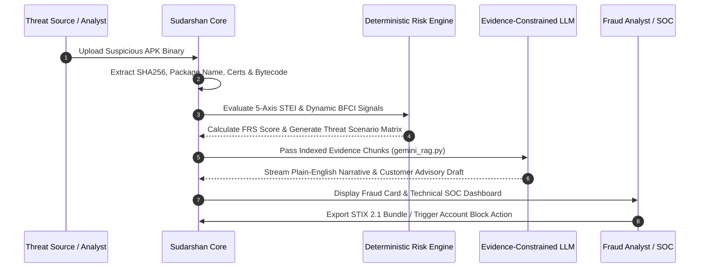

# 01 — Introduction & Problem Statement

## Purpose

This document introduces the **SUDARSHAN** platform, establishing its core domain context, target problem space, operational design principles, target audience, and architectural boundaries. It explains why traditional mobile malware analysis tools fail in banking fraud operations and articulates how Sudarshan bridges the gap between technical binary reverse engineering and actionable fraud risk decisions.

---

## Responsibilities

The primary responsibilities of this module document are to:
1. **Define the Domain Problem**: Articulate the **Intelligence Translation Problem** in mobile banking fraud operations.
2. **Establish Design Principles**: Formally document the three core design axioms governing the Sudarshan platform architecture.
3. **Specify the Target Audience**: Detail the requirements and operational perspectives of judges, Bank of India engineers, SOC analysts, reverse engineers, and security researchers.
4. **Define System Scope**: Delineate what Sudarshan accomplishes versus what falls outside its system boundaries.

---

## High-Level Overview

Mobile banking applications operate in an increasingly hostile endpoint environment. Android devices are routinely targeted by sophisticated banking trojans (such as *Drinik*, *Xenomorph*, *Cerberus*, *Anubis*, and *SpyNote*) capable of overlay phishing, SMS OTP interception, accessibility service automated transfer systems (ATS), and remote device control.

When a malicious application infects a customer's device, an account compromise or unauthorized funds transfer can occur in under **90 seconds**. Conversely, traditional fraud investigation workflows typically begin **3 to 7 days later** after a customer reports a fraudulent transaction. 

This latency exists not because of a lack of technical malware detection tools, but because of an **Intelligence Translation Problem**:

```text
[ Raw APK File / Technical Artifacts ]
                 │
                 ▼
 [ Reverse Engineering Tools (JADX, MobSF, Frida, APKTool) ]
                 │
                 ▼
 [ 500-Page Technical Log Reports (Smali, Memory Dumps, PCAPs) ]
                 │
                 ▼
 ❌ [ Intelligence Translation Gap: 3–7 Days Delay ]
                 │
                 ▼
 [ SOC Analyst / Fraud Operations Action (Blocked Account, Revoked Token) ]
```

Existing mobile security frameworks produce dense, highly technical logs designed for malware reverse engineers. They do not answer the operational questions required by a bank's fraud operations team:
- *Which specific banking applications are targeted by this application?*
- *Is the application actively attempting to read or intercept OTP SMS messages?*
- *Does the binary possess overlay drawing capabilities targeting financial login screens?*
- *What is the mathematical risk exposure to bank accounts, and what immediate mitigation step must be taken?*

Sudarshan solves the Intelligence Translation Problem by ingesting raw APK binaries and automatically translating low-level static and dynamic signals into a single, analyst-ready fraud intelligence package in under **5 minutes**.

---

## Architecture

The introduction module establishes the strategic positioning of Sudarshan within an enterprise banking infrastructure. Sudarshan sits between inbound threat feeds / customer device reports and the Fraud Operations Center (SOC).

```mermaid
graph TD
    subgraph Inbound Threat Vectors
        A1[Customer Fraud Reports]
        A2[Third-Party Threat Feeds]
        A3[Bank Mobile App Telemetry]
    end

    subgraph Sudarshan Intelligence Platform
        B1[Raw APK Buffer & Deduplication]
        B2[Static & Dynamic Pipeline Engine]
        B3[Deterministic Risk Engine]
        B4[Evidence-Constrained RAG Engine]
    end

    subgraph Fraud Operations Center (SOC)
        C1[Fraud Analyst Dashboard]
        C2[CISO Executive Alerts]
        C3[Automated Account Quarantine API]
        C4[CERT-In Advisory Generation]
    end

    A1 -->|Suspicious APK Upload| B1
    A2 -->|Malware Sample Hash| B1
    A3 -->|Device Threat Signal| B1

    B1 --> B2
    B2 --> B3
    B3 --> B4

    B4 -->|Structured AnalysisResponse| C1
    B4 -->|Risk Band & FRS Score| C2
    B4 -->|STIX 2.1 / Account Block API| C3
    B4 -->|PDF / HTML Advisory| C4
```

---

## Components

Sudarshan's operational model is built on three core design principles inspired by enterprise security and financial crime architectures:

### 1. Deterministic Detection, Explainable Intelligence
*Inspired by PayPal & Reserve Bank of India (RBI) Fraud Governance Guidelines.*
- **Principle**: Artificial Intelligence should explain decisions, not make them.
- **Implementation**: Every alert, risk score, or mitigation recommendation is derived from a transparent, weighted mathematical formula based on observable threat behaviors. Generative AI models operate strictly downstream of the deterministic risk engine, constrained to summarizing verified evidence stored in the RAG index ([`gemini_rag.py`](file:///d:/Projects/Sudarshan%20BOI/backend/app/ai/gemini_rag.py)). No LLM is permitted to mutate or compute risk scores.

### 2. Human Judgment, Machine Scale
*Inspired by Palantir & Enterprise SOC Operations.*
- **Principle**: Machines process evidence at scale; human analysts make accountable decisions.
- **Implementation**: Sudarshan automates binary unpacking, static code scanning, Frida runtime hooking, and API correlation. It synthesizes thousands of technical events into concise Executive and Technical SOC views, allowing a human analyst to verify evidence and approve response actions in under 60 seconds.

### 3. Fraud-First, Not Malware-First
*Inspired by the UPI Ecosystem & Indian Digital Banking Realities.*
- **Principle**: Traditional tools ask "What is this malware?" Sudarshan asks "Who is at risk, what is being targeted, and what action should be taken?"
- **Implementation**: Rather than relying solely on generic antivirus signatures or YARA rules, Sudarshan evaluates functional fraud capabilities:
  - *Accessibility Service Abuse*: Programmatic screen scraping and tap injection ($CT$ axis weight $0.60$, $BFCI$ $wa = 0.35$).
  - *SMS OTP Interception*: Reading 2FA tokens before user notification ($CT$ axis $+35$, $BFCI$ $ws = 0.25$).
  - *Phishing Overlay Attacks*: Drawing windows over legitimate banking apps ($CT$ axis $+25$, $BFCI$ $wo = 0.20$).
  - *Indian Banking Targeting*: Package name matches against major Indian banks ($BT$ axis weight $0.20$).

---

## Workflow

The operational workflow from problem identification to resolution proceeds through five distinct stages:



1. **Ingestion**: Ingest raw APK files via REST API or React Dashboard.
2. **Feature Extraction**: Extract static and dynamic signals.
3. **Deterministic Evaluation**: Compute 5-axis $STEI$, $BFCI$, and $FRS$ scores.
4. **Contextual Explanation**: Generate plain-English narratives using RAG-grounded LLM prompts.
5. **Actionable Response**: Present recommended SOC actions (e.g., `IMMEDIATE BLOCK`, `QUARANTINE`, `MONITOR`).

---

## Algorithms

The introduction establishes the core mathematical formulation governing the platform's risk decisions:

### Fraud Risk Score ($FRS$) Formulation

Nominal axis weights (renormalized when an axis has no data):

```text
FRS_base = weighted_mean( stei×0.25, dynamic×0.35, correlation×0.20, banking_impact×0.20 )
final_risk_score = min( FRS_base × ai_confidence_multiplier, 100 )
```

- **Static Exposure ($STEI$)**: Credential Theft ($0.60$), Banking Targeting ($0.20$), Permission Risk ($0.10$), Obfuscation ($0.05$), Infrastructure Risk ($0.05$).
- **Dynamic Behavior ($BFCI$)**: Used when the sandbox run is **conclusive**; otherwise the dynamic axis is excluded.
- **Threat Correlation**: Included only when VT/OTX/AbuseIPDB correlation returns `available: true`.
- **Banking Impact**: Severity weight of matched malware family and regulatory risk indicators.

**Risk bands** (from `risk_engine.py`): `Safe` (≤30), `Suspicious` (≤60), `High Risk` (≤89), `Critical` (≥90).

---

## Integration

Sudarshan integrates into enterprise banking environments through standard protocols:

```text
+-----------------------------------------------------------------------+
|                       BANKING ENTERPRISE ECOSYSTEM                   |
|                                                                       |
|  +-------------------+       +-------------------+       +----------+ |
|  |  Fraud Operations |       | Core Banking API  |       | SIEM /   | |
|  |  Analyst Portal   |       | Account Lockdown  |       | SOAR     | |
|  +---------+---------+       +---------+---------+       +----+-----+ |
|            |                           |                      |       |
|            | REST / JSON               | REST API             | STIX  |
|            v                           v                      v       |
|  +------------------------------------------------------------------+ |
|  |                  SUDARSHAN API GATEWAY (Port 8000)               | |
|  +------------------------------------------------------------------+ |
+-----------------------------------------------------------------------+
```

- **REST API Gateway**: Exposes `/api/v1/analyze`, `/api/v1/cases`, `/api/v1/intelligence/{sha256}`, `/api/v1/report/*`, and `/api/runtime/*`.
- **SIEM / SOAR Export**: Emits standard STIX 2.1 JSON bundles and CSV IOC feeds.
- **Core Banking System**: Integrate playbooks on `Critical` band (typically $FRS \ge 90$) or institution-specific thresholds.

---

## Folder Structure

The primary documentation files related to introduction and system scope are located in `docs/`:

```text
docs/
├── README.md               <- Master Documentation Portal Index
├── 01_INTRODUCTION.md      <- Problem Statement, Principles, Target Audience (This File)
├── 02_SYSTEM_OVERVIEW.md   <- High-Level System Architecture & Microservices Layout
├── ARCHITECTURE.md         <- System Architectural Specification
├── PROJECT_CONTEXT.md      <- Comprehensive Technical System Context
├── HOW_TO_RUN.md           <- Deployment & Execution Guide
└── CHANGELOG.md            <- Version History
```

---

## Current Implementation Status

| Capability / Module | Status | Rationale & Code Location |
| :--- | :--- | :--- |
| **Intelligence Problem Framing** | **Implemented** | Reflected across dashboard layout, risk engine outputs, and report templates. |
| **Deterministic Risk Rules** | **Implemented** | $STEI$, $BFCI$, and $FRS$ formulas implemented in [`shared/sudarshan_core/engines/risk_engine.py`](file:///d:/Projects/Sudarshan%20BOI/shared/sudarshan_core/engines/risk_engine.py). |
| **JWT Authentication** | **Implemented** | Implemented in [`backend/app/auth/auth.py`](file:///d:/Projects/Sudarshan%20BOI/backend/app/auth/auth.py) with seeded admin setup on startup. |
| **Async Worker Queue** | **Implemented** | In-memory asyncio queue worker pool implemented in [`backend/app/workers/analysis_queue.py`](file:///d:/Projects/Sudarshan%20BOI/backend/app/workers/analysis_queue.py). |
