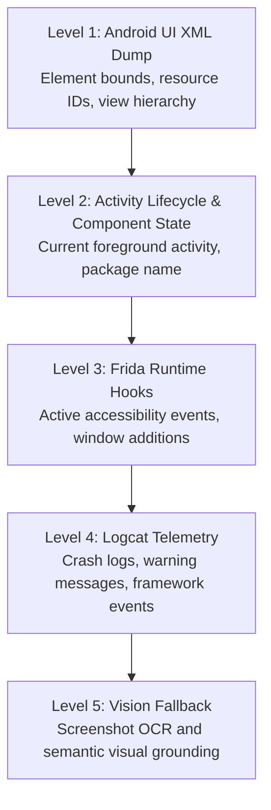

# SUDARSHAN — Deep UI Exploration & Screen Classification

> **Classification:** AUTHORITATIVE  
> **Source Modules:** `shared/sudarshan_core/engines/agentic/`  
> **Last Verified:** 2026-09-25  

---

## 1. The Autonomous UI Exploration Dilemma

Malware requires user interaction to proceed: it presents fake login screens, permissions disclaimers, or update dialogues. Without realistic interaction, dynamic analysis stalls at the first screen.

SUDARSHAN solves this with the **Deep UI Explorer** (`agentic_explorer.py`), an autonomous agent operating on a 5-level perception hierarchy.

---

## 2. The 5-Level Perception Hierarchy

1. **Level 1 (UI Automator XML):** Parses view hierarchy dumps to identify clickable buttons, text input fields, and checkboxes.
2. **Level 2 (Activity State):** Queries `dumpsys window` to confirm package ownership and avoid exploring outside the target app.
3. **Level 3 (Frida Hooks):** Informs the explorer if an overlay or accessibility dialog has appeared.
4. **Level 4 (Logcat):** Detects silent background crashes or permission denials.
5. **Level 5 (Vision Fallback):** When UI XML is obfuscated or rendered via Canvas/Unity/Flutter, falls back to OCR and visual grounding.

---

## 3. Semantic Screen Classification

The explorer classifies every encountered screen into one of **17 semantic categories**:
- `BANKING_LOGIN`: Fake bank authentication screen requiring credential entry.
- `PERMISSION_REQUEST`: System dialog requesting SMS, Accessibility, or Overlay permissions.
- `OTP_ENTRY`: Two-factor SMS token input prompt.
- `KYC_UPDATE`: Fake PAN card, Aadhaar, or credit card collection form.
- `UPDATE_PROMPT`: Deceptive update notification.
- `DEVICE_ADMIN`: Android device administrator activation screen.

### Loop Detection & State Graph
- To prevent getting trapped in infinite loops (e.g. clicking the same Help button repeatedly), the explorer builds a **Screen Graph** keyed by perceptual screen hashes (`screen_graph.py`).
- If a state is revisited multiple times without new progress, the explorer pivots to alternative UI elements.
