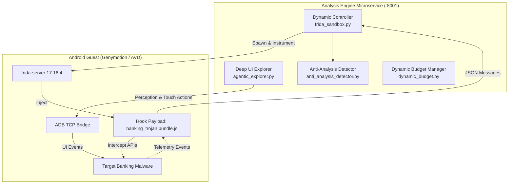

# SUDARSHAN — Dynamic Analysis Engine & Sandbox

> **Classification:** AUTHORITATIVE  
> **Source Modules:** `shared/sudarshan_core/engines/frida_sandbox.py`, `agentic_explorer.py`, `anti_analysis_detector.py`  
> **Last Verified:** 2026-09-25  

---

## 1. Dynamic Sandbox Architecture

The dynamic engine executes suspected banking malware inside an isolated Android guest environment, observing runtime behavior using custom Frida instrumentation and automated UI interaction.

---

## 2. Key Dynamic Subsystems

### 2.1 PID-Accurate Early Instrumentation
- Android trojans execute evasion logic immediately upon startup.
- `frida_sandbox.py` launches the target package via `frida.get_device().spawn()`, attaches to the exact PID, injects hook scripts, and resumes the main thread, capturing the very first instructions executed by the malware.

### 2.2 Adaptive Execution Budget (`dynamic_budget.py`)
- Default dynamic analysis duration: **130 seconds** (`FRIDA_ANALYSIS_DURATION`).
- The budget manager monitors activity: if the sample is actively producing high-priority fraud events, the window adapts to ensure end-to-end fraud workflows complete.

### 2.3 Anti-Analysis Detection & Neutralization
- Monitors sample attempts to detect emulator artifacts:
  - Checking `ro.kernel.qemu`, `ro.hardware.goldfish`
  - Scanning `/proc/net/tcp` for Frida ports (`27042`, `27055`)
  - Testing timing variance to detect hypervisors
- Evasion attempts are recorded as forensic evidence and activate the **Evasion Safety Floor** in the Risk Engine.
