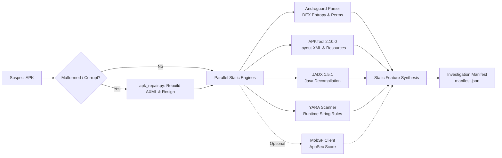

# SUDARSHAN — Static Analysis Pipeline

> **Classification:** AUTHORITATIVE  
> **Source Modules:** `shared/sudarshan_core/analyzers/apk_analyzer.py`, `apktool_engine.py`, `jadx_engine.py`, `apk_repair.py`, `yara_scanner.py`  
> **Last Verified:** 2026-09-25  

---

## 1. Overview

The static analysis pipeline inspects Android packages without execution. It deconstructs Android binary XML, DEX bytecode, resources, and digital certificates to uncover indicators of malicious intent, credential theft capabilities, and institutional targeting.

---

## 2. Core Decompilation & Extraction Engines

### 2.1 Native Androguard Bytecode Parser
- **File:** `shared/sudarshan_core/analyzers/apk_analyzer.py`
- Operates directly on ZIP bytecode structures, reading `AndroidManifest.xml` and `classes.dex` without unpacking everything onto disk.
- **Key Metrics Extracted:**
  - Package name and application label.
  - All declared permissions and dangerous permissions subset.
  - Exported and protected Android components: Activities, Services, Broadcast Receivers, Content Providers.
  - Reflection usage (`java.lang.reflect.Method.invoke`).
  - Concealed payload indicators: nested APKs in `assets/`, high-entropy DEX files.
  - Hardcoded URL and raw IP addresses.

### 2.2 Corrupted APK & AXML Recovery (`apk_repair.py`)
- Trojan authors intentionally corrupt AXML string pool headers or inject invalid resource IDs to crash analysis tools while allowing Android's lenient OS parser to install them.
- `apk_repair.py` detects malformed chunk lengths, repairs header tables, reconstructs valid AXML byte streams, and re-signs the package for decompiler compatibility.

### 2.3 APKTool 2.10.0 Resource Decompilation
- Disassembles binary Android resources into cleartext XML (`res/layout/*.xml`, `res/values/strings.xml`).
- Provides the layout AST structures directly utilized by VIDE for visual clone detection.

### 2.4 JADX 1.5.1 Java Decompiler
- Converts DEX bytecode back to high-level Java source code.
- Scans for known fraud patterns: overlay generation classes, accessibility service keyloggers, and SMS broadcast interceptors.

### 2.5 YARA String Scanner (`yara_scanner.py`)
- Employs 8 targeted YARA rules defined in `shared/sudarshan_core/engines/yara_rules/`:
  - `apk_dropper_packaging.yar`: Detects encrypted payload loaders and secondary stagers.
  - `banking_trojan_behaviour.yar`: Identifies known C2 command strings, overlay injection routines, and ATS script signatures.
