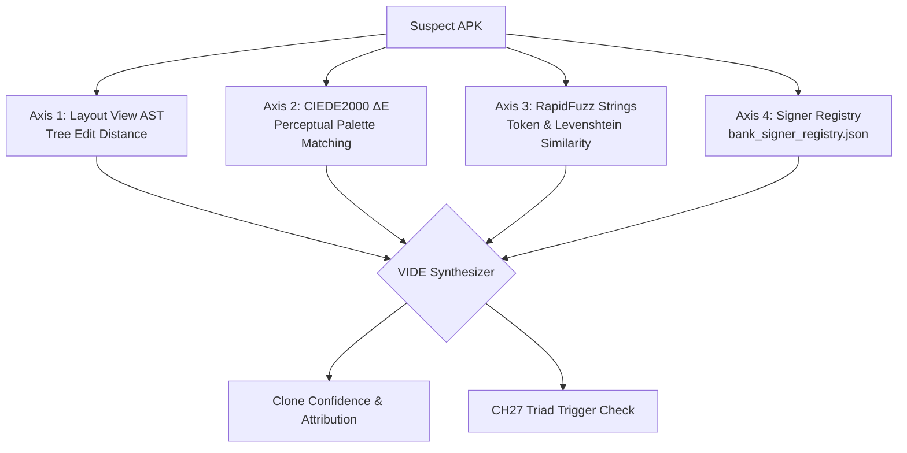

# SUDARSHAN — Visual Impersonation Detection Engine (VIDE)

> **Classification:** AUTHORITATIVE  
> **Source Modules:** `shared/sudarshan_core/engines/vide/`  
> **Last Verified:** 2026-09-25  

---

## 1. The Impersonation Problem

Targeted banking trojans copy the visual identity of official banking applications. An APK claiming to be "SBI YONO" or "HDFC Mobile Banking" may look identical to the victim, but carries a different developer certificate and steals credentials.

VIDE provides a mathematically rigorous, multi-modal clone detection engine.

---

## 2. The 4 VIDE Detection Axes

### Axis 1: Layout View AST Comparison (`view_ast.py`, `compare.py`)
- Unpacks decompiled XML layout hierarchies into Abstract Syntax Trees.
- Measures tree edit distance against canonical layouts in the Banking Baseline Corpus.
- Threshold: `>= 0.20` similarity flags potential structural layout cloning.

### Axis 2: CIEDE2000 Color Palette Matching (`color_match.py`)
- Analyzes color swatches extracted from drawables, theme colors, and layout backgrounds.
- Uses the standard **CIEDE2000** $\Delta E$ perceptual color distance formula to determine if an app accurately mimics official brand colors.

### Axis 3: Fuzzy Text Matching (`fuzzy.py`)
- Employs token-sort and partial-ratio string matching algorithms (via RapidFuzz with pure-Python fallback).
- Threshold: `>= 82.0` string similarity on app labels, login hints, and dialog titles.

### Axis 4: Digital Signer Registry (`signer_registry.py`)
- Compares developer signing certificate SHA-256 fingerprints against the official Play Store signing certificates registered in `bank_signer_registry.json`.
- Covers 10 Indian banking baseline profiles (`BASE-01-SBI` through `BASE-10-UNION`).
- **Fail-Closed Doctrine:** If an APK claims a protected package name but its certificate fingerprint does not match the registry, it is classified as an impersonation attack.

---

## 3. The CH27 On-Device Fraud Triad

When an APK exhibits:
1. **High Visual Clone Confidence** ($> 0.85$) against a protected banking app, AND
2. **Developer Certificate Mismatch** against the official signing registry, AND
3. **Accessibility Abuse** (`has_accessibility_abuse == True`),

The Deterministic Risk Engine immediately escalates the sample to **$	ext{FRS} \ge 95$ (`Critical`)**.
