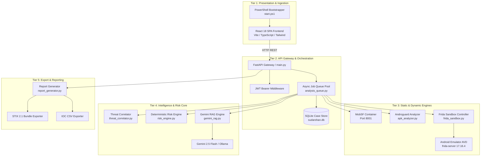
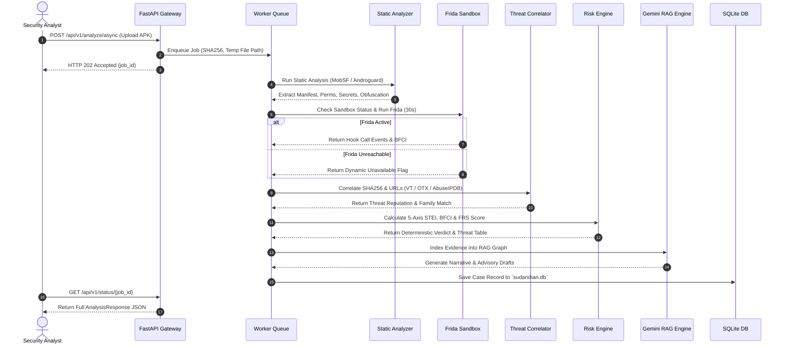

# 02 — System Overview & Platform Architecture

## Purpose

This document provides a comprehensive system-level architectural overview of the **SUDARSHAN** platform. It details the end-to-end processing pipeline, component interaction models, technology stack, microservices orchestration, data persistence models, and security governance frameworks required for enterprise banking deployment.

---

## Responsibilities

The primary responsibilities of this document are to:
1. **Define the Microservices Architecture**: Specify the operational roles of the API Gateway, MobSF static engine, Frida sandbox controller, Risk Engine, Gemini RAG, and React SPA frontend.
2. **Detail the Processing Pipeline**: Document the multi-stage analysis workflow from raw APK ingestion to intelligence export.
3. **Specify the Technology Stack**: Formally record all language runtimes, frameworks, libraries, database systems, and container configurations.
4. **Document Governance & Feasibility**: Explain data sovereignty, air-gapped deployment capability, determinism invariants, and auditability.

---

## High-Level Overview

Sudarshan is designed as a modular, decoupled platform capable of operating in both fully air-gapped corporate data centers and cloud environments. It ingests Android Package Kit (`.apk`) binaries and orchestrates static code analysis, dynamic runtime instrumentation, threat intelligence correlation, deterministic risk scoring, and evidence-constrained generative AI narrative synthesis.

```text
+-----------------------------------------------------------------------------------+
|                                 SUDARSHAN SYSTEM                                  |
|                                                                                   |
|  +--------------------+    +---------------------+    +------------------------+  |
|  |  React 18 SPA      |    |  FastAPI Gateway    |    |  Async Worker Queue    |  |
|  |  Analyst Dashboard |===>|  (Port 8000)        |===>|  (analysis_queue.py)   |  |
|  |  (Port 5173)       |    |  JWT Auth & Router  |    |  Job Dispatcher        |  |
|  +--------------------+    +---------------------+    +-----------+------------+  |
|                                                                   |               |
|            +-------------------+--------------------+-------------+               |
|            |                   |                    |                             |
|            v                   v                    v                             |
|  +------------------+  +---------------+  +-------------------+                   |
|  | Static Analysis  |  | Dynamic Engine|  | Threat Correlator |                   |
|  | MobSF (Port 8001)|  | Frida / ADB   |  | VT / OTX /        |                   |
|  | / Androguard     |  | (TCP 5555)    |  | AbuseIPDB API     |                   |
|  +--------+---------+  +-------+-------+  +---------+---------+                   |
|           |                    |                    |                             |
|           +--------------------+--------------------+                             |
|                                |                                                  |
|                                v                                                  |
|                    +-----------------------+                                      |
|                    | Deterministic Risk    |                                      |
|                    | Engine (5-Axis STEI)  |                                      |
|                    +-----------+-----------+                                      |
|                                |                                                  |
|                                v                                                  |
|                    +-----------------------+                                      |
|                    | Gemini 2.5 RAG Index  |                                      |
|                    | / Ollama Local LLM    |                                      |
|                    +-----------+-----------+                                      |
|                                |                                                  |
|                                v                                                  |
|                    +-----------------------+                                      |
|                    | SQLite Store          |                                      |
|                    | (sudarshan.db)        |                                      |
|                    +-----------------------+                                      |
+-----------------------------------------------------------------------------------+
```

---

## Architecture

The system consists of five primary execution tiers operating over isolated Docker networks and internal async channels:



---

## Components

The architecture breaks down into discrete operational modules:

| Subsystem | Primary Python / TS Modules | Responsibilities & External Dependencies |
| :--- | :--- | :--- |
| **API Gateway** | `backend/app/main.py`<br/>`backend/app/routes/upload.py` | Route handling, CORS middleware, JWT authentication, async job queueing (`analysis_queue.py`). Dependencies: `FastAPI`, `Uvicorn`, `Pydantic`. |
| **Database Access** | `backend/app/db/database.py` | Asynchronous SQLite database management via `aiosqlite` and `databases`. Initializes tables `cases`, `users`, `audit_logs`, and `iocs`. |
| **Authentication** | `backend/app/auth/auth.py` | Seeded admin account generation, password hashing using `bcrypt`, JWT token encoding/decoding using `python-jose`. |
| **Static Engine** | `backend/app/services/mobsf_client.py`<br/>`backend/app/analyzers/apk_analyzer.py` | MobSF API client (`httpx`) and Androguard fallback analyzer. Extracts permissions, components, hardcoded URLs, and DEX flags. |
| **Dynamic Engine** | `backend/app/engines/frida_sandbox.py`<br/>`backend/app/engines/agentic_explorer.py` | ADB controller over TCP (`host.docker.internal:5555`), Frida 17 script runner (`banking_trojan.bundle.js`), 15-stage fraud goal DAG explorer. |
| **Risk Engine** | `backend/app/engines/risk_engine.py` | Computes 5-axis $STEI$, $BFCI$, $FRS$, severity band, and generates the Threat Scenario Table. |
| **Threat Correlator** | `backend/app/services/threat_correlator.py`<br/>`backend/app/engines/classification_engine.py` | Queries VirusTotal, AlienVault OTX, and AbuseIPDB. Rule-based family classifier for *Drinik*, *Xenomorph*, *Cerberus*, *Anubis*, etc. |
| **RAG Intelligence** | `backend/app/ai/gemini_rag.py`<br/>`backend/app/ai/ollama_client.py` | In-memory RAG evidence graph builder per SHA256. Gemini 2.5 Flash API client and local Ollama (`qwen3:8b`) client. |
| **Reporting & Export**| `backend/app/routes/report.py`<br/>`backend/app/engines/report_generator.py` | Jinja2 HTML report generator, STIX 2.1 JSON exporter (`stix2` library), CSV IOC exporter. |
| **Frontend Application**| `frontend/src/App.tsx`<br/>`frontend/src/pages/*` | React 18 SPA with Vite 5, Tailwind CSS, Lucide icons, React Router v6. |

---

## Workflow

The complete analysis pipeline executes in a strict multi-stage order:



---

## Data Flow

Data transformation across system boundaries follows a structured pipeline:

```text
[ Incoming APK File ]
          │
          ▼
[ SHA256 Hashing & Storage ] ──► Temp File System (/tmp)
          │
          ├─────────────────────────────────────────┐
          ▼                                         ▼
[ Static Extraction ]                    [ Dynamic Execution ]
- Manifest & Permissions                 - ADB Install & Launch
- Component Analysis                     - Frida Hook Attachment
- String Entropy & Secrets               - API Event Capture
          │                                         │
          └────────────────────┬────────────────────┘
                               │
                               ▼
                   [ Threat Correlation ]
                   - VirusTotal Hash Lookup
                   - AlienVault OTX Pulses
                   - AbuseIPDB Reputation
                               │
                               ▼
                   [ Deterministic Risk Engine ]
                   - STEI Calculation (5 Axes)
                   - BFCI Calculation
                   - FRS Formula Execution
                               │
                               ▼
                   [ Gemini RAG Evidence Index ]
                   - Evidence Chunk Indexing
                   - Prompt Sanitization
                   - LLM Streaming Synthesis
                               │
                               ▼
                   [ SQLite Case Store & Dashboard ]
```

---

## Algorithms

System overview documents the main deterministic risk formula executed by `backend/app/engines/risk_engine.py`:

```text
                        +----------------------------------+
                        |  Fraud Risk Score (FRS) Formula  |
                        +----------------------------------+
                                         |
     +-------------------+---------------+-------------------+-------------------+
     | (Weight 0.25)     | (Weight 0.35)                     | (Weight 0.20)     | (Weight 0.20)
     v                   v                                   v                   v
+----------+      +--------------+                   +---------------+   +----------------+
|  STEI    |      | Dynamic BFCI |                   |  Correlation  |   | Banking Impact |
| Score    |      | Score        |                   |  Score        |   | Score          |
+----------+      +--------------+                   +---------------+   +----------------+
     |                   |                                   |                   |
  5-Axis              6-Component                         VT / OTX /         Targeting &
  Formula             Frida Formula                       AbuseIPDB Ratio    Family Severity
```

1. **Full FRS Score**:
   $$FRS = 0.25 \cdot STEI + 0.35 \cdot Dynamic + 0.20 \cdot Correlation + 0.20 \cdot BankingImpact$$
2. **Static Fallback Score**:
   $$FRS = 0.50 \cdot STEI + 0.25 \cdot Correlation + 0.25 \cdot BankingImpact$$

---

## Integration

The platform provides multiple integration points for enterprise banking deployment:

```text
+--------------------------------------------------------------------------------+
|                        SUDARSHAN ENTERPRISE INTEGRATION                        |
|                                                                                |
|  +--------------------+         +-------------------+        +---------------+ |
|  | React Dashboard    |         | REST API Clients  |        | SIEM / SOAR   | |
|  | Port 5173          |         | (cURL / Python)   |        | Connectors    | |
|  +---------+----------+         +---------+---------+        +-------+-------+ |
|            |                              |                          |         |
|            | HTTP / REST                  | HTTP REST                | STIX 2.1|
|            v                              v                          v         |
|  +---------------------------------------------------------------------------+ |
|  |                      FASTAPI API GATEWAY (Port 8000)                      | |
|  +---------------------------------------------------------------------------+ |
+--------------------------------------------------------------------------------+
```

---

## Folder Structure

Primary backend and frontend code locations:

```text
backend/
├── app/
│   ├── ai/                 <- RAG & LLM Integration (gemini_rag.py, ollama_client.py)
│   ├── analyzers/          <- Androguard Fallback (apk_analyzer.py)
│   ├── auth/               <- Authentication & User Auth (auth.py)
│   ├── db/                 <- SQLite Persistence (database.py)
│   ├── engines/            <- Core Risk & Dynamic Engines (risk_engine.py, frida_sandbox.py)
│   ├── models/             <- Domain Schemas (schemas.py)
│   ├── routes/             <- Endpoint Controllers (upload.py, report.py, cases.py)
│   ├── services/           <- MobSF & Threat Correlator (mobsf_client.py, threat_correlator.py)
│   └── workers/            <- Asynchronous Queue Pool (analysis_queue.py)
├── main.py                 <- Application Entrypoint
├── requirements.txt        <- Python Dependencies
└── Dockerfile              <- Backend Docker Environment Definition

frontend/
├── src/
│   ├── pages/              <- Dashboard Views (FraudCard, TechnicalView, ThreatIntelView)
│   ├── utils/              <- Utility Functions (derive.ts)
│   └── App.tsx             <- React Root & Routing
├── package.json            <- Frontend Dependencies
└── vite.config.ts          <- Vite Server Configuration
```

---

## API Reference

Core system endpoints exposed by FastAPI:

| Path | Method | Auth Required | Description |
| :--- | :--- | :--- | :--- |
| `/` | `GET` | No | Root health check & system metadata response. |
| `/health` | `GET` | No | Lightweight liveness probe (`{"status": "ok"}`). |
| `/api/v1/auth/login` | `POST` | No | Form login endpoint returning JWT Access Token. |
| `/api/v1/analyze` | `POST` | Yes | Synchronous analysis pipeline upload. |
| `/api/v1/analyze/async` | `POST` | Yes | Asynchronous analysis upload returning `job_id`. |
| `/api/v1/status/{job_id}` | `GET` | Yes | Poll job status (`queued`, `running`, `done`, `failed`). |
| `/api/v1/sandbox/status` | `GET` | No | Query Frida dynamic sandbox readiness status. |
| `/api/v1/cases` | `GET` | Yes | List historical case records from SQLite database. |

---

## Configuration

Core environment variables declared in `docker-compose.yml` and `.env`:

```env
# Server Port & Auth
PORT=8000
JWT_SECRET=sudarshan_jwt_secret_key_change_in_production_2024
ADMIN_USERNAME=admin
ADMIN_PASSWORD=sudarshan_admin_2024

# Third-Party Microservices
MOBSF_HOST=http://mobsf:8000
MOBSF_API_KEY=mobsf_api_key_secret_here

# Frida & Emulator Settings
ADB_HOST=host.docker.internal
ADB_PORT=5555
FRIDA_ANALYSIS_DURATION=30

# Intelligence & LLM Configuration
GEMINI_API_KEY=your_gemini_api_key_here
GEMINI_MODEL=gemini-2.5-flash
OLLAMA_HOST=http://localhost:11434
```

---

## Error Handling

1. **Authentication Failures**: Missing or expired JWT tokens return HTTP `401 Unauthorized` (`Could not validate credentials`).
2. **Database Initialization**: SQLite database initialization occurs automatically during startup (`init_db()`), logging success or throwing runtime errors if write permissions fail.
3. **Third-Party API Timeouts**: External threat intelligence calls (VirusTotal, AlienVault OTX, AbuseIPDB) catch timeout exceptions independently, logging warnings and returning `available: False` without breaking analysis execution.

---

## Current Implementation Status

| System Component | Status | Operational Details |
| :--- | :--- | :--- |
| **FastAPI Gateway & Router** | **Implemented** | Functional REST API with CORS, JWT middleware, and async upload routers. |
| **SQLite Case Store** | **Implemented** | Asynchronous persistent storage implemented in `backend/app/db/database.py`. |
| **Async Queue Pool** | **Implemented** | In-memory asyncio queue worker pool running in background tasks. |
| **Static Analysis Engine** | **Implemented** | MobSF API client with Androguard fallback active in production pipeline. |
| **Dynamic Frida Engine** | **Partial** | Frida hooks attach but 0 events fire due to Frida 17 / ART inlining on AVD; BFCI computes 0.0. |
| **Deterministic Risk Engine** | **Implemented** | 5-Axis STEI, BFCI, and FRS formulas implemented and verified by unit tests. |
| **AI RAG Investigation Assistant**| **Implemented** | Gemini 2.5 Flash RAG graph active with streaming SSE response support. |

---

## Current Limitations

1. **Single-Worker In-Memory Queue**: The job queue operates within the FastAPI process memory space (`analysis_queue.py`), preventing multi-node distributed queue processing.
2. **Dynamic Instrumentation Silence**: Frida 17 hook installation produces no events on the x86_64 16KB page-size AVD image (`google_apis_ps16k`).

---

## Future Improvements

1. **Celery / Redis Distributed Task Queue**: Replace `analysis_queue.py` with Celery workers for multi-container parallel APK processing.
2. **PostgreSQL Migration**: Upgrade backend database driver from SQLite (`sudarshan.db`) to PostgreSQL for high-concurrency enterprise deployments.
