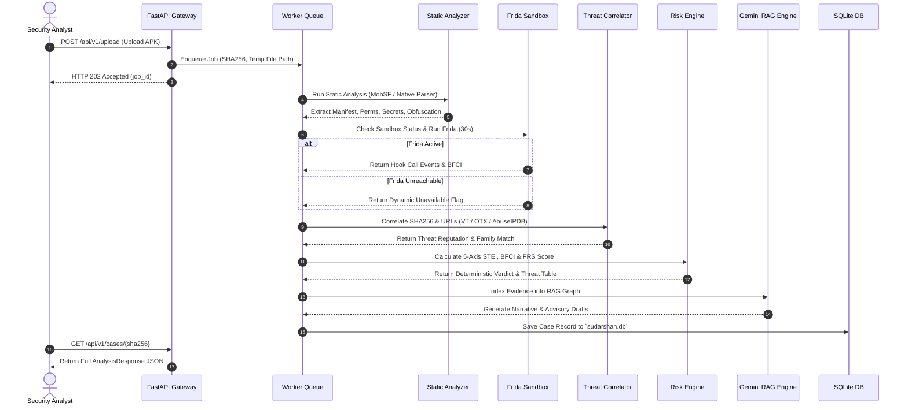

# 02 — System Overview & Platform Architecture

## Purpose

This document provides a comprehensive system-level architectural overview of the **SUDARSHAN** platform. It details the end-to-end processing pipeline, component interaction models, technology stack, microservices orchestration, data persistence models, and security governance frameworks required for enterprise banking deployment.

---

## Responsibilities

The primary responsibilities of this document are to:
1. **Define the Microservices Architecture**: Specify the operational roles of the API Gateway, MobSF static engine, Frida sandbox controller, Risk Engine, Gemini RAG, and React SPA frontend.
2. **Detail the Processing Pipeline**: Document the multi-stage analysis workflow from raw APK ingestion to intelligence export.
3. **Specify the Technology Stack**: Formally record all language runtimes, frameworks, libraries, database systems, and container configurations.
4. **Document Governance & Feasibility**: Explain data sovereignty, air-gapped deployment capability, determinism invariants, and auditability.

---

## High-Level Overview

Sudarshan is designed as a modular, decoupled platform operating across 5 containerized microservices. It ingests Android Package Kit (`.apk`) binaries and orchestrates static code analysis, dynamic runtime instrumentation, threat intelligence correlation, deterministic risk scoring, and evidence-constrained generative AI narrative synthesis.

```text
+-----------------------------------------------------------------------------------+
|                                 SUDARSHAN SYSTEM                                  |
|                                                                                   |
|  +--------------------+    +---------------------+    +------------------------+  |
|  |  React 18 SPA      |    |  FastAPI Gateway    |    |  Analysis Engine       |  |
|  |  Analyst Dashboard |===>|  (Port 8000)        |===>|  Microservice          |  |
|  |  (Port 5173)       |    |  JWT Auth & Router  |    |  (Port 8001)           |  |
|  +--------------------+    +---------------------+    +-----------+------------+  |
|                                                                   |               |
|            +-------------------+--------------------+-------------+               |
|            |                   |                    |                             |
|            v                   v                    v                             |
|  +------------------+  +---------------+  +-------------------+                   |
|  | Static Analysis  |  | Dynamic Engine|  | Threat Correlator |                   |
|  | MobSF (Port 8008)|  | Frida / ADB   |  | VT / OTX /        |                   |
|  | / Native Parser  |  | (TCP 5555)    |  | AbuseIPDB API     |                   |
|  +--------+---------+  +-------+-------+  +---------+---------+                   |
|           |                    |                    |                             |
|           +--------------------+--------------------+                             |
|                                |                                                  |
|                                v                                                  |
|                    +-----------------------+                                      |
|                    | Deterministic Risk    |                                      |
|                    | Engine (5-Axis STEI)  |                                      |
|                    +-----------+-----------+                                      |
|                                |                                                  |
|                                v                                                  |
|                    +-----------------------+                                      |
|                    | Gemini 2.5 RAG Index  |                                      |
|                    | / Ollama Local LLM    |                                      |
|                    +-----------+-----------+                                      |
|                                |                                                  |
|                                v                                                  |
|                    +-----------------------+                                      |
|                    | SQLite Store          |                                      |
|                    | (sudarshan.db)        |                                      |
|                    +-----------------------+                                      |
+-----------------------------------------------------------------------------------+
```

---

## Architecture

The system consists of five primary execution tiers operating over isolated Docker networks and internal async channels:

```mermaid
graph TB
    subgraph Tier 1: Presentation & Ingestion
        FE[React 18 SPA Frontend<br/>Vite / TypeScript / Port 5173]
        CLI[PowerShell Bootstrapper<br/>start.ps1]
    end

    subgraph Tier 2: API Gateway & Orchestration
        GW[FastAPI Gateway / backend/app/main.py]
        AUTH[JWT Bearer Middleware]
        Q[Async Job Queue Pool<br/>backend/app/workers/analysis_queue.py]
        DB[(SQLite Case Store<br/>sudarshan.db)]
        VOL[("Shared Volume /app/uploads")]
    end

    subgraph Tier 3: Containerized Analysis Microservice (Port 8001)
        ENG[Analysis Engine Microservice<br/>analysis-engine/app/main.py]
        MS[MobSF Container<br/>Port 8008]
        AG[Native APK Analyzer<br/>shared/sudarshan_core/analyzers/apk_analyzer.py]
        FS[Frida Sandbox Controller<br/>shared/sudarshan_core/engines/frida_sandbox.py]
        AVD[Android Emulator AVD<br/>frida-server 17.16.4]
    end

    subgraph Tier 4: Intelligence & Risk Core
        TC[Threat Correlator<br/>shared/sudarshan_core/services/threat_correlator.py]
        RE[Deterministic Risk Engine<br/>shared/sudarshan_core/engines/risk_engine.py]
        RAG[Gemini RAG Engine<br/>backend/app/ai/gemini_rag.py]
        LLM[Gemini 2.5 Flash / Ollama]
    end

    subgraph Tier 5: Export & Reporting
        REP[Report Generator<br/>shared/sudarshan_core/engines/report_generator.py]
        STIX[STIX 2.1 Bundle Exporter]
        CSV[IOC CSV Exporter]
    end

    FE -->|HTTP REST| GW
    CLI --> FE
    GW --> AUTH
    GW --> Q
    GW --- VOL
    Q --> DB
    GW -->|REST / Shared Vol| ENG
    ENG --- VOL

    ENG --> MS
    ENG --> AG
    ENG --> FS
    FS --> AVD

    ENG --> TC
    ENG --> RE
    RE --> RAG
    RAG --> LLM

    GW --> REP
    REP --> STIX
    REP --> CSV
```

---

## Components

The architecture breaks down into discrete operational modules:

| Subsystem | Primary Python / TS Modules | Responsibilities & External Dependencies |
| :--- | :--- | :--- |
| **API Gateway & Telemetry** | [`backend/app/main.py`](file:///d:/Projects/Sudarshan%20BOI/backend/app/main.py)<br/>[`backend/app/routes/upload.py`](file:///d:/Projects/Sudarshan%20BOI/backend/app/routes/upload.py)<br/>[`backend/app/routes/runtime_api.py`](file:///d:/Projects/Sudarshan%20BOI/backend/app/routes/runtime_api.py) | Route handling, CORS middleware, JWT authentication, async job queueing (`analysis_queue.py`), analysis-engine delegation, and live runtime telemetry streaming (`/api/runtime/*`). |
| **Analysis Microservice** | [`analysis-engine/app/main.py`](file:///d:/Projects/Sudarshan%20BOI/analysis-engine/app/main.py) | Microservice executing native APK analysis, MobSF client calls, APKTool, JADX, Frida PID attach, and mitmproxy HAR parsing. |
| **Database Access** | [`backend/app/db/database.py`](file:///d:/Projects/Sudarshan%20BOI/backend/app/db/database.py) | Asynchronous SQLite database management via `aiosqlite` and `SQLAlchemy`. Persists cases, users, audit logs, and IOCs. |
| **Authentication** | [`backend/app/auth/auth.py`](file:///d:/Projects/Sudarshan%20BOI/backend/app/auth/auth.py) | Seeded admin account generation, password hashing using `bcrypt`, JWT token encoding/decoding using `python-jose`. |
| **Static Engine** | [`shared/sudarshan_core/services/mobsf_client.py`](file:///d:/Projects/Sudarshan%20BOI/shared/sudarshan_core/services/mobsf_client.py)<br/>[`shared/sudarshan_core/analyzers/apk_analyzer.py`](file:///d:/Projects/Sudarshan%20BOI/shared/sudarshan_core/analyzers/apk_analyzer.py) | MobSF API client on Port 8008 and native APK analyzer fallback. Extracts permissions, components, hardcoded URLs, and DEX flags. |
| **Dynamic Engine** | [`shared/sudarshan_core/engines/frida_sandbox.py`](file:///d:/Projects/Sudarshan%20BOI/shared/sudarshan_core/engines/frida_sandbox.py)<br/>[`shared/sudarshan_core/engines/agentic_explorer.py`](file:///d:/Projects/Sudarshan%20BOI/shared/sudarshan_core/engines/agentic_explorer.py) | ADB controller over TCP (`host.docker.internal:5555`), Frida 17 script runner (`banking_trojan.bundle.js`), 15-stage fraud goal DAG explorer. |
| **Risk Engine** | [`shared/sudarshan_core/engines/risk_engine.py`](file:///d:/Projects/Sudarshan%20BOI/shared/sudarshan_core/engines/risk_engine.py) | Computes 5-axis $STEI$, $BFCI$, $FRS$, severity band, and generates the Threat Scenario Table. |
| **Threat Correlator** | [`shared/sudarshan_core/services/threat_correlator.py`](file:///d:/Projects/Sudarshan%20BOI/shared/sudarshan_core/services/threat_correlator.py)<br/>[`shared/sudarshan_core/engines/classification_engine.py`](file:///d:/Projects/Sudarshan%20BOI/shared/sudarshan_core/engines/classification_engine.py) | Queries VirusTotal, AlienVault OTX, and AbuseIPDB. Rule-based family classifier for *Drinik*, *Xenomorph*, *Cerberus*, *Anubis*, etc. |
| **RAG Intelligence** | [`backend/app/ai/gemini_rag.py`](file:///d:/Projects/Sudarshan%20BOI/backend/app/ai/gemini_rag.py)<br/>[`backend/app/ai/gemini_client.py`](file:///d:/Projects/Sudarshan%20BOI/backend/app/ai/gemini_client.py) | In-memory RAG evidence index builder per SHA256. Gemini 2.5 Flash API client and local Ollama client. |
| **Reporting & Export**| [`backend/app/routes/report.py`](file:///d:/Projects/Sudarshan%20BOI/backend/app/routes/report.py)<br/>[`shared/sudarshan_core/engines/report_generator.py`](file:///d:/Projects/Sudarshan%20BOI/shared/sudarshan_core/engines/report_generator.py) | Jinja2 HTML report generator, STIX 2.1 JSON exporter (`stix2` library), CSV IOC exporter. |
| **Frontend Application**| [`frontend/src/App.tsx`](file:///d:/Projects/Sudarshan%20BOI/frontend/src/App.tsx)<br/>[`frontend/src/pages/*`](file:///d:/Projects/Sudarshan%20BOI/frontend/src/pages/) | React 18 SPA with Vite 5, Tailwind CSS, Lucide icons, React Router v6. |

---

## Workflow

The complete analysis pipeline executes in a strict multi-stage order:



---

## Algorithms

System overview documents the main deterministic risk formula executed by [`risk_engine.py`](file:///d:/Projects/Sudarshan%20BOI/shared/sudarshan_core/engines/risk_engine.py):

```text
                        +----------------------------------+
                        |  Fraud Risk Score (FRS) Formula  |
                        +----------------------------------+
                                         |
     +-------------------+---------------+-------------------+-------------------+
     | (Weight 0.40)     | (Weight 0.30)                     | (Weight 0.15)     | (Weight 0.15)
     v                   v                                   v                   v
+----------+      +--------------+                   +---------------+   +----------------+
|  STEI    |      | Dynamic BFCI |                   |  Correlation  |   | Banking Impact |
| Score    |      | Score        |                   |  Score        |   | Score          |
+----------+      +--------------+                   +---------------+   +----------------+
     |                   |                                   |                   |
  5-Axis              6-Component                         VT / OTX /         Targeting &
  Formula             Frida Formula                       AbuseIPDB Ratio    Family Severity
```

1. **Full FRS Score**:
   $$FRS = \text{clamp}(0.40 \cdot STEI + 0.30 \cdot Dynamic + 0.15 \cdot Correlation + 0.15 \cdot BankingImpact, 0.0, 100.0)$$
2. **Static Fallback Score**:
   $$FRS = \text{clamp}(0.50 \cdot STEI + 0.25 \cdot Correlation + 0.25 \cdot BankingImpact, 0.0, 100.0)$$

---

## Current Implementation Status

| System Component | Status | Operational Details |
| :--- | :--- | :--- |
| **FastAPI Gateway & Router** | **Implemented** | Functional REST API with CORS, JWT middleware, and async upload routers. |
| **SQLite Case Store** | **Implemented** | Asynchronous persistent storage implemented in `backend/app/db/database.py`. |
| **Async Queue Pool** | **Implemented** | In-memory asyncio queue worker pool running in background tasks. |
| **Static Analysis Engine** | **Implemented** | MobSF API client with native `apk_analyzer.py` fallback active in production pipeline. |
| **Dynamic Frida Engine** | **Implemented** | Frida sandbox attaching via SELinux preflight (`adb root` + `setenforce 0`), Java bridge sub-probes, and ART deoptimization (`Java.deoptimizeEverything()`). Verified via **421 / 421 passing unit & integration tests**. |
| **Deterministic Risk Engine** | **Implemented** | 5-Axis STEI, BFCI, and FRS formulas implemented and verified by unit tests. |
| **AI RAG Investigation Assistant**| **Implemented** | Gemini 2.5 Flash RAG graph active with streaming SSE response support. |
