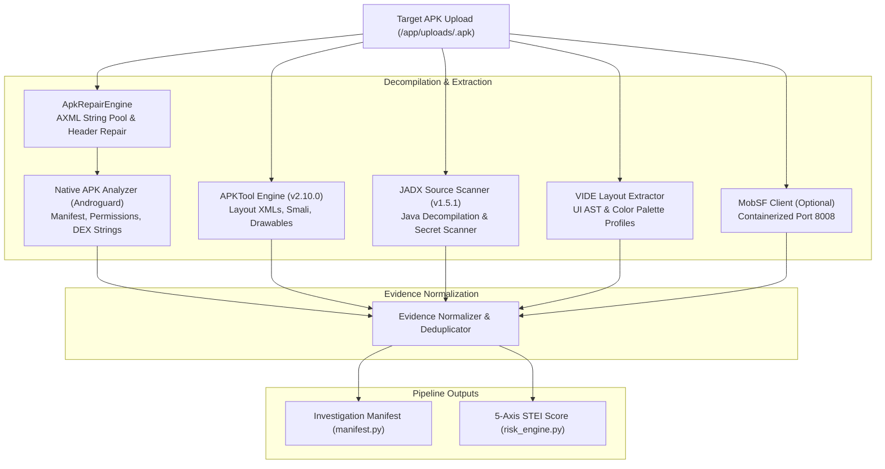

# 03 — Static Threat Intelligence & Decompilation Specification

> **Authoritative Technical Specification**  
> **Source Repository**: `SanTiwari07/Sudarshan`  
> **Last Verified Against Active Codebase**: 2026-08-25  

```yaml
Module Title:        Static Threat Intelligence & Decompilation Engine
Version:             2.1.0
Primary Files:       analysis-engine/app/main.py
                     shared/sudarshan_core/analyzers/apk_analyzer.py
                     shared/sudarshan_core/engines/apk_repair.py
                     shared/sudarshan_core/engines/apktool_engine.py
                     shared/sudarshan_core/engines/jadx_engine.py
                     shared/sudarshan_core/engines/vide/pipeline.py
                     shared/sudarshan_core/models/manifest.py
                     shared/sudarshan_core/services/mobsf_client.py
                     backend/app/routes/upload.py
Test Suite:          backend/tests/test_analysis_client.py, backend/tests/test_manifest_repair.py, backend/tests/test_remaining_features.py, tests/unit/test_labelled_corpus.py
```

---

## 1. Executive Overview

The **Static Threat Intelligence Engine** performs multi-layered pre-execution binary analysis on uploaded Android APKs. Rather than relying on a single tool, SUDARSHAN deploys a layered defense-in-depth static extraction pipeline:
1. **Native APK Analyzer ([`apk_analyzer.py`](../../shared/sudarshan_core/analyzers/apk_analyzer.py))**: Native Python DEX/AXML bytecode parsing via `androguard`.
2. **APK Corruption Repair ([`apk_repair.py`](../../shared/sudarshan_core/engines/apk_repair.py))**: Automated reconstruction of obfuscated/corrupted `AndroidManifest.xml` files.
3. **APKTool Engine ([`apktool_engine.py`](../../shared/sudarshan_core/engines/apktool_engine.py))**: Decompiles binary XMLs, smali, layout hierarchies, and string tables.
4. **JADX Engine ([`jadx_engine.py`](../../shared/sudarshan_core/engines/jadx_engine.py))**: Decompiles DEX bytecode to Java source code and scans for 10 fraud signatures.
5. **VIDE Static Profile ([`shared/sudarshan_core/engines/vide/`](../../shared/sudarshan_core/engines/vide/))**: Extracts UI layout ASTs and brand colors to detect visual impersonation of protected Indian banks.
6. **Optional MobSF Client ([`mobsf_client.py`](../../shared/sudarshan_core/services/mobsf_client.py))**: Provides supplementary AppSec vulnerability ratings when available.

Findings are normalized and compiled into an **Investigation Manifest** (`InvestigationManifest`), configuring the dynamic sandbox hooks and priority goals.

---

## 2. Multi-Engine Decompilation Pipeline



---

## 3. APK Corruption Repair (`apk_repair.py`)

Malware authors intentionally corrupt `AndroidManifest.xml` headers and string pool offsets to crash standard disassemblers while allowing Android's lenient `PackageParser` to install the app.

The `ApkRepairEngine`:
* **Validates AXML Magic**: Ensures the file header starts with `0x00080003`.
* **String Pool Offset Repair**: Fixes invalid offsets and malformed UTF-8/UTF-16 string table lengths.
* **Chunk Header Bounds**: Validates that XML chunk lengths do not exceed the actual file size.
* **Clean Fallback**: Reconstructs a valid AXML binary structure, allowing Androguard and APKTool to parse the manifest successfully.

---

## 4. APKTool & JADX Engines

### APKTool Engine (`apktool_engine.py`)
* Decompiles resources and raw binary XML files.
* Extracts layout hierarchies from `res/layout/` and text strings from `res/values/strings.xml`.
* Measures resource name entropy (detects obfuscation with single-character resource names like `a.xml`, `b.png`).
* Supplies decoded XML layouts to the VIDE engine.

### JADX Engine (`jadx_engine.py`)
Decompiles `.dex` bytecode into Java source code and scans for 10 banking fraud patterns:
1. `ACCESSIBILITY_SERVICE`: `extends AccessibilityService`
2. `DEVICE_ADMIN`: `extends DeviceAdminReceiver`
3. `SMS_RECEIVER`: `SmsManager.sendTextMessage` / `sendMultipartTextMessage`
4. `OVERLAY_WINDOW`: `WindowManager.LayoutParams.TYPE_APPLICATION_OVERLAY`
5. `DYNAMIC_CLASS_LOAD`: `DexClassLoader` / `InMemoryDexClassLoader`
6. `REFLECTION_INVOKE`: `Class.forName` / `getDeclaredMethod` / `invoke`
7. `BANKING_KEYWORD`: Targeting strings for Indian banks (`sbi`, `hdfc`, `icici`, `axis`, `kotak`, `boi`, `pnb`)
8. `OTP_HARVEST`: `SmsMessage.createFromPdu` / `getMessageBody`
9. `OVERLAY_DRAW`: `canDrawOverlays` / `WindowManager.addView`
10. `C2_SOCKET`: `new Socket(...)` / `SSLSocketFactory`

---

## 5. Investigation Manifest (`shared/sudarshan_core/models/manifest.py`)

The static analysis outputs are synthesized into the `InvestigationManifest` data contract:

```json
{
  "sha256": "e3b0c44298fc1c149afbf4c8996fb92427ae41e4649b934ca495991b7852b855",
  "package_name": "com.sbi.lotus.fake",
  "analysis_mode": "androguard",
  "stei_score": 78.5,
  "family_classification": "Drinik",
  "capability_flags": {
    "has_accessibility_abuse": true,
    "has_sms_read_write": true,
    "has_system_alert_window": true,
    "targets_indian_banks": true,
    "indian_bank_packages": ["com.sbi.lotus"],
    "has_concealed_payload": true
  },
  "hook_profiles": ["accessibility", "sms", "overlay", "banking", "network", "anti_analysis"],
  "goal_priority_config": {
    "accessibility_priority": 1,
    "sms_priority": 2,
    "overlay_priority": 3
  }
}
```

---

## 6. Static Threat Evaluation Index (STEI) Formula

The **STEI** score ($0.0 - 100.0$) is calculated in `shared/sudarshan_core/engines/risk_engine.py`:

$$\text{STEI} = 0.60 \times \text{CT} + 0.20 \times \text{BT} + 0.10 \times \text{PR} + 0.05 \times \text{OB} + 0.05 \times \text{IR}$$

| Axis | Weight | Indicators & Contributions |
| :--- | :--- | :--- |
| **Credential Theft ($\text{CT}$)** | **60%** | Accessibility abuse (+40), SMS read/intercept (+35), Overlay window (+25). Capped at 100. |
| **Banking Targeting ($\text{BT}$)** | **20%** | Matched Indian banking package names (base 20 + 10/pkg) or VIDE visual clone boost ($35 + 40 \times \text{conf}$). Capped at 100. |
| **Permission Risk ($\text{PR}$)** | **10%** | Dangerous permissions requested (`BIND_ACCESSIBILITY_SERVICE`: 20, `READ_SMS`: 18, `RECEIVE_SMS`: 18, `SYSTEM_ALERT_WINDOW`: 15, `REQUEST_INSTALL_PACKAGES`: 20, etc.). Capped at 100. |
| **Obfuscation ($\text{OB}$)** | **5%** | Dynamic DEX loading (+40), native libraries (+20), reflection (+25), string entropy (+15), concealed payload (+60). Capped at 100. |
| **Infrastructure Risk ($\text{IR}$)** | **5%** | Hardcoded C2 URLs and IPs (10 pts each). Capped at 100. |
