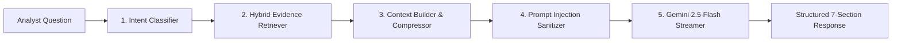

# SUDARSHAN — Evidence-Grounded Gemini RAG Engine

> **Classification:** AUTHORITATIVE  
> **Source Module:** `backend/app/ai/gemini_rag.py`  

---

## 1. 5-Stage RAG Pipeline

### Stage 1: Intent Classification
Identifies question category: `CAPABILITY_QUERY`, `TARGET_INSTITUTION`, `C2_INFRASTRUCTURE`, `CODE_EVIDENCE`, `RECOMMENDED_ACTION`.

### Stage 2: Hybrid Retrieval
Queries the in-memory **Investigation Graph** (`_investigation_index`) which indexes 22 forensic sections per analyzed APK.

### Stage 3: Context Compression
Extracts only relevant evidence chunks, bounding prompt token size.

### Stage 4: Input Sanitization
Sanitizes all text chunks against prompt injection attacks using `sanitize_block()`.

### Stage 5: Structured 7-Section Response
Gemini formats answers according to an immutable template:
1. Executive Verdict & FRS Reference
2. Confirmed Forensic Facts
3. Targeting Attribution
4. Technical Evidence Snippets
5. Operational Impact Assessment
6. Immediate Containment Playbook
7. Forensic Evidentiary Caveats
