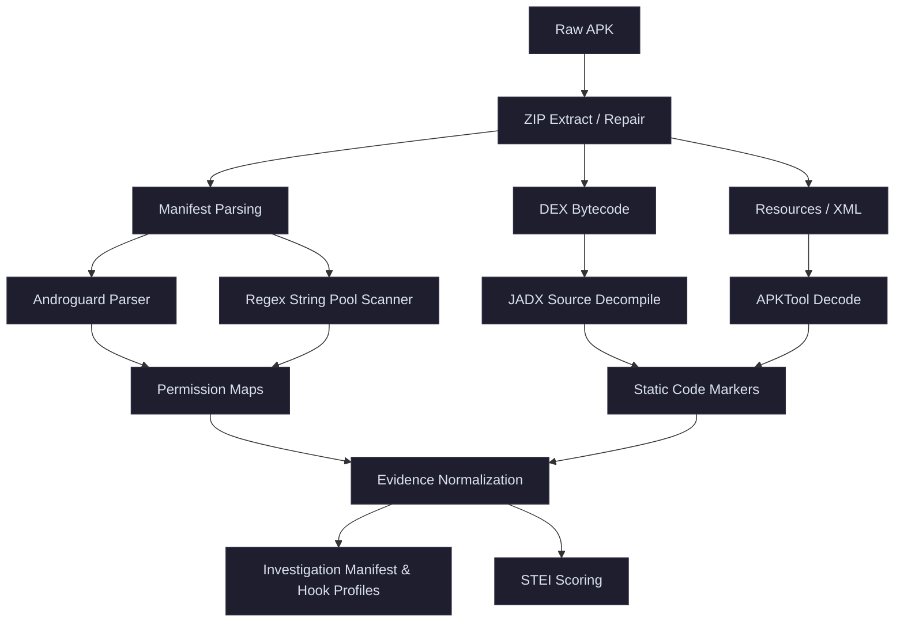
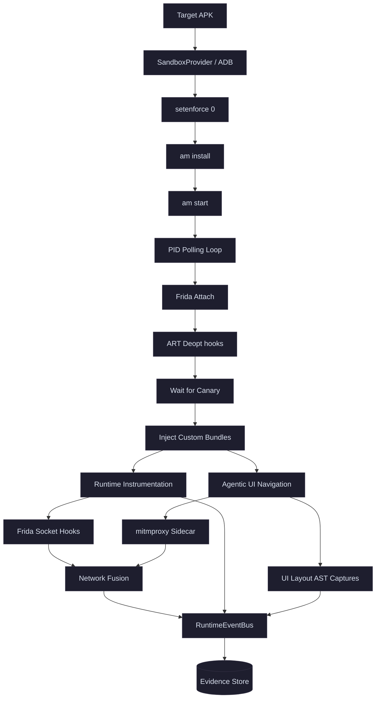
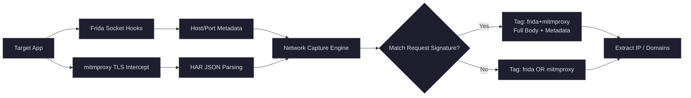
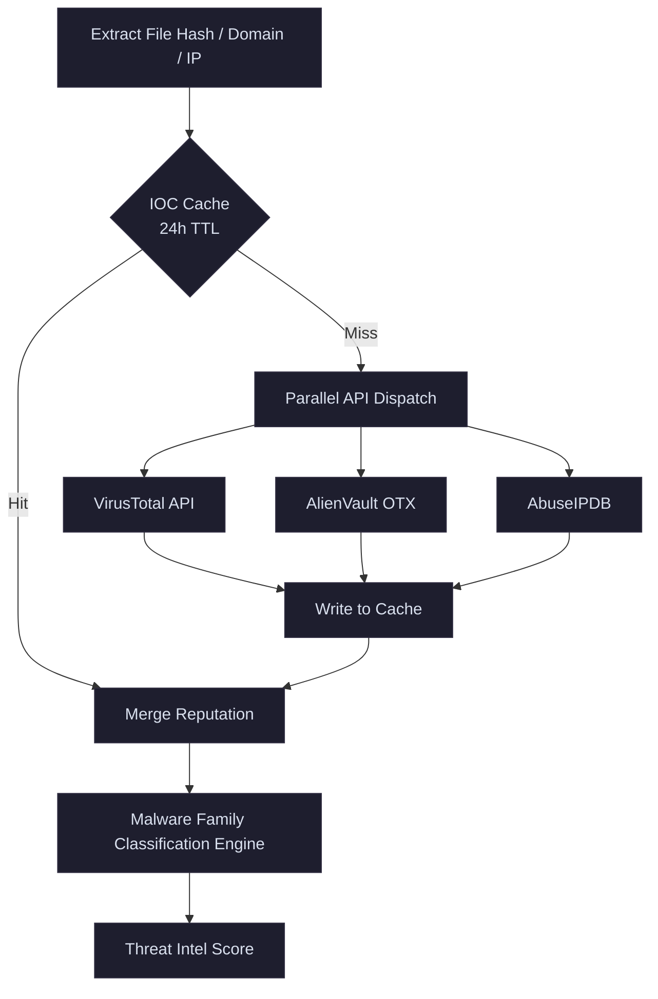
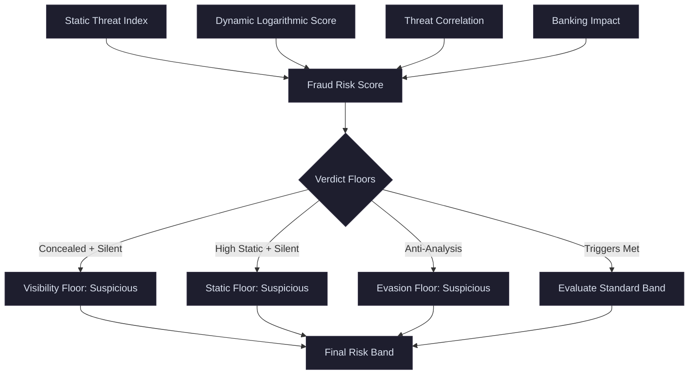
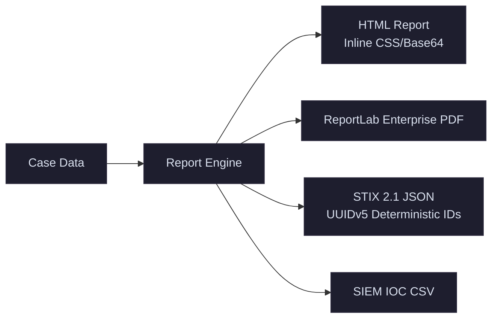
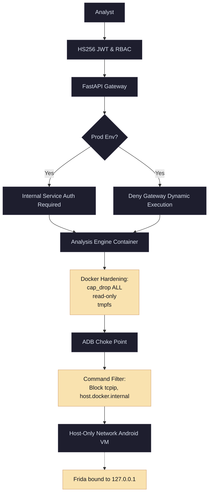
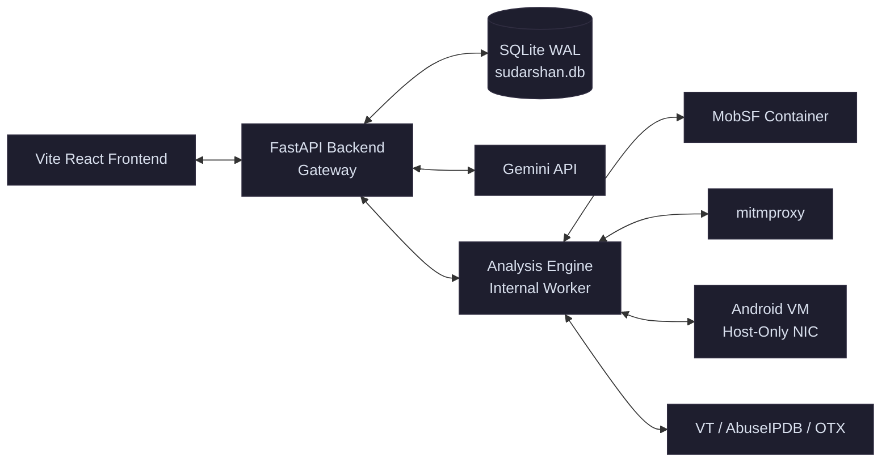

# SUDARSHAN — COMPLETE FEATURE & CAPABILITY DOCUMENTATION

## 1. What Is Sudarshan?

Sudarshan is a mobile banking threat intelligence and malware analysis platform built for Bank of India's fraud-analysis workflows. 

At its core, Sudarshan is a high-performance orchestration layer, deterministic risk engine, and interactive investigation workspace. It ingests unknown or suspicious Android Application Packages (APKs), dissects them statically and dynamically, correlates behaviors against threat intelligence feeds, detects visual impersonation of banking brands, and translates complex forensic telemetry into plain-English intelligence using AI.

It is designed for Security Operations Center (SOC) personnel, Tier 1/2 analysts, and forensic researchers. The platform solves the bottleneck of manual malware analysis by automating the extraction of Indicators of Compromise (IOCs), identifying phishing overlay tactics, and providing a deterministic, auditable Risk Score that drives blocklist actions and threat mitigation. The final output is an actionable intelligence report, standardized STIX 2.1 bundles, and a real-time investigative chat environment.

---

## 2. The Problem We Are Solving

The modern mobile threat landscape is dominated by sophisticated Android banking trojans (e.g., Xenomorph, TeaBot, Drinik, Anubis) that utilize evasion, dynamic payloads, and complex execution chains.

*   **Credential & OTP Theft**: Malware abuses `READ_SMS` and `RECEIVE_SMS` to intercept One-Time Passwords, routing them to Command and Control (C2) servers.
*   **Accessibility Abuse (ATS)**: Modern trojans use the Android Accessibility Service to automate screen scraping, read balances, and perform automated tap injections to execute unauthorized transfers (Automated Transfer Systems).
*   **Overlay Attacks (Brand-Jacking)**: Utilizing the `SYSTEM_ALERT_WINDOW` permission, malware draws pixel-perfect visual clones of legitimate banking login screens directly over the authentic application, deceiving users into surrendering credentials.
*   **Evasion Tactics**: Malware intentionally delays execution, checks for emulators, or ships with damaged ZIP headers to crash traditional static analyzers.

**Why existing approaches fail:**
*   *Manual analysis* is too slow for active banking fraud campaigns.
*   *Static-only analysis* is easily defeated by packers, droppers, and encrypted second-stage payloads.
*   *Dynamic-only analysis* is often defeated by malware recognizing the sandbox environment and refusing to execute (evasion).
*   *AI-only verdicts* are unsafe and unreliable for high-stakes banking security due to the risk of hallucinations or prompt injection.

Sudarshan solves this by merging highly resilient static parsing, goal-directed dynamic emulation, and deterministic risk logic.

---

## 3. Sudarshan's Core Approach

Sudarshan is built on a philosophy of **Deterministic Authority with Generative Explanation**.

```
    STATIC THREAT INTELLIGENCE
              +
    DYNAMIC BEHAVIOR
              +
    THREAT INTELLIGENCE
              +
    VISUAL INTELLIGENCE
              ↓
    DETERMINISTIC RISK ENGINE
              ↓
    EVIDENCE-GROUNDED AI
              ↓
    ANALYST DECISION
```

The AI (Gemini) **never** calculates the risk score or decides the threat classification. Instead, deterministic engines (written in Python) analyze the raw telemetry, compute the Fraud Risk Score (FRS), and apply safety guardrails. The LLM is restricted exclusively to **explaining** those forensic facts, raw telemetry, and database records in plain language for the analyst.

---

## 4. COMPLETE END-TO-END SYSTEM WORKFLOW

```mermaid
flowchart TD
    classDef default fill:#1E1E2E,stroke:#302D41,color:#D9E0EE;
    classDef process fill:#89B4FA,stroke:#3E8FB0,color:#11111B;
    classDef decision fill:#F9E2AF,stroke:#D4A373,color:#11111B;
    classDef ai fill:#CBA6F7,stroke:#A178DF,color:#11111B;
    classDef output fill:#A6E3A1,stroke:#40A02B,color:#11111B;

    User([Analyst]) --> Login[Login / Auth]
    Login --> Upload[Upload APK / Enter URL]
    Upload --> SHA256[SHA-256 Identification & Validation]
    
    SHA256 --> StaticEval{Is APK Valid?}
    StaticEval -->|Damaged / Malformed| Repair[APK Repair Engine & Re-sign]
    Repair --> StaticParse
    StaticEval -->|Valid| StaticParse[Multi-Engine Static Analysis]
    
    StaticParse --> StaticFallback{Androguard Available?}
    StaticFallback -->|Yes| Androguard[Parse Manifest & Dex]
    StaticFallback -->|No| RegexParse[Static Fallback: Raw Regex Pool Scan]
    
    Androguard & RegexParse --> InvManifest[Generate Investigation Manifest\n& Hook Profiles]
    
    InvManifest --> SandboxCheck{Is Sandbox Available?}
    SandboxCheck -->|No| ExcludeDynamic[Exclude Dynamic Axis & Renormalize FRS]
    SandboxCheck -->|Yes| DAE[SandboxProvider & Android VM]
    
    DAE --> Install[Install & Launch Target]
    Install --> PID[PID Resolution & Stability Polling]
    PID --> SELinux[SELinux Preflight setenforce 0]
    
    SELinux --> FridaAttach{Frida Attach Success?}
    FridaAttach -->|No| SpawnFallback[Fallback: device.spawn]
    FridaAttach -->|Yes| ART[ART Deoptimization]
    SpawnFallback & ART --> Canary[Wait for Canary Event]
    
    Canary --> Hooks[Deploy Tailored Runtime Hooks]
    Hooks --> Agentic[Agentic UI Explorer\nObserve-Think-Act]
    Agentic --> LoopCheck{Loop Detected?}
    LoopCheck -->|Yes| Backtrack[LOOP_RECOVERY Backtrack]
    LoopCheck -->|No| Action[Execute UI Action]
    Action --> Agentic
    
    Hooks --> Sockets[Frida Socket Intercept]
    Agentic --> Mitmproxy[mitmproxy HAR Capture]
    Sockets & Mitmproxy --> Network[Network Evidence Fusion]
    
    Agentic & Network --> EvidenceBus[Runtime Event Bus & Evidence Store]
    
    EvidenceBus & ExcludeDynamic --> TI{Threat Intel Configured?}
    TI -->|No| SkipTI[Exclude Correlation Axis]
    TI -->|Yes| TICache[Lookup IOC Cache]
    TICache --> |Cache Miss| FetchTI[VT / OTX / AbuseIPDB]
    TICache & FetchTI --> Correlation[Threat Correlation]
    
    EvidenceBus --> VIDECore{Is VIDE Enabled?}
    VIDECore -->|No| SkipVIDE[Skip Visual Diff]
    VIDECore -->|Yes| VIDEDiff[3-Axis Visual Impersonation Check]
    
    Correlation & SkipTI & VIDEDiff & SkipVIDE --> Workflow[Fraud Workflow Reconstruction]
    
    Workflow --> RiskEngine[Deterministic Risk Engine\nSTEI / BFCI / FRS]
    
    RiskEngine --> Floors{Safety Guardrails}
    Floors --> |Evasion / No Payload| FloorAdjust[Raise to Suspicious]
    Floors --> |Normal| FinalScore[Final Risk Score & Band]
    FloorAdjust --> FinalScore
    
    FinalScore --> RAG[RAG Context Builder]
    RAG --> AI{Gemini API Online?}
    AI -->|Yes| Gemini[Gemini 2.5 Flash\nPlain-English Synthesis]
    AI -->|No| Fallback[Deterministic Fallback Narrative]
    
    Gemini & Fallback --> DB[Persist to SQLite]
    DB --> Reports[Generate HTML / PDF / STIX / CSV]
    DB --> Dashboard[Dashboard / Executive View]
    
    Reports & Dashboard --> AnalystDecision([Analyst Decision])

    class StaticParse,Androguard,RegexParse,InvManifest,DAE,PID,SELinux,Hooks,Agentic,Action,Network,EvidenceBus,TICache,FetchTI,Correlation,VIDEDiff,Workflow,RiskEngine,FinalScore,RAG,DB process;
    class StaticEval,StaticFallback,SandboxCheck,FridaAttach,LoopCheck,TI,VIDECore,Floors,AI decision;
    class Gemini ai;
    class Reports,Dashboard,AnalystDecision output;
```



---

## 5. ANALYST USER JOURNEY

```mermaid
flowchart LR
    classDef default fill:#1E1E2E,stroke:#302D41,color:#D9E0EE;
    classDef view fill:#A6E3A1,stroke:#40A02B,color:#11111B;

    Login([Login]) --> Upload[Upload APK / Enter URL]
    Upload --> Pipeline[Pipeline Tracker Dashboard]
    Pipeline --> History[Case History / Registry]
    History --> Executive[Executive SOC View]
    Executive --> TechView[Technical Investigation View]
    TechView --> VIDE[VIDE Assessment Panel]
    TechView --> ThreatIntel[Threat Intel & Workflow]
    ThreatIntel --> Chat[AI Investigation Chat]
    Chat --> Notes[Analyst Sticky Notes]
    Notes --> Reports([Download Reports])

    class Executive,TechView,VIDE,ThreatIntel,Chat,Notes view;
```



---

## 6. COMPLETE FEATURE CATALOG

### 6.1 Authentication & Access Control
* JWT Lifecycle Management
* Role-Based Access Control (RBAC: Analyst, SOC Lead, Admin)
* Protected Client Routing
* Internal Service Authentication

### 6.2 Case Intake & Discovery
* Drag-and-Drop APK Upload
* Async Pipeline Tracker (6-Stage Live Grid)
* Malware Discovery URL Crawler (Spider)
* Case Registry & Search (History)

### 6.3 Static Analysis & Preparation
* SHA-256 Identification & Provenance
* Forensic APK Repair (Header Bypass & Resign)
* Multi-Engine Manifest Parsing (Androguard, aapt, regex fallback)
* Permission Mapping & Danger Tags
* Indian Banking Package Detection
* JADX & APKTool Source Decompilation
* Dynamic Hook Profile Generation

### 6.4 Dynamic Analysis & Containment
* Host-Only Network Sandbox Containment
* Blocked ADB Global Commands
* SELinux Permissive Preflight
* PID Resolution & Stability Polling
* Frida Spawn vs Attach Fallbacks
* ART VM Deoptimization
* Canary Event Verification
* Loopback-Only Frida Server Binding

### 6.5 Network Analysis
* Frida Socket/URLConnection Hooking
* mitmproxy HAR Flow Capture
* Request Deduplication & Evidence Fusion

### 6.6 Agentic UI Exploration
* Observe-Think-Act Loop
* Screen Layout Perception & Hashing
* Goal-Directed Navigation
* Loop Detection & Backtrack Recovery
* App Crash & ANR Failure Handling

### 6.7 Threat Intelligence & Fraud Workflows
* VirusTotal, AlienVault OTX, AbuseIPDB Correlation
* IOC Cache (24h TTL)
* Malware Family Classification (deterministic flag-based rules in `classification_engine.py`: Drinik, Xenomorph, Cerberus, and others)
* Fraud Workflow Causal Chain Reconstruction
* MITRE ATT&CK Mapping

### 6.8 Visual Impersonation & Design Engine (VIDE)
* 3-Axis Layout Comparison (String, Structure, Redmean Color)
* Bank Signer Registry Check (CH06)
* Visual Asset AST Parsing
* Overlay Evidence Rendering

### 6.9 Deterministic Risk Engine
* Fraud Risk Score (FRS) Calculation
* Static Threat Exposure Index (STEI)
* Behavioral Fraud Confidence Index (BFCI) v2 (Logarithmic)
* Temporal Sequence Multipliers (+25% chain bonus)
* Regulatory Impact & Evasion Verdict Floors

### 6.10 AI Investigation & RAG
* Regulatory/MITRE Semantic Enrichment
* Intent-Based Evidence Retrieval (BM25)
* Streaming Event-Sourced Chatbot
* Multi-Layer Sanitization & Anti-Hallucination
* Offline Fallback Narratives

### 6.11 Reporting & Export
* Standalone HTML Reports (Base64/Inline CSS)
* ReportLab Enterprise PDFs
* STIX 2.1 Threat Bundles (UUIDv5)
* SIEM IOC CSVs


### 6.12 Analyst Dashboard & Interactivity
* Time-Warp Sandbox Simulation
* Device Persona Seeding (SMS, Contacts)
* Analyst Sticky Notes
* Real-Time Logcat & Websocket Event Steams
* Executive Risk Dials & Visual Previews

---

## 7. INDIVIDUAL FEATURE EXPLANATIONS

### Feature: Forensic APK Repair Engine

#### What It Does
Bypasses intentionally damaged APK ZIP headers that crash standard static analysis tools, extracts the assets, and safely repackages and resigns the binary.

#### Why It Exists
Malware authors deliberately mangle Central Directory headers or insert UTF-16 NULs. Android's lenient package manager can often still install these files, but strict forensic tools (like Androguard or Python's `zipfile`) will crash.

#### How It Works
It relies on `apkInspector` to extract files ignoring standard ZIP constraints. It performs Zip-Slip path-traversal checks, reconstructs `.arsc` and `.dex` files without compression, and uses `apksigner` with a local SOC debug certificate to resign the package for deployment.

#### Output
A valid `repaired_{original_sha256}.apk` file that can be ingested by both Androguard and the Android Emulator.

#### Implementation
`shared/sudarshan_core/engines/apk_repair.py`

#### Current Status
**IMPLEMENTED** & **VERIFIED**

---

### Feature: Agentic UI Exploration

#### What It Does
An automated "Observe-Think-Act" engine that drives the emulator interface to navigate deep into malware, accepting permissions and pressing buttons autonomously.

#### Why It Exists
Malware is rarely fully active on launch. It requires a victim to grant accessibility, accept overlays, or input data. Basic "random monkeys" fail to bypass complex permission dialogues.

#### How It Works
1. **Perception**: Dumps the XML layout hierarchy and hashes the screen state.
2. **Planner**: (Powered by Gemini or fallback logic) Evaluates the layout to identify the most productive action (e.g., clicking "Allow").
3. **Execution**: Emits UI commands via ADB.
4. **Loop Detection**: Evaluates a sliding window of screen hashes (`max_visits=3`). If a loop is detected, it triggers a `LOOP_RECOVERY` backtrack (pressing Back or Home).

#### Implementation
`shared/sudarshan_core/engines/agentic_explorer.py`, `ScreenGraph`

#### Current Status
**IMPLEMENTED** & **VERIFIED**

---

### Feature: Visual Impersonation & Design Engine (VIDE)

#### What It Does
Detects if an unknown application is attempting to visually masquerade as a legitimate banking app (overlay phishing or brand-jacking).

#### Why It Exists
Sophisticated trojans use `SYSTEM_ALERT_WINDOW` to draw a fake login screen directly over the real bank app. Static analysis sees no malicious code, only UI elements.

#### How It Works
The engine uses a 3-axis deterministic comparison against a known corpus of banking baselines:
*   **Strings (0.40 Weight)**: Fuzzy token-set matching.
*   **Structure (0.35 Weight)**: Layout view-tree AST sequence mapped to standard roles.
*   **Colour (0.25 Weight)**: Brand color delta E 2000 ($\Delta\text{E}_{2000}$) perceptual matches.
It also cross-references the `bank_signer_registry.json` to verify cryptographic authenticity.

#### Backend / Engine Behavior
If VIDE confidence is $> 0.85$ and the signer doesn't match, it triggers rule `CH27` (On-Device Fraud Triad), deterministically forcing the risk score to $\ge 95.0$ (Critical).

#### Implementation
`shared/sudarshan_core/engines/vide/pipeline.py`

#### Current Status
**IMPLEMENTED**, however the UI comparison baselines and certificate registries are currently in a **LAB/DEMO** state (missing the full production corpus).

---

### Feature: Deterministic Risk Engine (STEI & BFCI)

#### What It Does
Computes the exact numerical risk score (0-100) and risk band without using LLMs.

#### Why It Exists
LLMs cannot be trusted to perform reliable risk math. They hallucinate numbers and are vulnerable to prompt injection (e.g., malware naming a variable "SAFE_NOT_MALWARE" to trick the LLM).

#### Processing
*   **STEI (Static)**: Scores declared capabilities (Accessibility, SMS, Overlays, Obfuscation) up to 100.
*   **BFCI v2 (Dynamic)**: Uses logarithmic curves to score observed runtime behaviors (caps applied per category to balance volume). A +25% multiplier is applied if causal sequences (e.g., OTP_THEFT_CHAIN) are observed in a 30-second window.
*   **FRS**: Renormalizes weights based on axis availability (e.g., if Threat Intel is offline, its weight is distributed to STEI and BFCI).

#### Safety Guardrails (Verdict Floors)
*   **Visibility Floor**: If payload is concealed but the sandbox run was silent, the verdict is floored at "Suspicious."
*   **Evasion Floor**: If anti-analysis checks are logged, the sample cannot be rated "Safe."

#### Implementation
`shared/sudarshan_core/engines/risk_engine.py`, `bfci_scorer.py`

#### Current Status
**IMPLEMENTED** & **VERIFIED**

---

### Feature: RAG-Grounded Interactive Chat

#### What It Does
Provides analysts with a real-time, streaming chatbot that can explain the threat findings, risk scores, and suggest remediations.

#### Why It Exists
Allows Tier-1 analysts to interrogate complex data (like reverse-engineered DEX hooks or network traffic) using natural language.

#### How It Works
*   **Input**: User query.
*   **Processing**: Intent detection routes the query to specific evidence domains. A BM25 keyword scorer pulls the most relevant evidence chunks. The chunks are aggressively sanitized (`sanitize_block`) to prevent prompt injection. The LLM is restricted via a `0.2` temperature constraint.
*   **Output**: Server-Sent Events (SSE) streaming with interactive chips and evidence cards rendered in markdown.

#### Fallback Behavior
If the Gemini API is down, the chat pipeline fails gracefully and uses a predefined deterministic template explaining that AI is offline, presenting the deterministic risk score directly.

#### Implementation
`backend/app/ai/gemini_rag.py`

#### Current Status
**IMPLEMENTED** & **VERIFIED**

---

## 8. STATIC ANALYSIS



---

## 9. DYNAMIC ANALYSIS



---

## 10. FRIDA RUNTIME INSTRUMENTATION

Sudarshan limits hook bundles dynamically based on the static Investigation Manifest to evade detection.

| Hook Bundle / Profile | API / Class Target | Behavior Detected | Risk Impact |
| :--- | :--- | :--- | :--- |
| `canary` | JS `send()` heartbeat | Validates Frida injection success. | None (Control) |
| `accessibility` | `AccessibilityNodeInfo`, `AccessibilityManager` | Tap injection, Screen scraping (T1417). | Critical (ATS) |
| `sms` | `SmsManager`, `ContentResolver` | OTP Exfiltration, SMS reading (T1412). | Critical (Fraud) |
| `overlay` | `WindowManager`, `Settings.canDrawOverlays` | Phishing windows (T1411). | High Risk |
| `dynamic_code` | `DexClassLoader`, `Runtime.load` | Encrypted payload execution (T1623). | High Risk |
| `persistence` | `DevicePolicyManager`, `AlarmManager` | Device Administrator requests (T1624). | Medium Risk |
| `network` | `URL`, `HttpURLConnection`, `Socket` | C2 communication, data exfil (T1623). | Medium Risk |

---

## 11. AGENTIC UI EXPLORATION

Sudarshan abandons legacy "random monkey" clicking for a stateful **Observe-Think-Act** graph.

*   **Perception**: Dumps the XML node tree and generates a visual SHA-256 state hash.
*   **Goal DAG**: Sequences targets. (e.g. `Allow Permissions` $\rightarrow$ `Login` $\rightarrow$ `Explore`).
*   **Loop Detection**: Evaluates memory graph history. If the system is trapped in a 5-action loop, it executes `LOOP_RECOVERY` to backtrack.
*   **Failure States**: Scans for Android ANR/Crash dialogue signatures to log application instability without breaking the sandbox session.

---

## 12. NETWORK ANALYSIS



---

## 13. EVIDENCE PROCESSING

```text
    Frida Events
    Network Events
    UI Events
    Logcat
    Screenshots
           ↓
    RuntimeEventBus (Thread-safe Async Broker)
           ↓
    EvidenceStore (In-memory dict & SQLite WAL)
           ↓
    Evidence Normalization (Categorization, Deduplication)
           ↓
    Workflow Reconstruction (Sequence mapping)
           ↓
    Risk Engine (Quantitative scoring)
           ↓
    RAG (Semantic Chunking)
```

---

## 14. FRAUD WORKFLOW RECONSTRUCTION

Sudarshan merges low-level API hooks into higher-order Causal Chains. 
For example, the **OTP Theft Chain** requires:
1. `AccessibilityService.onAccessibilityEvent` (Input Capture)
2. `SmsMessage.getMessageBody` (Interception)
3. `Socket.connect` / `SmsManager.sendTextMessage` (Exfiltration)

If these occur within a 30-second temporal sliding window, the `BFCI` score is awarded a **+25% Sequence Multiplier**.

---

## 15. THREAT INTELLIGENCE



*(Note: An active bug ignores caching 404 Not Found results, resulting in API quota burn for benign files).*

---

## 16. VIDE — VISUAL IMPERSONATION DETECTION

VIDE explicitly tackles the "Overlay Attack" vector where static code looks clean but the UI is a perfect replica of a bank.

1.  **Static Profile**: Parses the layout AST of the unknown app.
2.  **Comparison**: Matches against established brand baselines using:
    *   `String Similarity` (Fuzzy token match)
    *   `Tree Similarity` (Structural XML match)
    *   `Color Similarity` ($\Delta\text{E}_{2000}$ brand palette match)
3.  **Signer Verification (CH06)**: Validates the application certificate against `bank_signer_registry.json`.
4.  **Escalation**: If visually matched ($>0.85$) but cryptographically unverified, triggers the **CH27** Critical escalation.

*(Current limitation: Only 3 demo banks are active in the registry).*

---

## 17. DETERMINISTIC RISK ENGINE

The LLM does **not** control the numerical score. The FRS is deterministic.



---

## 18. AI INVESTIGATION + RAG

**AI Boundary**: The Gemini 2.5 Flash model operates strictly as a RAG-grounded synthesizer.

1.  **Evidence**: Raw deterministic data is packaged.
2.  **RAG**: `knowledge_base.json` (MITRE, RBI directives) is queried using BM25 intent algorithms.
3.  **Sanitization**: `sanitize_block` strips prompt-injection attempts from malicious strings.
4.  **Prompt**: Instructs Gemini to answer queries strictly using evidence (Temperature: 0.2).
5.  **Output**: Streams via Server-Sent Events (SSE) into the interactive UI, rendering evidence cards dynamically.

---

## 19. DASHBOARD ARCHITECTURE

The Frontend utilizes React + TypeScript with strict JWT route guards.

*   **Login**: JWT generation.
*   **Upload**: 6-stage async progress grid.
*   **History**: Paginated registry with risk band filters.
*   **Executive SOC View**: Circular risk dials, plain-English AI summaries, and screenshot carousels.
*   **Technical SOC View**: Deep diagnostic tables for Permissions, Network Captures, Manifests, and Logcat.
*   **Investigation Shell**: Live SSE Chat with the RAG assistant and floating sticky notes.
*   **Resilience Controls**: Time-warp simulations, device persona seeding, and checkpoint management.

---

## 20. REPORTING & EXPORT



---

## 21. SECURITY ARCHITECTURE



---

## 22. MICROSERVICE ARCHITECTURE



---

## 23. API SURFACE

An exhaustive 51-endpoint API drives the platform. Key endpoints include:

| Method | Endpoint | Purpose | Auth / Role | Output |
| :--- | :--- | :--- | :--- | :--- |
| `POST` | `/api/v1/analyze/async` | Queue background analysis | `analyst` | Job ID |
| `GET` | `/api/v1/status/{id}` | Poll analysis progress | `analyst` | Job Status |
| `GET` | `/api/v1/cases` | Paginated case history | `analyst` (Scope filtered) | Case Array |
| `GET` | `/api/v1/cases/{sha256}`| Retrieve full case JSON | `analyst` | Case Data |
| `POST` | `/api/v1/auth/login` | Authenticate & get JWT | Public | Token |
| `POST` | `/api/v1/chat/stream` | LLM RAG chat querying | `analyst` | SSE Stream |
| `POST` | `/api/v1/analysis/{id}/time-warp`| Bypass dynamic dormancy | `analyst` | Result Status |
| `GET` | `/api/v1/report/stix/{sha256}` | Download STIX 2.1 bundle | `analyst` | STIX JSON |

---

## 24. TECHNOLOGY STACK

1.  **Frontend**: React, TypeScript, Vite, Tailwind CSS, React Router v6.
    *   *Why*: High-density SOC interfaces requiring rapid real-time state changes (websockets).
2.  **Backend**: FastAPI, Python 3.11+, Pydantic, aiosqlite.
    *   *Why*: Asynchronous I/O is critical for managing long-running background analysis workers without blocking the main event loop.
3.  **Data Persistence**: SQLite (WAL mode).
    *   *Why*: Zero-configuration embeddability, bypassing complex multi-container Postgres requirements. WAL mode prevents database locking under concurrent load.
4.  **Static Engines**: Androguard, apkInspector, JADX, APKTool.
    *   *Why*: Multi-stage fallback allows ingestion of deliberately corrupted ZIP structures.
5.  **Dynamic Sandbox**: Frida, mitmproxy, ADB, Genymotion.
    *   *Why*: Industry standard instrumentation and deep TLS interception.
6.  **AI Engine**: Gemini 2.5 Flash API.
    *   *Why*: Massive context window suitable for ingesting raw decompiled code and logcat traces.

---

## 25. DATA FLOW / DATA LINEAGE

```text
    APK Upload
     ↓
    SHA-256 Identification
     ↓
    Decompilation & Manifest Parse
     ↓
    Investigation Manifest (Static Evidence)
     ↓
    Frida & mitmproxy Execution
     ↓
    RuntimeEventBus (Runtime Evidence)
     ↓
    Threat Correlation & VIDE Check
     ↓
    SQLite Storage (Raw Case Result)
     ↓
    Risk Engine (Deterministic Scoring)
     ↓
    RAG & Knowledge Base Enrichment
     ↓
    Gemini Output (Reports & AI Chat)
     ↓
    SOC Analyst Dashboard
```

---

## 26. FAILURE HANDLING & FALLBACKS

Sudarshan degrades gracefully when subsystems fail:

1.  **Malformed APK / ZIP Header Crash**: Falls back to `apkInspector` to extract, rebuild, and resign the binary.
2.  **Androguard Crash**: Falls back to byte-level Regex scans over raw binary string pools to extract permissions and packages.
3.  **SELinux Enforcing**: Executes `setenforce 0` via root shell to allow Frida ptracing.
4.  **Frida Attach by PID Fails**: Falls back to `device.spawn()` to initiate a fresh process.
5.  **VM Dormancy / Sleep Evasion**: Analyst can trigger a "Time Warp" API to fast-forward the device clock and execute background `AlarmManager` jobs.
6.  **Threat Intel Unconfigured/Throttled**: Axis is excluded from FRS and remaining weights are renormalized.
7.  **Gemini LLM Offline**: Platform generates a deterministic, static templated threat report and disables the chat interface.

---

## 27. DETERMINISM + AI PHILOSOPHY

Sudarshan separates "knowing the truth" from "explaining the truth."

LLMs are highly prone to prompt injection and hallucination. Therefore, Sudarshan computes Risk, Threat Levels, Regulatory Impact, and Trigger Assertions deterministically via rigid Python math (`risk_engine.py`). AI is isolated to the presentation layer, used only to parse the JSON and draft plain-English summaries. 
**Benefit**: Security verdicts are fully reproducible, auditable, and safe for enterprise compliance requirements.

---

## 28. UNIQUE / DIFFERENTIATING FEATURES

1.  **Forensic APK Repair**: Standard tools (MobSF) crash on corrupted APKs. Sudarshan dynamically rebuilds the binary to force execution.
2.  **Agentic Observe-Think-Act Sandbox**: Rather than random clicks, the UI explorer utilizes view-tree hierarchy hashing and goal tracking to actively bypass permission prompts and log in.
3.  **Time-Warp & Persona Seeding**: Directly from the UI, analysts can push fake SMS, populate contacts, and advance the OS clock to break malware dormancy.
4.  **VIDE (Visual Impersonation Detection)**: Cross-references screen layouts (Strings, Trees, Redmean Colors) against cryptographic signer keys to instantly detect overlay phishing attacks.

---

## 29. VALIDATION & TESTING

The platform maintains a large but entirely developer-run testing footprint:
*   **Collected**: **2,622 tests** across `tests/` and `backend/tests/` (measured 2026-08-27 with
    `pytest tests/ backend/tests --collect-only`, no collection errors): 1,813 in `tests/unit`,
    12 in `tests/integration` and 797 in `backend/tests`.
*   **Enforced automatically**: **none**. There is no `.github/` directory and no CI workflow in
    this repository. The only git-side gate is `.githooks/pre-push`, which checks commit
    attribution rather than running tests. Earlier revisions of this document described a
    `ci.yml` gating 525 tests; that file does not exist.
*   **Collection prerequisites**: `PYTHONPATH` must include both `backend` and `shared`, and the
    interpreter needs `requests` and a working `bcrypt` backend for `passlib`. A single import
    error during collection aborts the entire session.
*   **Validations**:
    *   Auth Flow Route Guards
    *   JWT Session management
    *   Risk Engine Mathematical accuracy
    *   VIDE layout parsing accuracy
    *   API Mock Integrations (VT, Gemini)

---

## 30. PERFORMANCE

*   **Ingestion & Static**: < 5 seconds (JADX heavy scans may take longer based on codebase size).
*   **Dynamic Sandbox**: Adjustable, typically restricted to 90–120 second time-to-live (TTL) limits.
*   **LLM Inference**: Streamed (SSE) to prevent HTTP timeouts.
*   **Database**: SQLite WAL configuration prevents locking even under 10+ concurrent background tasks.

---

## 31. CURRENT IMPLEMENTATION STATUS

**What the status words mean.** They were previously undefined, which made
`VERIFIED` indistinguishable from *"we believe this works"*:

| Status | Definition |
| :--- | :--- |
| `VERIFIED` | Directly observed working — by executing it, or by a test that fails when it breaks. The Evidence column names what was observed and when. |
| `IMPLEMENTED` | Code exists and is wired in, but no standing evidence proves it end-to-end. |
| `LAB / DEMO` | Works, on placeholder data. Not fit for production input. |
| `PARTIAL` | Works for the common path; a known case is unhandled. |
| `NOT IMPLEMENTED` | Absent. Any call is a no-op. |

A row without evidence does not get `VERIFIED`.

| Capability | Status | Evidence | Notes / Limitations |
| :--- | :--- | :--- | :--- |
| **STEI / FRS / BFCI Scoring** | VERIFIED | `docs/evaluation/CORPUS_STATIC_VALIDATION.md` — 17 labelled samples, 2026-08-16; determinism replay in `backend/tests/test_determinism_replay.py` | Fully deterministic and operational. |
| **Agentic Sandbox Explorer** | VERIFIED | Anubis run 2026-08-16: 3 actions, 6 screenshots, `attack_timeline.json` | Operates over ADB with screen hashing. Only 2–3 actions complete inside the 90 s budget — see §29. |
| **Frida Injection & Network Intercept** | VERIFIED | Anubis run 2026-08-16: `canary_received` 17.6 s, `first_hook_event` 17.9 s | Was **broken until 2026-08-16**: the client dialled frida's fixed USB port while the server ran on the configured one, so attach failed on every run and reported the misleading "need Gadget to attach on jailed Android". Port resolution is now single-source (`sandbox/config.py:frida_server_port`). |
| **VIDE Execution** | IMPLEMENTED | — | Core layout/color matching is operational; no end-to-end evidence recorded. |
| **VIDE Baseline Corpus** | LAB / DEMO | — | Missing production baselines (only 3 lab banks present). |
| **Signer Registry** | LAB / DEMO | `shared/sudarshan_core/data/bank_signer_registry.json` | All 12 package entries have `signers_provisioned: false`. Deliberately fail-closed: an unprovisioned package has its identity claim **rejected**, not trusted. |
| **Threat Intel Caching** | PARTIAL | `services/threat_correlator.py:165,235,269,304` | Cache works, but 404s are never stored, so unknown-to-VirusTotal samples are re-queried on every analysis. |
| **YARA Scanner** | NOT IMPLEMENTED | `engines/frida_sandbox.py:3517` logs `YARA scanning DISABLED` | Zero `.yar` files in the repository. It now fails loudly rather than silently returning empty results. |
| **AI Fallbacks** | IMPLEMENTED | — | Air-gapped fallback template is wired in, but no test exercises the no-key path end-to-end, so it does not meet the bar for VERIFIED above. Downgraded 2026-08-16 on that basis. |

---

## 32. COMPLETE FEATURE MATRIX

Status words are defined in §31. `VERIFIED` requires named evidence; rows that
have none are `IMPLEMENTED` instead. This table previously marked 13 of 14 rows
`VERIFIED` with nothing to point at — including one (row 10) that could not
work at all at the time it was written.

| ID | Feature | Layer | User Visible | Status | Evidence | Differentiating |
| :--- | :--- | :--- | :--- | :--- | :--- | :--- |
| 1 | Protected SPA Routing (JWT) | Frontend | Yes | VERIFIED | `backend/tests/test_boundaries.py` | No |
| 2 | Executive Dashboard (Dials/Narrative) | Frontend | Yes | IMPLEMENTED | — | Yes |
| 3 | AI Chat Investigator (SSE Stream) | Frontend | Yes | IMPLEMENTED | — | Yes |
| 4 | Sandbox Resilience Panel | Frontend | Yes | IMPLEMENTED | — | Yes |
| 5 | Asynchronous Queue Worker | Backend | No | IMPLEMENTED | — | No |
| 6 | Gateway Production Restrictions | Backend | No | VERIFIED | `backend/tests/test_hackathon_security_hardening.py` | No |
| 7 | Forensic APK Repair | Analysis | No | VERIFIED | `backend/tests/test_manifest_repair.py` | Yes |
| 8 | Multi-Engine Manifest Parser | Analysis | No | VERIFIED | `backend/tests/test_activity_parser.py` | Yes |
| 9 | Agentic Observe-Think-Act | Analysis | No | VERIFIED | `backend/tests/test_agentic_explorer.py`; Anubis run 2026-08-16 | Yes |
| 10| mitmproxy + Frida Fusion | Analysis | Yes | VERIFIED | Anubis run 2026-08-16 (`first_hook_event` 17.9 s). **Non-functional before the 2026-08-16 frida port fix** — see §31. | Yes |
| 11| VIDE Visual Diff Engine | Analysis | Yes | PARTIAL | `tests/unit/test_vide_*.py` (16 modules, **not run by CI** — see §29) | Yes |
| 12| 5-Axis STEI Math | Risk | No | VERIFIED | `docs/evaluation/CORPUS_STATIC_VALIDATION.md`; `backend/tests/test_risk_engine.py` | No |
| 13| 4-Tier Verdict Safety Floors | Risk | No | VERIFIED | `backend/tests/test_detection_regressions.py`; visibility floor fires on 3/8 trojans (Anubis, Drinik, Hook) in the 2026-08-16 corpus run | Yes |
| 14| Offline RAG Fallback | AI | No | IMPLEMENTED | — | Yes |

---

## 33. FINAL MASTER SYSTEM FLOWCHART

```mermaid
flowchart TD
    classDef default fill:#1E1E2E,stroke:#302D41,color:#D9E0EE;
    
    USER([SOC Analyst]) --> LOGIN[Authenticate (JWT)]
    LOGIN --> UPLOAD[Upload Suspect APK]
    UPLOAD --> REPAIR{Malformed Header?}
    REPAIR -->|Yes| RESIGN[Rebuild & Resign APK]
    REPAIR -->|No| STATIC[Static Analysis\nAndroguard / JADX]
    RESIGN --> STATIC
    
    STATIC --> MANIFEST[Investigation Manifest\nGenerate Minimal Hook Profile]
    
    MANIFEST --> SANDBOX[Host-Only Android Sandbox]
    SANDBOX --> SELINUX[setenforce 0]
    SELINUX --> ATTACH[Frida Attach (PID/Spawn)]
    ATTACH --> AGENT[Agentic UI Explorer\nNavigate & Click]
    
    AGENT --> NETWORK[Mitmproxy TLS Capture]
    AGENT --> HOOKS[Frida API Hooks]
    
    NETWORK & HOOKS --> EVIDENCE[Evidence Store Normalization]
    
    EVIDENCE --> TI[Query Threat Intel\nVT / OTX]
    EVIDENCE --> VIDE[VIDE Layout Check]
    EVIDENCE --> WORKFLOW[Fraud Causal Chain Mapping]
    
    TI & VIDE & WORKFLOW --> RISK[Deterministic Risk Engine\nSTEI / BFCI / FRS]
    
    RISK --> RAG[RAG Context Construction]
    RAG --> AI[Gemini API / Fallback Narrative]
    
    AI --> REPORT[HTML / STIX / PDF Generation]
    AI --> DASHBOARD[Live Pipeline & Technical UI]
    
    REPORT & DASHBOARD --> DECISION([Final Block/Isolate Decision])
```

---
*Prepared for the Bank of India / IIT Hyderabad BOI Hackathon 2026. Documentation drafted with AI assistance.*
