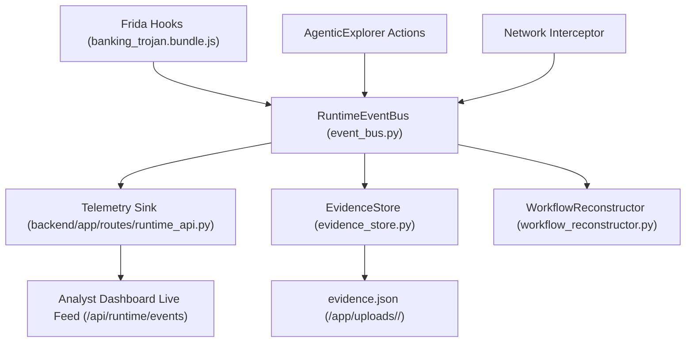
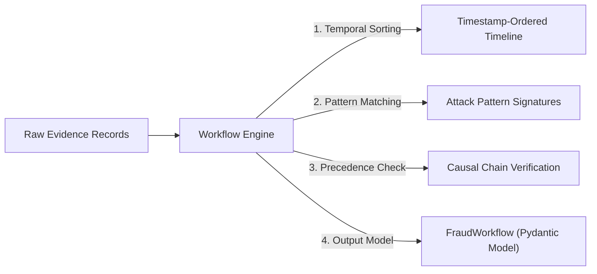

# 06 — Evidence Processing & Workflow Reconstruction Specification

> **Authoritative Technical Specification**  
> **Source Repository**: `SanTiwari07/Sudarshan`  
> **Last Verified Against Active Codebase**: 2026-08-25  

```yaml
Module Title:        Runtime Evidence Processing & Workflow Reconstruction Engine
Version:             2.1.0
Primary Files:       shared/sudarshan_core/engines/event_bus.py
                     shared/sudarshan_core/engines/evidence_store.py
                     shared/sudarshan_core/engines/screenshot_manager.py
                     shared/sudarshan_core/engines/workflow_reconstructor.py
                     backend/app/routes/runtime_api.py
Test Suite:          backend/tests/test_workflow_reconstructor.py, backend/tests/test_artifact_persistence.py, tests/unit/test_evidence_pipeline.py, tests/unit/test_evidence_provenance.py
```

---

## 1. Executive Overview

The **Evidence Processing Engine** manages real-time telemetry ingestion, structured evidence normalization, cryptographic provenance tracking, automated screenshot cataloging, and temporal causal chain reconstruction for all runtime events observed during dynamic execution.

---

## 2. Runtime Event Bus & Telemetry Sink (`event_bus.py`)

`RuntimeEventBus` acts as an in-memory pub/sub broker routing real-time telemetry from Frida hooks and the UI explorer to storage and telemetry sinks.



### Registered Event Sinks:
At backend startup (`backend/app/main.py:167`), `register_telemetry_sink(record_event)` connects the shared core event bus to the `/api/runtime/events` ring buffer, maintaining decoupling between `sudarshan_core` and the FastAPI web framework.

---

## 3. Evidence Store & Provenance Tracking (`evidence_store.py`)

Every security-relevant action is persisted as a structured `EvidenceRecord` inside `evidence.json`:

```json
{
  "evidence_id": "ev_1042",
  "category": "ACCESSIBILITY",
  "hook_name": "AccessibilityService.onAccessibilityEvent",
  "timestamp_ms": 1721930400120,
  "class_name": "com.evil.trojan.SvcA",
  "method_name": "onAccessibilityEvent",
  "arguments": ["TYPE_VIEW_TEXT_CHANGED", "com.sbi.lotus"],
  "severity": "CRITICAL",
  "mitre_technique": "T1628",
  "screenshot_ref": "shot_004.png",
  "provenance_hash": "a1b2c3d4e5f60718"
}
```

---

## 4. Screenshot Management (`screenshot_manager.py`)

`ScreenshotManager` orchestrates runtime screen capture, visual deduplication, and automated captioning:
* **Storage Location**: `/app/uploads/<sha256>/screenshots/`.
* **Deduplication Policy**: Perceptual and layout tree hashes prevent redundant screenshots on static or looping screens.
* **Captions & Annotations**: Visual grounding generates bounding box coordinates and descriptive captions (e.g., `"Fake State Bank of India login overlay requesting MPIN"`).

---

## 5. Fraud Workflow Reconstruction (`workflow_reconstructor.py`)

`WorkflowReconstructor` processes raw evidence records to construct causal temporal chains representing complete fraud campaigns:



### Supported Fraud Execution Chains:
1. **`FULL_ACCOUNT_TAKEOVER`**: Accessibility Service Enabled $\rightarrow$ Phishing Overlay Displayed $\rightarrow$ SMS OTP Intercepted $\rightarrow$ C2 Network Exfiltration.
2. **`OTP_THEFT_CHAIN`**: SMS Read / Telephony Interception $\rightarrow$ C2 Exfiltration POST.
3. **`OVERLAY_PHISHING_CHAIN`**: Targeted Bank Launch Detected $\rightarrow$ WindowManager Overlay Window Displayed.
4. **`DROPPER_CHAIN`**: Dynamic Class Loading (`DexClassLoader`) $\rightarrow$ Secondary Payload Decryption & Execution.

---

## 6. MITRE ATT&CK Mapping Matrix

Reconstructed stages map directly to the MITRE ATT&CK for Mobile matrix:

| Attack Stage | MITRE ID | Technical Signature |
| :--- | :--- | :--- |
| **Accessibility Abuse** | `T1628` | Scraping input fields, programmatic click injection |
| **Overlay Phishing** | `T1637` | `TYPE_APPLICATION_OVERLAY` over banking applications |
| **SMS Interception** | `T1643` | Intercepting SMS broadcast receivers and reading 2FA OTPs |
| **Dynamic Code Loading** | `T1407` | `DexClassLoader` and in-memory DEX unpacking |
| **C2 Communication** | `T1437` | HTTP/HTTPS beacons and socket connections to command servers |
| **Device Admin Elevation**| `T1624` | Requesting `DeviceAdminReceiver` to prevent app uninstallation |
