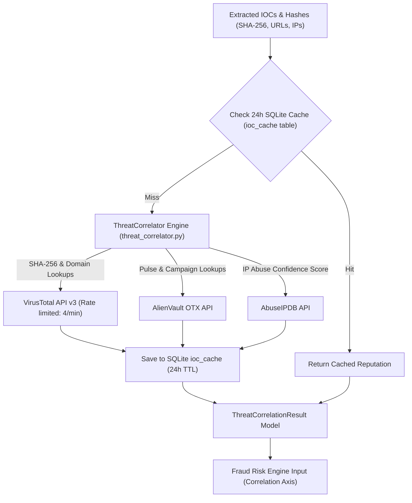

# 07 — Fraud Intelligence & Attribution Specification

> **Authoritative Technical Specification**  
> **Source Repository**: `SanTiwari07/Sudarshan`  
> **Last Verified Against Active Codebase**: 2026-08-25  

```yaml
Module Title:        Threat Intelligence Correlation & Family Classification
Version:             2.1.0
Primary Files:       shared/sudarshan_core/services/threat_correlator.py
                     shared/sudarshan_core/engines/classification_engine.py
                     backend/app/main.py
                     backend/app/db/database.py
Test Suite:          tests/unit/test_virustotal_crosscheck.py, backend/tests/test_classification_engine.py, backend/tests/test_risk_engine.py
```

---

## 1. Executive Overview

The **Fraud Intelligence Engine** correlates extracted indicators of compromise (file SHA-256 hashes, domains, IP addresses, URL endpoints) against external threat intelligence sources (VirusTotal, AlienVault OTX, AbuseIPDB) and performs deterministic classification of APK binaries into known banking malware families.

---

## 2. Threat Intelligence Correlation Architecture



---

## 3. External Threat Intel Providers & 24h TTL Caching

1. **VirusTotal API v3**: Queries file SHA-256 hashes and domain IOCs to compute detection ratios (`sha256_detections` / `sha256_total`) and vendor malicious labels.
2. **AlienVault OTX**: Queries pulses and threat campaigns associated with extracted C2 IPs.
3. **AbuseIPDB**: Queries IP abuse confidence scores ($0 - 100$) and country location metadata.

### Persistent IOC Reputation Cache (24h TTL)
To prevent API rate-limit exhaustion against VirusTotal, OTX, and AbuseIPDB free tier endpoints (max 4 req/min), the system wires a 24-hour TTL SQLite cache during startup (`backend/app/main.py` calling `configure_ioc_cache`). Lookups check `ioc_cache` table in `sudarshan.db` prior to dispatching outbound HTTP requests.

If external APIs fail or are unconfigured, `threat_correlator.py` degrades gracefully and returns a clean `available: false` correlation payload, which allows the FRS engine to exclude and renormalize the correlation axis.

---

## 4. Deterministic Malware Family Classification

Malware family classification is deterministic and executed in `shared/sudarshan_core/engines/classification_engine.py`:

```python
# Rule order:
# 1. Drinik:   targets_indian_banks AND DexClassLoader in dangerous_apis_found
#              → "Banking Target + Dynamic Code Loading = Drinik-pattern"
# 2. Xenomorph: has_accessibility_abuse AND has_sms_read_write AND targets_indian_banks
#              → "Accessibility + SMS + banking package match = Xenomorph-pattern"
# 3. Cerberus: has_system_alert_window AND has_sms_read_write AND targets_indian_banks
#              → "System Alert Window (Overlay) + SMS + banking package match = Cerberus-pattern"
# 4. Anubis:   has_accessibility_abuse AND addJavascriptInterface in dangerous_apis_found
#              → "Accessibility + Webview Injection = Anubis-pattern"
# 5. Hydra:    has_accessibility_abuse AND has_system_alert_window
#              → "Accessibility + System Alert Window = Hydra-pattern"
# 6. SpyNote:  has_accessibility_abuse AND Runtime.exec in dangerous_apis_found
#              → "Accessibility + Command Execution = SpyNote-pattern"
# 7. Joker:    has_sms_read_write AND System.loadLibrary in dangerous_apis_found
#              → "SMS + Native Library Loading = Joker-pattern"
# 8. Unknown:  No specific family signature matched.
```

Returns `family_classification` (e.g., `Drinik`, `Xenomorph`, or `Unknown`) and `matched_rule`.
