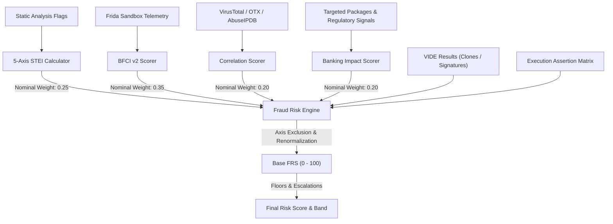

# 08 — Deterministic Risk Engine & FRS Specification

> **Authoritative Technical Specification**  
> **Source Repository**: `SanTiwari07/Sudarshan`  
> **Last Verified Against Active Codebase**: 2026-08-25  

```yaml
Module Title:        Deterministic Risk Engine & Mathematical Models
Version:             2.1.0
Primary Files:       shared/sudarshan_core/engines/risk_engine.py
                     shared/sudarshan_core/engines/bfci_scorer.py
                     shared/sudarshan_core/engines/execution_assertions.py
Test Suite:          backend/tests/test_risk_engine.py, backend/tests/test_bfci_scorer.py, tests/unit/test_risk_engine_nothing_happened.py, tests/unit/test_labelled_corpus.py
```

---

## 1. Executive Overview

The **Deterministic Risk Engine** (`shared/sudarshan_core/engines/risk_engine.py`) provides the core mathematical risk scoring logic of the SUDARSHAN platform.

To maintain strict regulatory compliance, auditability, and determinism, numerical risk scores ($0.0 - 100.0$) and risk bands are calculated **strictly from mathematical formulas, observable signals, and deterministic escalation rules** — LLMs never calculate or alter numerical risk scores.

---

## 2. Mathematical Scoring Architecture



---

## 3. Static Threat Evaluation Index (STEI)

The **STEI** score measures static pre-execution fraud potential:

$$\text{STEI} = 0.60 \times \text{CT} + 0.20 \times \text{BT} + 0.10 \times \text{PR} + 0.05 \times \text{OB} + 0.05 \times \text{IR}$$

* **Credential Theft ($\text{CT}$, Weight 0.60)**:
  - Accessibility service abuse (`BIND_ACCESSIBILITY_SERVICE`): $+40$
  - SMS interception (`READ_SMS` / `RECEIVE_SMS`): $+35$
  - Phishing overlay window (`SYSTEM_ALERT_WINDOW`): $+25$
  - Capped at $100.0$.
* **Banking Targeting ($\text{BT}$, Weight 0.20)**:
  - Matched Indian banking package names (base $20 + 10$ per additional package up to $100.0$).
  - VIDE visual clone boost: $\min(35 + 40 \times \text{confidence}, 85.0)$.
* **Permission Risk ($\text{PR}$, Weight 0.10)**:
  - Dangerous permissions requested: `BIND_ACCESSIBILITY_SERVICE` (20), `READ_SMS` (18), `RECEIVE_SMS` (18), `REQUEST_INSTALL_PACKAGES` (20), `SYSTEM_ALERT_WINDOW` (15), `READ_CONTACTS` (8), `RECORD_AUDIO` (8), etc. Capped at $100.0$.
* **Obfuscation ($\text{OB}$, Weight 0.05)**:
  - Dynamic DEX loading (`DexClassLoader` / `PathClassLoader`): $+40$
  - Native library loading (`System.loadLibrary`): $+20$
  - Java reflection (`Class.forName` / `getDeclaredMethod` / `invoke`): $+25$
  - String pool entropy ($>0.5$ entropy): up to $+15$
  - Concealed executable payload in assets: $+60$
* **Infrastructure Risk ($\text{IR}$, Weight 0.05)**:
  - Hardcoded C2 URLs / IP addresses: $+10$ per indicator, capped at $100.0$.

---

## 4. Behavioural Fraud Confidence Index (BFCI v2)

Calculated in `shared/sudarshan_core/engines/bfci_scorer.py`.

Each category's component score is volume-aware on a logarithmic scale, so one event is not equivalent to many:

$$\text{component}_c = \min\left(1.0, \frac{\ln(1 + N_c)}{\ln(1 + M_c)}\right) \times 100$$

$$BFCI_{\text{v2}} = \min\left(100.0,\; \left(\sum_{c} W_c \cdot \text{component}_c\right) \times S\right)$$

$N_c$ is the observed event count for category $c$ and $M_c$ its saturation cap. $S$ is the **sequence multiplier**: `SEQUENCE_MULTIPLIER = 1.25` when events from a defined fraud sequence all fall inside `SEQUENCE_WINDOW_SECONDS = 30.0`, and `1.0` otherwise. It is a multiplier, not an additive bonus.

### Weights and caps

Seven categories, summing to exactly 1.0 - `raw_bfci` applies no normalisation, so the module asserts the sum at import time.

| Category | $W_c$ | Cap $M_c$ |
| :--- | ---: | ---: |
| `accessibility` | 0.315 | 3 |
| `sms` | 0.225 | 2 |
| `overlay` | 0.180 | 2 |
| `banking` | 0.090 | 3 |
| `network` | 0.045 | 10 |
| `persistence` | 0.045 | 2 |
| `code_execution` | 0.100 | 2 |

`code_execution` was added after Drinik - a labelled banking trojan - was observed calling `ProcessBuilder.start` and native `execve("/bin/sh")` in a live run and still scored BFCI 0.0, because those events landed in the unscored `dangerous_apis` bucket. The six original categories were **scaled by `1 - 0.10`** rather than re-tuned, so their relative ordering is exactly as validated against the corpus: adding an axis is a claim about what was missing, not a reason to re-rank what was already there.

### Fraud sequences

Defined in `FRAUD_SEQUENCES`. All required categories must have an event inside a common 30-second window:

| Label | Required categories |
| :--- | :--- |
| `OTP_THEFT_CHAIN` | `accessibility`, `sms`, `network` |
| `OVERLAY_BANKING_CHAIN` | `overlay`, `banking` |
| `ACCOUNT_TAKEOVER_CHAIN` | `accessibility`, `overlay`, `sms` |
| `DROPPER_CHAIN` | `persistence`, `network` |

### Unscored categories

`dangerous_apis`, `files_accessed`, `anti_analysis`, `device_fingerprint`, `app_telemetry` and `notification` are collected as evidence and **never scored**. The caps above are 2-3 events with logarithmic scaling, so a single event already scores 50-63 for its component; a scored category that also catches ordinary application behaviour is not a weak signal but a constant, and it would inflate every verdict equally. `calculate_bfci_v2` iterates `for cat in BFCI_WEIGHTS`, so a category listed as unscored is inert by construction.

Adding a weight to any of them is a **model change**: it raises existing verdicts and must be validated against the labelled corpus.

---

## 5. Full Fraud Risk Score (FRS) & Dynamic Weight Renormalization

$$\text{base\_frs} = \frac{\sum_{a \in \text{live}} w_a \cdot s_a}{\sum_{a \in \text{live}} w_a}$$

| Axis | Nominal Weight | Inclusion Condition |
| :--- | :--- | :--- |
| **`stei`** | **0.25** | Always included |
| **`dynamic`** | **0.35** | Dynamic analysis was **conclusive** (`dynamic_conclusive`) |
| **`correlation`** | **0.20** | Threat intelligence provider returned `available: true` |
| **`banking_impact`**| **0.20** | Always included |

$$\text{final\_risk\_score} = \min(\text{base\_frs} \times \text{ai\_confidence\_multiplier}, 100.0)$$

*Note: The `ai_confidence_multiplier` is rule-derived from family classification confidence ($1.0$ or $1.2$), clamped to $[0.5, 1.5]$.*

### Risk bands

The comparisons in `calculate_risk_score` are inclusive upper bounds on the unrounded score:

| Band | Condition |
| :--- | :--- |
| **Safe** | `final_score <= 30` |
| **Suspicious** | `30 < final_score <= 60` |
| **High Risk** | `60 < final_score <= 89` |
| **Critical** | `final_score > 89` |

A score of 89.5 is therefore `Critical`, not `High Risk`.

---

## 6. Deterministic Escalation Rules

1. **CH27 On-Device Fraud Triad Rule**:
   - Condition: High visual clone confidence ($>0.85$) + Bank signer mismatch + `BIND_ACCESSIBILITY_SERVICE`.
   - Result: Final score floored to $\ge 95.0$, Risk Band = `Critical`.
2. **Signer Impersonation**:
   - Condition: App impersonates a protected bank with an unauthorized certificate.
   - Result: Final score floored to $\ge 92.0$, Risk Band = `Critical`.
3. **Critical Visual Cluster**:
   - Condition: Visual clone match combined with high-risk static capability cluster.
   - Result: Final score floored to $\ge 88.0$, Risk Band = `Critical`.

---

## 7. Safety Floors (Zero False Negatives)

To prevent evasive, dormant, or packed trojans from rating as "Safe":

1. **Visibility Floor**:
   - If a sample ships a concealed payload (`has_concealed_payload`) and the dynamic sandbox did not observe substantive payload behavior ($\text{BFCI} < 20.0$), the verdict cannot be `Safe` and is floored to `Suspicious` (`verdict_floored_for_visibility=True`).
2. **Static Evidence Floor**:
   - If static analysis found strong fraud capability ($\text{STEI} \ge 50.0$) and an empty dynamic run captured 0 behavior, the verdict cannot be `Safe` and is floored to `Suspicious` (an empty run is not an acquittal).
3. **Evasion Floor**:
   - If anti-analysis evasion events were triggered and no behavior followed, the verdict is floored to `Suspicious`.
4. **Execution Assertion Matrix Floor**:
   - If the sample's prerequisite triggers (e.g. accessibility grant, target bank launch) were never reached during sandbox execution, `verdict` is set to `INCOMPLETE_EXERCISE` and floored to `Suspicious`.
