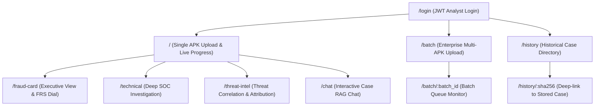

# 10 — Analyst Dashboard & UI Specification

> **Authoritative Technical Specification**  
> **Source Repository**: `SanTiwari07/Sudarshan`  
> **Last Verified Against Active Codebase**: 2026-08-25  

```yaml
Module Title:        React 18 Analyst Dashboard & UI Workflows
Version:             2.1.0
Primary Files:       frontend/src/App.tsx
                     frontend/src/pages/Upload.tsx
                     frontend/src/pages/FraudCard.tsx
                     frontend/src/pages/TechnicalView.tsx
                     frontend/src/pages/ThreatIntelView.tsx
                     frontend/src/pages/InvestigationChat.tsx
                     frontend/src/pages/BatchScan.tsx
                     frontend/src/pages/BatchDetail.tsx
                     frontend/src/pages/History.tsx
                     frontend/src/components/investigation/InvestigationShell.tsx
                     frontend/src/components/investigation/VisualImpersonationPanel.tsx
                     frontend/src/components/investigation/EvidenceDrawer.tsx
                     frontend/src/components/investigation/ScoreLedgerSlideOver.tsx
```

---

## 1. Executive Overview

The **Analyst Dashboard** is a responsive Single Page Application (SPA) built with React 18, TypeScript, Vite, and Tailwind CSS.

It translates static decompilation data, dynamic Frida runtime traces, VIDE visual clone forensics, and mathematical risk scores into intuitive, actionable views tailored for fraud analysts, SOC investigators, and executive banking leadership.

---

## 2. Navigation Structure & Routes



### Route Index:
* **`/login`**: Analyst authentication page.
* **`/` (`Upload.tsx`)**: Drag-and-drop APK upload portal with real-time stage progress polling (`0%` to `100%`).
* **`/fraud-card` (`FraudCard.tsx`)**: Executive view displaying the FRS score dial, Risk Band badge, Verdict status, plain-English summary, and CERT-In advisories.
* **`/technical` (`TechnicalView.tsx`)**: Deep SOC analyst view with tabs for Manifest, Code Findings, VIDE Impersonation, Behavioral Timeline, Frida Hooks, and Screenshot Gallery.
* **`/threat-intel` (`ThreatIntelView.tsx`)**: Threat actor attribution, IOC reputation table (VirusTotal, OTX, AbuseIPDB), and STIX 2.1 / CSV export downloads.
* **`/chat` (`InvestigationChat.tsx`)**: Interactive multi-turn chat interface querying the case findings using Gemini RAG.
* **`/batch` (`BatchScan.tsx`)**: Multi-file enterprise APK upload portal.
* **`/batch/:batch_id` (`BatchDetail.tsx`)**: Real-time batch progress monitor with per-job status, retry, and cancellation controls.
* **`/history` (`History.tsx`)**: Searchable, paginated audit trail of all previous analyses.
* **`/history/:sha256`**: Direct route to restore and view any historical case.

---

## 3. Investigation Shell (`InvestigationShell.tsx`)

`InvestigationShell.tsx` provides shared investigation tooling across all post-upload views:
* **`CaseHeader`**: Displays target APK package name, SHA-256 hash, analysis mode, and risk band badge.
* **`ScoreLedgerSlideOver`**: Slide-over panel displaying the mathematical STEI, BFCI v2, and FRS breakdown formulas with axis weights.
* **`EvidenceDrawer`**: Searchable drawer listing merged static findings, dynamic evidence records, and screenshot thumbnails.
* **`AnalystNotesPanel`**: Interactive panel allowing analysts to write, save, and persist investigation notes (`POST /api/v1/cases/{sha256}/notes`).

---

## 4. Key View Breakdown

### 4.1 Executive Fraud Card (`FraudCard.tsx`)
* **FRS Dial Gauge**: Visual semi-circular gauge displaying final risk score ($0.0 - 100.0$) and Risk Band (`Safe`, `Suspicious`, `High Risk`, `Critical`).
* **Verdict Banner**: Highlights standard risk bands or the `INCOMPLETE_EXERCISE` assertion warning.
* **Executive Summary**: Plain-English narrative summarizing malware tactics and targets.
* **Recommended Actions & Customer Advisory**: Specific defensive mitigations and customer-facing warning notices.
* **Visual Impersonation Card**: Summarizes brand clone matches detected by VIDE.

### 4.2 Technical SOC View (`TechnicalView.tsx`)
* **Manifest & Capabilities**: Declared vs dangerous permissions, exported components.
* **Decompiled Code & Secrets**: JADX-extracted fraud patterns, API calls, and hardcoded secrets.
* **Dynamic Behavioral Timeline**: Interactive `WorkflowDiagram.tsx` displaying reconstructed attack stages.
* **VIDE Forensic Panel**: Delta-E color comparison, AST tree similarity, and signer mismatch alerts.
* **Screenshot Gallery**: Authenticated image viewer loading screenshots via `GET /api/v1/screenshots/{sha256}/{filename}` with JWT blob URL conversion.

### 4.3 Enterprise Batch Scanning (`BatchScan.tsx` & `BatchDetail.tsx`)
* Multi-APK drag-and-drop intake.
* Live queue progress bar, per-job stage indicators (`NATIVE_ANALYSIS`, `SANDBOXING`, `COMPLETED`), and error details.
* Action buttons to Pause, Resume, Cancel, or Retry individual failed jobs.

### 4.4 AI Investigation Assistant Chat (`InvestigationChat.tsx`)
* Conversational interface powered by `backend/app/ai/gemini_rag.py`.
* Real-time answers grounded strictly on case findings, citing Finding IDs with zero hallucination.
