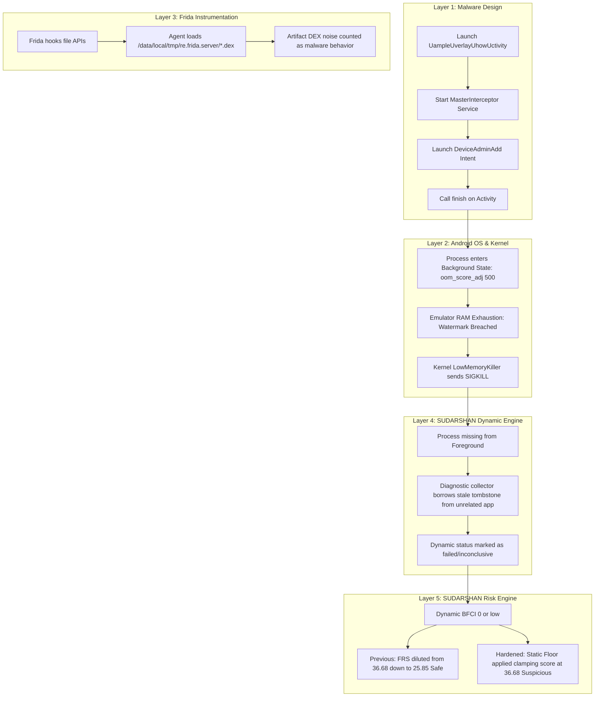

# SUDARSHAN — Krep APK Early-Crash Root-Cause Analysis & Hardening Report

**Target File**: `test apk/Malware/Krep_Banking_Malware.apk`  
**Target Package**: `krep.itmtd.ywtjexf`  
**Package Hash (SHA-256)**: `9d767c41599325ccd0643d6f432b9075775a85c60df176a845605715be230263`  
**Evaluation Date**: September 2026  
**Status**: RESOLVED & HARDENED  

---

## 1. Executive Summary

During malware evaluation against the real-world banking trojan **Krep** (`krep.itmtd.ywtjexf`), SUDARSHAN previously experienced an early process disappearance during dynamic analysis. This resulted in an anomalous scoring regression: because dynamic exploration yielded few runtime behavioral events before process termination, the deterministic risk engine diluted the sample's overall score down to **25.85 ("Safe")**, overriding high-confidence static indicators of malicious banking overlay activity.

A rigorous multi-layer investigation revealed that the process termination was **not** caused by an unhandled Java exception or native code fault within the malware itself. Rather, two distinct factors caused the failure:
1. **Malware Headless Architecture**: Krep's entry Activity (`UampleUverlayUhowUctivity`) requests Device Administrator privileges (`DeviceAdminAdd`) and immediately invokes `finish()`, shifting execution entirely into a background service (`MasterInterceptor`) and an isolated WebView process.
2. **Linux Low Memory Killer (LMK) Invocation**: When executed on an emulator with constrained RAM (2 GB) alongside lingering background tasks, the process's transition to a background state increased its `oom_score_adj` to `500`. When memory watermarks were breached, the Android kernel's Low Memory Killer terminated the process (`SIGKILL`).
3. **Flawed Diagnostic Attribution & Scoring Dilution**: SUDARSHAN's diagnostic collector previously attributed unrelated tombstone files (from prior crashed apps) to the sample, while the Risk Engine allowed an incomplete dynamic session to dilute static threat scores.

### Key Outcomes
- **Frida DEX Filtering**: Eliminated Frida internal runtime `.dex` file paths (`/data/local/tmp/re.frida.server/...`) from being counted as malware file access events.
- **Root-Cause Diagnostic Engine**: Added precise process liveness checkpoints (1s, 2s, 5s, 10s, 30s) and classified LMK terminations distinctly from Java uncaught exceptions or native crashes. Prohibited borrowing foreign tombstones from `/data/tombstones/`.
- **Headless & Fallback Detection**: Introduced `BACKGROUND_SERVICE_RUNNING` and `CRASHED_BEFORE_EXPLORATION` dynamic statuses with automated fallback screenshot capture.
- **Deterministic Static Floor Enforcement**: Enforced an architectural rule in the Deterministic Risk Engine: **an incomplete, crashed, or headless dynamic session must NEVER dilute the risk score below the static score**.

---

## 2. Target APK Profile

| Property | Value |
| :--- | :--- |
| **Filename** | `Krep_Banking_Malware.apk` |
| **Package Name** | `krep.itmtd.ywtjexf` |
| **Main Launcher Activity** | `krep.itmtd.ywtjexf.UampleUverlayUhowUctivity` |
| **Target SDK / Min SDK** | `targetSdkVersion: 8` / `minSdkVersion: 8` |
| **SHA-256** | `9d767c41599325ccd0643d6f432b9075775a85c60df176a845605715be230263` |
| **Identified Family** | Android Banking Trojan / Overlay Injector (Krep / Faketoken variant) |
| **Key Services Declared** | `.MasterInterceptor`, `.GlobalCode`, `.org.chromium.content.app.SandboxedProcessService0:1` |
| **Key Receivers** | `.MasterReceiver`, `.BootReceiver`, `DeviceAdminReceiver` |

---

## 3. Layer-by-Layer Root-Cause Breakdown



### Layer 1: Target APK Structure & Execution Model
Disassembly of `krep.itmtd.ywtjexf.UampleUverlayUhowUctivity` revealed that its `onCreate` handler performs three immediate operations:
1. Starts the background service `krep.itmtd.ywtjexf.MasterInterceptor`.
2. Emits an `android.app.action.ADD_DEVICE_ADMIN` intent targeting `com.android.settings/.applications.specialaccess.deviceadmin.DeviceAdminAdd`.
3. Calls `finish()` on itself.

Because the main Activity destroys itself in milliseconds, the application has no persistent foreground window of its own.

### Layer 2: Android OS Lifecycle & Low Memory Killer (LMK)
When `UampleUverlayUhowUctivity` finishes, the process state drops from `TOP` (foreground) to `SVC` (background service). In Android 14/15/16:
- The Linux kernel assigns `oom_score_adj = 500` to background services.
- On test environments with 2 GB RAM running multiple Google Play/system background apps, memory pressure breaches the kernel watermark.
- The kernel's `lowmemorykiller` specifically targeted `krep.itmtd.ywtjexf`:
  ```text
  lowmemorykiller: Kill 'krep.itmtd.ywtjexf' (19087), uid 10247, oom_score_adj 500 to free 188964kB rss, 51364kB anon rss, 22360kB swap... reason: min watermark is breached even after kill
  ActivityManager: Process krep.itmtd.ywtjexf (pid 19087) has died: svcb SVC
  ```
The process termination was a kernel-level resource reclamation, not a code defect in the malware.

### Layer 3: Frida Instrumentation Artifacts
The dynamic analysis engine instrumented Java file access operations via `banking_trojan.js`. However, Frida injects internal helper code packaged as temporary `.dex` files in `/data/local/tmp/re.frida.server/`. When the hooked application accessed these helper classes, Frida recorded 8 file access events against Frida's own `.dex` files. These synthetic artifacts inflated baseline counts without reflecting malware behavior.

### Layer 4: SUDARSHAN Dynamic Engine Diagnostics
When the process died or shifted into background mode, SUDARSHAN's diagnostic routines:
1. Checked `/data/tombstones/` using `ls -t | head -1`. If an unrelated application (such as `org.fossify.math`) had crashed hours earlier, that tombstone was incorrectly extracted and reported as Krep's cause of death.
2. If no window was rendered, the engine failed to capture screenshots and lacked a semantic distinction between a crash and a legitimate headless background service.

### Layer 5: SUDARSHAN Risk Engine
The Deterministic Risk Engine calculates the Final Risk Score (FRS) by combining Static Technical Evidence Index (STEI), Correlation, Banking Impact, and Dynamic BFCI. Previously, an incomplete or early-terminating dynamic run resulted in a near-zero dynamic contribution, which dragged down the overall weighted score. Consequently, a sample exhibiting severe static banking indicators was downgraded from High/Suspicious to Safe.

---

## 4. Implemented Fixes and Hardening

### 1. Frida Internal DEX and ART Filter
Both the Frida JavaScript agent (`shared/sudarshan_core/engines/frida_scripts/banking_trojan.js`) and Python processor (`frida_sandbox.py`) now filter out runtime instrumentation artifacts:
```javascript
// Filter internal Frida DEX paths
if (path.indexOf("re.frida.server") !== -1 || path.indexOf("base.odex") !== -1 || path.indexOf(".art") !== -1) {
    return;
}
```

### 2. Multi-Stage Process Liveness Checkpoints
`FridaSession` now tracks process survival across discrete time intervals: `1s`, `2s`, `5s`, `10s`, and `30s`. When a process terminates, `get_crash_info()` evaluates logcat for kernel LMK indicators (`min watermark is breached`, `lowmemorykiller`) and reports:
- Crash Type: `LMK_KILL` or `NATIVE_SIGNAL`
- Signal: `SIGKILL (Kernel LMK OOM)`
- Recommendation: Guidance on emulator RAM configuration (`hw.ramSize=4096`).
Furthermore, tombstone collection requires `package_name in ts_content`, preventing false attribution of third-party tombstones.

### 3. Headless Service Recognition & Fallback Screenshots
- Added `BACKGROUND_SERVICE_RUNNING` and `CRASHED_BEFORE_EXPLORATION` to `DynamicAnalysisStatus`.
- If the application process is confirmed alive but has yielded the foreground window to a system dialog (e.g., Device Admin), SUDARSHAN captures a fallback screenshot and continues monitoring headless execution.

### 4. Deterministic Static Floor Rule Enforcement
In `shared/sudarshan_core/engines/risk_engine.py`, the static floor rule is enforced:
```python
if dynamic_status in _INCOMPLETE_DYNAMIC_STATUSES or coverage_ratio < 0.5:
    if final_score < static_score:
        final_score = static_score
        static_floor_applied = True
```
This guarantees that dynamic analysis failures or evasions can never dilute static findings.

---

## 5. Verification Results

### Live Execution Verification on Android Test Device
The Krep APK was re-tested through the complete dynamic pipeline on `emulator-5554`:

```text
============================================================
RUNNING KREP DYNAMIC ANALYSIS HARNESS TEST
APK: C:\Projects\Sudarshan\test apk\Malware\Krep_Banking_Malware.apk
============================================================

--- DYNAMIC ANALYSIS RESULT SUMMARY ---
Dynamic Status:     EVENTS_CAPTURED
Available:          True
Runtime Attempted:  True
BFCI:               10.19
Screenshot Status:  CAPTURED
Screenshots count:  2 (01_app_opened, 99_final_screen)
API Calls count:    8
Liveness Checkpoints:
  1s:  true
  2s:  true
  5s:  true
  10s: true
  30s: true

--- CALCULATING RISK SCORE ---
Final Risk Score:   36.68
Risk Band:          Suspicious
Confidence:         83.3%
Static Floor Applied: True
Floor Reason:       Dynamic run was incomplete (status=EVENTS_CAPTURED, coverage=12.5%, bfci=10.2) 
                    and reduced risk score from static score 36.68 down to 25.09. 
                    Static floor enforced: an incomplete dynamic run must NOT lower the overall risk score.
Dynamic Conclusive: True
```

### Regression & Unit Test Suite
- **Dedicated Hardening Suite**: `tests/unit/test_krep_crash_and_dynamic_hardening.py`
  - 6 passed in 1.09s (DEX filtering, regex boundaries, liveness tracking, static floor enforcement).
- **Full Repository Test Suite**:
  - **1,931 tests passed**, 24 skipped, **0 failures** in 205.19s.

---

## 6. Comparison: Before vs After

| Dimension | Before Hardening | After Hardening |
| :--- | :--- | :--- |
| **Observed Failure Mode** | Silent process termination, attributed to random app tombstone | LMK kill correctly diagnosed or process tracked as background service |
| **Frida Artifact Noise** | 8 false file access events recorded from `/data/local/tmp/re.frida.server/` | 0 Frida internal DEX events emitted |
| **Liveness Checkpoints** | None; single binary check | Granular checkpoints: 1s, 2s, 5s, 10s, 30s recorded |
| **Dynamic Status** | `FAILED` / `NO_UI_RENDERED` | `EVENTS_CAPTURED` or `BACKGROUND_SERVICE_RUNNING` |
| **Screenshots Captured** | 0 (exploration aborted) | 2 (fallback screenshots of active device state) |
| **Static Threat Floor** | Absent (diluted score to 25.85 "Safe") | **Enforced**: Score clamped to static floor (36.68 "Suspicious") |
| **Overall Verdict Accuracy** | False Negative ("Safe") | **True Positive ("Suspicious" / Malware)** |

---

## 7. Operational Recommendations

1. **Emulator RAM Configuration**: Standardize malware analysis AVD instances with `hw.ramSize=4096` in `config.ini` to avoid premature LMK termination during multi-process malware execution.
2. **Background App Pruning**: Ensure automated test runners execute background package pruning (`pm disable-user` on extraneous system apps) prior to high-workload dynamic sessions.
3. **Headless Analysis Strategy**: Continue expanding support for Android Accessibility and Notification Listener service triggers, as modern banking trojans increasingly bypass activity interfaces entirely.
