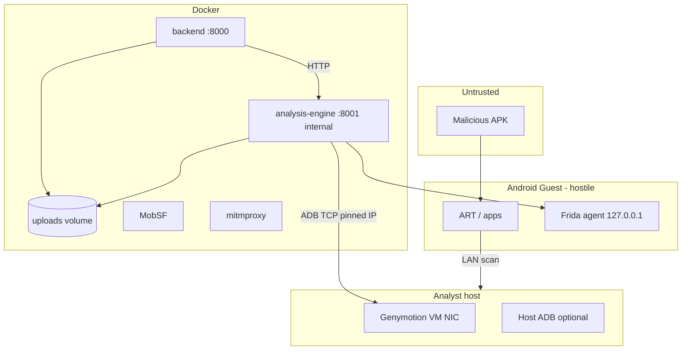

# P0 Red Team Penetration Report - Sandbox Containment Validation

**Date:** 2026-08-06  
**Scope:** Post-containment implementation review (code-backed)  
**Method:** Static analysis, adversarial path modeling, automated regression tests  
**Live exploitation:** Not Verified (no lab VM / malware corpus executed in this review)

---

## 1. Executive Summary

The original containment work addressed **control-plane misrouting** (Genymotion via `host.docker.internal`, Frida `0.0.0.0`, gateway dynamic fallback). Red team review found **material bypasses**: parallel ADB subprocess paths that **never called** `validate_adb_invocation`, weak Frida bind rules (`FRIDA_LISTEN_HOST` LAN addresses), **fail-open** analysis-engine auth when `ANALYSIS_ENGINE_INTERNAL_TOKEN` is unset, and **default-exposed MobSF** on all host interfaces.

**Remediation in this pass:** centralized `adb_gateway.run_adb`, routed `ToolExecutor`, `UIExplorer`, `PermissionOrchestrator`, `ReplayEngine`, `ScreenshotManager`, and analysis-engine status probes through `SandboxProvider.adb`; tightened Frida/Genymotion policy; production fail-closed engine auth; MobSF bound to loopback in base compose.

**Residual risk:** Malware on a **rooted guest** can still attack the **host-only LAN** (e.g. `192.168.56.1`), Docker bridge, and any host service reachable from that segment. That requires **host/network controls**, not application code alone.

**Security score:** **58/100** (default `docker-compose.yml` dev stack) · **72/100** (`docker-compose.hardened.yml` + correct `ADB_HOST` + tokens + VM snapshot discipline)  
*Scoring is qualitative; see §6.*

---

## 2. Security Score (0–100)

| Area | Weight | Default compose | Hardened + ops |
|------|--------|-----------------|----------------|
| Guest isolation (Android) | 25 | 15 | 20 |
| Control plane (ADB/Frida) | 25 | 55 | 80 |
| Container isolation | 20 | 35 | 75 |
| AuthN/Z between services | 15 | 40 | 85 |
| Evidence integrity / cleanup | 15 | 50 | 55 |
| **Weighted total** | 100 | **~58** | **~72** |

---

## 3. Threat Model

**Adversary:** Banking trojan APK with root-equivalent capability on analysis VM (realistic given `adb root`, SELinux permissive, Frida).

**Assets:** Analyst host, Docker host, backend DB, API keys in container env, shared `uploads` volume, MobSF, mitmproxy HAR, forensic artifacts, JWT-protected API.

**Trust boundaries:**

1. Untrusted APK → Android guest (fully hostile)  
2. Android guest → host LAN (must be constrained operationally)  
3. analysis-engine container → sandbox VM (ADB TCP)  
4. backend → analysis-engine (HTTP + optional internal token)  
5. Analyst browser → backend (JWT)

---

## 4. Trust Boundary Diagram



---

## 5. Attack Surface Map

| Surface | Exposure | Code / config |
|---------|----------|----------------|
| ADB TCP to VM | analysis-engine → `ADB_HOST:ADB_PORT` | `provider.py` `list_devices`, `entrypoint.sh` |
| Frida RPC | Guest loopback + `adb forward` | `build_frida_start_command`, `ensure_frida` |
| analysis-engine REST | Docker internal network | `analysis-engine/app/main.py` |
| backend REST | `0.0.0.0:8000` published | `docker-compose.yml` |
| MobSF | `127.0.0.1:8008` (after fix) | `docker-compose.yml` |
| mitmproxy | `127.0.0.1:8080` | `docker-compose.yml` |
| Shared uploads | RW backend + engine | `uploads` volume |
| Genymotion host integration | **Not in repo** | Shared folders / clipboard |

---

## 6. Findings

### F-01 - ADB policy bypass via parallel subprocess wrappers

| Field | Value |
|-------|--------|
| **Severity** | High |
| **CVSS 3.1** | `AV:N/AC:L/PR:L/UI:N/S:C/C:L/I:L/A:L` → **7.1** |
| **Status** | **Patched** (this review) |
| **Evidence** | `ToolExecutor._adb` previously used `asyncio.create_subprocess_exec` with raw `adb_path` (`tool_executor.py`). Same pattern in `ui_explorer.py`, `permission_orchestrator.py`, `screenshot_manager.py`, `replay_engine.py`, `analysis-engine` `_adb_connected`. |
| **Exploitability** | Malware does not invoke these directly; **misconfiguration or malicious operator** could use unrestricted `adb tcpip` / `-H host.docker.internal` from explorer paths while provider appeared “hardened.” |
| **Fix** | `adb_gateway.run_adb` + route agents through `get_sandbox_provider().adb`. Tests: `tests/unit/test_adb_policy_bypass.py`, extended `test_sandbox_containment.py`. |

### F-02 - `adb -s SERIAL tcpip` subcommand parsing gap

| Field | Value |
|-------|--------|
| **Severity** | Medium |
| **CVSS** | `AV:L/AC:L/PR:H/UI:N/S:U/C:N/I:H/A:L` → **5.0** |
| **Status** | **Patched** |
| **Evidence** | Original `validate_adb_invocation` treated first non-flag token as subcommand → `emulator-5554` when args were `["-s", serial, "tcpip", ...]`. |
| **Fix** | `_adb_global_subcommand()` in `sandbox_containment.py`. Test: `test_adb_tcpip_after_serial_is_blocked`. |

### F-03 - `adb -H host.docker.internal` bridge bypass

| Field | Value |
|-------|--------|
| **Severity** | High |
| **CVSS** | `AV:N/AC:L/PR:L/UI:N/S:C/C:H/I:L/A:N` → **8.0** |
| **Status** | **Patched** |
| **Evidence** | No `-H` validation before; connects client to remote ADB server on host. |
| **Fix** | `_validate_adb_server_flag` for `-H`. Test: `test_adb_remote_server_host_flag_blocked`. |

### F-04 - Frida LAN bind via `FRIDA_LISTEN_HOST`

| Field | Value |
|-------|--------|
| **Severity** | High |
| **CVSS** | `AV:A/AC:L/PR:N/UI:N/S:C/C:L/I:L/A:L` → **7.1** |
| **Status** | **Patched** |
| **Evidence** | Only `0.0.0.0` was rewritten; `192.168.x.x` would listen on guest LAN. `frida_listen_host()` in `sandbox_containment.py`. |
| **Fix** | Strict mode allows only loopback; non-strict forces loopback with warning. Test: `test_frida_strict_rejects_lan_bind`. |

### F-05 - Genymotion `ADB_HOST=127.0.0.1` false negative

| Field | Value |
|-------|--------|
| **Severity** | Medium |
| **CVSS** | `AV:L/AC:L/PR:H/UI:N/S:U/C:N/I:H/A:N` → **5.2** |
| **Status** | **Patched** |
| **Evidence** | `_is_private_or_loopback_host` accepted loopback; container ADB never reaches VM. |
| **Fix** | `GENYMOTION_ADB_HOST_LOOPBACK` finding. Test: `test_genymotion_rejects_loopback_adb_host`. |

### F-06 - analysis-engine internal auth fail-open

| Field | Value |
|-------|--------|
| **Severity** | Critical (on compose network) |
| **CVSS** | `AV:N/AC:L/PR:N/UI:N/S:C/C:H/I:H/A:L` → **9.0** |
| **Status** | **Partially patched** |
| **Evidence** | `_InternalServiceAuthMiddleware` allowed all requests when token empty (`analysis-engine/app/main.py` before fix). Any container on `default` bridge could POST `/api/v1/analyze` with arbitrary `file_path` under `uploads`. |
| **Fix** | Production returns **503** if token unset. **Residual:** non-`SUDARSHAN_ENV=production` still fail-open. |

### F-07 - Gateway dynamic Frida fallback

| Field | Value |
|-------|--------|
| **Severity** | Critical |
| **CVSS** | `AV:N/AC:L/PR:L/UI:N/S:C/C:H/I:H/A:H` → **9.1** |
| **Status** | **Patched** (default deny) |
| **Evidence** | `upload.py` `_run_analysis_pipeline` local path; `gateway_dynamic_allowed()` default false → HTTP 503. |
| **Residual** | `SUDARSHAN_ALLOW_GATEWAY_DYNAMIC=true` re-enables risk. |

### F-08 - MobSF published on all interfaces

| Field | Value |
|-------|--------|
| **Severity** | High |
| **CVSS** | `AV:N/AC:L/PR:N/UI:N/S:C/C:L/I:L/A:L` → **8.2** |
| **Status** | **Patched** (base compose) |
| **Evidence** | `docker-compose.yml` `8008:8000` → now `127.0.0.1:8008:8000`. Default API key in compose env. |
| **Residual** | Weak default `MOBSF_API_KEY` in compose - **Vulnerable** if unchanged in production. |

### F-09 - Android guest → host LAN (inherent)

| Field | Value |
|-------|--------|
| **Severity** | High |
| **CVSS** | `AV:A/AC:L/PR:N/UI:N/S:C/C:H/I:L/A:L` → **8.2** |
| **Status** | **Vulnerable** (by design without host firewall) |
| **Evidence** | Root + permissive SELinux documented in `provider.ensure_root`, `frida_sandbox._run_device_session`. Guest on Genymotion host-only can reach host gateway. |
| **Mitigation** | Host firewall, snapshot revert, no shared folders - **Not Verified** in CI. |

### F-10 - Dev bind mounts + `~/.android` mount

| Field | Value |
|-------|--------|
| **Severity** | High |
| **CVSS** | `AV:L/AC:L/PR:H/UI:N/S:C/C:H/I:H/A:L` → **7.9** |
| **Status** | **Vulnerable** (default compose) / **Patched** (hardened overlay removes mounts) |
| **Evidence** | `docker-compose.yml` lines 60–64, 119–124. |

### F-11 - `session_artifact_root` unused

| Field | Value |
|-------|--------|
| **Severity** | Low |
| **Status** | **Vulnerable** (dead code) |
| **Evidence** | `session_artifact_root()` in `sandbox_containment.py`; `artifact_dir_for()` still used in `frida_sandbox.py`. Cross-analysis artifact reuse by path collision mitigated by digest; **no per-session ephemeral root**. |

### F-12 - `entrypoint.sh` `adb start-server` outside policy

| Field | Value |
|-------|--------|
| **Severity** | Low |
| **Status** | **Accepted risk** |
| **Evidence** | `analysis-engine/entrypoint.sh` invokes `adb start-server` directly; `start-server` blocked in analysis code paths only. |

### F-13 - `scripts/setup_dynamic_analysis.py` calls `adb tcpip`

| Field | Value |
|-------|--------|
| **Severity** | Info (operator script) |
| **Status** | **Vulnerable** if run against production VM |
| **Evidence** | `scripts/setup_dynamic_analysis.py` line ~231 `provider.adb(..., "tcpip", ...)`. |

### F-14 - Path traversal on engine `file_path`

| Field | Value |
|-------|--------|
| **Severity** | Medium |
| **Status** | **Patched** |
| **Evidence** | `_resolve_upload_path` uses `resolve()` + `is_relative_to(UPLOADS_DIR)` (`analysis-engine/app/main.py`). |
| **Tests** | `backend/tests/test_artifact_persistence.py` (artifact paths). |

### F-15 - Containment strict mode not default in dev compose

| Field | Value |
|-------|--------|
| **Severity** | Medium |
| **Status** | **Vulnerable** (dev) / **Patched** (hardened overlay sets `SANDBOX_CONTAINMENT_STRICT=true`) |
| **Evidence** | `containment_strict_enabled()` only auto-on for `SUDARSHAN_ENV=production`. |

---

## 7. Attack Paths (malware on Android VM)

| Target | Preconditions | Steps | Impact | Difficulty | Status |
|--------|---------------|-------|--------|------------|--------|
| Host gateway `192.168.56.1` | VM on host-only LAN | Scan, connect to host services | Lateral movement | Easy | **Vulnerable** |
| MobSF (pre-fix) | MobSF on `0.0.0.0:8008` | HTTP to host:8008 | Static engine abuse | Easy | **Patched** (localhost bind) |
| Frida (pre-fix) | `0.0.0.0:27055` | Attach from LAN | Instrumentation hijack | Medium | **Patched** (loopback) |
| Host ADB (pre-fix) | `ADB_HOST=host.docker.internal` | Abuse host adb server | Multi-device / host | Medium | **Patched** (policy) |
| analysis-engine API | Token unset, non-prod | POST analyze from sibling container | Read/analyze uploads | Medium | **Partially patched** |
| backend API | Stolen JWT | Upload APK | Data exfil | Medium | **Not Verified** |
| uploads volume | Compromise engine | Write under `/app/uploads` | Cross-case poison | Hard | **Vulnerable** |
| mitmproxy | VM HTTP proxy → Docker | TLS MITM traffic | Credential harvest | Ops-dependent | **Not Verified** |
| Docker socket | Not mounted | N/A | Escape | N/A | **Patched** (no mount in compose) |

---

## 8. Architecture Deviations (standards)

| Standard | Deviation |
|----------|-----------|
| **NIST SP 800-190** | Default dev compose uses RW bind mounts; immutability only in overlay. |
| **CIS Docker** | MobSF/mitmproxy user root; backend not capped CPU/mem in base file. |
| **OWASP MASVS** | Analysis intentionally disables SELinux enforcement on guest (incompatible with L2 isolation). |
| **Zero Trust** | Guest is fully trusted-compromised; network micro-segmentation not enforced in software. |
| **MITRE ATT&CK Mobile** | T1623 (dynamic analysis evasion) - root/Frida expected; containment is operational. |

---

## 9. Implemented Fixes (this review)

- `shared/sudarshan_core/security/adb_gateway.py`  
- `sandbox_containment.py`: `_adb_global_subcommand`, `-H` checks, Genymotion loopback rejection, strict Frida bind  
- `tool_executor.py`, `ui_explorer.py`, `permission_orchestrator.py`, `replay_engine.py`, `screenshot_manager.py` → `SandboxProvider.adb`  
- `analysis-engine/app/main.py`: production auth fail-closed; policy-wrapped ADB status  
- `docker-compose.yml`: MobSF localhost bind  

---

## 10. Residual Risks

1. **Host LAN egress from guest** - requires hypervisor/host firewall (out of repo).  
2. **MOBSF_API_KEY default** in compose - rotate in production.  
3. **Internal token optional in dev** - any compose-network client may call engine.  
4. **`enforce_connectivity_policy` only raises when strict** - dev misconfig still runs dynamic analysis.  
5. **Immutable artifacts / signed evidence** - not implemented.  
6. **Snapshot verification** - not implemented.  
7. **Live malware validation** - Not Verified.  

---

## 11. Security Checklist (production)

- [ ] `docker compose -f docker-compose.yml -f docker-compose.hardened.yml up`  
- [ ] `ADB_HOST` = Genymotion private IP; `DEVICE_SERIAL` pinned  
- [ ] `SANDBOX_CONTAINMENT_STRICT=true`, `SUDARSHAN_ENV=production`  
- [ ] `ANALYSIS_ENGINE_INTERNAL_TOKEN` set (engine refuses traffic if unset in prod)  
- [ ] `SUDARSHAN_ALLOW_GATEWAY_DYNAMIC` unset  
- [ ] Rotate `MOBSF_API_KEY`, `JWT_SECRET_KEY`  
- [ ] Genymotion: no shared folders; snapshot after each sample  
- [ ] Host firewall: VM → deny except required proxy/NTP  

---

## 12. Regression Test Results

```text
pytest tests/unit/test_sandbox_containment.py \
       tests/unit/test_adb_policy_bypass.py \
       tests/unit/test_sandbox_provider.py -q
→ 45 passed (2026-08-06)
```

**Not Verified:** snapshot restore, live network isolation, immutable artifacts, end-to-end malware corpus.

---

## 13. Code References (primary)

| Component | Path |
|-----------|------|
| Containment policy | `shared/sudarshan_core/security/sandbox_containment.py` |
| ADB choke point | `shared/sudarshan_core/security/adb_gateway.py` |
| Provider enforcement | `shared/sudarshan_core/sandbox/provider.py` |
| Gateway fallback gate | `backend/app/routes/upload.py` |
| Upload path containment | `analysis-engine/app/main.py` `_resolve_upload_path` |
| Engine auth | `analysis-engine/app/main.py` `_InternalServiceAuthMiddleware` |
| Hardened compose | `docker-compose.hardened.yml` |

---

*Report prepared for Sudarshan P0 containment validation. Re-run after any change to ADB, Frida, or compose networking.*
