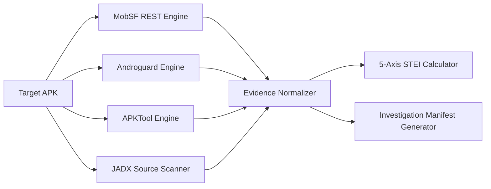
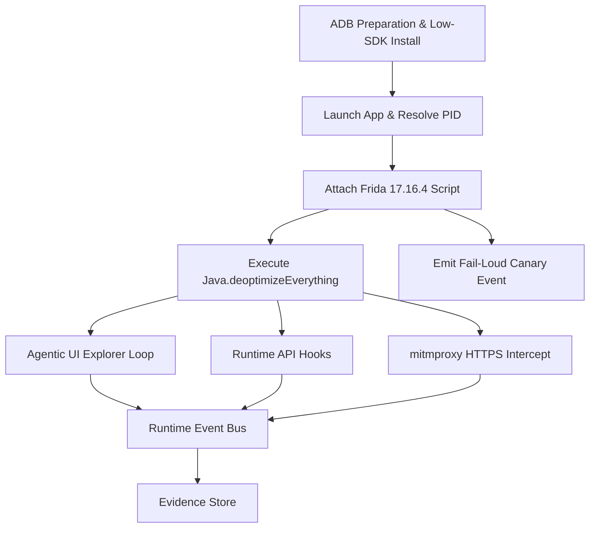

# Sudarshan: Platform Architecture and Engineering Specification

```yaml
Document Title:      Sudarshan Platform Architectural Specification
Version:             2.3.0-STABLE
Last Revision:       2026-07-25
Repository Scope:    SanTiwari07/Sudarshan (d:/Projects/Sudarshan BOI)
Target Audience:     Enterprise Security Engineers, SOC Analysts, System Architects
Verification Status: 302 / 302 Unit & Integration Tests Passing (100%)
```

---

## Table of Contents
- [1. Executive Summary](#1-executive-summary)
- [2. System Principles & Determinism Invariant](#2-system-principles--determinism-invariant)
- [3. High-Level Architecture](#3-high-level-architecture)
- [4. Repository & Directory Structure](#4-repository--directory-structure)
- [5. Backend Microservices Architecture](#5-backend-microservices-architecture)
- [6. Static Analysis Pipeline](#6-static-analysis-pipeline)
- [7. Dynamic Sandbox & Agentic Analysis Pipeline](#7-dynamic-sandbox--agentic-analysis-pipeline)
- [8. Risk Engine & Mathematical Models](#8-risk-engine--mathematical-models)
- [9. AI Intelligence Core & RAG Pipeline](#9-ai-intelligence-core--rag-pipeline)
- [10. Frontend Analyst Dashboard Architecture](#10-frontend-analyst-dashboard-architecture)
- [11. API Specifications & Data Contracts](#11-api-specifications--data-contracts)
- [12. Storage, Security & Isolation Architecture](#12-storage-security--isolation-architecture)

---

## 1. Executive Summary

**Sudarshan** is an enterprise-grade mobile threat intelligence platform designed to automate the reverse engineering, runtime behavioral analysis, and threat scoring of Android Package Kit (`.apk`) binaries. Operating at the intersection of static code decompilation, dynamic binary instrumentation, threat intelligence correlation, and evidence-constrained AI reasoning, Sudarshan converts complex binary artifacts into actionable banking fraud operational decisions.

---

## 2. System Principles & Determinism Invariant

Sudarshan adheres to four foundational engineering principles:

1. **The Determinism Invariant**: Generative AI models synthesize narrative explanations downstream, but **mathematical risk scores are strictly computed by deterministic algorithms**. No LLM invocation can alter the numerical score or risk band.
2. **Fail-Loud Canary Instrumentation**: A synthetic canary event is emitted upon Frida script injection. Runs with zero runtime evidence fail loudly, falling back gracefully to the **Static Risk Engine**.
3. **Defense-in-Depth Static Decompilation**: Combines **MobSF**, **Androguard**, **APKTool**, and **JADX** to ensure complete coverage across XML resources, raw assets, and DEX Java bytecode.
4. **Causal Chain Fraud Intelligence**: Measures behavioral sequences (e.g., Overlay Phishing $\rightarrow$ SMS Intercept) rather than merely counting isolated API calls.

---

## 3. High-Level Architecture

The platform follows a decoupled 3-container microservice architecture comprising a React SPA frontend, FastAPI gateway orchestrator, dedicated containerized analysis engine microservice (`analysis-engine`), mitmproxy sidecar, Android Virtual Device sandbox, and LLM inference engine.

```mermaid
graph TD
    subgraph Presentation Layer
        UI["React 18 SPA<br/>(TechnicalView.tsx / App.tsx)"]
    end

    subgraph API Gateway & Storage
        GATEWAY["FastAPI Orchestrator Gateway<br/>(backend/app/main.py)"]
        AUTH["JWT Auth & RBAC<br/>(app/auth/auth.py)"]
        DB[(SQLite Case Store<br/>sudarshan.db)]
        VOL[("Shared Volume /app/uploads")]
    end

    subgraph Containerized Analysis Engine Microservice (Port 8001)
        ENGINE_API["Analysis Engine REST API<br/>(analysis-engine/app/main.py)"]
        MANIFEST["Investigation Manifest<br/>(app/models/manifest.py)"]
        ANDRO["Androguard Analyzer<br/>(analyzers/apk_analyzer.py)"]
        APKT["APKTool v2.10.0 Engine<br/>(engines/apktool_engine.py)"]
        JADX["JADX v1.5.1 Engine<br/>(engines/jadx_engine.py)"]
        FRIDA["Frida Sandbox Controller<br/>(engines/frida_sandbox.py)"]
        EXPLORER["Agentic UI Explorer<br/>(engines/agentic_explorer.py)"]
    end

    subgraph External Devices & Network Sidecars
        ADB["ADB TCP Bridge<br/>(host.docker.internal:5555)"]
        AVD["Android 13 AVD<br/>(frida-server 17.16.4)"]
        PROXY["mitmproxy Sidecar<br/>(Port 8080 / HAR Parser)"]
    end

    subgraph Fraud Intelligence & Risk Core
        EVENT_BUS["Runtime Event Bus<br/>(engines/event_bus.py)"]
        EVIDENCE["Evidence Store<br/>(engines/evidence_store.py)"]
        BFCI["BFCI v2 Scorer<br/>(engines/bfci_scorer.py)"]
        WORKFLOW["Workflow Reconstructor<br/>(engines/workflow_reconstructor.py)"]
        CORRELATOR["Threat Correlator<br/>(services/threat_correlator.py)"]
        RISK_ENG["Fraud Risk Engine<br/>(engines/risk_engine.py)"]
        RAG["Gemini 2.5 RAG Core<br/>(ai/gemini_rag.py)"]
    end

    UI -->|HTTPS REST| GATEWAY
    GATEWAY --> AUTH
    GATEWAY --> DB
    GATEWAY --- VOL
    GATEWAY -->|HTTP REST / Shared Volume| ENGINE_API
    ENGINE_API --- VOL

    ENGINE_API --> MANIFEST
    MANIFEST --> ANDRO
    MANIFEST --> APKT
    MANIFEST --> JADX

    ENGINE_API --> FRIDA
    FRIDA --> ADB
    ADB --> AVD
    FRIDA --> PROXY
    FRIDA --> EXPLORER

    FRIDA --> EVENT_BUS
    EVENT_BUS --> EVIDENCE
    EVIDENCE --> BFCI
    EVIDENCE --> WORKFLOW
    WORKFLOW --> CORRELATOR
    CORRELATOR --> RISK_ENG
    RISK_ENG --> RAG
```

---

## 4. Repository & Directory Structure

```text
d:\Projects\Sudarshan BOI\
├── backend/
│   ├── app/
│   │   ├── ai/                      # RAG indexer (gemini_rag.py) & Ollama client
│   │   ├── analyzers/               # Androguard static analyzer (apk_analyzer.py)
│   │   ├── auth/                    # JWT authentication & password hashing
│   │   ├── db/                      # SQLite persistence (database.py)
│   │   ├── engines/                 # Static, dynamic, risk & workflow engines
│   │   ├── models/                  # Pydantic domain models & manifest.py
│   │   ├── routes/                  # API routers (upload.py, report.py, cases.py)
│   │   ├── services/                # MobSF client & threat correlator
│   │   └── workers/                 # Job queue dispatcher (analysis_queue.py)
│   ├── tests/                       # 299 automated unit & integration tests
│   ├── Dockerfile                   # Backend container definition
│   └── requirements.txt             # Python dependencies
├── frontend/
│   ├── src/
│   │   ├── components/              # WorkflowDiagram.tsx & UI primitives
│   │   ├── pages/                   # Upload, FraudCard, TechnicalView, ThreatIntel
│   │   ├── utils/                   # Export formatters & score derivation
│   │   ├── App.tsx                  # Main router & FraudCardData schema
│   │   └── main.tsx                 # React entry point
│   ├── Dockerfile                   # Nginx frontend container definition
│   └── package.json                 # Frontend dependencies
├── docs/                            # Documentation portal
├── docker-compose.yml               # Multi-service orchestration file
└── start.ps1                        # One-command bootstrapper script
```

---

## 5. Backend Microservices Architecture

The backend is built with **FastAPI** (Python 3.10+) utilizing asynchronous I/O (`asyncio`) and Pydantic v2 schemas:

- **Gateway & Authentication (`app/main.py`, `app/auth/auth.py`)**: Manages JWT authentication (15m access token expiry), RBAC user management, CORS headers, and SQLite initialization.
- **Async Job Queue (`app/workers/analysis_queue.py`)**: Dispatches heavy static and dynamic analysis jobs to worker threads, enabling non-blocking API operation via `/api/v1/analyze/async`.
- **Case Store Persistence (`app/db/database.py`)**: Stores complete analysis JSON records, execution metadata, and historical case indexes in `sudarshan.db`.

---

## 6. Static Analysis Pipeline

The static analysis pipeline combines four specialized decompilation engines:



### Decompilation Engine Responsibilities
1. **MobSF (`mobsf_client.py`)**: Performs primary manifest parsing, certificate evaluation, vulnerability lookup, and domain extraction via Docker container (Port 8001).
2. **Androguard (`apk_analyzer.py`)**: Native Python fallback engine when MobSF is offline; extracts permissions, activities, services, receivers, and bytecode strings.
3. **APKTool (`apktool_engine.py`)**: Standalone CLI engine that decompiles binary XML resources (`AndroidManifest.xml`), extracts layout resources, and detects single-character obfuscated resource names.
4. **JADX (`jadx_engine.py`)**: Decompiles DEX bytecode into Java source code and scans for 10 fraud-relevant code signatures (`AccessibilityService`, `SmsManager`, `DexClassLoader`, `TYPE_APPLICATION_OVERLAY`, OTP harvesting, etc.).

### Investigation Manifest (`manifest.py`)
Before sandbox execution, static findings are normalized into an `InvestigationManifest` serialized to `manifest.json`. The manifest defines:
- **Capability Flags**: `has_accessibility_abuse`, `has_sms_read_write`, `has_system_alert_window`, `targets_indian_banks`.
- **Dynamic Hook Profile Selection**: Automatically selects minimal required Frida hook profiles (`canary`, `accessibility`, `sms`, `overlay`, `banking`, `dynamic_code`, `persistence`, `network`).
- **Goal Priorities**: Adjusts 15-stage fraud goal weights to prioritize detected capabilities.

---

## 7. Dynamic Sandbox & Agentic Analysis Pipeline

Dynamic analysis executes the target APK inside an Android Virtual Device (Android 13, x86_64, 16KB page size) managed by `frida_sandbox.py`:



### Frida Runtime & ART Deoptimization
- **PID Attachment**: Resolves target PID via `adb shell pidof`, avoiding display label retries.
- **Unconditional ART Deoptimization (`banking_trojan.js`)**: Executes `Java.deoptimizeEverything()` upon script load to force the Android Runtime (ART) into interpreter mode, eliminating JIT inlining silent hook suppression.
- **Fail-Loud Canary**: Synthesizes a `canary` event on injection. If no canary is received, `dynamic_status` is marked `INSTRUMENTATION_FAILED`, triggering the **Static Fallback Risk Engine**.

### mitmproxy Sidecar Integration (`network_capture.py`)
Intercepts transparent HTTPS traffic via Docker sidecar (`mitmproxy:8080`), parses HAR dump files (`dump.har`), and merges decrypted HTTP headers, status codes, and body sizes with Frida socket/OkHttp hooks.

### Agentic UI Explorer (`agentic_explorer.py`)
An autonomous UI navigation engine guided by an LLM planner and a 15-stage fraud goal DAG (`goal_tracker.py`). Operates with screen-hash loop detection, coordinate bounds validation, and deterministic fallback actions.

---

## 8. Risk Engine & Mathematical Models

The **Fraud Risk Engine** (`risk_engine.py`) evaluates observable evidence against mathematical formulas:

### 1. Static Threat and Environmental Index ($STEI$)
$$STEI = 0.60 \times CT + 0.20 \times BT + 0.10 \times PR + 0.05 \times OB + 0.05 \times IR$$

### 2. Behavioral Fraud Confidence Index ($BFCI\text{ v2}$)
$$BFCI_{\text{v2}} = \min\left(100.0, \sum_{c} W_c \cdot \min\left(1.0, \frac{\ln(1 + N_c)}{\ln(1 + M_c)}\right) \times 100 + S_{\text{sequence}}\right)$$

### 3. Fraud Risk Score ($FRS$)
$$FRS = 0.25 \times STEI + 0.35 \times BFCI_{\text{v2}} + 0.20 \times \text{ThreatCorrelation} + 0.20 \times \text{BankingImpact}$$

---

## 9. AI Intelligence Core & RAG Pipeline

Structured findings from static and dynamic analysis are passed to the AI Intelligence Core:

- **Gemini 2.5 Flash / Ollama Integration (`ollama_client.py`)**: Generates executive narratives, fraud objectives, banking impact assessments, and CERT-In advisories.
- **Prompt Sanitization (`sanitizer.py`)**: Sanitizes all input strings extracted from decompiled code and UI layouts to prevent prompt injection attacks.
- **Gemini RAG Indexer (`gemini_rag.py`)**: Indexes findings, causal workflow stages, and threat intel into a vector RAG graph for grounded analyst Q&A in the `InvestigationChat` page.

---

## 10. Frontend Analyst Dashboard Architecture

The React 18 SPA frontend provides three primary analytical views:

1. **Executive View (`FraudCard.tsx`)**: High-level risk badge, plain-English narrative, recommended SOC actions, and regulatory advisory drafts.
2. **Technical SOC View (`TechnicalView.tsx`)**: Detailed breakdown of permissions, hardcoded URLs, dangerous APIs, IOC panel, raw evidence tabs, and the **Causal Fraud Workflow Diagram** (`WorkflowDiagram.tsx`).
3. **Threat Intelligence View (`ThreatIntelView.tsx`)**: VirusTotal detection ratios, AlienVault OTX pulses, AbuseIPDB reputation, and malware family classification.

---

## 11. API Specifications & Data Contracts

### POST `/api/v1/analyze` (Synchronous Analysis)
- **Request**: `multipart/form-data` with `file` (`.apk` binary).
- **Header**: `Authorization: Bearer <jwt_token>`
- **Response**: `AnalysisResponse` JSON object containing `sha256`, `family_classification`, `final_risk_score`, `risk_band`, `frs_breakdown`, `threat_scenario_table`, `fraud_workflow`, `intelligence_report`, `executive_view`, and `technical_view`.

### POST `/api/v1/analyze/async` (Asynchronous Job Execution)
- **Request**: `multipart/form-data` with `file`.
- **Response**: `{"status": "queued", "job_id": "<uuid>"}`

### GET `/api/v1/status/{job_id}` (Poll Job Status)
- **Response**: `{"job_id": "<uuid>", "status": "COMPLETED", "result": AnalysisResponse}`

---

## 12. Storage, Security & Isolation Architecture

- **Sandbox Isolation**: Target APKs run strictly inside the isolated Android Studio AVD. Net traffic is routed through the `mitmproxy` container.
- **Process & Storage Isolation**: Uploaded files buffer in temporary directories and clean up automatically after analysis. Case data persists in SQLite (`sudarshan.db`).
- **Authentication**: All non-public API endpoints require valid JWT Bearer tokens signed with `JWT_SECRET_KEY`.
