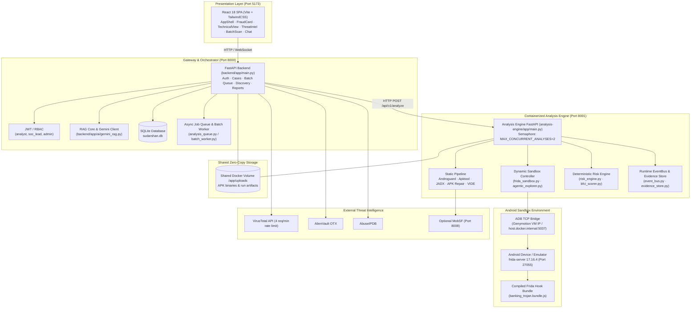
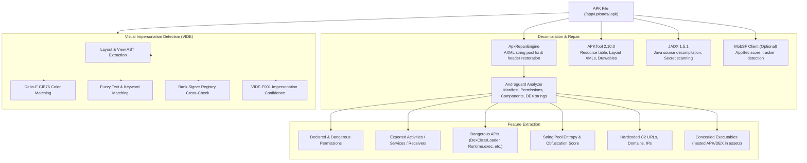
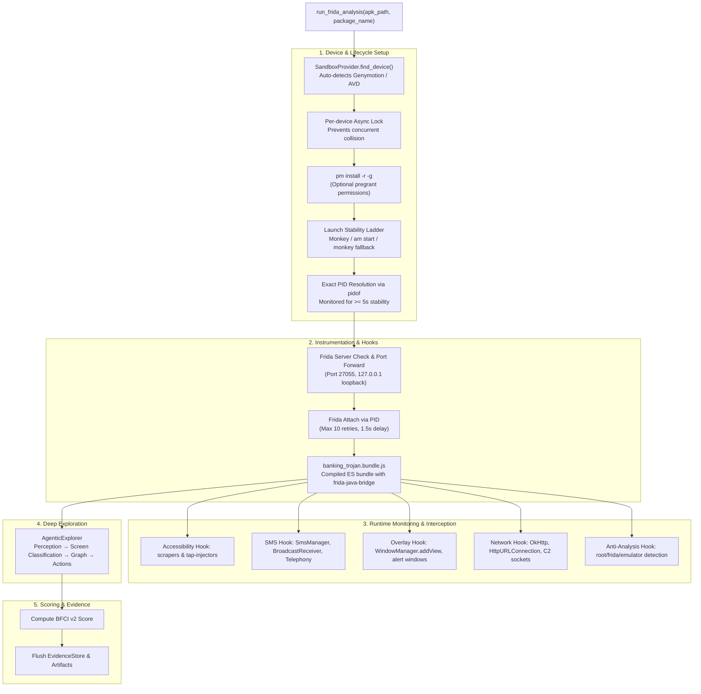
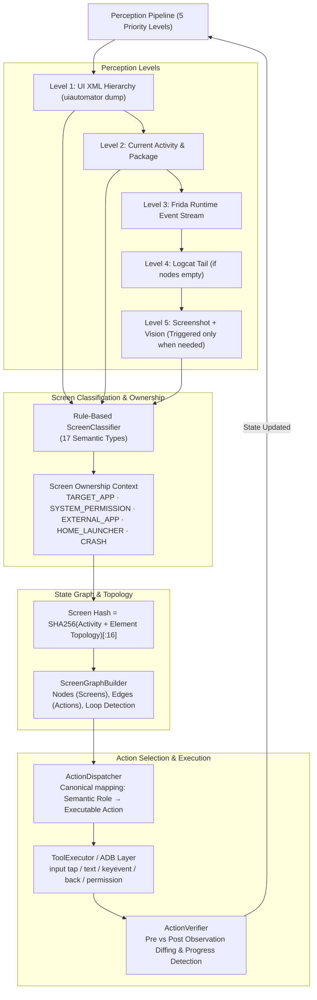
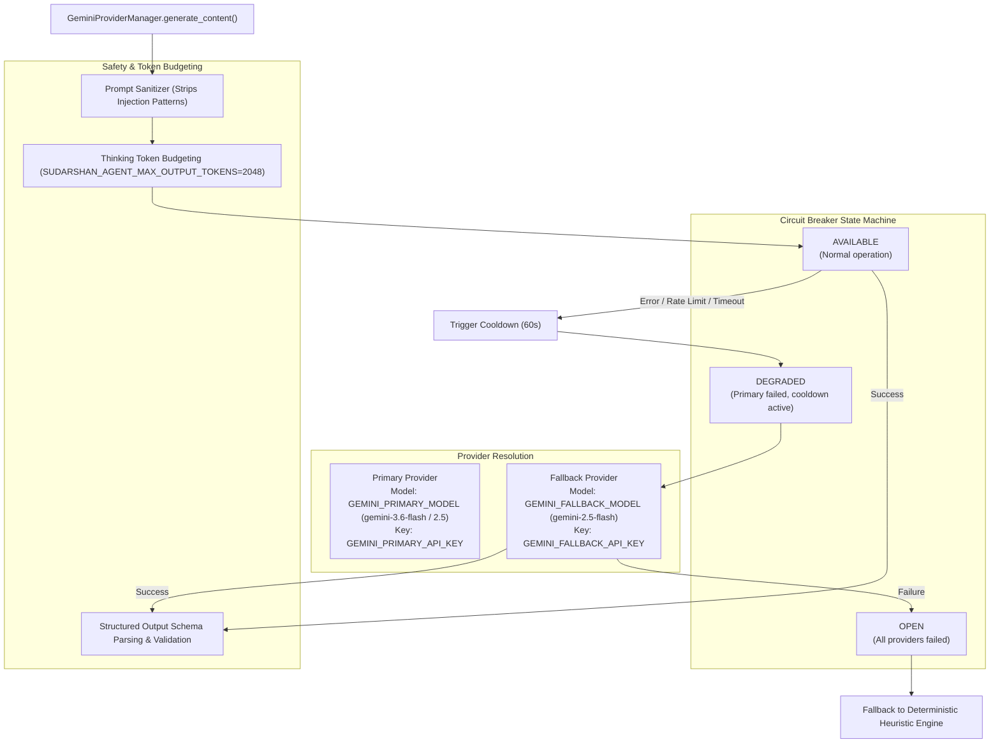
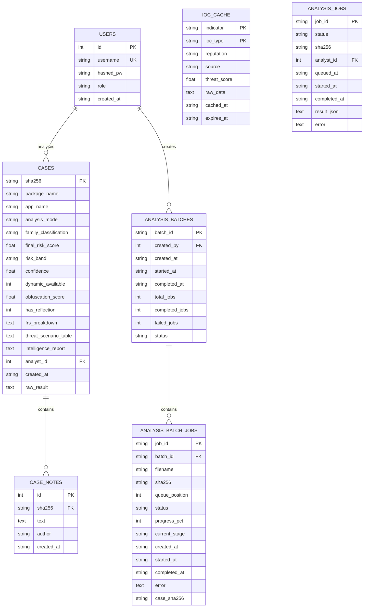

# SUDARSHAN — Current System Architecture

> **Authoritative Technical Architecture Document**  
> **Source Repository**: `SanTiwari07/Sudarshan`  
> **Platform Version**: `2.1.0` (Analysis Engine Microservice `v2.3.0`)  
> **Last Verified Against Active Codebase**: 2026-08-25  

---

## 1. System Overview

**SUDARSHAN** is an enterprise-grade mobile banking malware analysis and threat intelligence platform designed to detect, deconstruct, and attribute targeted Android banking trojans (such as **Drinik**, **Xenomorph**, **Cerberus**, **Anubis**, **SOVA**, **Hydra**, **Octo**, and **Teabot**).

The system combines:
1. **Containerized Static Analysis**: Native DEX/AXML bytecode parsing via Androguard, decompilation through APKTool 2.10.0 and JADX 1.5.1, optional MobSF enrichment, corrupted APK repair, and Visual Impersonation Detection (VIDE).
2. **Frida Dynamic Behavioral Sandbox**: Runtime instrumentation over an Android sandbox (Genymotion Desktop VM or Android Studio AVD) using a compiled Frida 17.16.4 Java-bridge hook bundle, exact PID attachment, launch stability pacing, and anti-analysis monitoring.
3. **Deterministic Deep UI Explorer**: 5-level priority perception hierarchy (UI XML, Activity, Frida events, Logcat, and Level 5 vision fallback), rule-based semantic screen classification (17 semantic types + package ownership context), state-graph hash tracking, canonical action dispatch, and state-transition progress verification.
4. **Deterministic Risk Engine (FRS)**: A strictly bounded 4-axis Fraud Risk Score (0–100) comprising 5-axis STEI (Static Threat Evaluation Index), BFCI v2 (Banking Financial Crime Impact), threat correlation, and banking impact, backed by deterministic escalation rules (such as the **CH27 On-Device Fraud Triad**) and 4 safety floors (Visibility, Static Evidence, Evasion, and Execution Assertions).
5. **AI Investigation Core & Grounded RAG**: Resilient Gemini AI client with a 3-state circuit breaker (`AVAILABLE`, `DEGRADED`, `OPEN`), primary-to-fallback key/model failover, thinking token budgeting, prompt injection sanitization, and vector RAG indexing.
6. **Enterprise Workflow & Analyst UI**: React 18 SPA with Executive Fraud Cards, Technical SOC View, Live Threat Intel, Interactive RAG Investigation Chat, and multi-file Enterprise Batch Scanning.

---

## 2. High-Level Architecture & Topology



---

## 3. End-to-End Scan Lifecycle

The complete execution flow from APK submission to report export operates as follows:

```text
1. APK Upload / Intake
   ├── Frontend POST /api/v1/analyze (Sync) or /api/v1/analyze/async
   ├── File validation: ZIP magic bytes (PK\x03\x04), extension check, MAX_UPLOAD_BYTES (200 MB)
   └── SHA-256 computation and streaming write to shared volume /app/uploads/<sha256>.apk

2. Orchestration & Delegation
   ├── Gateway attempts delegated execution to Analysis Engine microservice (http://analysis-engine:8001)
   ├── Shared secret authentication header (ANALYSIS_ENGINE_INTERNAL_TOKEN)
   └── Fallback to local gateway pipeline if microservice is offline / unconfigured

3. Static Threat Intelligence Pipeline
   ├── Primary: Bytecode analysis via Androguard (permissions, exported components, URLs, APIs, entropy)
   ├── Corruption Recovery: AXML repair via ApkRepairEngine (handles obfuscated AndroidManifest.xml)
   ├── Decompilation: APKTool 2.10.0 (smali/resources) and JADX 1.5.1 (Java decompilation, secret extraction)
   ├── VIDE Engine: UI layout extraction, Delta-E color comparison, fuzzy string matching, bank signer registry check
   └── Optional MobSF Enrichment: Runs if MOBSF_HOST is configured; non-blocking with timeout protection

4. Dynamic Sandbox & Behavioral Analysis (Conditional)
   ├── SandboxProvider discovery: Auto-detects Genymotion Desktop or Android Studio AVD via ADB
   ├── Containment check: Sandbox containment policies prevent accidental host bridging
   ├── App Lifecycle: APK install (pm install -r -g), launch stabilization ladder, exact PID resolution
   ├── Hook Injection: Injects compiled Frida bundle (banking_trojan.bundle.js) linking frida-java-bridge
   ├── Deep Exploration: AgenticExplorer drives 5-level perception, semantic screen classification, and state graph
   └── Runtime Monitoring: Telemetry collected on accessibility abuse, SMS interception, overlay windows, C2 URLs

5. Threat Intelligence Correlation
   ├── Queries VirusTotal, AlienVault OTX, and AbuseIPDB
   └── Cached with 24-hour TTL in SQLite table ioc_cache to respect API rate limits

6. Deterministic Risk Scoring & Verdict Computation
   ├── Computes 5-Axis STEI (CT, BT, PR, OB, IR)
   ├── Computes Dynamic BFCI v2 score (wa*A + ws*S + wo*O + wb*B + wn*N + wp*P)
   ├── Computes full 4-Axis FRS (0.25*STEI + 0.35*Dynamic + 0.20*Correlation + 0.20*BankingImpact)
   ├── Renormalizes weights if dynamic or correlation axes are absent/inconclusive
   ├── Applies deterministic escalations (CH27 triad, signer impersonation, visual cluster)
   └── Applies safety floors (Visibility, Static Evidence, Evasion, Execution Assertions)

7. AI Investigation Synthesis & Grounded RAG
   ├── Vector RAG index built from case findings via Gemini RAG core
   └── LLM generates Executive Narrative, Attack Graph, Mitigations, and CERT-In advisories with failover support

8. Persistence, Caching & Reporting
   ├── Full case record saved to SQLite table cases
   ├── Report cached for STIX 2.1 JSON, CSV IOC, and PDF export
   └── Telemetry streamed to frontend and accessible via case history
```

---

## 4. Static Analysis Pipeline

The static pipeline extracts structural, cryptographic, and behavioral indicators without executing code:



### Static Indicators Extracted:
* **Package & SDK Identity**: `package_name`, `version_name`, `version_code`, `min_sdk`, `target_sdk`.
* **Permissions**: Partitioned into normal and dangerous sets (`READ_SMS`, `RECEIVE_SMS`, `BIND_ACCESSIBILITY_SERVICE`, `SYSTEM_ALERT_WINDOW`, `REQUEST_INSTALL_PACKAGES`, etc.).
* **Component Surface**: Total vs. exported activities, services, receivers, content providers, intent-filter actions.
* **Obfuscation & Dynamic Loading**: String entropy calculations, `Class.forName`, `getDeclaredMethod`, `DexClassLoader`, `PathClassLoader`, `System.loadLibrary`.
* **Concealed Executables**: Detection of `.apk`, `.dex`, or encrypted payloads hidden in `assets/` or `res/raw/`.
* **VIDE Visual Impersonation**: Matching against official Indian banking baselines (SBI, HDFC, ICICI, PNB, BoI, Axis, etc.) and signature certificate fingerprint validation.

---

## 5. Dynamic Analysis Engine & Frida Sandbox

The dynamic subsystem safely runs and instruments the APK inside an Android sandbox environment:



### Key Dynamic Mechanisms:
1. **SandboxProvider Abstraction** (`shared/sudarshan_core/sandbox`): Auto-discovers devices, finds ADB binaries, handles TCP forwarding (`adb forward tcp:27055 tcp:27055`), and validates network containment.
2. **Compiled Hook Bundle** (`banking_trojan.bundle.js`): Frida 17 removed the global `Java` object; hooks are compiled with `frida-java-bridge` into a single standalone bundle (~540 KB).
3. **Exact PID Attachment**: Prevents attaching by package name (which fails on Android) by resolving the exact PID through `pidof` and monitoring process stability for $\ge 5.0\text{s}$.
4. **Launch Stability Ladder**: Tries primary launcher intent, falls back to `am start -n`, and then `monkey -p <pkg> -c android.intent.category.LAUNCHER 1`.

---

## 6. Deep Exploration Engine

The deep exploration system explores reachable UI states deterministically, prioritizing security-relevant vectors with AI assistance.



### Perception & Exploration Details:
* **Level 5 Vision Trigger**: Vision is invoked **only** if UI XML is empty, contains zero actionable nodes, fraction of labeled nodes is $<20\%$, current activity matches a known WebView class, or previous action failed.
* **Screen Classifier**: Identifies `BANK_LOGIN`, `OTP_SCREEN`, `ACCESSIBILITY_DIALOG`, `SYSTEM_PERMISSION`, `OVERLAY_ATTACK`, `UPDATE_PROMPT`, `EXTERNAL_APK`, `VPN_REQUEST`, `WEBVIEW`, `DIALOG`, `SETTINGS`, `HOME`, `CRASH_STATE`, `APP_NOT_RESPONDING`, `UNKNOWN`.
* **Loop Detection**: Flags loops when a state hash is encountered $\ge 3$ times within a 5-step window, triggering backtracking or alternate branch exploration.

---

## 7. AI & Gemini Provider Pipeline

SUDARSHAN integrates Google Gemini models for deep reasoning, attack tree synthesis, and analyst interaction with resilient failover logic:



---

## 8. Deterministic Risk Engine & FRS Math

The risk engine computes the **Fraud Risk Score (FRS)** deterministically. Machine learning or LLMs **never** calculate the numerical risk score; they only enrich findings and narratives.

### 1. 5-Axis Static Threat Evaluation Index (STEI)
$$\text{STEI} = 0.60 \times \text{CT} + 0.20 \times \text{BT} + 0.10 \times \text{PR} + 0.05 \times \text{OB} + 0.05 \times \text{IR}$$

* **$\text{CT}$ (Credential Theft, weight 0.60)**: Accessibility service abuse (+40), SMS read/intercept (+35), Overlay window (+25). Max 100.
* **$\text{BT}$ (Banking Targeting, weight 0.20)**: Matched Indian banking package names (base 20 + 10/package) or VIDE visual clone boost ($35 + 40 \times \text{conf}$). Max 100.
* **$\text{PR}$ (Permission Risk, weight 0.10)**: Weighted sum of dangerous permissions (`BIND_ACCESSIBILITY_SERVICE`: 20, `READ_SMS`: 18, `RECEIVE_SMS`: 18, `REQUEST_INSTALL_PACKAGES`: 20, `SYSTEM_ALERT_WINDOW`: 15, etc.). Max 100.
* **$\text{OB}$ (Obfuscation, weight 0.05)**: Dynamic DEX loading (+40), native libraries (+20), reflection (+25), string entropy (+15), concealed payloads in assets (+60). Max 100.
* **$\text{IR}$ (Infrastructure Risk, weight 0.05)**: Count of hardcoded C2 URLs and IP addresses (10 pts each). Max 100.

### 2. Behavioral Fraud Crime Impact (BFCI v2)
$$\text{BFCI} = 0.35 \times A + 0.25 \times S + 0.20 \times O + 0.10 \times B + 0.05 \times N + 0.05 \times P$$
Where $A=\text{Accessibility}$, $S=\text{SMS interception}$, $O=\text{Overlay}$, $B=\text{Banking}$, $N=\text{Network C2}$, $P=\text{Persistence}$.

### 3. Full Fraud Risk Score (FRS)
$$\text{FRS} = 0.25 \times \text{STEI} + 0.35 \times \text{Dynamic} + 0.20 \times \text{Correlation} + 0.20 \times \text{BankingImpact}$$

* **Dynamic Axis Exclusion & Renormalization**: If dynamic analysis is unavailable or inconclusive (e.g., app never rendered UI or was blocked by anti-analysis), the dynamic weight (0.35) is excluded and remaining weights are renormalized.
* **Correlation Axis Exclusion**: If threat intel API keys are unconfigured, correlation weight (0.20) is excluded and remaining weights are renormalized.

### 4. Deterministic Escalations & Bands
* **Risk Bands**:
  - `0–30`: **Safe**
  - `31–60`: **Suspicious**
  - `61–89`: **High Risk**
  - `90–100`: **Critical**
* **CH27 On-Device Fraud Triad Rule**: Visual Impersonation ($>0.85$ conf) + Signer mismatch + `BIND_ACCESSIBILITY_SERVICE` $\rightarrow$ Score floored to $\ge 95.0$, Band = `Critical`.
* **Signer Impersonation**: Detected $\rightarrow$ Score floored to $\ge 92.0$, Band = `Critical`.
* **Critical Visual Cluster**: Detected $\rightarrow$ Score floored to $\ge 88.0$, Band = `Critical`.

### 5. Verdict Floors
* **Visibility Floor**: Concealed executable payload detected + no substantive dynamic payload observation $\rightarrow$ Verdict floored to `Suspicious` (never certified `Safe`).
* **Static Evidence Floor**: $\text{STEI} \ge 50.0$ + empty dynamic run $\rightarrow$ Verdict floored to `Suspicious`.
* **Evasion Floor**: Anti-analysis evasion detected + no payload behavior $\rightarrow$ Verdict floored to `Suspicious`.
* **Execution Assertion Matrix**: If sample fraud preconditions were never reached during sandbox execution, `verdict` is marked `INCOMPLETE_EXERCISE` and floored to `Suspicious`.

---

## 9. Evidence & Telemetry Processing

Evidence collection links raw runtime events with high-level attack reconstructions:

1. **`RuntimeEventBus`** (`event_bus.py`): In-memory pub/sub routing runtime telemetry across hooks, scanners, and explorers.
2. **`EvidenceStore`** (`evidence_store.py`): Normalized evidence records with cryptographic hashing, timestamps, category tagging, and screenshots.
3. **`ScreenshotManager`** (`screenshot_manager.py`): Automated screenshot capture, deduplication, captioning, and bounding box annotations stored at `/app/uploads/<sha256>/screenshots/`.
4. **`WorkflowReconstructor`** (`workflow_reconstructor.py`): Reconstructs temporal fraud execution chains (e.g., Installation $\rightarrow$ Permission Escalation $\rightarrow$ C2 Registration $\rightarrow$ Phishing Overlay $\rightarrow$ OTP Exfiltration).
5. **`runtime_api.py`**: Telemetry sink exposing ring buffers and diagnostics to the frontend.

---

## 10. Database Schema & Storage

SUDARSHAN uses an async SQLite database (`sudarshan.db`) via `aiosqlite`.



---

## 11. Frontend Application Architecture

The frontend is a React 18 Single Page Application built with Vite and TailwindCSS:

* **Authentication Guard**: `AuthProvider` enforces JWT token validation and role-based access control (`analyst`, `soc_lead`, `admin`).
* **State Management**: `AnalysisContext` manages the active case state and polling hooks.
* **Core Views**:
  - **Upload (`/`)**: Drag-and-drop APK upload, real-time stage progress polling (`0%` to `100%`).
  - **Fraud Card (`/fraud-card`)**: Executive summary with FRS dial, Risk Band badge, Verdict status, plain-English narrative, recommended actions, and CERT-In advisories.
  - **Technical SOC View (`/technical`)**: Deep investigation tabs covering Manifest Findings, Decompiled Code & Strings, VIDE Impersonation comparisons, Dynamic Behavioral Timeline, Frida Hook hits, and Screenshot Gallery.
  - **Threat Intelligence View (`/threat-intel`)**: Threat actor attribution, IOC reputation table (VirusTotal, OTX, AbuseIPDB), and STIX 2.1 / CSV export.
  - **Investigation Chat (`/chat`)**: Interactive Q&A grounded on the active case findings via Gemini vector RAG.
  - **Case History (`/history` & `/history/:sha256`)**: Searchable, paginated audit trail of all previous analyses.
  - **Enterprise Batch Scan (`/batch` & `/batch/:batch_id`)**: Bulk APK upload queue management, per-job progress tracking, retry/cancellation controls.

---

## 12. Error Handling & Fallback Strategy

| Failure Scenario | Component | Fallback Behavior |
| :--- | :--- | :--- |
| Analysis Engine microservice offline | Gateway (`upload.py`) | Falls back to local gateway pipeline execution (without container limits). |
| Corrupted / Obfuscated `AndroidManifest.xml` | `apk_repair.py` | Restores string pool offsets, UTF-8 strings, and XML chunk sizes automatically. |
| MobSF container unreachable | `mobsf_client.py` | Gracefully skips MobSF; pipeline completes using native Androguard + APKTool + JADX. |
| Android Emulator / Frida offline | `frida_sandbox.py` | Skips dynamic stage, dynamic axis is excluded, and FRS renormalizes to static-only mode. |
| Gemini API quota exhausted / Error 429 | `gemini_provider.py` | Enters 60s cooldown, fails over to `GEMINI_FALLBACK_API_KEY`, or deterministic template engine. |
| Evasive malware dormancy / Sterile run | `risk_engine.py` | Triggers `INCOMPLETE_EXERCISE` assertion floor, preventing false "Safe" rating. |
| UI Hierarchy unreadable ($<20\%$ labels) | `perception.py` | Triggers Level 5 Vision observation and screenshot visual grounding. |

---

## 13. Configuration Reference

Key environment variables defined in `.env.example`:

| Variable | Purpose | Default | Required / Optional |
| :--- | :--- | :--- | :--- |
| `JWT_SECRET_KEY` | Secret key for signing JWT auth tokens | *None* | **Required** |
| `ADMIN_USERNAME` | Seeded administrative user | `admin` | Optional |
| `ADMIN_PASSWORD` | Seeded administrative password | *Randomly generated* | Optional |
| `GEMINI_PRIMARY_API_KEY` | Primary API key for Gemini models | *None* | Recommended |
| `GEMINI_PRIMARY_MODEL` | Primary model for planner and RAG | `gemini-3.6-flash` | Optional |
| `GEMINI_FALLBACK_API_KEY` | Secondary failover API key | *None* | Optional |
| `GEMINI_FALLBACK_MODEL` | Secondary failover model | `gemini-2.5-flash` | Optional |
| `VIRUSTOTAL_API_KEY` | VirusTotal v3 threat intelligence API key | *None* | Optional |
| `OTX_API_KEY` | AlienVault OTX API key | *None* | Optional |
| `ABUSEIPDB_API_KEY` | AbuseIPDB reputation API key | *None* | Optional |
| `ANDROID_SANDBOX_PROVIDER`| Sandbox discovery (`auto`, `genymotion`, `android_studio`)| `auto` | Optional |
| `ADB_HOST` | ADB server / VM host endpoint | *Host default* | Optional |
| `FRIDA_ANALYSIS_DURATION` | Dynamic execution window in seconds | `300` | Optional |
| `SUDARSHAN_PREGRANT_PERMISSIONS` | Grant runtime permissions via `pm grant` before start | `1` | Optional |
| `SUDARSHAN_AGENT_ACTION_BUDGET` | Max exploration actions per session | `60` | Optional |
| `ANALYSIS_ENGINE_URL` | Microservice endpoint | `http://analysis-engine:8001` | Optional |

---

## 14. Testing & Verification Summary

The platform includes comprehensive test suites across unit, integration, and regression levels:
* **Root Pytest Suite** (`tests/`): 57 unit test modules covering action execution, permission investigation, VIDE color & fuzzy matching, Gemini provider failover, Frida pipeline, and sandbox containment.
* **Backend Pytest Suite** (`backend/tests/`): 53 test modules covering API routes, batch queue processing, risk engine determinism, RAG indexing, PDF generation, and report exports.
* **Labelled Validation Corpus** (`scripts/validate_corpus.py`): Evaluates static-only scoring against 17 labelled ground-truth samples (8 real banking trojans, 9 benign controls) achieving **8/8 detection (100%) and 0/9 false positives (0%)**.
