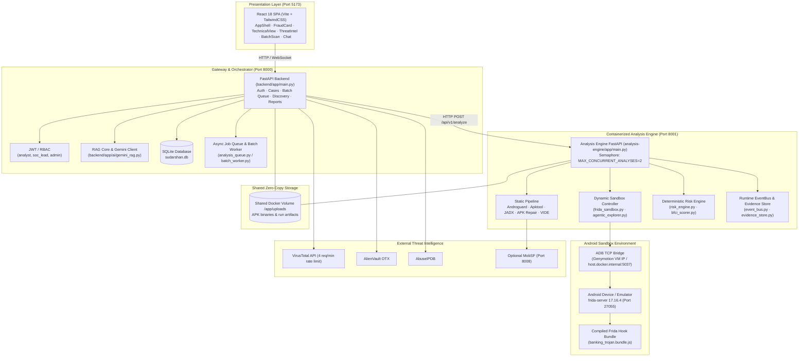
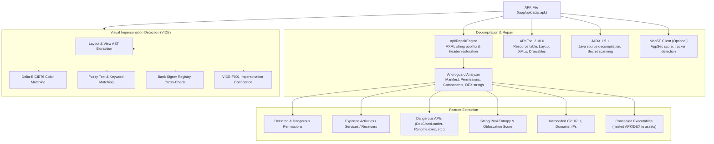
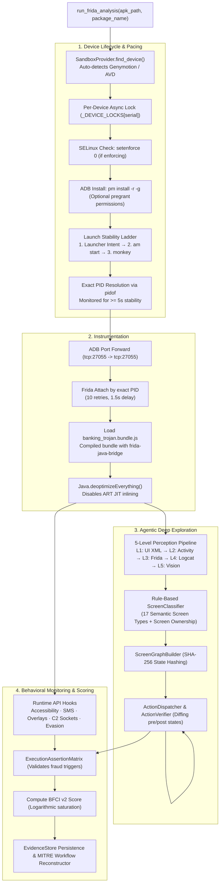
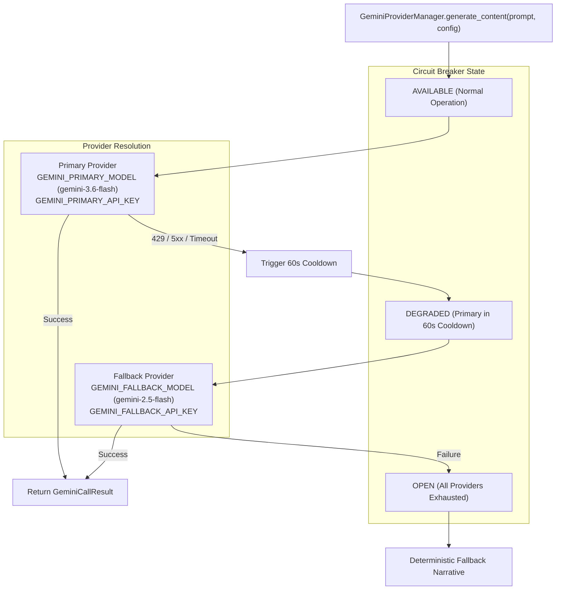

# SUDARSHAN — Current System Architecture

> **Authoritative Technical Architecture Document**  
> **Source Repository**: `SanTiwari07/Sudarshan`  
> **Platform Version**: `2.1.0` (Analysis Engine Microservice `v2.3.0`)  
> **Last Verified Against Active Codebase**: 2026-08-25  

---

## 1. System Overview

**SUDARSHAN** is an enterprise-grade mobile banking malware analysis and threat intelligence platform designed to detect, deconstruct, and attribute targeted Android banking trojans (such as **Drinik**, **Xenomorph**, **Cerberus**, **Anubis**, **SOVA**, **Hydra**, **Octo**, and **Teabot**).

The system combines:
1. **Containerized Static Analysis**: Native DEX/AXML bytecode parsing via Androguard, decompilation through APKTool 2.10.0 and JADX 1.5.1, optional MobSF enrichment, corrupted APK repair, and Visual Impersonation Detection (VIDE).
2. **Frida Dynamic Behavioral Sandbox**: Runtime instrumentation over an Android sandbox (Genymotion Desktop VM or Android Studio AVD) using a compiled Frida 17.16.4 Java-bridge hook bundle, exact PID attachment, launch stability pacing, and anti-analysis monitoring.
3. **Deterministic Deep UI Explorer**: 5-level priority perception hierarchy (UI XML, Activity, Frida events, Logcat, and Level 5 vision fallback), rule-based semantic screen classification (17 semantic types + package ownership context), state-graph hash tracking, canonical action dispatch, and state-transition progress verification.
4. **Deterministic Risk Engine (FRS)**: A strictly bounded 4-axis Fraud Risk Score (0–100) comprising 5-axis STEI (Static Threat Evaluation Index), BFCI v2 (Banking Financial Crime Impact), threat correlation, and banking impact, backed by deterministic escalation rules (such as the **CH27 On-Device Fraud Triad**) and 4 safety floors (Visibility, Static Evidence, Evasion, and Execution Assertions).
5. **AI Investigation Core & Grounded RAG**: Resilient Gemini AI client with a 3-state circuit breaker (`AVAILABLE`, `DEGRADED`, `OPEN`), primary-to-fallback key/model failover, thinking token budgeting, prompt injection sanitization, and vector RAG indexing.
6. **Enterprise Workflow & Analyst UI**: React 18 SPA with Executive Fraud Cards, Technical SOC View, Live Threat Intel, Interactive RAG Investigation Chat, and multi-file Enterprise Batch Scanning.

---

## 2. High-Level Architecture & Topology



---

## 3. Component Architecture

### 3.1 Backend Gateway (`backend/app/`)

| Module | Purpose |
|---|---|
| `main.py` | FastAPI app, router registration, startup/shutdown lifecycle, DB init |
| `routes/upload.py` | APK upload, file validation, pipeline orchestration, microservice delegation |
| `routes/report.py` | HTML / STIX 2.1 / IOC CSV / PDF export + AI chat endpoints |
| `routes/batch.py` | Enterprise batch scan queue management and job control |
| `routes/cases.py` | Case history listing, search, filtering, and single-case retrieval |
| `routes/intelligence.py` | Threat intelligence correlation and IOC cache management |
| `routes/screenshots.py` | Dynamic runtime screenshot browsing and authenticated serving |
| `routes/runtime_api.py` | Runtime telemetry sink and status queries from the analysis engine |
| `routes/baselines.py` | VIDE baseline corpus querying and admin refresh |
| `routes/resilience.py` | Investigation resilience event tracking |
| `routes/discovery.py` | APK URL web crawler discovery and candidate scanning |
| `db/database.py` | `aiosqlite` async SQLite layer (no SQLAlchemy ORM, raw SQL) |
| `auth/auth.py` | JWT authentication, password hashing, RBAC enforcement |
| `ai/gemini_client.py` | LLM narrative and advisory generation |
| `ai/gemini_rag.py` | RAG investigation vector index builder and similarity search |
| `rag/knowledge_base.py` | Knowledge-base context builder |
| `workers/analysis_queue.py` | Async single-APK job worker pool |
| `workers/batch_worker.py` | Enterprise batch scan sequential worker (prevents emulator contention) |
| `workers/baseline_refresh.py` | Periodic VIDE baseline re-ingestion |
| `startup_validation.py` | Production environment validation on startup |

### 3.2 Analysis Engine Microservice (`analysis-engine/`)

A standalone FastAPI microservice exposed on internal port `8001`:
- Receives `{file_path, sha256}` via `POST /api/v1/analyze` authenticated with `ANALYSIS_ENGINE_INTERNAL_TOKEN`
- Limits concurrent dynamic executions via `MAX_CONCURRENT_ANALYSES=2` semaphore
- Runs static analysis (Androguard + optional MobSF/APKTool/JADX) + dynamic Frida analysis + VIDE + deterministic risk scoring
- Returns raw analysis result payload to the backend gateway
- Has **no LLM or database access** (pure isolated analysis engine)

### 3.3 Shared Core Library (`shared/sudarshan_core/`)

Core modules imported across both backend and analysis-engine:

| Sub-package | Purpose |
|---|---|
| `analyzers/apk_analyzer.py` | Androguard static analysis entry point (DEX, manifest, permissions, entropy) |
| `engines/apk_repair.py` | AXML string pool and corrupted chunk header repair engine |
| `engines/frida_sandbox.py` | Frida dynamic sandbox controller (exact PID attach, pacing, transport) |
| `engines/agentic/` | Deep UI exploration subsystem (perception, screen classifier, graph, actions) |
| `engines/risk_engine.py` | Deterministic FRS scoring (5-axis STEI, BFCI, FRS, safety floors) |
| `engines/bfci_scorer.py` | Behavioral Fraud Confidence Index (v2 logarithmic volume scoring) |
| `engines/report_generator.py` | Self-contained HTML report builder |
| `engines/pdf_generator.py` | ReportLab enterprise PDF report builder |
| `engines/vide/` | Visual Impersonation Detection Engine (AST comparing, CIE76 color matching) |
| `engines/event_bus.py` | In-memory pub/sub RuntimeEventBus |
| `engines/evidence_store.py` | Evidence record structured JSON persistence |
| `engines/workflow_reconstructor.py` | Causal temporal chain reconstruction (MITRE ATT&CK stages) |
| `engines/yara_scanner.py` | YARA rule memory and string scanner |
| `engines/network_capture.py` | Runtime network interception and mitmproxy HAR parsing |
| `engines/permission_orchestrator.py`| Permission grant/deny automation |
| `engines/apktool_engine.py` | APKTool wrapper for resource/smali extraction |
| `engines/jadx_engine.py` | JADX decompiler wrapper for Java fraud signatures |
| `engines/classification_engine.py` | Rule-based deterministic malware family classifier |
| `ai/gemini_provider.py` | `GeminiProviderManager` with 3-state circuit breaker and failover |
| `ai/gemini_settings.py` | Gemini configuration loader and thinking token budgeting |
| `models/schemas.py` | Shared Pydantic data contracts |
| `models/manifest.py` | InvestigationManifest pre-sandbox data contract builder |
| `services/mobsf_client.py` | MobSF REST client |
| `services/threat_correlator.py` | VT / OTX / AbuseIPDB correlator with 24h SQLite caching |
| `sandbox/` | `SandboxProvider` abstraction (Genymotion / AVD / physical) |
| `security/` | Sandbox containment, ADB gateway, and internal token authentication |

---

## 4. End-to-End Scan Lifecycle

```
POST /api/v1/analyze (multipart APK upload)
  │
  ├── 1. Validate: ZIP magic bytes (PK\x03\x04), extension, size limit (200MB), SHA-256
  ├── 2. Save to shared volume /app/uploads/<sha256>.apk
  │
  ├── 3. Delegate to Analysis Engine (http://analysis-engine:8001/api/v1/analyze)
  │      └── Inside Analysis Engine:
  │           ├── Androguard static analysis (permissions, exported components, dangerous APIs)
  │           ├── ApkRepairEngine (AXML repair for corrupted manifests)
  │           ├── APKTool (layout XMLs, resources) & JADX (Java source decompilation)
  │           ├── InvestigationManifest pre-sandbox contract generation
  │           ├── Dynamic Frida Sandbox (if emulator ready):
  │           │    ├── Launch stability ladder & exact PID resolution via pidof
  │           │    ├── Inject banking_trojan.bundle.js (frida-java-bridge)
  │           │    ├── Java.deoptimizeEverything() to bypass ART JIT suppression
  │           │    ├── AgenticExplorer: 5-level perception, 17 screen types, state graph
  │           │    └── Runtime telemetry to EvidenceStore (Accessibility, SMS, Overlays, C2)
  │           ├── VIDE Visual Impersonation analysis (AST compare, CIE76 color matching)
  │           ├── calculate_risk_score(): 5-axis STEI, BFCI v2, FRS, safety floors
  │           └── Return raw result dict to Gateway
  │
  ├── 4. Gateway Post-Processing & Enrichment:
  │      ├── Threat correlation (VT, OTX, AbuseIPDB) via 24h SQLite cache
  │      ├── Rule-based malware family classification (Drinik, Xenomorph, Cerberus, etc.)
  │      ├── AI Investigation Synthesis via GeminiProviderManager (failover protected)
  │      ├── Vector RAG index construction (gemini_rag.py)
  │      └── Save case record to SQLite cases table
  │
  └── 5. Return AnalysisResponse JSON to Analyst Dashboard
```

---

## 5. Static Analysis Pipeline



---

## 6. Dynamic Sandbox & Deep UI Exploration



---

## 7. Deterministic Risk Engine & FRS Mathematics

$$\text{STEI} = 0.60 \times \text{CT} + 0.20 \times \text{BT} + 0.10 \times \text{PR} + 0.05 \times \text{OB} + 0.05 \times \text{IR}$$

$$BFCI_{\text{v2}} = \min\left(100.0, \sum_{c} W_c \cdot \min\left(1.0, \frac{\ln(1 + N_c)}{\ln(1 + M_c)}\right) \times 100 + S_{\text{sequence}}\right)$$

$$\text{base\_frs} = \frac{\sum_{a \in \text{live}} w_a \cdot s_a}{\sum_{a \in \text{live}} w_a}$$

$$\text{final\_risk\_score} = \min(\text{base\_frs} \times \text{ai\_confidence\_multiplier}, 100.0)$$

### Renormalization & Safety Floors:
1. **Dynamic Axis Renormalization**: If dynamic analysis is unconfigured or inconclusive (0 events captured), the `dynamic` weight (0.35) is excluded and remaining weights renormalize.
2. **Correlation Axis Renormalization**: If threat intel keys are missing, the `correlation` weight (0.20) is excluded and remaining weights renormalize.
3. **CH27 On-Device Fraud Triad Escalation**: Visual clone $>0.85$ + Signer mismatch + `BIND_ACCESSIBILITY_SERVICE` $\rightarrow$ FRS floored to $\ge 95.0$ (`Critical`).
4. **Visibility Floor**: Concealed payload + inconclusive dynamic run $\rightarrow$ floored to `Suspicious`.
5. **Static Evidence Floor**: $\text{STEI} \ge 50.0$ + empty dynamic run $\rightarrow$ floored to `Suspicious`.
6. **Execution Assertion Floor**: Prerequisite triggers unreached $\rightarrow$ `verdict="INCOMPLETE_EXERCISE"` floored to `Suspicious`.

---

## 8. AI Investigation Engine & Grounded RAG



---

## 9. SQLite Database Schema (`backend/app/db/database.py`)

The SQLite database (`sudarshan.db`) runs in WAL mode with 9 tables:

1. **`users`**: User accounts with hashed passwords (`bcrypt`) and roles (`analyst`, `soc_lead`, `admin`).
2. **`cases`**: Analysis dossiers storing 15 indexed summary columns and the full raw analysis JSON in `raw_result`.
3. **`ioc_cache`**: 24-hour TTL threat intelligence cache for VT, OTX, and AbuseIPDB.
4. **`case_notes`**: Analyst notes appended to cases.
5. **`analysis_jobs`**: Async job tracking table.
6. **`discovery_sessions`**: Web crawler APK discovery sessions.
7. **`discovery_candidates`**: Discovered APK candidate URLs and statuses.
8. **`analysis_batches`**: Enterprise batch scanning parent records.
9. **`analysis_batch_jobs`**: Individual APK jobs linked to an enterprise batch.

---

## 10. Error & Fallback Behavior

| Failure Condition | System Response & Mitigation |
|---|---|
| **Analysis Engine Unreachable** | Gateway logs WARNING; returns HTTP 503 (or falls back to local pipeline if `SUDARSHAN_ALLOW_GATEWAY_DYNAMIC=true` in dev). |
| **MobSF Offline** | Native Androguard analyzer runs; analysis completes cleanly with full static flags. |
| **APKTool / JADX Missing** | Skipped with non-fatal warning; native parser supplies all required core flags. |
| **Emulator / Device Offline** | Dynamic analysis skipped; `dynamic_conclusive=False`, dynamic axis excluded, safety floors applied. |
| **Gemini Primary Rate Limit (429)** | Circuit breaker marks primary `DEGRADED`, enters 60s cooldown, fails over to `gemini-2.5-flash`. |
| **All Gemini Providers Offline** | Generates deterministic rule-derived executive summaries and advisories with zero hallucinations. |
| **Threat Intel API Keys Missing** | Threat correlation skipped cleanly; correlation axis excluded and weights renormalized. |
| **Corrupted APK Headers** | `ApkRepairEngine` fixes AXML magic and string pool offsets before disassembler execution. |

---

## 11. Testing & Verification

Comprehensive test suites in `tests/` and `backend/tests/`:
* **920 collected tests**, **525 CI-enforced**.
* Determinism replay asserts zero score drift against `determinism_baseline.json`.
* Labelled corpus static validation achieves 8/8 trojan detection with 0/9 false positives.
