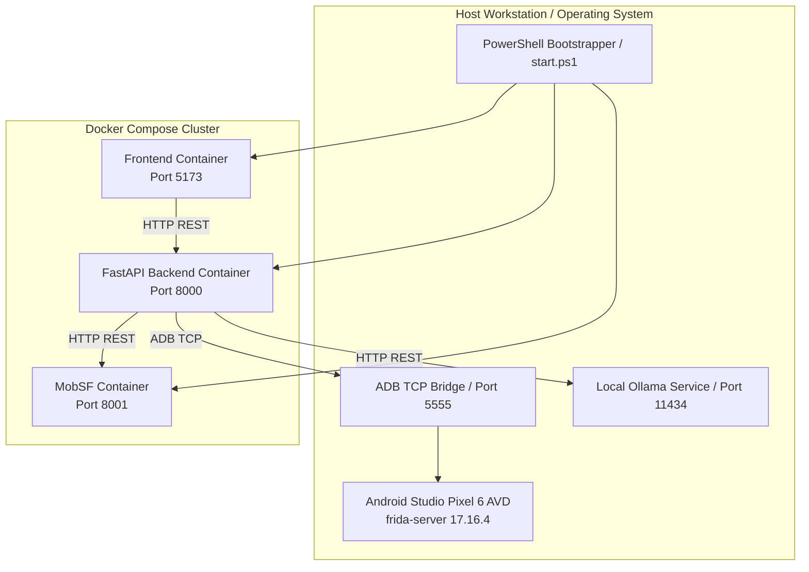

# How to Run Sudarshan — Installation & Operations Manual

## Purpose

This document provides step-by-step installation, deployment, and operational procedures for running the **SUDARSHAN** platform across local development environments, Docker container clusters, and Android Virtual Device (AVD) testbeds.

---

## Responsibilities

This guide is responsible for:
1. **Prerequisites Verification**: Specifying exact runtime dependencies (Python 3.10+, Node.js 18+, Docker Desktop, Android Studio, Frida 17, Ollama).
2. **Local & Docker Deployment**: Providing instructions for running Sudarshan via Docker Compose, PowerShell bootstrapper (`start.ps1`), or standalone terminal execution.
3. **Frida Sandbox Configuration**: Guiding the deployment of `frida-server 17.16.4` on the Android emulator and exposing ADB over TCP port 5555.
4. **Health Verification**: Providing health check endpoints and verification protocols for all microservices.

---

## High-Level Overview

Sudarshan can be launched using three deployment modes depending on environmental requirements:

```text
[ Sudarshan Deployment Modes ]
       │
       ├─► Mode 1: One-Click Bootstrapper (Windows PowerShell: .\start.ps1)
       ├─► Mode 2: Docker Compose Cluster (docker-compose up --build)
       └─► Mode 3: Standalone Local Process Execution (FastAPI + Vite)
```

---

## Architecture

Deployment architecture showing service container ports and ADB TCP bridge:



---

## Components & Deployment Requirements

System prerequisites and service allocation:

| Service / Dependency | Version | Default Port | Launch Command |
| :--- | :--- | :--- | :--- |
| **FastAPI Backend** | Python 3.10+ | `8000` | `uvicorn app.main:app --reload --port 8000` |
| **React Dashboard** | Node 18+ / Vite | `5173` | `npm run dev` |
| **MobSF Engine** | Docker Image | `8001` | `docker run -d -p 8001:8000 opensecurity/mobile-security-framework-mobsf` |
| **Android AVD** | Android 13+ | `5555` | Android Studio AVD Manager |
| **Frida Server** | `17.16.4` | `27042` | `adb shell /data/local/tmp/frida-server &` |
| **Ollama LLM** | `qwen3:8b` | `11434` | `ollama run qwen3:8b` |

---

## Workflow

Step-by-step deployment procedure:

### Option A: One-Click Bootstrapper (Windows PowerShell)
```powershell
.\start.ps1
```
This script automatically checks Python/Node installations, creates virtual environments, installs requirements, builds frontend assets, and launches the services.

### Option B: Docker Compose Deployment
```bash
# 1. Copy Environment Configuration
copy .env.example .env

# 2. Build and Launch Containers
docker-compose up --build
```

### Option C: Manual Standalone Execution

#### 1. Backend Setup
```bash
cd backend
python -m venv venv

# Windows
.\venv\Scripts\activate
# Linux / Mac
source venv/bin/activate

pip install -r requirements.txt
uvicorn app.main:app --reload --port 8000
```

#### 2. Frontend Setup
```bash
cd frontend
npm install
npm run dev
```

#### 3. Frida AVD Emulator Setup
```bash
# 1. Start your Pixel 6 AVD in Android Studio
# 2. Expose ADB over TCP
adb tcpip 5555

# 3. Push and Start frida-server 17.16.4
adb push frida-server-17.16.4-android-x86_64 /data/local/tmp/frida-server
adb shell "chmod 755 /data/local/tmp/frida-server"
adb shell "/data/local/tmp/frida-server &"
```

---

## Data Flow

Health verification flow across deployed services:

$$\text{Deployment Launch } (\texttt{docker-compose up} \text{ / } \texttt{.\textbackslash start.ps1})$$
$$\Downarrow$$
$$\text{Liveness Probes: } \texttt{GET http://localhost:8000/health} \longrightarrow \text{HTTP 200 OK}$$
$$\Downarrow$$
$$\text{Sandbox Probe: } \texttt{GET http://localhost:8000/api/v1/sandbox/status} \longrightarrow \text{\{"ready": true\}}$$
$$\Downarrow$$
$$\text{Analyst Login: } \texttt{http://localhost:5173/login} \longrightarrow \text{Default: admin / sudarshan\_admin\_2024}$$

---

## Integration

Service endpoints post-launch:
- **Analyst Dashboard**: `http://localhost:5173`
- **FastAPI OpenAPI Swagger Docs**: `http://localhost:8000/docs`
- **MobSF Static Console**: `http://localhost:8001`
- **Ollama API**: `http://localhost:11434`

---

## Folder Structure

Relevant execution scripts:

```text
Sudarshan BOI/
├── start.ps1               <- Windows PowerShell Bootstrapper
├── docker-compose.yml      <- Multi-Container Deployment Specification
├── backend/
│   ├── app/main.py         <- FastAPI Entrypoint
│   └── requirements.txt    <- Python Dependencies
└── frontend/
    ├── src/App.tsx         <- React Dashboard Root
    └── package.json        <- Frontend Node Dependencies
```

---

## Configuration

Environment variables declared in `.env`:

```env
PORT=8000
ADMIN_USERNAME=admin
ADMIN_PASSWORD=sudarshan_admin_2024
JWT_SECRET=sudarshan_jwt_secret_key_change_in_production_2024

MOBSF_HOST=http://mobsf:8000
MOBSF_API_KEY=mobsf_api_key_secret_here

ADB_HOST=host.docker.internal
ADB_PORT=5555
FRIDA_ANALYSIS_DURATION=30

GEMINI_API_KEY=your_gemini_api_key_here
GEMINI_MODEL=gemini-2.5-flash
OLLAMA_HOST=http://localhost:11434
```

---

## Error Handling

1. **ADB Connection Failure**: If the backend container cannot connect to ADB on `host.docker.internal:5555`, verify that `adb tcpip 5555` was executed on the host machine.
2. **Frida Version Mismatch**: Ensure the `frida-server` binary on the AVD matches the backend Python package version (`17.16.4`).

---

## Current Implementation Status

Deployment options are fully functional and tested under Windows PowerShell and Docker Compose.
