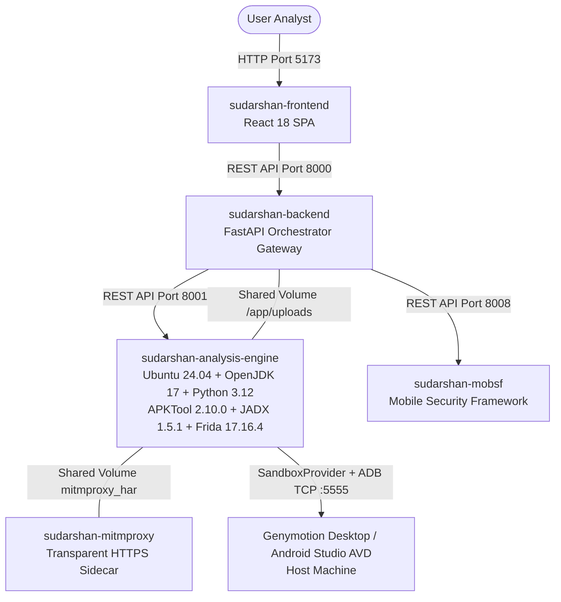

# Sudarshan Microservice & Sandbox Migration Guide

## Architecture Overview

The Sudarshan platform runs as a **5-container microservice architecture**. All heavy reverse-engineering binaries (APKTool, JADX, Java 17, Frida 17, Androguard, and ADB) live in the `analysis-engine` microservice. The **host sandbox** is abstracted behind `SandboxProvider` so Genymotion Desktop (default) or Android Studio AVD can be swapped without changing the Dynamic Analysis Engine.



---

## Genymotion Migration (Emulator Layer Only)

### What changed

| Area | Before | After |
|---|---|---|
| Default sandbox | Android Studio AVD | **Genymotion Desktop** |
| DAE ↔ device | Hardcoded ADB / `emulator-5554` assumptions | **`SandboxProvider` abstraction** |
| Device selection | First `adb devices` entry | `adb devices` + optional `DEVICE_SERIAL` |
| State simulation | `adb emu` only | Provider-specific (Genymotion: dumpsys/shell; Studio: `adb emu`) |
| Analysis / Risk / AI / MobSF | — | **Unchanged** |

### New package

```text
shared/sudarshan_core/sandbox/
├── __init__.py
├── config.py           # SANDBOX_PROVIDER, ADB_*, DEVICE_SERIAL, FRIDA_PORT, …
├── exceptions.py       # SandboxOffline, ADBUnavailable, DeviceNotFound, …
├── types.py            # DeviceInfo, FridaStatus, ConnectionResult
├── provider.py         # Abstract SandboxProvider
├── genymotion.py       # GenymotionProvider (default)
├── android_studio.py   # AndroidStudioProvider (optional)
├── future.py           # Corellium / Waydroid / physical stubs
└── factory.py          # get_sandbox_provider()
```

### Environment variables

```bash
SANDBOX_PROVIDER=genymotion   # or android_studio | corellium | waydroid | physical
# Genymotion: set ADB_HOST to the VM IP from `adb devices` (e.g. 192.168.56.101), not host.docker.internal.
# Android Studio AVD from Docker: ADB_HOST=host.docker.internal is common.
ADB_HOST=
ADB_PORT=5555
DEVICE_SERIAL=                # e.g. 192.168.56.101:5555 — recommended when multiple devices are online
FRIDA_PORT=27055
AUTO_CONNECT=true
ROOT_REQUIRED=true
```

### How to Run (Genymotion)

```powershell
# 1. Start Genymotion Desktop virtual device (rooted, Android 10/11 x86_64)
# 2. Prepare device + Frida
python scripts/setup_dynamic_analysis.py
# 3. Boot Docker stack
docker compose up --build -d
```

### Rollback to Android Studio AVD

```bash
# In .env
SANDBOX_PROVIDER=android_studio
DEVICE_SERIAL=emulator-5554   # optional pin
```

Restart `start.ps1` / `docker compose up`. No code rollback required — the Android Studio provider remains fully supported.

### Potential breaking changes

1. **Default provider is Genymotion** — operators who previously assumed Android Studio must set `SANDBOX_PROVIDER=android_studio` or start Genymotion.
2. **Error messages** no longer say “Start an AVD in Android Studio”; they reference the configured provider / structured `error_code`.
3. **Multi-stage GPS/battery/SMS** on Genymotion use shell/dumpsys instead of `adb emu` — behaviour is equivalent for analysis triggers but not byte-identical to the emulator console.
4. Empty `device_serial` defaults in `session_manager` / `ioc_collector` no longer hardcode `emulator-5554`.

### Compatibility

| Android | API | ABI | Provider |
|---|---|---|---|
| 10 | 29 | x86, x86_64 | Genymotion / Android Studio |
| 11 | 30 | x86, x86_64 | Genymotion / Android Studio |

MobSF remains static-only (`androguard` / `androguard+mobsf`). No MobSF dynamic analyzer identifier change.

---

## Key Technical Specifications

1. **`analysis-engine` Container**:
   - Base OS: **Ubuntu 24.04**
   - Java: OpenJDK 17
   - Python: 3.12 with PyPI verified `frida==17.16.4` and `frida-tools`
   - Shared Library: [`shared/sudarshan_core/`](../shared/sudarshan_core/) mounted at `/opt/sudarshan-core`
   - Network ADB: `SandboxProvider` connects using `ADB_HOST`, `ADB_PORT`, and optional `DEVICE_SERIAL` from `.env` (`AUTO_CONNECT=true`). Genymotion uses the VM endpoint visible to the host; Android Studio AVDs often use `host.docker.internal:5555` from inside containers.
   - Resource Constraints: Hard limits (`mem_limit: 4g`, `cpus: 2.0`, `no-new-privileges:true`).
   - REST API: `GET /health`, `GET /status`, `POST /api/v1/analyze`, `POST /api/v1/analyze/async`, `GET /api/v1/status/{job_id}` (optional `ANALYSIS_ENGINE_INTERNAL_TOKEN` in production).

2. **Backend Orchestrator**:
   - Contains **zero local binary dependencies** (no local `apktool`, `jadx`, `java`, `frida`, or `adb`).
   - Delegates analysis jobs to `http://analysis-engine:8001/api/v1/analyze` over internal Docker networking with optional `ANALYSIS_ENGINE_INTERNAL_TOKEN` (`shared/sudarshan_core/security/internal_auth.py`).
   - Does **not** run dynamic analysis locally when the engine is down unless `SUDARSHAN_ALLOW_GATEWAY_DYNAMIC=true` (dev only).

---

## Verification & Testing

```powershell
$env:PYTHONPATH="backend;shared"; $env:JWT_SECRET_KEY="test_secret_key_for_pytest"
backend\.venv\Scripts\python.exe -m pytest tests/unit/test_sandbox_provider.py tests/ backend/tests -q
```

### Manual verification checklist

- [ ] `adb devices` lists Genymotion serial (or AVD)
- [ ] `SANDBOX_PROVIDER=genymotion` in `.env`
- [ ] `python scripts/setup_dynamic_analysis.py` completes root + Frida
- [ ] `whoami` returns `root`
- [ ] `frida-ps` / device `ps` shows frida-server / `sudarshan_agent_srv`
- [ ] `docker compose up` — analysis-engine `/status` shows sandbox ready
- [ ] APK upload → install → launch → agentic explorer → runtime events
- [ ] Screenshots written under artifact dir
- [ ] mitmproxy HAR ingest when proxy configured
- [ ] Risk Engine / AI report / MobSF static path unchanged
- [ ] Rollback: `SANDBOX_PROVIDER=android_studio` still connects to AVD
