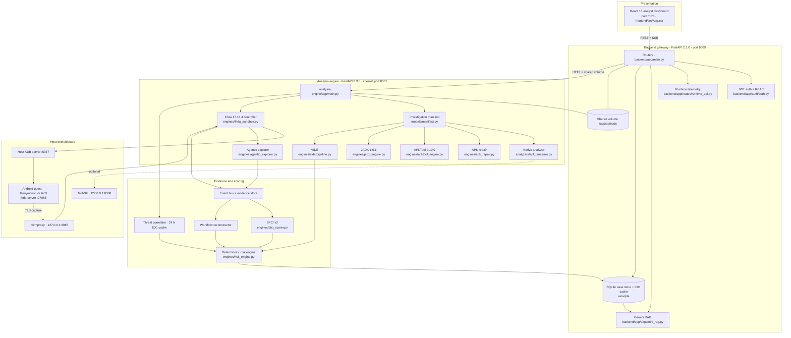

# SUDARSHAN documentation

Technical reference for the SUDARSHAN Android fraud investigation platform.

[Repository README](../README.md) · [API reference](api/ENDPOINTS.md) · [How to run](HOW_TO_RUN.md) · [Feature status](FEATURE_STATUS.md) · [Known limitations](KNOWN_LIMITATIONS.md)

---

Every document here is written against the active codebase in `SanTiwari07/Sudarshan`. Where a document and the code disagree, the code is correct and the document is a defect — report it.

Last synchronised against the codebase: **2026-08-27**.

---

## Start here

| If you are | Read, in order |
| :--- | :--- |
| Evaluating the platform | [Introduction](01_INTRODUCTION.md) → [System overview](02_SYSTEM_OVERVIEW.md) → [Feature status](FEATURE_STATUS.md) → [Known limitations](KNOWN_LIMITATIONS.md) |
| Deploying or operating it | [How to run](HOW_TO_RUN.md) → [Current architecture](CURRENT_ARCHITECTURE.md) → [Database](DATABASE.md) → [Security](#security) |
| Integrating against the API | [API endpoints](api/ENDPOINTS.md) → [System overview](02_SYSTEM_OVERVIEW.md) |
| Working on the code | [Codebase map](CODEBASE_MAP.md) → [Architecture](ARCHITECTURE.md) → the subsystem document for your area → [Contributing](CONTRIBUTING.md) |
| Investigating a case as an analyst | [Analyst dashboard](dashboard/10_DASHBOARD.md) → [Deterministic risk engine](architecture/08_DETERMINISTIC_RISK_ENGINE.md) → [Known limitations](KNOWN_LIMITATIONS.md) |

---

## Core reference

| Document | Purpose |
| :--- | :--- |
| [01 — Introduction](01_INTRODUCTION.md) | Problem statement, threat model, targeted malware families, operational scope |
| [02 — System overview](02_SYSTEM_OVERVIEW.md) | Service topology, container network, end-to-end data flow |
| [ARCHITECTURE.md](ARCHITECTURE.md) | Engineering architecture: gateway, microservice, database, shared volumes |
| [CURRENT_ARCHITECTURE.md](CURRENT_ARCHITECTURE.md) | Authoritative container topology, pipeline stages and scoring formulas |
| [CODEBASE_MAP.md](CODEBASE_MAP.md) | Directory, module and responsibility index across all four services |
| [DATABASE.md](DATABASE.md) | SQLite schema, tables, indexes and retention policy |
| [FEATURE_STATUS.md](FEATURE_STATUS.md) | Implementation status matrix with per-feature source evidence |
| [KNOWN_LIMITATIONS.md](KNOWN_LIMITATIONS.md) | Operational boundaries, impact and workarounds |
| [SUDARSHAN_MASTER.md](SUDARSHAN_MASTER.md) | Consolidated long-form platform reference |
| [PROJECT_CONTEXT.md](PROJECT_CONTEXT.md) | Programme context and design intent |

## Subsystems

| Document | Covers |
| :--- | :--- |
| [03 — Static threat intelligence](architecture/03_STATIC_THREAT_INTELLIGENCE.md) | Androguard analysis, APK repair, APKTool 2.10.0, JADX 1.5.1, investigation manifest, STEI |
| [04 — Dynamic analysis engine](architecture/04_DYNAMIC_ANALYSIS_ENGINE.md) | Sandbox providers, Frida 17 attach, ART deopt, launch ladder, deep UI exploration |
| [05 — AI investigation engine](architecture/05_AI_INVESTIGATION_ENGINE.md) | Gemini provider failover, circuit breaker, RAG grounding, prompt-injection defence |
| [06 — Evidence processing](architecture/06_EVIDENCE_PROCESSING.md) | Runtime event bus, evidence store, screenshot manager, workflow reconstruction |
| [07 — Fraud intelligence engine](architecture/07_FRAUD_INTELLIGENCE_ENGINE.md) | VirusTotal / OTX / AbuseIPDB correlation, IOC cache, family classification |
| [08 — Deterministic risk engine](architecture/08_DETERMINISTIC_RISK_ENGINE.md) | STEI, BFCI v2, FRS, axis renormalisation, escalation rules, safety floors |
| [09 — AI report generation](architecture/09_AI_REPORT_GENERATION.md) | ReportLab PDF, standalone HTML, STIX 2.1, IOC and rule exports |
| [10 — Analyst dashboard](dashboard/10_DASHBOARD.md) | React SPA views, case routes, investigation surfaces |
| [VIDE](architecture/VIDE.md) | Visual impersonation detection, baseline comparison, signer registry, CH27 |

### Dynamic analysis deep dives

| Document | Covers |
| :--- | :--- |
| [DYNAMIC_ANALYSIS_2.0.md](architecture/DYNAMIC_ANALYSIS_2.0.md) | Design of the current dynamic engine generation |
| [DYNAMIC_AXIS_OBSERVATION.md](architecture/DYNAMIC_AXIS_OBSERVATION.md) | Why an unobserved run is excluded rather than scored zero |
| [CONCEALED_SAMPLE_SCORING.md](architecture/CONCEALED_SAMPLE_SCORING.md) | Dropper and concealed-payload handling, and the visibility floor |
| [DYNAMIC_INVESTIGATION_AUDIT.md](architecture/DYNAMIC_INVESTIGATION_AUDIT.md) | Audit of the investigation path against observed runs |
| [DYNAMIC_INVESTIGATION_TESTING.md](architecture/DYNAMIC_INVESTIGATION_TESTING.md) | Test strategy for the dynamic path |
| [DYNAMIC_INVESTIGATION_LIVE_VALIDATION.md](architecture/DYNAMIC_INVESTIGATION_LIVE_VALIDATION.md) | Results of live-device validation runs |
| [DYNAMIC_ANALYSIS_PORTABILITY.md](DYNAMIC_ANALYSIS_PORTABILITY.md) | Moving the sandbox between hosts and providers |
| [DAE_CURRENT_STATE.md](DAE_CURRENT_STATE.md) | Resolution state of the dynamic engine's known defects |

## Operations

| Document | Purpose |
| :--- | :--- |
| [HOW_TO_RUN.md](HOW_TO_RUN.md) | Prerequisites, Docker Compose setup, `start.ps1`, emulator connectivity |
| [MIGRATION.md](MIGRATION.md) | Upgrade and data migration procedures |
| [VALIDATION.md](VALIDATION.md) | Determinism replay, ground-truth matrix, pipeline validation |
| [YARA_RULES.md](YARA_RULES.md) | YARA integration and rule authoring |
| [BOI_DEMO_CREDENTIALS.md](BOI_DEMO_CREDENTIALS.md) | Demonstration account configuration — placeholders only, never real secrets |

## API

| Document | Purpose |
| :--- | :--- |
| [api/ENDPOINTS.md](api/ENDPOINTS.md) | Every active route: method, path, required role, request body, response |

## Evaluation

| Document | Purpose |
| :--- | :--- |
| [11 — Evaluation strategy](evaluation/11_EVALUATION.md) | Test suite structure, verification protocols, determinism invariant |
| [CORPUS_STATIC_VALIDATION.md](evaluation/CORPUS_STATIC_VALIDATION.md) | Measured static-only accuracy over 17 labelled samples |
| [VIRUSTOTAL_CROSSCHECK.md](evaluation/VIRUSTOTAL_CROSSCHECK.md) | Engine verdicts cross-checked against VirusTotal |
| [BENCHMARKS.md](evaluation/BENCHMARKS.md) | Timing and throughput measurements |
| [CASE_STUDIES.md](evaluation/CASE_STUDIES.md) | Worked investigations with per-axis scores |

## Security

| Document | Purpose |
| :--- | :--- |
| [P0_SANDBOX_ESCAPE_INCIDENT.md](security/P0_SANDBOX_ESCAPE_INCIDENT.md) | Containment incident, remediation and the hardened Compose overlay |
| [P0_RED_TEAM_PENETRATION_REPORT.md](security/P0_RED_TEAM_PENETRATION_REPORT.md) | Red-team findings, ADB bypass fixes, residual risk |

## Project

| Document | Purpose |
| :--- | :--- |
| [CONTRIBUTING.md](CONTRIBUTING.md) | Development setup, testing, review expectations |
| [CHANGELOG.md](CHANGELOG.md) | Documentation-scoped change history (repository changelog: [../CHANGELOG.md](../CHANGELOG.md)) |
| [12 — Future work](future/12_FUTURE_WORK.md) | Planned direction; nothing here is implemented |
| [report/](report/README.md) | LaTeX prototype report sources |

## Component READMEs

| Component | Document |
| :--- | :--- |
| Backend gateway | [../backend/README.md](../backend/README.md) |
| Analysis engine | [../analysis-engine/README.md](../analysis-engine/README.md) |
| Shared core | [../shared/README.md](../shared/README.md) |
| Frontend | [../frontend/README.md](../frontend/README.md) |
| Scripts | [../scripts/README.md](../scripts/README.md) |
| Tests | [../tests/README.md](../tests/README.md) |
| Frida setup notes | [../backend/README_FRIDA.md](../backend/README_FRIDA.md) |

---

## Platform architecture

---

## Conventions used in these documents

- **Source is authoritative.** Every non-obvious claim names the file that implements it.
- **Deterministic and AI-assisted are distinguished explicitly.** The risk engine owns the score; the model owns the prose. A document that blurs this is wrong.
- **Absence of evidence is stated as such.** "The sandbox observed nothing" and "the sample is clean" are different claims and are never written interchangeably.
- **Measurements carry a date and a commit.** A number without provenance is not a measurement.
- **No credentials.** Placeholders only, in every example.
