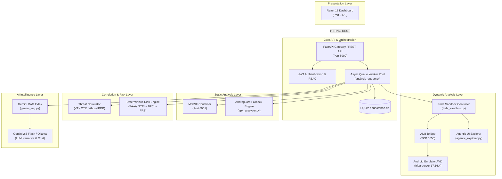
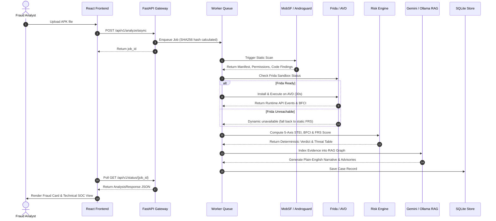

# Sudarshan Enterprise Documentation Portal

## Purpose

The **Sudarshan Documentation Portal** serves as the central index, architectural reference, and operational guidebook for the **SUDARSHAN Banking Threat Intelligence Platform**. It provides security researchers, reverse engineers, SOC analysts, software engineers, and regulatory auditors with accurate, evidence-backed documentation detailing the design, implementation state, data flows, and technical components of the Sudarshan platform.

---

## Responsibilities

The primary responsibilities of this documentation system are:
1. **System Indexing**: Provide a clear, structured navigation map linking all system architecture, component specifications, evaluation benchmarks, and operational manuals.
2. **Implementation Ground Truth**: Maintain strict separation between **Implemented**, **Partial**, and **Planned** features based on direct source code verification.
3. **Architectural Transparency**: Detail the 5-axis Static Threat and Environmental Index (STEI), Behavioral Fraud Confidence Index (BFCI), Fraud Risk Score (FRS), and RAG-grounded AI reasoning engines without relying on black-box assumptions.
4. **Developer & Analyst Onboarding**: Provide exact setup, execution, configuration, and API reference materials to enable local deployment and enterprise integration.

---

## High-Level Overview

Sudarshan is an automated mobile threat intelligence and malware investigation platform tailored for banking fraud operations. When a suspicious Android Package Kit (APK) is uploaded, Sudarshan executes an automated multi-stage analysis pipeline:

1. **Static Analysis**: Decompiles the binary, parses `AndroidManifest.xml`, inspects DEX bytecode, and identifies dangerous permissions, hardcoded secrets, and API signatures via MobSF or native Androguard fallback.
2. **Dynamic Analysis**: Deploys the APK to an Android Virtual Device (AVD), attaches Frida 17 runtime hooks, and executes goal-directed automated UI exploration via `AgenticExplorer` to capture behavioral signals.
3. **Threat Correlation**: Queries VirusTotal, AlienVault OTX, and AbuseIPDB while applying deterministic rule matching to classify known malware families (e.g., *Drinik*, *Xenomorph*, *Cerberus*).
4. **Deterministic Risk Scoring**: Evaluates observable evidence against mathematical formulas ($STEI$, $BFCI$, $FRS$) to yield a reproducible risk score ($0.0 - 100.0$) and severity band.
5. **AI Investigation & Report Generation**: Feeds structured evidence into an evidence-constrained Large Language Model (Gemini 2.5 Flash or local Ollama) to produce plain-English narratives, SOC recommendations, regulatory advisories, STIX 2.1 bundles, and HTML reports.

---

## Architecture

The Sudarshan platform operates as a decoupled microservices-ready architecture comprising a React 18 SPA frontend, a FastAPI asynchronous backend, a MobSF container, an AVD with Frida server, and an external/local LLM provider.



---

## Components

The core components across the repository are categorized in the table below:

| Component Category | Primary Modules / Files | Responsibility / Description |
| :--- | :--- | :--- |
| **API Gateway & Auth** | `backend/app/main.py`<br/>`backend/app/auth/auth.py` | FastAPI application routes, JWT token issuance, password hashing (bcrypt), and RBAC user management. |
| **Analysis Routers** | `backend/app/routes/upload.py`<br/>`backend/app/routes/report.py`<br/>`backend/app/routes/cases.py` | Synchronous/asynchronous upload endpoints, status polling, report exports (HTML/STIX/CSV), case history. |
| **Static Analyzers** | `backend/app/services/mobsf_client.py`<br/>`backend/app/analyzers/apk_analyzer.py` | MobSF REST API integration and Androguard bytecode/manifest analyzer fallback. |
| **Dynamic Engines** | `backend/app/engines/frida_sandbox.py`<br/>`backend/app/engines/multi_stage_engine.py`<br/>`backend/app/engines/agentic_explorer.py` | ADB controller, Frida script injection (`banking_trojan.bundle.js`), 15-stage fraud goal DAG explorer. |
| **Risk Engine** | `backend/app/engines/risk_engine.py` | Calculates 5-axis $STEI$, $BFCI$, and $FRS$ scores; generates the granular Threat Scenario Table. |
| **Threat Correlator** | `backend/app/services/threat_correlator.py`<br/>`backend/app/engines/classification_engine.py` | External threat intelligence lookup and deterministic malware family classification. |
| **AI Intelligence** | `backend/app/ai/gemini_rag.py`<br/>`backend/app/ai/ollama_client.py`<br/>`backend/app/engines/agentic/sanitizer.py` | Gemini 2.5 Flash / Ollama RAG graph, streaming investigation assistant, prompt sanitization. |
| **Data & State** | `backend/app/db/database.py`<br/>`backend/app/models/schemas.py` | SQLite database schema (`sudarshan.db`), Pydantic v2 domain schemas. |
| **Frontend UI** | `frontend/src/App.tsx`<br/>`frontend/src/pages/*` | React 18 SPA featuring Executive, Technical SOC, Threat Intel, AI Chat, and Case History views. |

---

## Workflow

The execution sequence for an incoming APK analysis job operates as follows:



---

## Data Flow

Data moves unidirectionally through the analysis pipeline:

$$\text{Raw APK File} \longrightarrow \text{SHA256 Hashing \& File Storage}$$
$$\Downarrow$$
$$\text{Static Analysis (MobSF / Androguard)} \longrightarrow \text{Extracted Signals (10,000+ indicators)}$$
$$\Downarrow$$
$$\text{Dynamic Analysis (Frida / ADB)} \longrightarrow \text{Runtime Events \& API Call Traces}$$
$$\Downarrow$$
$$\text{Threat Correlation (VT / OTX / AbuseIPDB)} \longrightarrow \text{External Reputation \& Family Classification}$$
$$\Downarrow$$
$$\text{Deterministic Risk Engine} \longrightarrow \text{5-Axis STEI + BFCI } \Rightarrow \text{Fraud Risk Score (FRS)}$$
$$\Downarrow$$
$$\text{RAG Context Builder} \longrightarrow \text{LLM Prompt Injection Filter (sanitizer.py)}$$
$$\Downarrow$$
$$\text{Gemini 2.5 Flash / Ollama} \longrightarrow \text{Plain-English Narrative \& Customer Advisory}$$
$$\Downarrow$$
$$\text{SQLite Store \& React Dashboard} \longleftarrow \text{JSON Export / STIX 2.1 / HTML Report}$$

---

## Algorithms

The risk engine relies on three deterministic mathematical algorithms:

### 1. Static Threat and Environmental Index ($STEI$)
$$STEI = 0.60 \cdot CT + 0.20 \cdot BT + 0.10 \cdot PR + 0.05 \cdot OB + 0.05 \cdot IR$$
- **Credential Theft ($CT$, weight $0.60$)**: Accessibility service ($+40$), SMS read/receive ($+35$), System alert window ($+25$).
- **Banking Targeting ($BT$, weight $0.20$)**: Base $+20$ for any Indian banking package match, $+10$ per additional package up to $+100$.
- **Permission Risk ($PR$, weight $0.10$)**: Sum of weighted dangerous permissions declared in manifest.
- **Obfuscation ($OB$, weight $0.05$)**: `DexClassLoader` ($+40$), `System.loadLibrary` ($+20$), reflection ($+25$), string entropy ($>0.5$).
- **Infrastructure Risk ($IR$, weight $0.05$)**: Hardcoded C2 URLs/IPs ($+10$ per indicator up to $+100$).

### 2. Behavioral Fraud Confidence Index ($BFCI$)
$$BFCI = (0.35 \cdot A) + (0.25 \cdot S) + (0.20 \cdot O) + (0.10 \cdot B) + (0.05 \cdot N) + (0.05 \cdot P)$$
Where $A$ = Accessibility Abuse, $S$ = SMS Interception, $O$ = Overlay Attacks, $B$ = Banking Interaction, $N$ = Network C2, $P$ = Persistence.

### 3. Fraud Risk Score ($FRS$)
- **With Dynamic Analysis Available**:
  $$FRS = 0.25 \cdot STEI + 0.35 \cdot BFCI + 0.20 \cdot Correlation + 0.20 \cdot BankingImpact$$
- **Static-Only Fallback**:
  $$FRS = 0.50 \cdot STEI + 0.25 \cdot Correlation + 0.25 \cdot BankingImpact$$

---

## Documentation Navigation

The documentation suite is organized into the following detailed modules:

| Document | Path | Primary Focus |
| :--- | :--- | :--- |
| **Documentation Portal** | [README.md](file:///d:/Projects/Sudarshan%20BOI/docs/README.md) | Central index, technology stack, directory layout, quick start. |
| **Introduction** | [01_INTRODUCTION.md](file:///d:/Projects/Sudarshan%20BOI/docs/01_INTRODUCTION.md) | Problem statement, design principles, target audience, core objectives. |
| **System Overview** | [02_SYSTEM_OVERVIEW.md](file:///d:/Projects/Sudarshan%20BOI/docs/02_SYSTEM_OVERVIEW.md) | System-wide architecture, processing pipeline, enterprise feasibility. |
| **Static Threat Intelligence** | [architecture/03_STATIC_THREAT_INTELLIGENCE.md](file:///d:/Projects/Sudarshan%20BOI/docs/architecture/03_STATIC_THREAT_INTELLIGENCE.md) | MobSF integration, Androguard, manifest/code analyzers, secret scanners. |
| **Dynamic Analysis Engine** | [architecture/04_DYNAMIC_ANALYSIS_ENGINE.md](file:///d:/Projects/Sudarshan%20BOI/docs/architecture/04_DYNAMIC_ANALYSIS_ENGINE.md) | Frida sandbox, frida-server 17.16.4, AVD bridge, Agentic Explorer. |
| **AI Investigation Engine** | [architecture/05_AI_INVESTIGATION_ENGINE.md](file:///d:/Projects/Sudarshan%20BOI/docs/architecture/05_AI_INVESTIGATION_ENGINE.md) | Gemini 2.5 Flash, Ollama, RAG evidence index, prompt sanitization. |
| **Evidence Processing** | [architecture/06_EVIDENCE_PROCESSING.md](file:///d:/Projects/Sudarshan%20BOI/docs/architecture/06_EVIDENCE_PROCESSING.md) | EvidenceStore, EventBus, MITRE mapper, YARA, screenshot manager. |
| **Fraud Intelligence Engine** | [architecture/07_FRAUD_INTELLIGENCE_ENGINE.md](file:///d:/Projects/Sudarshan%20BOI/docs/architecture/07_FRAUD_INTELLIGENCE_ENGINE.md) | Threat correlator, VirusTotal, AlienVault OTX, AbuseIPDB, family rules. |
| **Deterministic Risk Engine** | [architecture/08_DETERMINISTIC_RISK_ENGINE.md](file:///d:/Projects/Sudarshan%20BOI/docs/architecture/08_DETERMINISTIC_RISK_ENGINE.md) | 5-axis STEI, BFCI, FRS mathematical models, threat scenario matrix. |
| **AI Report Generation** | [architecture/09_AI_REPORT_GENERATION.md](file:///d:/Projects/Sudarshan%20BOI/docs/architecture/09_AI_REPORT_GENERATION.md) | HTML Jinja2 reports, STIX 2.1 JSON exporter, IOC CSV export. |
| **Dashboard Specification** | [dashboard/10_DASHBOARD.md](file:///d:/Projects/Sudarshan%20BOI/docs/dashboard/10_DASHBOARD.md) | React 18 SPA, state flow, Executive Fraud Card, Technical SOC View. |
| **Evaluation Strategy** | [evaluation/11_EVALUATION.md](file:///d:/Projects/Sudarshan%20BOI/docs/evaluation/11_EVALUATION.md) | Test suite structure (285 tests), determinism replay testing. |
| **Case Studies** | [evaluation/CASE_STUDIES.md](file:///d:/Projects/Sudarshan%20BOI/docs/evaluation/CASE_STUDIES.md) | InsecureBankv2 and real banking trojan sample walkthroughs. |
| **Benchmarks** | [evaluation/BENCHMARKS.md](file:///d:/Projects/Sudarshan%20BOI/docs/evaluation/BENCHMARKS.md) | Execution latencies, memory bounds, determinism verification. |
| **Future Work** | [future/12_FUTURE_WORK.md](file:///d:/Projects/Sudarshan%20BOI/docs/future/12_FUTURE_WORK.md) | eBPF kernel telemetry floor, Cuttlefish integration, rule DSL. |
| **How to Run** | [HOW_TO_RUN.md](file:///d:/Projects/Sudarshan%20BOI/docs/HOW_TO_RUN.md) | Complete local and Docker installation instructions. |
| **Project Context** | [PROJECT_CONTEXT.md](file:///d:/Projects/Sudarshan%20BOI/docs/PROJECT_CONTEXT.md) | Master context document for developer onboarding. |
| **DAE Current State** | [DAE_CURRENT_STATE.md](file:///d:/Projects/Sudarshan%20BOI/docs/DAE_CURRENT_STATE.md) | Direct assessment of Frida 17 / ART inlining dynamic engine status. |
| **Validation Rules** | [VALIDATION.md](file:///d:/Projects/Sudarshan%20BOI/docs/VALIDATION.md) | Ground-truth verification constraints. |
| **Changelog** | [CHANGELOG.md](file:///d:/Projects/Sudarshan%20BOI/docs/CHANGELOG.md) | Release notes and version history. |
| **Contributing Guide** | [CONTRIBUTING.md](file:///d:/Projects/Sudarshan%20BOI/docs/CONTRIBUTING.md) | Development standards, linting, and pull request rules. |

---

## Folder Structure

The repository maintains a flattened, modular folder organization:

```text
Sudarshan BOI/
├── backend/                        <- FastAPI Backend Application
│   ├── app/
│   │   ├── ai/                     <- LLM & Gemini RAG Indexing (gemini_rag.py, ollama_client.py)
│   │   ├── analyzers/              <- Androguard Fallback Analyzer (apk_analyzer.py)
│   │   ├── auth/                   <- JWT Auth & Password Hashing (auth.py)
│   │   ├── db/                     <- SQLite Database Connection & Initialization (database.py)
│   │   ├── engines/                <- Core Logic (risk_engine.py, frida_sandbox.py, agentic_explorer.py)
│   │   │   ├── agentic/            <- Planner, Memory, Goal Tracker, Sanitizer, Tool Executor
│   │   │   └── frida_hooks/        <- JS Hooks (banking_trojan.bundle.js, banking_trojan.js)
│   │   ├── models/                 <- Pydantic Domain Schemas (schemas.py)
│   │   ├── rag/                    <- Knowledge Base Embeddings (knowledge_base.py)
│   │   ├── routes/                 <- API Endpoint Handlers (upload.py, report.py, cases.py)
│   │   ├── services/               <- MobSF Integration & Threat Correlator
│   │   └── workers/                <- Async Analysis Queue (analysis_queue.py)
│   ├── tests/                      <- Pytest Test Suite (285 passing tests)
│   ├── Dockerfile                  <- Backend Container Definition
│   └── requirements.txt            <- Python Dependencies
├── frontend/                       <- React 18 SPA Application
│   ├── src/
│   │   ├── pages/                  <- FraudCard, TechnicalView, ThreatIntelView, Chat, History
│   │   ├── utils/                  <- Derived UI Formatting Helpers (derive.ts)
│   │   └── App.tsx                 <- Main Router & Navigation Bar
│   ├── package.json                <- Node.js Dependencies
│   └── vite.config.ts              <- Vite Server Configuration
├── docs/                           <- System Documentation Hierarchy
├── start.ps1                       <- One-Click Windows Bootstrapper
└── docker-compose.yml              <- Multi-Container Orchestration File
```

---

## Quick Start

### Prerequisites
- **Python 3.10+** and **Node.js 18+**
- **Docker Desktop** (for MobSF container)
- **Android Studio** with Pixel 6 AVD (`google_apis_ps16k`, x86_64, Android 13+)
- **ADB** exposed over TCP (`adb tcpip 5555`)

### One-Click Bootstrapper (Windows PowerShell)
```powershell
.\start.ps1
```

### Docker Compose Launch
```bash
docker-compose up --build
```

### Key Access URLs
- **Fraud Analyst Dashboard**: `http://localhost:5173`
- **Backend API Gateway Docs**: `http://localhost:8000/docs`
- **MobSF Static Engine**: `http://localhost:8001` (Credentials: `mobsf` / `mobsf`)

---

## Technology Stack

- **Frontend**: React 18, TypeScript, Vite 5, Tailwind CSS, Lucide React Icons.
- **Backend**: Python 3.11, FastAPI (ASGI), Pydantic v2, `aiosqlite`, `databases`.
- **Static Analysis**: MobSF (Dockerized), Androguard (`apk_analyzer.py`).
- **Dynamic Analysis**: Frida 17.16.4 (`frida-java-bridge` bundle), ADB TCP, Android Studio AVD.
- **Risk Engine**: Custom deterministic Python implementation (`risk_engine.py`).
- **AI / LLM**: Gemini 2.5 Flash (`google-genai`), Ollama (`qwen3:8b`), local vector RAG.
- **Containerization**: Docker Compose (`backend`, `frontend`, `mobsf`).

---

## Development Workflow

1. **Environment Setup**: Copy `.env.example` to `.env` and populate API keys (`GEMINI_API_KEY`, `VT_API_KEY`, `OTX_API_KEY`, `ABUSEIPDB_API_KEY`).
2. **Backend Execution**:
   ```bash
   cd backend
   python -m venv venv
   .\venv\Scripts\activate
   pip install -r requirements.txt
   uvicorn app.main:app --reload --port 8000
   ```
3. **Frontend Execution**:
   ```bash
   cd frontend
   npm install
   npm run dev
   ```
4. **Running Tests**:
   ```bash
   cd backend
   pytest
   ```

---

## API Reference Summary

| Method | Endpoint | Description |
| :--- | :--- | :--- |
| `POST` | `/api/v1/auth/login` | Authenticate user & return JWT Bearer token. |
| `POST` | `/api/v1/analyze` | Synchronous APK analysis (returns complete `AnalysisResponse`). |
| `POST` | `/api/v1/analyze/async` | Asynchronous APK upload (returns `job_id` for polling). |
| `GET` | `/api/v1/status/{job_id}` | Poll async job status & retrieve analysis result. |
| `GET` | `/api/v1/sandbox/status` | Query current Frida sandbox readiness on AVD. |
| `GET` | `/api/v1/report/html/{sha256}` | Download printable Jinja2 HTML security report. |
| `GET` | `/api/v1/report/stix/{sha256}` | Export STIX 2.1 JSON intelligence bundle. |
| `GET` | `/api/v1/report/csv/{sha256}` | Export extracted IOCs in CSV format. |

---

## Configuration

Main environment variables configured in `.env` or `docker-compose.yml`:

```env
# Backend API & Gateway
PORT=8000
ADMIN_USERNAME=admin
ADMIN_PASSWORD=sudarshan_admin_2024
JWT_SECRET=sudarshan_jwt_secret_key_change_in_production_2024

# Third-Party Engine Services
MOBSF_HOST=http://mobsf:8000
MOBSF_API_KEY=mobsf_api_key_secret_here

# Dynamic Frida Sandbox
ADB_HOST=host.docker.internal
ADB_PORT=5555
FRIDA_ANALYSIS_DURATION=30
SUDARSHAN_EXPLORER_MODE=ai

# AI & LLM Services
GEMINI_API_KEY=your_gemini_api_key_here
GEMINI_MODEL=gemini-2.5-flash
OLLAMA_HOST=http://localhost:11434
```

---

## Error Handling

1. **MobSF Unavailability**: If MobSF is offline or errors during scan, `_run_analysis_pipeline` catches `MobSFNotAvailable` / `MobSFAnalysisError` and seamlessly degrades to the native `Androguard` analyzer (`apk_analyzer.py`).
2. **Frida Unreachability**: If the AVD is off or Frida server is stopped, `get_sandbox_status()` returns `ready: False`. The pipeline falls back to the static-only FRS formula ($FRS = 0.50 \cdot STEI + 0.25 \cdot Correlation + 0.25 \cdot BankingImpact$).
3. **LLM Failure**: If Gemini API returns a 404 or connection fails, `ollama_client.py` falls back to local Ollama or returns structured deterministic fallback narratives without crashing the job.

---

## Current Implementation Status

| Feature / Subsystem | Status | Technical Rationale |
| :--- | :--- | :--- |
| **Static Analysis Pipeline** | **Implemented** | MobSF & Androguard extract permissions, components, secrets, and obfuscation. |
| **Deterministic Risk Engine** | **Implemented** | 5-Axis STEI, BFCI, and FRS formulas fully implemented and covered by tests. |
| **Dynamic Analysis Engine** | **Partial** | Frida hooks attach, but 0 events fire due to Frida 17 / ART inlining on 16KB AVD; BFCI computes 0.0 in practice. |
| **Evidence Processing** | **Partial** | `EvidenceStore` schema defined (~60% built); waiting on dynamic event stream recovery. |
| **AI RAG Investigation Assistant** | **Implemented** | Gemini 2.5 Flash RAG graph indexed per SHA256 with streaming response support. |
| **Threat Correlation** | **Implemented** | VirusTotal, AlienVault OTX, AbuseIPDB integration & family classification rules active. |
| **React Dashboard** | **Implemented** | Complete SPA with Executive, Technical, Threat Intel, Chat, and History views. |

---

## Current Limitations

1. **Dynamic Event Silence**: Due to Frida 17 method hook silent failures on the 16KB page-size AVD image (`google_apis_ps16k`), dynamic analysis produces 0 events and defaults to a 0.0 BFCI score.
2. **Goal DAG Stall**: `AgenticExplorer` stage 5 ("Login Flow") requires specific UI hooks; when missing, stages 6–10 are skipped.
3. **Malware Corpus**: Evaluation relies primarily on `InsecureBankv2` and `UnCrackable-Level1` due to licensing and containment constraints surrounding live banking trojan samples.

---

## Future Improvements

1. **Dynamic Engine Recovery**: Implement Frida `Java.deoptimizeEverything()` and canary hooks to assert runtime instrumentation health.
2. **eBPF Telemetry Floor**: Replace user-space Frida hooking with kernel-level eBPF/tracepoint monitoring on Cuttlefish AVD.
3. **Behavior Graph Reconstruction**: Construct dynamic event graphs to link Accessibility abuse, SMS interception, and C2 exfiltration into a single temporal fraud workflow.
