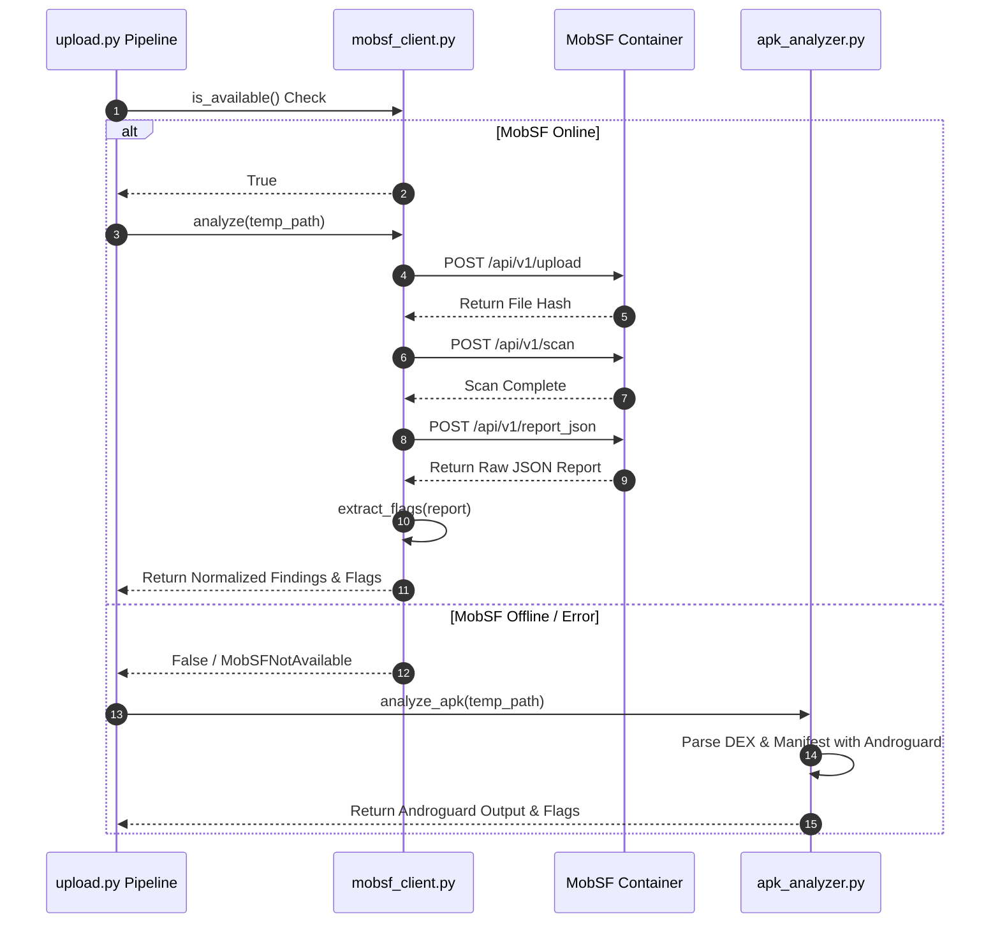

# 03 — Static Threat Intelligence Engine

## Purpose

The **Static Threat Intelligence Engine** is responsible for unpacking Android Package Kit (`.apk`) binaries, decompiling Android DEX bytecode, parsing the binary XML manifest (`AndroidManifest.xml`), extracting hardcoded secrets, inspecting string pools, and identifying dangerous permission requests and API signatures. It provides the primary static signal foundation ($10,000+$ indicators) consumed by the classification and risk scoring engines.

---

## Responsibilities

The static analysis engine is specifically tasked with:
1. **Binary Unpacking & Hashing**: Calculating SHA256 file hashes and buffering uploaded binaries to temporary disk storage.
2. **Manifest Analysis**: Parsing `AndroidManifest.xml` to extract package names, declared permissions, components (Activities, Services, Broadcast Receivers, Content Providers), and intent filters.
3. **Bytecode Inspection**: Scanning DEX files via Dex2Jar/Jadx/Androguard for dynamic code loading (`DexClassLoader`), native library calls (`System.loadLibrary`), reflection, and WebView JavaScript bridges.
4. **MobSF Integration & Fallback**: Interfacing with a containerized Mobile Security Framework (MobSF) instance via REST API, with automated fallback to native Androguard parsing (`apk_analyzer.py`) if MobSF is unavailable.
5. **Static Indicator Extraction**: Identifying hardcoded URLs, IP addresses, API keys, certificate details, and Indian banking package targets.

---

## High-Level Overview

Static analysis serves as the first line of defense in the Sudarshan processing pipeline. Upon receiving an APK binary, the engine checks whether MobSF is available. If MobSF is running, it uploads the APK to the MobSF REST API, triggers a full scan, parses the resulting JSON report, and extracts structured findings.

If MobSF is unreachable, the engine falls back to native Python-based Androguard static extraction (`apk_analyzer.py`), ensuring that system analysis continues without interruption.

```text
[ Uploaded APK File ]
          │
          ▼
[ Check MobSF Readiness ]
          │
    ┌─────┴────────────────────────────────┐
    │ MobSF Available                      │ MobSF Unavailable / Exception
    ▼                                      ▼
[ MobSF REST Client ]               [ Androguard Analyzer ]
(mobsf_client.py)                   (apk_analyzer.py)
    │                                      │
    ├─ Upload Binary (/api/v1/upload)      ├─ Load APK via Androguard
    ├─ Trigger Scan (/api/v1/scan)         ├─ Parse Package & Manifest
    └─ Fetch Report (/api/v1/report_json)  └─ Extract Permissions & Strings
    │                                      │
    └──────────────────┬───────────────────┘
                       │
                       ▼
          [ Static Flag Extraction ]
          - Accessibility Service Abuse Flag
          - SMS Read/Write Flag
          - System Alert Window Flag
          - Indian Bank Package Matches
          - Obfuscation Entropy Score
          - Reflection & Dynamic Loading Flags
```

---

## Architecture

The Static Threat Intelligence Engine consists of two primary services operating within the FastAPI backend context:

```mermaid
graph TD
    subgraph Ingestion Layer
        UP[Upload Endpoint / upload.py]
        TMP[Temp Storage Buffer]
    end

    subgraph Primary Static Engine (MobSF Container)
        MC[MobSF Client / mobsf_client.py]
        MS[MobSF Docker Container<br/>Port 8001]
    end

    subgraph Fallback Static Engine
        AG[Androguard Analyzer / apk_analyzer.py]
    end

    subgraph Flag & Finding Normalization
        FL[Static Flag Extractor]
        MF[Manifest Finding Mapper]
        CF[Code Finding Mapper]
    end

    UP --> TMP
    TMP --> MC
    MC -->|HTTP POST| MS
    
    MS -- Error / Timeout --> AG
    MC -- Success --> FL
    AG --> FL

    FL --> MF
    FL --> CF
```

---

## Components

The technical components comprising the Static Threat Intelligence Engine include:

| Class / Service / Module | Source File | Description |
| :--- | :--- | :--- |
| `MobSFClient` | `backend/app/services/mobsf_client.py` | Async HTTP client communicating with MobSF over REST (`/api/v1/upload`, `/api/v1/scan`, `/api/v1/report_json`). Extracts flags, permissions, and secrets. |
| `apk_analyzer.py` | `backend/app/analyzers/apk_analyzer.py` | Standalone Python module using `androguard.core.bytecodegen` and `androguard.core.apk.APK` for native manifest and string pool extraction. |
| `StaticAnalysisFlags` | `backend/app/models/schemas.py` | Pydantic v2 data model holding static Boolean flags, obfuscation scores, and list of matched bank packages. |
| `ManifestFinding` | `backend/app/models/schemas.py` | Pydantic schema representing manifest-level vulnerabilities (e.g., exported components, dangerous permissions). |
| `CodeFinding` | `backend/app/models/schemas.py` | Pydantic schema representing code-level findings (e.g., hardcoded cryptographic keys, insecure HTTP endpoints). |

---

## Workflow

Static analysis execution proceeds through six ordered steps:



---

## Data Flow

Data flow through the static analyzer moves from raw bytes to normalized Pydantic flag models:

$$\text{Raw APK File Path}$$
$$\Downarrow$$
$$\text{MobSF Analysis / Androguard Decompilation}$$
$$\Downarrow$$
$$\text{Raw Structural JSON (Permissions, Components, Strings, Secrets, Entropy)}$$
$$\Downarrow$$
$$\text{StaticAnalysisFlags Model}$$
$$\left\{ \text{has\_accessibility}, \text{has\_sms}, \text{has\_overlay}, \text{targets\_indian\_banks}, \text{obfuscation\_score} \right\}$$

---

## Algorithms

The static engine executes deterministic rule matching algorithms to evaluate application risk signals:

### 1. Indian Banking Package Matcher
Inspects declared intent filters, component package names, and hardcoded string pools against a pre-compiled registry of major Indian financial institutions:
- `com.sbi.lotusintouch` (State Bank of India)
- `com.bankofindia.mobile` (Bank of India)
- `com.icicibank.mobilebanking` (ICICI Bank)
- `com.hdfcbank.netbanking` (HDFCBANK)
- `com.axis.mobile` (Axis Bank)
- `com.punjabnationalbank` (PNB)

### 2. String Entropy Obfuscation Scoring
Calculates Shannon entropy across extracted class and method string pools:
$$H(X) = -\sum_{i=1}^{n} P(x_i) \log_2 P(x_i)$$
High entropy ($H > 0.5$) indicates string obfuscation, encrypted payload wrappers, or packed DEX files, feeding directly into the Obfuscation ($OB$) axis of the STEI formula.

---

## Integration

The Static Threat Intelligence Engine interfaces directly with downstream risk and correlation modules:

```text
+-------------------------------------------------------------------------+
|                  STATIC THREAT INTELLIGENCE ENGINE                      |
|                                                                         |
|  +---------------------------+         +-----------------------------+  |
|  | MobSF Container (8001)    |         | Androguard Fallback         |  |
|  +-------------+-------------+         +--------------+--------------+  |
|                |                                      |                 |
|                +------------------+-------------------+                 |
|                                   |                                     |
|                                   v                                     |
|                  +----------------------------------+                   |
|                  | StaticAnalysisFlags Dict         |                   |
|                  +----------------+-----------------+                   |
|                                   |                                     |
|            +----------------------+----------------------+              |
|            |                                             |              |
|            v                                             v              |
|  +-------------------+                         +---------------------+  |
|  | Deterministic Risk|                         | Gemini RAG Graph    |  |
|  | Engine (STEI Axis)|                         | (gemini_rag.py)     |  |
|  +-------------------+                         +---------------------+  |
+-------------------------------------------------------------------------+
```

---

## Folder Structure

Relevant source code locations for static analysis:

```text
backend/
├── app/
│   ├── analyzers/
│   │   └── apk_analyzer.py      <- Native Androguard Static Fallback Analyzer
│   ├── services/
│   │   └── mobsf_client.py      <- MobSF Container REST API Integration Client
│   ├── models/
│   │   └── schemas.py           <- StaticAnalysisFlags & Finding Pydantic Models
│   └── routes/
│       └── upload.py            <- Analysis Pipeline Controller & Flag Orchestrator
```

---

## API Reference

The MobSF integration communicates via internal REST endpoints:

### MobSF Container Internal Endpoints
- `POST http://mobsf:8000/api/v1/upload` — Upload APK file to MobSF.
- `POST http://mobsf:8000/api/v1/scan` — Perform static decompilation and scan.
- `POST http://mobsf:8000/api/v1/report_json` — Fetch completed JSON static report.

---

## Configuration

Environment variables configured in `.env` or `docker-compose.yml`:

| Variable | Default Value | Description |
| :--- | :--- | :--- |
| `MOBSF_HOST` | `http://mobsf:8000` | MobSF service container URL. |
| `MOBSF_API_KEY` | `mobsf_api_key_secret_here` | REST API key for MobSF authentication. |

---

## Error Handling

1. **MobSF Connection Exception**: If `MobSFClient.is_available()` returns `False` or raises `httpx.ConnectError`, `upload.py` logs a warning (`MobSF failed, falling back to Androguard`) and executes `analyze_apk()` natively.
2. **Corrupted APK File**: If Androguard fails to parse an APK due to zip corruption or malformed headers, `apk_analyzer.py` catches `Exception` and returns a clean fallback dictionary with `package_name = "Unknown"`.

---

## Current Implementation Status

| Component | Status | Implementation Details |
| :--- | :--- | :--- |
| **MobSF REST Client** | **Implemented** | `mobsf_client.py` handles upload, scan, report retrieval, and flag parsing. |
| **Androguard Fallback** | **Implemented** | `apk_analyzer.py` provides native static analysis without external dependencies. |
| **Banking Package Detection**| **Implemented** | Regex matching against Indian banking app package identifiers active. |
| **Secret & URL Scanners** | **Implemented** | Hardcoded API keys, JWTs, and HTTP endpoints extracted and normalized. |

---

## Current Limitations

1. **Native Library Decompilation**: Neither MobSF nor Androguard performs deep decompilation of packed ARM/x86 `.so` native libraries; native code is flagged via `System.loadLibrary` presence.
2. **MobSF Scan Latency**: MobSF static scans take 15–45 seconds depending on APK size, contributing to overall synchronous analysis latency.

---

## Future Improvements

1. **Static YARA Bytecode Rules**: Integrate custom `yara-python` rule scanning against unzipped DEX bytecode during static analysis.
2. **Async MobSF Polling Optimization**: Implement non-blocking asynchronous polling intervals for large APK scans.
