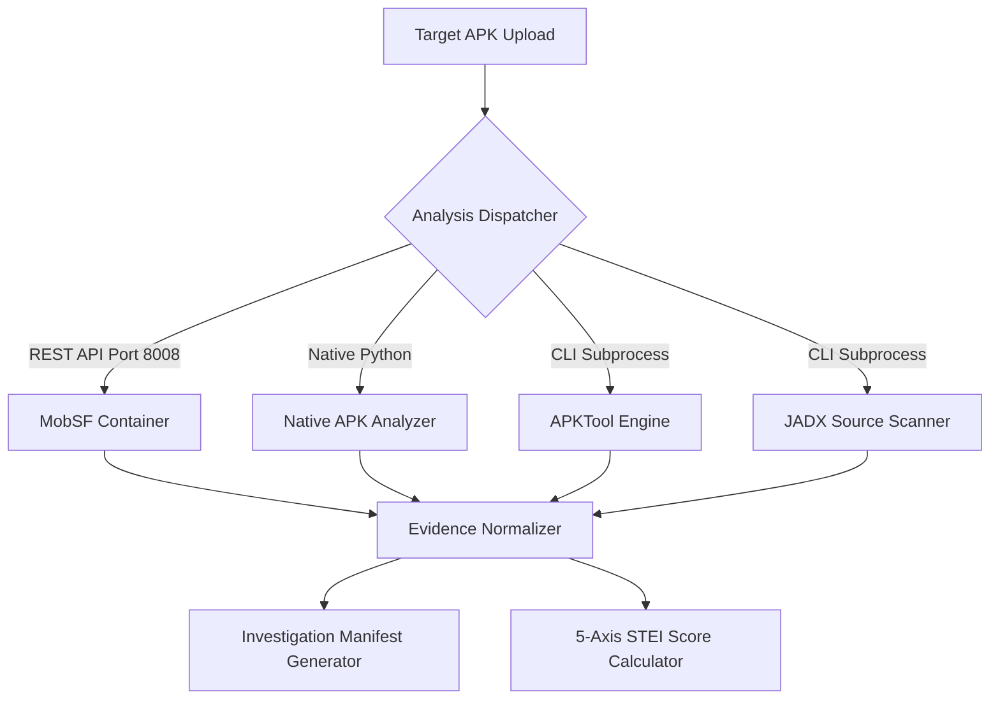

# 03 - Static Threat Intelligence Engine Specification

```yaml
Module Title:        Static Threat Intelligence & Decompilation Engine
Version:             2.5.0-STABLE
Primary Files:       analysis-engine/app/main.py
                     shared/sudarshan_core/models/manifest.py
                     shared/sudarshan_core/engines/apk_repair.py
                     shared/sudarshan_core/engines/apktool_engine.py
                     shared/sudarshan_core/engines/jadx_engine.py
                     shared/sudarshan_core/analyzers/apk_analyzer.py
                     shared/sudarshan_core/services/mobsf_client.py
                     backend/app/routes/upload.py
Test Suite:          backend/tests/test_analysis_client.py, backend/tests/test_manifest_repair.py, backend/tests/test_remaining_features.py
```

---

## Table of Contents
- [1. Executive Overview](#1-executive-overview)
- [2. Multi-Engine Decompilation Strategy](#2-multi-engine-decompilation-strategy)
- [3. APKTool Engine Integration](#3-apktool-engine-integration)
- [4. JADX Engine Integration](#4-jadx-engine-integration)
- [5. MobSF & Native APK Analysis](#5-mobsf--native-apk-analysis)
- [6. Investigation Manifest Generation](#6-investigation-manifest-generation)
- [7. Static Threat Exposure Index (STEI) Formula](#7-static-threat-exposure-index-stei-formula)

---

## 1. Executive Overview

The **Static Threat Intelligence Engine** performs pre-execution binary analysis on uploaded Android APKs. Rather than relying on a single analyzer, Sudarshan deploys a four-layered defense-in-depth static extraction pipeline (**MobSF**, native [`apk_analyzer.py`](file:///d:/Projects/Sudarshan%20BOI/shared/sudarshan_core/analyzers/apk_analyzer.py), **APKTool**, and **JADX**) to extract permissions, components, API calls, hardcoded secrets, obfuscation signals, and banking app targets.

Findings are normalized via [`upload.py`](file:///d:/Projects/Sudarshan%20BOI/backend/app/routes/upload.py) and compiled into a pre-sandbox **Investigation Manifest** (`manifest.json`), which configures dynamic sandbox hooks and goal priorities.

---

## 2. Multi-Engine Decompilation Strategy



### Why Both APKTool and JADX Are Used
- **APKTool ([`apktool_engine.py`](file:///d:/Projects/Sudarshan%20BOI/shared/sudarshan_core/engines/apktool_engine.py))**: Specializes in decompiling raw Android binary XML files (`AndroidManifest.xml`), layout resources (`res/layout/`), and string tables (`res/values/strings.xml`). It detects obfuscated single-character resource names and resource-embedded URLs.
- **JADX ([`jadx_engine.py`](file:///d:/Projects/Sudarshan%20BOI/shared/sudarshan_core/engines/jadx_engine.py))**: Specializes in decompiling DEX bytecode to readable Java source code. It scans method bodies for complex fraud logic patterns (`DexClassLoader`, `SmsManager.sendTextMessage`, `AccessibilityService`, `WindowManager.addView`) that raw resource tools cannot parse.

Together, APKTool provides structural & asset visibility while JADX provides behavioral source code visibility.

---

## 3. APKTool Engine Integration (`apktool_engine.py`)

Wraps the APKTool CLI to decompile resources and extract decoded XML files when MobSF is offline:

- **Decoded Manifest Extraction**: Reads `AndroidManifest.xml` in human-readable text format.
- **VIDE static UI profile**: Layout XML and `assets/*.html` extracted here feed [`build_static_ui_profile()`](../../shared/sudarshan_core/engines/vide/ui_profile.py) for deterministic baseline comparison (see [`VIDE.md`](VIDE.md)).
- **Obfuscation Detection**: Counts single-character resource files (e.g., `a.xml`, `b.png`) to measure resource obfuscation entropy.
- **Suspicious Resource Scanning**: Scans text resource files for embedded IP addresses, C2 URLs, and permission strings.
- **Graceful Fallback**: If `apktool` is not in PATH, analysis logs a warning and continues cleanly using native parser/JADX.

---

## 4. JADX Engine Integration (`jadx_engine.py`)

Wraps the JADX CLI to decompile `.dex` bytecode into Java source code files:

- **10 Fraud Pattern Signature Scanners**:
  1. `ACCESSIBILITY_SERVICE`: `extends AccessibilityService`
  2. `DEVICE_ADMIN`: `extends DeviceAdminReceiver`
  3. `SMS_RECEIVER`: `SmsManager.sendTextMessage` / `sendMultipartTextMessage`
  4. `OVERLAY_WINDOW`: `WindowManager.LayoutParams.TYPE_APPLICATION_OVERLAY`
  5. `DYNAMIC_CLASS_LOAD`: `DexClassLoader` / `InMemoryDexClassLoader`
  6. `REFLECTION_INVOKE`: `Class.forName` / `getDeclaredMethod` / `invoke`
  7. `BANKING_KEYWORD`: Regex for Indian banking packages (`sbi`, `hdfc`, `icici`, `axis`, `kotak`, `phonepe`, `paytm`)
  8. `OTP_HARVEST`: `SmsMessage.createFromPdu` / `getMessageBody`
  9. `OVERLAY_DRAW`: `canDrawOverlays` / `WindowManager.addView`
  10. `C2_SOCKET`: `new Socket(...)` / `SSLSocketFactory`
- **Extracted String Literals**: Extracts hardcoded C2 HTTP/HTTPS endpoints.

---

## 5. MobSF & Native APK Analysis

- **MobSF Engine ([`mobsf_client.py`](file:///d:/Projects/Sudarshan%20BOI/shared/sudarshan_core/services/mobsf_client.py))**: Interfaces with the OpenSecurity MobSF container (Port 8008). Extracts security scores, manifest vulnerability findings, dangerous permissions, code analysis findings, hardcoded secrets, and certificate metadata.
- **Native APK Analyzer ([`apk_analyzer.py`](file:///d:/Projects/Sudarshan%20BOI/shared/sudarshan_core/analyzers/apk_analyzer.py))**: Native fallback when MobSF is unavailable. Parses `AndroidManifest.xml` via `androguard` to extract package details, permissions, activities, services, receivers, and bytecode strings.

---

## 6. Investigation Manifest Generation (`manifest.py`)

Static analysis results are compiled into a formal pre-sandbox data contract: `InvestigationManifest`.

```json
{
  "sha256": "e3b0c44298fc1c149afbf4c8996fb92427ae41e4649b934ca495991b7852b855",
  "package_name": "com.sbi.lotus.fake",
  "analysis_mode": "mobsf",
  "stei_score": 78.5,
  "family_classification": "Drinik",
  "capability_flags": {
    "has_accessibility_abuse": true,
    "has_sms_read_write": true,
    "has_system_alert_window": true,
    "targets_indian_banks": true,
    "indian_bank_packages": ["com.sbi.lotus"]
  },
  "hook_profiles": ["canary", "accessibility", "sms", "overlay", "banking", "network"],
  "goal_priority_config": {
    "accessibility_priority": 1,
    "sms_priority": 2,
    "overlay_priority": 3
  }
}
```

---

## 7. Static Threat Exposure Index (STEI) Formula

The **STEI** score ($0.0 - 100.0$) is computed via a 5-axis mathematical model in [`risk_engine.py`](file:///d:/Projects/Sudarshan%20BOI/shared/sudarshan_core/engines/risk_engine.py):

$$STEI = 0.60 \times CT + 0.20 \times BT + 0.10 \times PR + 0.05 \times OB + 0.05 \times IR$$

| Axis | Weight | Indicators Evaluated |
| :--- | :--- | :--- |
| **Credential Theft ($CT$)** | 60% | Accessibility abuse, SMS read/write, System Alert Window overlay abuse. |
| **Banking Targeting ($BT$)** | 20% | Package matching against 47 Indian banking application signatures. |
| **Permission Risk ($PR$)** | 10% | Count of dangerous Android permissions requested vs expected baseline. |
| **Obfuscation ($OB$)** | 5% | Shannon entropy ratio of DEX bytecode and class/method reflection calls. |
| **Infrastructure Risk ($IR$)** | 5% | Hardcoded malicious IPs, C2 domains, and suspicious string literals. |
