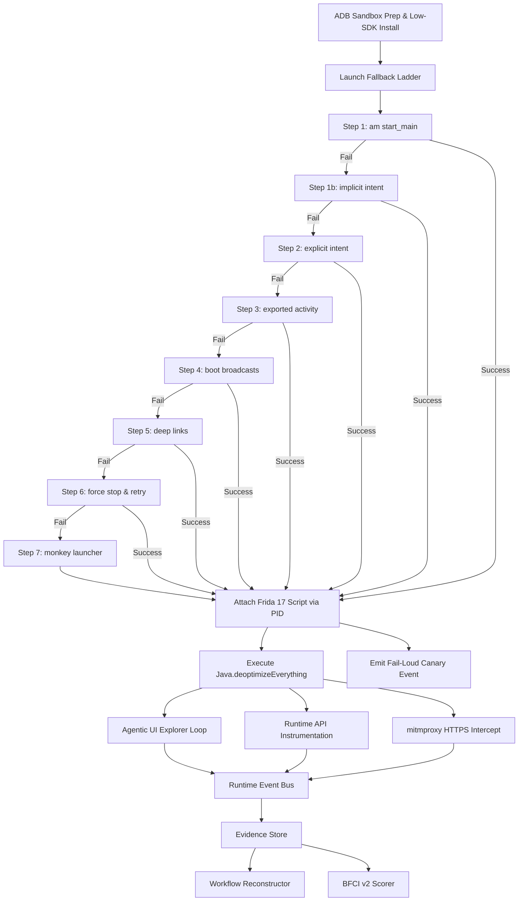
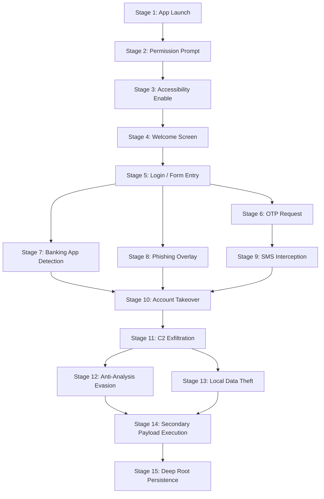

# 04 - Dynamic Analysis Engine & Agentic Explorer Specification

```yaml
Module Title:        Dynamic Analysis Engine (DAE) & Agentic Explorer
Version:             2.1.0
Primary Files:       analysis-engine/app/main.py
                     backend/app/routes/runtime_api.py
                     shared/sudarshan_core/engines/frida_sandbox.py
                     shared/sudarshan_core/engines/agentic_explorer.py
                     shared/sudarshan_core/engines/apk_repair.py
                     shared/sudarshan_core/engines/network_capture.py
                     shared/sudarshan_core/engines/bfci_scorer.py
                     shared/sudarshan_core/engines/workflow_reconstructor.py
                     shared/sudarshan_core/engines/frida_hooks/banking_trojan.js
                     shared/sudarshan_core/engines/frida_hooks/java_probe.js
                     shared/sudarshan_core/engines/frida_hooks/bisect_sec.js
                     frontend/src/components/WorkflowDiagram.tsx
Test Suite:          tests/unit/test_frida_pipeline_full.py, scripts/verify_runtime_pipeline.py, backend/tests/test_analysis_client.py, backend/tests/test_agentic_explorer.py, backend/tests/test_frida_preflight.py
```

---

## Table of Contents
- [1. Executive Overview](#1-executive-overview)
- [2. Dynamic Execution Architecture](#2-dynamic-execution-architecture)
- [3. Frida 17 Runtime & ART Deoptimization](#3-frida-17-runtime--art-deoptimization)
- [4. Dynamic Hook Bundle Inventory](#4-dynamic-hook-bundle-inventory)
- [5. mitmproxy Sidecar & Network Interception](#5-mitmproxy-sidecar--network-interception)
- [6. Agentic UI Explorer & 15-Stage Goal DAG](#6-agentic-ui-explorer--15-stage-goal-dag)
- [7. Scripted vs Agentic Analysis Comparison](#7-scripted-vs-agentic-analysis-comparison)
- [8. Behavioral Fraud Confidence Index (BFCI v2)](#8-behavioral-fraud-confidence-index-bfci-v2)
- [9. Fraud Workflow Reconstruction](#9-fraud-workflow-reconstruction)

---

## 1. Executive Overview

The **Dynamic Analysis Engine (DAE)** executes suspicious Android applications inside an isolated host sandbox selected via `SandboxProvider` (default: **Genymotion Desktop**; optional: Android Studio AVD). Compatible with Android 10/11 (API 29/30), x86 / x86_64. Combining Frida 17 binary instrumentation, `mitmproxy` transparent HTTPS decryption, an autonomous LLM UI explorer ([`agentic_explorer.py`](../../shared/sudarshan_core/engines/agentic_explorer.py)), and a causal workflow reconstructor ([`workflow_reconstructor.py`](../../shared/sudarshan_core/engines/workflow_reconstructor.py)), the DAE captures real-time behavioral evidence of mobile banking fraud.

The DAE communicates with the emulator **only** through `sudarshan_core.sandbox.SandboxProvider`. Install, launch, Frida hooks, Agentic Explorer, Risk Engine, and MobSF integration are unchanged.

---

## 2. Dynamic Execution Architecture & 7-Step Launch Fallback Ladder



---

## 2a. SELinux Preflight (required)

Before `frida-server` is checked, `run_frida_analysis` performs:

```powershell
adb -s <serial> root
adb -s <serial> shell getenforce      # if "Enforcing":
adb -s <serial> shell setenforce 0
```

**Why this is not optional.** SELinux is Enforcing by default on Android 13+ and denies the `ptrace` that Frida injection requires, *even for uid 0*. Without this step every attach fails with `PermissionDeniedError: unable to access process with pid <n>` while `frida-server` reports healthy.

---

## 2b. Live Runtime Telemetry Streaming (`runtime_api.py`)

The DAE exposes real-time telemetry, hook execution statistics, and evidence snapshots via [`backend/app/routes/runtime_api.py`](file:///d:/Projects/Sudarshan%20BOI/backend/app/routes/runtime_api.py):

- **`/api/runtime/status`**: Returns high-level pipeline health summary and active `PipelineTracker` states across analysis jobs.
- **`/api/runtime/hooks`**: Tracks Frida hook installation status, hit counters, and runtime error rates per hook.
- **`/api/runtime/events`**: Exposes a ring buffer of recent telemetry events (max 500 events) for real-time analyst streaming.
- **`/api/runtime/pipeline`**: Reports state machine transitions across `INIT`, `DECOMPILING`, `SANDBOXING`, `CORRELATING`, `SCORING`, `RAG_INDEXING`, and `COMPLETED` stages.
- **`/api/runtime/metrics`**: Calculates rolling event processing rate (events/sec), dropped event metrics, and error totals.
- **`/api/runtime/evidence`**: Provides snapshots of `evidence.json` generated during dynamic analysis runs.

---

## 2c. Sandbox containment & ADB policy

Dynamic analysis reaches the guest only through [`SandboxProvider`](../../shared/sudarshan_core/sandbox/provider.py) and [`adb_gateway.run_adb`](../../shared/sudarshan_core/security/adb_gateway.py). [`sandbox_containment.py`](../../shared/sudarshan_core/security/sandbox_containment.py) enforces:

- Valid `ADB_HOST` for Genymotion (private NIC; not `host.docker.internal`).
- Blocked ADB subcommands (`tcpip`, `kill-server`, `start-server`, …).
- Loopback-only Frida on the guest (`FRIDA_LISTEN_HOST=127.0.0.1`).
- Startup audit or fail-closed when `SANDBOX_CONTAINMENT_STRICT=true` or `SUDARSHAN_ENV=production`.

The analysis-engine exposes port **8001** only on the internal Docker network and optionally requires `ANALYSIS_ENGINE_INTERNAL_TOKEN`. Operational runbooks: [`../security/P0_SANDBOX_ESCAPE_INCIDENT.md`](../security/P0_SANDBOX_ESCAPE_INCIDENT.md).

---

## 3. Frida 17 Runtime & ART Deoptimization

- **PID Attachment**: Resolves running application process ID via `adb shell pidof <package>`, avoiding package label retries.
- **Unconditional ART Deoptimization ([`banking_trojan.js`](file:///d:/Projects/Sudarshan%20BOI/shared/sudarshan_core/engines/frida_hooks/banking_trojan.js))**:
  ```javascript
  if (Java.available) {
    Java.perform(function () {
      if (Java.deoptimizeEverything) {
        Java.deoptimizeEverything();
        console.log("[Sudarshan] Java.deoptimizeEverything() executed successfully.");
      }
    });
  }
  ```
  Forces Android Runtime (ART) into interpreter mode, eliminating JIT inlining silent hook suppression.
- **Fail-Loud Canary**: Emits a `canary` event at load time. If unreceived, [`frida_sandbox.py`](file:///d:/Projects/Sudarshan%20BOI/shared/sudarshan_core/engines/frida_sandbox.py) flags `INSTRUMENTATION_FAILED`, invoking the **Static Fallback Risk Engine**.

---

## 4. Dynamic Hook Bundle Inventory

The DAE injects modular hook profiles selected by the `InvestigationManifest`:

| Hook Bundle | Monitored API / Classes | Fraud Behavioral Signatures |
| :--- | :--- | :--- |
| `canary` | Synthetic Script Health Check | Asserts runtime script load and bridge health. |
| `accessibility` | `AccessibilityService`, `AccessibilityEvent` | UI scraping, OTP field extraction, node clicking. |
| `sms` | `SmsManager`, `SmsMessage`, `BroadcastReceiver` | Inbound SMS interception, OTP theft, SMS exfiltration. |
| `overlay` | `WindowManager`, `TYPE_APPLICATION_OVERLAY` | Phishing window overlays over banking applications. |
| `banking` | Target package intent launches | Financial app detection, overlay triggers. |
| `dynamic_code` | `DexClassLoader`, `InMemoryDexClassLoader`, `PathClassLoader` | Secondary payload dropping and dynamic DEX loading. |
| `persistence` | `DeviceAdminReceiver`, `PackageManager` | Device administrator privilege escalation and app icon hiding. |
| `network` | `OkHttp3`, `URLConnection`, `Socket`, `SSLSocket` | C2 heartbeat communication, exfiltration POST requests. |

---

## 5. mitmproxy Sidecar & Network Interception

[`network_capture.py`](file:///d:/Projects/Sudarshan%20BOI/shared/sudarshan_core/engines/network_capture.py) combines two network evidence streams:
1. **Frida Socket Hooks**: Intercepts HTTP/HTTPS connections at call time.
2. **mitmproxy Sidecar Container**: Intercepts transparent proxy traffic via port 8080. Parses HAR dumps (`dump.har`) written to shared volumes to extract full decrypted HTTP request/response headers, status codes, and body sizes.

---

## 6. Agentic UI Explorer & 15-Stage Goal DAG

`AgenticExplorer` uses an LLM planner and screen-hash state abstraction to navigate app UIs:



- **Loop Detection**: Maintains screen view hashes to break out of redundant navigation loops.
- **Input Sanitization**: Prevents prompt injection attacks via [`sanitizer.py`](file:///d:/Projects/Sudarshan%20BOI/shared/sudarshan_core/engines/agentic/sanitizer.py).

---

## 7. Scripted vs Agentic Analysis Comparison

| Feature Dimension | Traditional Scripted Frida | Sudarshan Agentic Dynamic Analysis |
| :--- | :--- | :--- |
| **Navigation Model** | Hardcoded UI clicks / random input fuzzing | Autonomous LLM + 15-stage Goal DAG |
| **Hook Activation** | Monolithic static script load | Dynamic profile loading via `manifest.json` |
| **JIT Bypass** | Prone to silent inline suppression | Unconditional `Java.deoptimizeEverything()` |
| **Network Visibility** | Host socket URLs only | Frida hooks + mitmproxy HAR decrypted bodies |
| **Scoring Logic** | Count API invocations | Causal workflow reconstruction & sequence bonuses |

---

## 8. Behavioral Fraud Confidence Index (BFCI v2)

$$BFCI_{\text{v2}} = \min\left(100.0, \sum_{c} W_c \cdot \min\left(1.0, \frac{\ln(1 + N_c)}{\ln(1 + M_c)}\right) \times 100 + S_{\text{sequence}}\right)$$

Where $W_c$ is category weight, $N_c$ is event count, $M_c$ is saturation threshold, and $S_{\text{sequence}} = +15$ when a temporal causal chain completes within 30 seconds. Implemented in [`bfci_scorer.py`](file:///d:/Projects/Sudarshan%20BOI/shared/sudarshan_core/engines/bfci_scorer.py).

---

## 9. Fraud Workflow Reconstruction

[`workflow_reconstructor.py`](file:///d:/Projects/Sudarshan%20BOI/shared/sudarshan_core/engines/workflow_reconstructor.py) maps raw Frida events into MITRE ATT&CK causal stages:

- **Full Account Takeover**: Accessibility Enable $\rightarrow$ Overlay Phishing $\rightarrow$ SMS Intercept $\rightarrow$ C2 Exfiltration.
- **OTP Theft Chain**: SMS Intercept $\rightarrow$ C2 POST.
- **Interactive UI Timeline**: Rendered in the frontend via [`WorkflowDiagram.tsx`](file:///d:/Projects/Sudarshan%20BOI/frontend/src/components/WorkflowDiagram.tsx).

---

## 10. VIDE runtime inputs (WebView HTML)

The **Visual Impersonation Detection Engine** ([`engines/vide/`](../../shared/sudarshan_core/engines/vide/)) consumes Frida events from `banking_trojan.bundle.js` (WebView `loadData` / `loadDataWithBaseURL`) via `collect_webview_html_from_frida_events()`. The analysis microservice runs `safe_run_vide_analysis()` after dynamic analysis and attaches `vide` to the consolidated result ([`analysis-engine/app/main.py`](../../analysis-engine/app/main.py)). Specification and verification matrix: [`VIDE.md`](VIDE.md).
