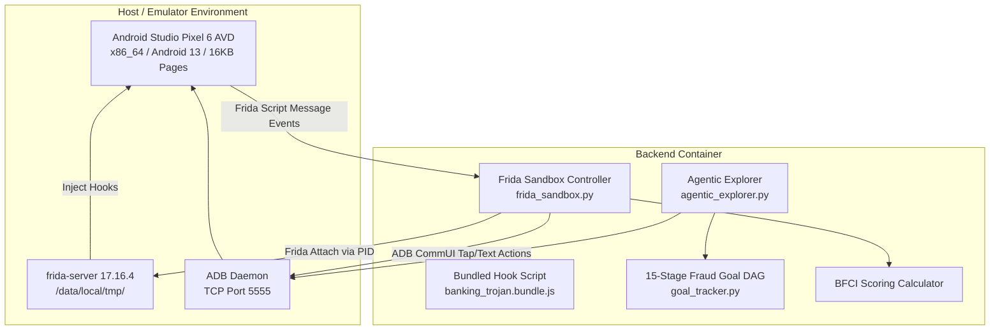
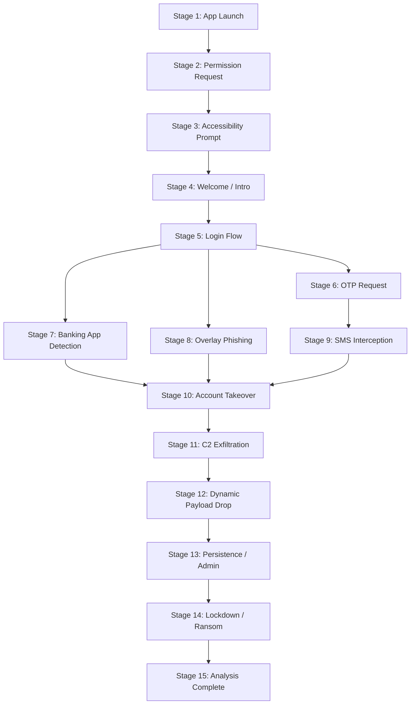

# 04 — Dynamic Analysis Engine

## Purpose

The **Dynamic Analysis Engine (DAE)** performs automated, runtime behavioral analysis of suspicious Android applications in an isolated Android Virtual Device (AVD). It uses Frida runtime instrumentation and an AI-guided goal-directed UI explorer to execute the APK, monitor API calls, capture network traffic, detect anti-analysis techniques, and compute the Behavioral Fraud Confidence Index ($BFCI$).

---

## Responsibilities

The dynamic engine is responsible for:
1. **Emulator & Sandbox Lifecycle**: Managing ADB connectivity over TCP, installing target APK binaries on the emulator, granting runtime permissions via `PermissionOrchestrator`, and launching target activities.
2. **Runtime Instrumentation**: Injecting Frida JavaScript hooks (`banking_trojan.bundle.js`) to intercept sensitive Android API calls (`AccessibilityService`, `SmsManager`, `WindowManager`, `DexClassLoader`, `KeyStore`, `OkHttp`).
3. **Behavioral Goal Exploration**: Executing `AgenticExplorer`, an LLM-driven UI navigation engine guided by a 15-stage fraud goal Directed Acyclic Graph (DAG).
4. **Behavioral Metric Computation**: Calculating the Behavioral Fraud Confidence Index ($BFCI$) using weighted hook firing categories.
5. **Anti-Analysis Detection**: Detecting environment checks (emulator detection, root checks, Frida detection) via `AntiAnalysisDetector`.

---

## High-Level Overview

When dynamic analysis is triggered, the engine first checks ADB connectivity to the running Android Studio emulator (`host.docker.internal:5555`). If active, it resolves the target application's Process ID (`PID`) using `adb shell pidof`, installs the binary, and attaches Frida 17 runtime hooks compiled with `frida-java-bridge`.

Simultaneously, `AgenticExplorer` or `UIExplorer` drives UI interactions (tapping buttons, filling input fields, navigating login screens) to exercise application code paths and trigger malicious behavior.

```text
[ Target APK Binary ]
          │
          ▼
[ Check Sandbox Readiness ] ──► ADB TCP Ping (host.docker.internal:5555)
          │
          ▼
[ ADB Installation & Permission Grant ]
          │
          ▼
[ Launch Application Process & Resolve PID ]
          │
          ▼
[ Attach Frida 17 Script (banking_trojan.bundle.js) ]
          │
    ┌─────┴────────────────────────────────┐
    │                                      │
    ▼                                      ▼
[ UI Exploration Engine ]          [ Frida Runtime Hooks ]
- AgenticExplorer (15-Stage DAG)   - Accessibility Abuse Hooks
- Hybrid Monkey Mode               - SMS Interception Hooks
- Screen-Hash State Tracking        - Phishing Overlay Hooks
    │                               - DexClassLoader / Net Hooks
    │                                      │
    └──────────────────┬───────────────────┘
                       │
                       ▼
          [ Event Collector & BFCI Engine ]
          - Compute Component Scores (wa, ws, wo, wb, wn, wp)
          - Compute BFCI Score (0.0 - 100.0)
```

---

## Architecture

The dynamic analysis architecture spans host machine processes, Docker container controllers, and the Android Virtual Device runtime:



---

## Components

The dynamic engine comprises the following primary components:

| Module / Component | File Location | Description & Responsibilities |
| :--- | :--- | :--- |
| `FridaSandbox` | `backend/app/engines/frida_sandbox.py` | Main controller managing ADB, PID resolution, Frida script attachment, event collection, and BFCI calculation. |
| `banking_trojan.bundle.js` | `backend/app/engines/frida_hooks/` | Bundled JavaScript hooks compiled with `frida-java-bridge` to support Frida 17+. Hooks accessibility, SMS, overlay, reflection, and network APIs. |
| `AgenticExplorer` | `backend/app/engines/agentic_explorer.py` | LLM-driven UI exploration agent with deterministic fallback, screen-hash state abstraction, loop detection, and screenshot capture. |
| `GoalTracker` | `backend/app/engines/agentic/goal_tracker.py` | Tracks progression across a 15-stage fraud goal DAG (e.g., App Launch, Permission Request, Login Flow, OTP Interception). |
| `MultiStageEngine` | `backend/app/engines/multi_stage_engine.py` | Orchestrates multi-phase dynamic execution when `SUDARSHAN_MULTISTAGE=true`. |
| `PermissionOrchestrator` | `backend/app/engines/permission_orchestrator.py` | Automatically grants declared dangerous permissions via ADB shell before execution. |

---

## Workflow

The 15-stage fraud goal DAG guides UI exploration during dynamic analysis:



---

## Data Flow

Dynamic event processing data flow:

$$\text{Target Package Name} \longrightarrow \text{PID Resolution via } \texttt{adb shell pidof}$$
$$\Downarrow$$
$$\text{Frida Script Attachment } (\texttt{banking\_trojan.bundle.js})$$
$$\Downarrow$$
$$\text{Runtime API Interception } (\text{Accessibility}, \text{SMS}, \text{WindowManager}, \text{DexClassLoader})$$
$$\Downarrow$$
$$\text{Event Stream Collection } \longrightarrow \text{Unique Hook Category Buckets}$$
$$\Downarrow$$
$$\text{BFCI Formula Calculation } \Rightarrow \text{Dynamic Score } (0.0 - 100.0)$$

---

## Algorithms

The dynamic engine calculates the Behavioral Fraud Confidence Index ($BFCI$) using the exact weighted mathematical model:

### Behavioral Fraud Confidence Index ($BFCI$) Formula
$$BFCI = (w_a \cdot A) + (w_s \cdot S) + (w_o \cdot O) + (w_b \cdot B) + (w_n \cdot N) + (w_p \cdot P)$$

Where category weights reflect prevalence in real-world Indian banking trojans:
- $w_a = 0.35$: Accessibility Service Abuse score ($A$, $0 - 100$).
- $w_s = 0.25$: SMS Interception score ($S$, $0 - 100$).
- $w_o = 0.20$: Overlay Attack score ($O$, $0 - 100$).
- $w_b = 0.10$: Banking App Interaction score ($B$, $0 - 100$).
- $w_n = 0.05$: Network C2 Communication score ($N$, $0 - 100$).
- $w_p = 0.05$: Persistence Mechanism score ($P$, $0 - 100$).

Each component score $C$ is derived from distinct hook firings normalized against category caps:
$$C = \min\left(\frac{\text{Unique Hooks Fired}}{\text{Category Cap}}, 1.0\right) \cdot 100$$

---

## Integration

The dynamic engine integrates with the Risk Engine and UI Explorer:

```text
+--------------------------------------------------------------------------+
|                        DYNAMIC ANALYSIS ENGINE                           |
|                                                                          |
|  +--------------------+      +--------------------+      +-------------+ |
|  | AgenticExplorer    |=====>| ADB TCP Bridge     |=====>| Android AVD | |
|  | (15-Stage DAG)     |      | (TCP 5555)         |      | Emulator    | |
|  +--------------------+      +--------------------+      +------+------+ |
|                                                                 |        |
|                                 +-------------------------------+        |
|                                 | Frida Messages                         |
|                                 v                                        |
|                      +--------------------+                              |
|                      | Frida Sandbox      |                              |
|                      | Controller         |                              |
|                      +---------+----------+                              |
|                                |                                         |
|                                v                                         |
|                      +--------------------+                              |
|                      | Risk Engine        |                              |
|                      | (BFCI Input)       |                              |
|                      +--------------------+                              |
+--------------------------------------------------------------------------+
```

---

## Folder Structure

Dynamic analysis source code locations:

```text
backend/app/engines/
├── frida_sandbox.py          <- Frida Controller & BFCI Calculator
├── agentic_explorer.py       <- AI-Guided UI Navigation Engine
├── multi_stage_engine.py     <- Multi-Stage Analysis Coordinator
├── ui_explorer.py            <- Legacy UI Explorer & Fallback Monkey Mode
├── frida_hooks/
│   ├── banking_trojan.bundle.js  <- Compiled Frida 17 JS Hook Bundle
│   └── banking_trojan.js         <- Raw Frida JS Hook Source
└── agentic/
    ├── goal_tracker.py       <- 15-Stage Fraud Goal DAG Implementation
    ├── planner.py            <- LLM Action Planner
    └── perception.py         <- Screen Representation & UI Parser
```

---

## API Reference

Dynamic engine status endpoint:

### Query Sandbox Status
- **HTTP Method**: `GET`
- **Path**: `/api/v1/sandbox/status`
- **Response**:
  ```json
  {
    "ready": true,
    "device": "emulator-5554",
    "frida_version": "17.16.4",
    "message": "Frida sandbox operational and connected to ADB"
  }
  ```

---

## Configuration

Environment options in `.env`:

| Variable | Default Value | Description |
| :--- | :--- | :--- |
| `ADB_HOST` | `host.docker.internal` | Host machine ADB IP address. |
| `ADB_PORT` | `5555` | ADB TCP port (`adb tcpip 5555`). |
| `FRIDA_ANALYSIS_DURATION` | `30` | Duration (in seconds) to capture dynamic hooks. |
| `SUDARSHAN_EXPLORER_MODE` | `ai` | Exploration mode (`ai`, `monkey`, `hybrid`). |
| `SUDARSHAN_MULTISTAGE` | `false` | Enable multi-stage dynamic pipeline execution. |

---

## Error Handling

1. **ADB Disconnection**: If ADB is unreachable on port 5555, `run_frida_analysis` catches `ConnectionRefusedError`, logs `Frida sandbox not ready`, and sets `dynamic_available = False`.
2. **Frida Attach Failure**: If attaching by package name fails, `frida_sandbox.py` falls back to resolving process ID via `adb shell pidof <package_name>` and attaching directly by PID.

---

## Current Implementation Status

> [!WARNING]
> **Implementation Status: Partial**

As documented in `docs/DAE_CURRENT_STATE.md`:
1. **Frida Hooking**: `frida_sandbox.py` successfully connects over ADB TCP and attaches to target application PIDs. However, due to Frida 17 method hook silent failures on the 16KB page-size AVD image (`google_apis_ps16k`), **0 runtime events fire during dynamic execution**.
2. **BFCI Score Result**: Because 0 events fire, $BFCI = 0.0$ on all tested samples.
3. **DAG Goal Progress**: Goal tracker stalls at Stage 5 ("Login Flow") when automated login credentials or required UI elements are not detected, preventing evaluation of stages 6–10.

---

## Current Limitations

1. **ART Method Inlining**: Modern Android ART runtime inlines lightweight methods, preventing standard Frida `Java.use()` hooks from intercepting execution without `Java.deoptimizeEverything()`.
2. **AVD Kernel Constraints**: The stock QEMU/goldfish AVD kernel lacks eBPF tracepoint support, preventing kernel-level telemetry collection.

---

## Future Improvements

1. **Frida Deoptimization**: Call `Java.deoptimizeEverything()` upon script load to force ART method hook interception.
2. **Canary Load Assertion**: Implement a synthetic startup event (`canary_fired`) to fail dynamic execution loudly if zero hooks fire, preventing false "Safe" verdicts.
