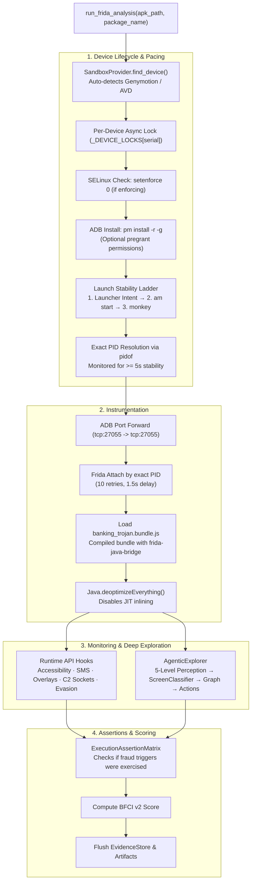
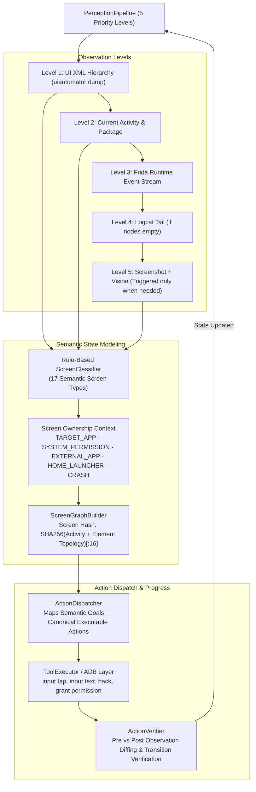

# 04 — Dynamic Analysis Engine & Deep Exploration Specification

> **Authoritative Technical Specification**  
> **Source Repository**: `SanTiwari07/Sudarshan`  
> **Last Verified Against Active Codebase**: 2026-08-25  

```yaml
Module Title:        Dynamic Analysis Engine (DAE) & Deep UI Explorer
Version:             2.1.0
Primary Files:       analysis-engine/app/main.py
                     backend/app/routes/runtime_api.py
                     shared/sudarshan_core/engines/frida_sandbox.py
                     shared/sudarshan_core/engines/agentic_explorer.py
                     shared/sudarshan_core/engines/agentic/exploration_engine.py
                     shared/sudarshan_core/engines/agentic/perception.py
                     shared/sudarshan_core/engines/agentic/screen_classifier.py
                     shared/sudarshan_core/engines/agentic/screen_graph.py
                     shared/sudarshan_core/engines/agentic/action_dispatch.py
                     shared/sudarshan_core/engines/agentic/action_verifier.py
                     shared/sudarshan_core/engines/execution_assertions.py
                     shared/sudarshan_core/engines/bfci_scorer.py
                     shared/sudarshan_core/engines/workflow_reconstructor.py
                     shared/sudarshan_core/engines/frida_hooks/banking_trojan.bundle.js
Test Suite:          tests/unit/test_frida_pipeline_full.py, tests/unit/test_deep_exploration.py, tests/unit/test_action_verifier.py, backend/tests/test_launch_ladder.py, backend/tests/test_agentic_explorer.py
```

---

## 1. Executive Overview

The **Dynamic Analysis Engine (DAE)** executes suspicious Android applications inside an isolated Android sandbox environment (Genymotion Desktop VM or Android Studio AVD).

Combining Frida 17 binary instrumentation, compiled Java-bridge hook scripts (`banking_trojan.bundle.js`), an autonomous deterministic UI explorer with AI prioritization (`AgenticExplorer`), and an Execution Assertion Matrix, the DAE safely observes runtime fraud behavior without corrupting evidence.

---

## 2. Dynamic Execution Architecture & Lifecycle



---

## 3. Launch Stability & PID Resolution

Android process lifecycles require strict synchronization before dynamic instrumentation can begin:
1. **Launch Stability Ladder**: Attempts primary launcher intent via `am start -n`, falls back to explicit component intents, and finally triggers `monkey -p <package> -c android.intent.category.LAUNCHER 1`.
2. **Exact PID Resolution**: Attaching by package name fails on Android. The sandbox resolves the exact PID using `pidof <package>` and monitors process existence continuously for $\ge 5.0\text{s}$ (`LAUNCH_PID_STABLE_MIN_SECONDS`) to prevent attaching to transient splash screen forks.
3. **Pacing Constants**:
   - `APP_OPEN_SETTLE_SECONDS`: `8.0s` delay allowing complex banking frameworks to finish cold-start initialization before input is dispatched.
   - `FRIDA_ANALYSIS_DURATION`: Default `300s` window ensuring second-stage droppers deploy before analysis terminates.

---

## 4. Frida 17 Instrumentation & Compiled Bundle

Frida 17 removed the global `Java` object. The hook script must be linked at build time:
* **Compiled Bundle (`banking_trojan.bundle.js`)**: An ES module compiled using `frida-compile` that packages `frida-java-bridge` (~540 KB). Loading raw uncompiled JS is rejected by the runtime controller.
* **Unconditional ART Deoptimization**:
  ```javascript
  if (Java.available) {
    Java.perform(function () {
      if (Java.deoptimizeEverything) {
        Java.deoptimizeEverything();
        console.log("[Sudarshan] Java.deoptimizeEverything() executed successfully.");
      }
    });
  }
  ```
  Disables JIT compilation across the VM, preventing the runtime from inlining critical method hooks.

### Dynamic Hook Coverage:
* **Accessibility**: `AccessibilityService`, `AccessibilityEvent` (monitors screen scraping, node clicking, text scraping).
* **SMS Interception**: `SmsManager.sendTextMessage`, `SmsMessage.createFromPdu`, telephony broadcast receivers.
* **Overlays**: `WindowManager.addView`, `TYPE_APPLICATION_OVERLAY`, alert window creation.
* **Network C2**: `OkHttpClient`, `HttpURLConnection`, `Socket.connect`, SSL socket handshakes.
* **Anti-Analysis**: Root checks (`/system/bin/su`), Frida server ports, emulator build properties (`ro.kernel.qemu`).

---

## 5. Deep UI Exploration Subsystem

The **Agentic Explorer** operates on a deterministic state graph, using Gemini for intelligent prioritization:



### Perception Priority System
* **Level 1**: UI XML via `uiautomator dump` (primary).
* **Level 2**: Foreground activity name.
* **Level 3**: Frida event queue since last step.
* **Level 4**: Logcat tail (captured if XML yields no actionable nodes).
* **Level 5 (Vision)**: Invoked **only** when XML is empty, lacks actionable nodes, labeled node fraction $<20\%$, current activity is a known WebView class, or previous action failed.

### Rule-Based Screen Classification
Classifies screens into 17 deterministic types:
`BANK_LOGIN`, `OTP_SCREEN`, `ACCESSIBILITY_DIALOG`, `SYSTEM_PERMISSION`, `OVERLAY_ATTACK`, `UPDATE_PROMPT`, `EXTERNAL_APK`, `VPN_REQUEST`, `WEBVIEW`, `DIALOG`, `SETTINGS`, `HOME`, `HOME_LAUNCHER`, `CRASH_STATE`, `APP_NOT_RESPONDING`, `TRANSITION`, `UNKNOWN`.

---

## 6. Execution Assertion Matrix & Safety Floors

To ensure sterile or dormant runs do not masquerade as benign:
1. **Execution Assertions (`execution_assertions.py`)**: Checks whether the sample's preconditions were exercised (e.g., target bank foregrounded, accessibility granted, SMS received).
2. **`INCOMPLETE_EXERCISE` Verdict**: If no fraud trigger condition was reached during analysis, `verdict` is set to `INCOMPLETE_EXERCISE` and floored to `Suspicious` if the numerical score $\le 30$.
3. **Evasion Floor**: If anti-analysis checks are observed followed by zero behavior, the run is flagged as `EVASION_ONLY` and floored to `Suspicious`.
4. **Visibility Floor**: If a concealed payload was detected statically but never deployed dynamically, the run is floored to `Suspicious`.

---

## 7. Behavioral Fraud Crime Impact (BFCI v2) Formula

The behavioral dynamic score is calculated in `shared/sudarshan_core/engines/bfci_scorer.py`:

$$BFCI_{\text{v2}} = \min\left(100.0, \sum_{c} W_c \cdot \min\left(1.0, \frac{\ln(1 + N_c)}{\ln(1 + M_c)}\right) \times 100 + S_{\text{sequence}}\right)$$

| Component | Weight ($W_c$) | Saturation ($M_c$) | Target Fraud Behavior |
| :--- | :--- | :--- | :--- |
| **Accessibility ($A$)** | **0.35** | 10 events | Screen scraping, tap injection, OTP field extraction |
| **SMS Interception ($S$)** | **0.25** | 5 events | Reading SMS messages, stealing 2FA tokens |
| **Overlay Window ($O$)** | **0.20** | 3 events | Drawing phishing login overlays over legitimate apps |
| **Banking Interaction ($B$)**| **0.10** | 5 events | Target package launching and financial API activity |
| **Network C2 ($N$)** | **0.05** | 20 events | C2 heartbeat beacons and credential exfiltration |
| **Persistence ($P$)** | **0.05** | 3 events | Device administrator elevation and icon hiding |

*$S_{\text{sequence}} = +15.0$ bonus is awarded when a complete temporal attack sequence (e.g. Accessibility $\rightarrow$ Overlay $\rightarrow$ SMS) is observed.*
