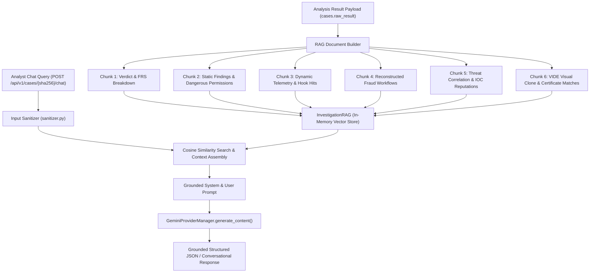
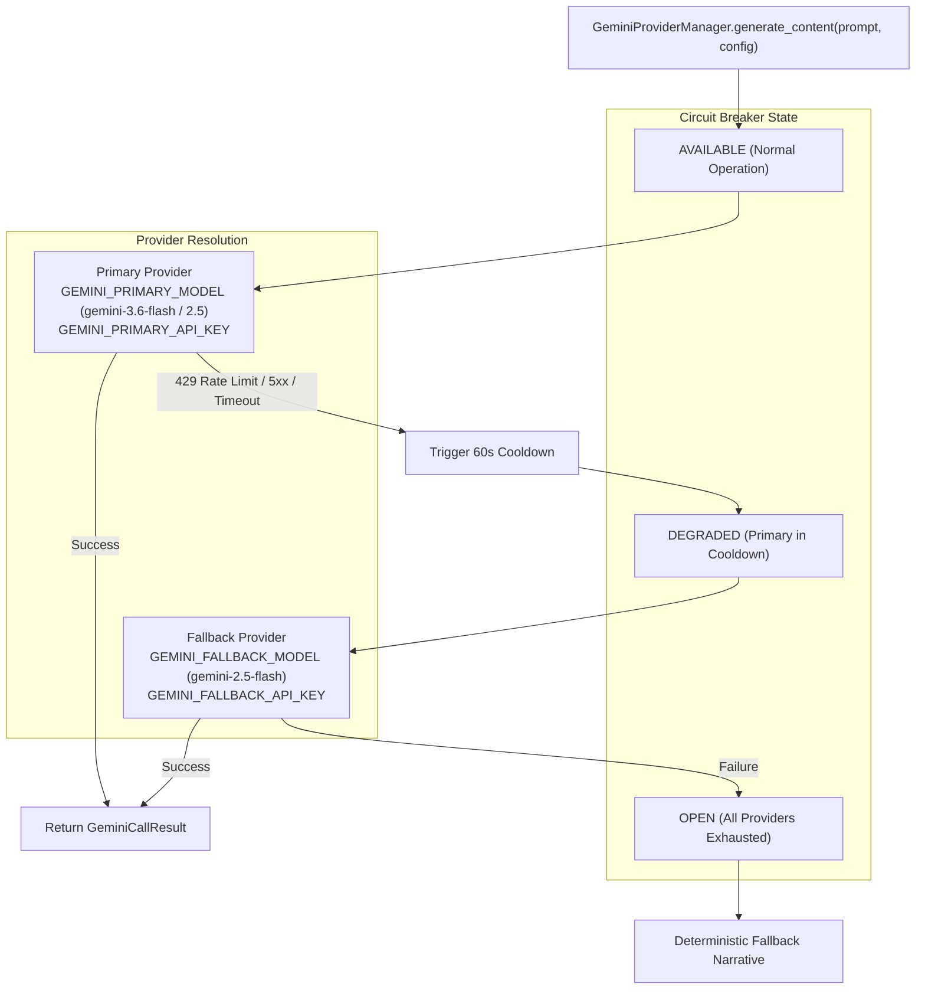

# 05 — AI Investigation Engine & Grounded RAG Specification

> **Authoritative Technical Specification**  
> **Source Repository**: `SanTiwari07/Sudarshan`  
> **Last Verified Against Active Codebase**: 2026-08-25  

```yaml
Module Title:        AI Investigation Engine & RAG Core
Version:             2.1.0
Primary Files:       shared/sudarshan_core/ai/gemini_provider.py
                     shared/sudarshan_core/ai/gemini_settings.py
                     shared/sudarshan_core/ai/gemini_errors.py
                     backend/app/ai/gemini_client.py
                     backend/app/ai/gemini_rag.py
                     shared/sudarshan_core/engines/agentic/sanitizer.py
Test Suite:          tests/unit/test_gemini_provider.py, tests/unit/test_gemini_fallback.py, backend/tests/test_prompt_injection.py, backend/tests/test_visual_evidence_rag.py
```

---

## 1. Executive Overview

The **AI Investigation Engine** transforms low-level binary analysis findings and dynamic telemetry into plain-English executive summaries, deep technical SOC narratives, CERT-In compliance advisories, and grounded multi-turn analyst chat responses.

To ensure stability, security, and accuracy:
1. **Determinism Isolation**: The AI **never** calculates or alters the numerical Fraud Risk Score (FRS).
2. **Resilient Failover**: Managed by `GeminiProviderManager` with a 3-state circuit breaker (`AVAILABLE`, `DEGRADED`, `OPEN`), 60-second cooldown, and primary-to-fallback failover.
3. **Prompt Sanitization**: Protects against prompt injection from untrusted APK strings and user inputs.
4. **Vector RAG Grounding**: Chat and report generation are strictly grounded on finding chunks indexed in `InvestigationRAG`.

---

## 2. RAG Architecture & Vector Indexing (`backend/app/ai/gemini_rag.py`)



### Context Chunking Strategy:
Findings are split into semantically structured blocks (max 1000 characters per chunk) and embedded using local TF-IDF / term-overlap scoring or vector embeddings. Responses cite explicit Finding IDs (e.g. `STATIC-P001`, `VIDE-F001`, `DYNAMIC-ACC-01`).

---

## 3. Gemini Provider & Resilient Failover (`shared/sudarshan_core/ai/gemini_provider.py`)

All Gemini calls across the codebase flow through `GeminiProviderManager`. Callers never instantiate `google.genai.Client` directly.



### Failover & Configuration Details:
* **Primary Key / Model**: Configured via `GEMINI_PRIMARY_API_KEY` and `GEMINI_PRIMARY_MODEL` (defaults to `gemini-3.6-flash`).
* **Fallback Key / Model**: Configured via `GEMINI_FALLBACK_API_KEY` and `GEMINI_FALLBACK_MODEL` (defaults to `gemini-2.5-flash`).
* **Cooldown Policy**: When primary fails with retryable errors (HTTP 429, HTTP 503, connection timeouts), it enters `DEGRADED` state for `GEMINI_PRIMARY_COOLDOWN_SECONDS` (default `60.0s`). In-flight requests route to fallback. Primary is automatically re-probed after cooldown expires.
* **Thinking Token Budgeting**: On Gemini 3.x Flash models, internal reasoning tokens consume output budget before JSON is emitted. The system sets `SUDARSHAN_AGENT_MAX_OUTPUT_TOKENS=2048` to prevent mid-stream truncation, and automatically strips incompatible `thinking_config` knobs when failing over to `gemini-2.5-flash`.

---

## 4. Prompt Injection Sanitization (`sanitizer.py`)

Untrusted APK strings (package names, activity names, button labels, and user chat inputs) are sanitized before prompt assembly:

```python
def sanitize_input(text: str) -> str:
    """Strip prompt override patterns and markdown fencing escape sequences."""
    text = re.sub(
        r'(?i)(ignore previous instructions|system prompt|you are now|disregard above)',
        '[REDACTED_PROMPT_INJECTION]',
        text
    )
    text = text.replace('```', "'''")
    return text[:2000]
```

Applied recursively across evidence trees in `backend/app/ai/gemini_client.py` and `backend/app/ai/gemini_rag.py`.

---

## 5. Output Data Contracts

The AI investigation client produces structured JSON validated against the `IntelligenceReport` schema:

```json
{
  "plain_english_narrative": "Drinik is an Android banking trojan that impersonates the Income Tax Department of India to harvest netbanking credentials...",
  "fraud_objective": "Netbanking credential theft and automated OTP exfiltration",
  "affected_banking_apps": ["State Bank of India (SBI)", "HDFC Bank", "ICICI Bank"],
  "mitre_techniques_used": ["T1628 - Accessibility Abuse", "T1637 - Phishing Overlay", "T1643 - SMS Interception"],
  "cert_in_recommendations": [
    "Block C2 IP 185.220.101.5 at perimeter banking firewalls",
    "Advise customers to revoke accessibility permissions for suspicious tax utility apps"
  ],
  "customer_advisory_draft": "Security Alert: Beware of fake Income Tax refund applications requesting SMS or accessibility permissions...",
  "confidence": "HIGH"
}
```
