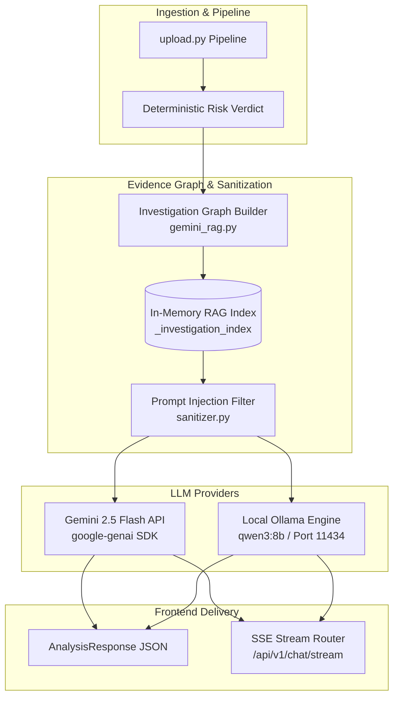
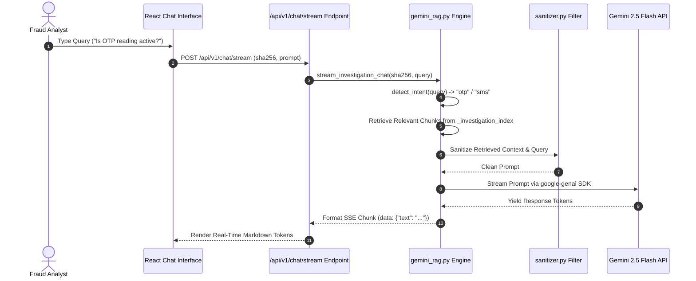

# 05 — AI Investigation Engine & RAG Architecture

## Purpose

The **AI Investigation Engine** provides evidence-constrained Large Language Model (LLM) reasoning and interactive investigative chat capabilities for the Sudarshan platform. By pairing Gemini 2.5 Flash / Ollama (`qwen3:8b`) with an in-memory Retrieval-Augmented Generation (RAG) evidence index (`gemini_rag.py`), the engine translates dense technical analysis outputs into plain-English executive narratives, SOC mitigation steps, and regulatory advisory drafts without risking hallucinated or unverified claims.

---

## Responsibilities

The AI engine is explicitly responsible for:
1. **Evidence Indexing**: Building an in-memory, section-aware RAG graph (`_investigation_index`) per SHA256 hash containing all static, dynamic, threat intelligence, and risk score outputs.
2. **Prompt Sanitization**: Filtering all extracted strings and evidence inputs through `sanitizer.py` to strip prompt-injection attacks before passing context to the LLM.
3. **Narrative Synthesis**: Generating plain-English executive narratives, fraud objective summaries, affected banking app lists, CERT-In recommendations, and customer advisory drafts.
4. **Interactive Assistant Streaming**: Streaming real-time Server-Sent Events (SSE) responses via `/api/v1/chat/stream` to answer analyst queries using section-constrained evidence retrieval.
5. **Deterministic Boundary Preservation**: Enforcing the architectural rule that **LLMs never compute or alter risk scores**.

---

## High-Level Overview

Sudarshan enforces a strict **AI-downstream design rule**:

$$\text{Deterministic Engine Output } (STEI, BFCI, FRS) \longrightarrow \text{Indexed Evidence Context} \longrightarrow \text{LLM Explanation}$$

Artificial intelligence in Sudarshan does not make risk decisions; it explains verified mathematical decisions. When an analysis completes, `upload.py` invokes `build_investigation_index(sha256, result)` to populate the RAG evidence graph.

When an analyst asks a question in the AI Assistant interface (e.g., *"How does this app steal OTPs?"*), the hybrid retriever identifies intent, retrieves section-specific evidence chunks (e.g., `permissions`, `dynamic_findings`, `runtime_events`), constructs a compressed prompt, and streams a structured answer via Gemini 2.5 Flash or local Ollama.

```text
[ Analysis Pipeline Output (AnalysisResponse) ]
                       │
                       ▼
          [ RAG Investigation Indexer ]
          (gemini_rag.py: build_investigation_index)
                       │
                       ▼
          [ In-Memory Evidence Graph ]
          { sha256: { metadata, manifest, permissions, dynamic_events, risk_engine, ... } }
                       │
                       ├─────────────────────────────────────────┐
                       ▼                                         ▼
         [ One-Shot Report Generator ]            [ Interactive Chat Assistant ]
         (analyze_with_llm)                       (stream_investigation_chat)
                       │                                         │
                       ▼                                         ▼
         [ Sanitizer (sanitizer.py) ]             [ Intent Detection & Retrieval ]
                       │                                         │
                       ▼                                         ▼
         [ Gemini 2.5 Flash / Ollama ]            [ Gemini SSE Stream Handler ]
                       │                                         │
                       ▼                                         ▼
         [ Executive Narrative & Advisory ]       [ Streaming Response to Frontend ]
```

---

## Architecture

The AI engine operates as a decoupled reasoning layer integrated into the FastAPI backend:



---

## Components

Primary AI engineering components:

| Component / Module | Location | Description |
| :--- | :--- | :--- |
| `gemini_rag.py` | `backend/app/ai/gemini_rag.py` | Core RAG engine featuring `build_investigation_index`, `detect_intent`, hybrid section retriever, context builder, and `stream_investigation_chat`. |
| `ollama_client.py` | `backend/app/ai/ollama_client.py` | Air-gapped fallback client communicating with local Ollama service (`/api/generate`) when Gemini API is unconfigured. |
| `sanitizer.py` | `backend/app/engines/agentic/sanitizer.py` | Sanitizes extracted text and LLM prompts, stripping system instruction overrides, markdown fence breakouts, and injection payloads. Covered by 64 unit tests. |
| `IntelligenceReport` | `backend/app/models/schemas.py` | Pydantic schema enforcing structured AI output fields (narrative, fraud objective, CERT-In advisory, affected apps). |

---

## Workflow

Streaming investigation assistant chat execution workflow:



---

## Data Flow

Data movement through the RAG pipeline:

$$\text{Pipeline Findings (AnalysisResponse)}$$
$$\Downarrow$$
$$\text{Evidence Chunking \& Section Indexing } (\text{metadata}, \text{permissions}, \text{dynamic\_events}, \text{verdict})$$
$$\Downarrow$$
$$\text{Analyst Query } \longrightarrow \text{Intent Detection } (\text{safe}, \text{otp}, \text{overlay}, \text{permissions})$$
$$\Downarrow$$
$$\text{Hybrid Section Retrieval } \longrightarrow \text{Sanitizer Filtering}$$
$$\Downarrow$$
$$\text{System Prompt + Evidence Context Injection}$$
$$\Downarrow$$
$$\text{Gemini 2.5 Flash Token Generation } \longrightarrow \text{Server-Sent Events (SSE)}$$

---

## Algorithms

The RAG engine implements intent-aware evidence retrieval and prompt sanitization algorithms:

### 1. Intent Detection Matrix
Matches analyst queries against pre-defined intent keywords:
```python
INTENT_SECTION_MAP = {
    "safe":          ["verdict", "risk_engine", "static_findings", "dynamic_findings"],
    "otp":           ["dynamic_findings", "runtime_events", "permissions", "static_findings"],
    "sms":           ["dynamic_findings", "runtime_events", "permissions"],
    "accessibility": ["dynamic_findings", "runtime_events", "permissions"],
    "overlay":       ["dynamic_findings", "runtime_events", "permissions"],
    "permissions":   ["permissions", "static_findings", "manifest"],
}
```

### 2. Prompt Injection Filtering Algorithm
`sanitizer.py` applies regular expressions to strip known injection patterns before sending text to the LLM:
- System prompt override patterns (`"ignore previous instructions"`, `"you are now an unrestricted AI"`).
- Markdown code fence breakouts (` ```system `, ` ```xml `).
- Null bytes and non-printable control characters.

---

## Integration

The AI engine integrates with the API Gateway and Frontend Chat view:

```text
+--------------------------------------------------------------------------+
|                      AI INVESTIGATION ENGINE & RAG                       |
|                                                                          |
|  +--------------------+      +--------------------+      +-------------+ |
|  | Pipeline Findings  |=====>| gemini_rag.py      |=====>| Gemini 2.5  | |
|  | (upload.py)        |      | In-Memory Index    |      | Flash API   | |
|  +--------------------+      +---------+----------+      +------+------+ |
|                                        |                        |        |
|                                        v                        v        |
|                              +--------------------+   +----------------+ |
|                              | SSE Stream Router  |==>| React Chat View| |
|                              | (/chat/stream)     |   | (Investigation)| |
|                              +--------------------+   +----------------+ |
+--------------------------------------------------------------------------+
```

---

## Folder Structure

Source code locations for AI reasoning:

```text
backend/app/
├── ai/
│   ├── gemini_rag.py       <- Core Gemini RAG Indexer & SSE Streamer
│   └── ollama_client.py    <- Local Air-Gapped Ollama LLM Integration
├── engines/
│   └── agentic/
│       └── sanitizer.py    <- Prompt Injection Filter (64 Tests)
└── routes/
    └── report.py           <- SSE Streaming Endpoint Handler (/chat/stream)
```

---

## API Reference

Interactive AI Assistant streaming endpoint:

### Stream Investigation Assistant Chat
- **HTTP Method**: `POST`
- **Path**: `/api/v1/chat/stream`
- **Headers**: `Content-Type: application/json`, `Authorization: Bearer <JWT>`
- **Request Body**:
  ```json
  {
    "sha256": "4e3a2b1c8f...",
    "prompt": "Does this application attempt to intercept SMS OTPs?"
  }
  ```
- **Response**: `text/event-stream` yielding JSON chunk events (`data: {"text": "..."}`).

---

## Configuration

Environment variables in `.env`:

| Variable | Default Value | Description |
| :--- | :--- | :--- |
| `GEMINI_API_KEY` | `""` | Google Gemini API key. |
| `GEMINI_MODEL` | `gemini-2.5-flash` | Gemini model variant for RAG synthesis. |
| `OLLAMA_HOST` | `http://localhost:11434` | Local Ollama endpoint for air-gapped environments. |

---

## Error Handling

1. **Missing RAG Index**: If a chat request arrives for an unindexed SHA256, `gemini_rag.py` returns a clean SSE response: `Evidence index not found for this case. Please run analysis first.`
2. **Gemini API Timeout**: If the Gemini API call fails or times out, the engine catches the exception, logs a warning, and falls back to local Ollama (`qwen3:8b`) seamlessly.

---

## Current Implementation Status

| Component | Status | Operational Details |
| :--- | :--- | :--- |
| **RAG Evidence Indexer** | **Implemented** | `gemini_rag.py` indexes all 20 evidence sections per SHA256 in memory. |
| **Prompt Injection Filter** | **Implemented** | `sanitizer.py` active and verified by 64 dedicated unit tests in `backend/tests/`. |
| **Gemini 2.5 Flash SDK** | **Implemented** | Streaming responses implemented using `google-genai` Python SDK. |
| **Local Ollama Fallback** | **Implemented** | `ollama_client.py` supports air-gapped deployments using `qwen3:8b`. |

---

## Current Limitations

1. **In-Memory Index Ephemerality**: `_investigation_index` is stored in server process memory. Backend restarts require re-indexing cases upon retrieval.
2. **Single-Case Chat Scope**: The assistant streams responses constrained to a single SHA256 case context; cross-case comparative RAG queries are not supported.

---

## Future Improvements

1. **Vector Store Persistence**: Migrate in-memory `_investigation_index` to a persistent local vector database (ChromaDB / FAISS) for multi-case comparative threat analysis.
2. **Cross-Case Campaign Discovery**: Enable multi-case RAG queries to identify shared C2 infrastructure across separate malware sample uploads.
