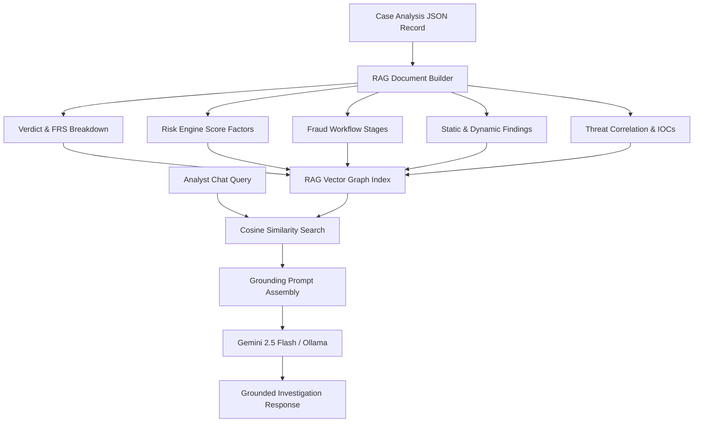

# 05 — AI Investigation Engine & RAG Specification

```yaml
Module Title:        AI Investigation Engine & RAG Core
Version:             2.2.0-STABLE
Primary Files:       backend/app/ai/gemini_rag.py
                     backend/app/ai/ollama_client.py
                     backend/app/engines/agentic/sanitizer.py
Test Suite:          tests/test_prompt_injection.py, tests/test_gemini_rag.py
```

---

## Table of Contents
- [1. Executive Overview](#1-executive-overview)
- [2. RAG Architecture & Context Vector Graph](#2-rag-architecture--context-vector-graph)
- [3. Gemini 2.5 Flash & Ollama Integration](#3-gemini-2.5-flash--ollama-integration)
- [4. Prompt Injection Sanitization Guard](#4-prompt-injection-sanitization-guard)
- [5. Anti-Hallucination Evidence Clamps](#5-anti-hallucination-evidence-clamps)
- [6. Threat Attribution & Banking Intelligence Graph](#6-threat-attribution--banking-intelligence-graph)

---

## 1. Executive Overview

The **AI Investigation Engine** serves as the intelligence layer of the Sudarshan platform. It transforms structured findings ($STEI$, $BFCI\text{ v2}$, $FRS$, extracted string IOCs, Frida events, and reconstructed fraud workflows) into plain-English executive narratives, technical SOC breakdowns, CERT-In regulatory advisories, and real-time analyst chat responses.

---

## 2. RAG Architecture & Context Vector Graph (`gemini_rag.py`)



---

## 3. Gemini 2.5 Flash & Ollama Integration

- **Primary Cloud Model**: **Gemini 2.5 Flash** (`gemini-2.5-flash`) via official Google GenAI SDK.
- **Air-Gapped Local Model**: Local **Ollama** instance (`Qwen3:8b`, `Llama-3`, or `Mistral`) on port 11434.
- **Output Contracts**: Standardized Pydantic `IntelligenceReport` model:
  - `plain_english_narrative`
  - `fraud_objective`
  - `affected_banking_apps`
  - `mitre_techniques_used`
  - `cert_in_recommendations`
  - `customer_advisory_draft`

---

## 4. Prompt Injection Sanitization Guard (`sanitizer.py`)

All strings extracted from un-trusted APK binaries (class names, method strings, layout text, UI labels) are sanitized prior to prompt assembly:

```python
def sanitize_input(text: str) -> str:
    """Strip system prompt override attempts and markdown fencing escape sequences."""
    text = re.sub(r'(?i)(ignore previous instructions|system prompt|you are now)', '[REDACTED_PROMPT_INJECTION]', text)
    text = text.replace('```', "'''")
    return text[:2000]
```

Tested against 64 adversarial injection payloads (`test_prompt_injection.py`).

---

## 5. Anti-Hallucination Evidence Clamps

To guarantee zero hallucinated verdicts:
1. **Determinism Isolation**: The LLM is **never permitted to generate or modify numerical risk scores** ($FRS$).
2. **Context Clamping**: Prompts mandate that any claim regarding targeted banking apps or exfiltrated data must reference an explicit finding ID in the RAG context.
3. **Structured Fallback**: If LLM services fail or return 404/500, a rule-derived fallback narrative is generated deterministically.

---

## 6. Threat Attribution & Banking Intelligence Graph

The engine maps observed evidence against known threat actors and banking malware families (*Drinik*, *Xenomorph*, *Anatsa*, *Cerberus*):

- **MITRE ATT&CK for Mobile**: Maps findings to technique IDs (`T1628` Accessibility Abuse, `T1637` App Overlay, `T1643` SMS Theft).
- **Banking Application Graph**: Cross-references package names against 47 Indian financial applications (SBI, HDFC, ICICI, Axis, PhonePe, Paytm, BHIM, Google Pay).
