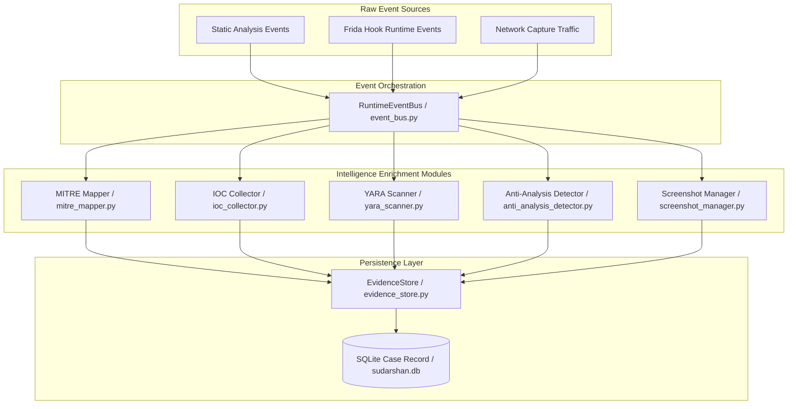
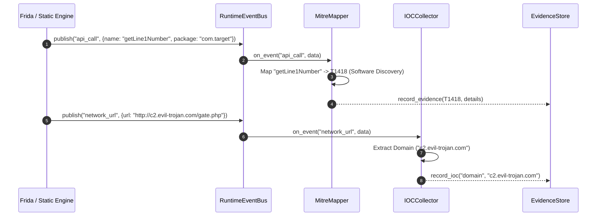

# 06 — Evidence Processing & Intelligence Pipeline

## Purpose

The **Evidence Processing Engine** normalizes, correlates, enriches, and stores raw static, dynamic, network, and file system artifacts collected during application analysis. By mapping extracted behaviors to the MITRE ATT&CK for Mobile framework, extracting Indicators of Compromise (IOCs), scanning DEX payloads with YARA rules, and tracking visual UI screenshots, this engine converts unstructured operational logs into structured, chain-of-custody evidence records.

---

## Responsibilities

The evidence processing pipeline is responsible for:
1. **Event Bus Decoupling**: Receiving runtime events from Frida hooks, network captures, and static scanners over an in-memory `RuntimeEventBus`.
2. **Chain-of-Custody Evidence Storage**: Persisting granular evidence records (`EvidenceRecord`) into `EvidenceStore` with SHA256 integrity hashes and timestamp metadata.
3. **MITRE ATT&CK for Mobile Mapping**: Automatically mapping observed permissions, API calls, and behaviors to standard MITRE ATT&CK for Mobile technique IDs (e.g., `T1417`, `T1418`, `T1516`, `T1623`).
4. **IOC Extraction**: Harvesting IPv4/IPv6 addresses, C2 domain names, cryptocurrency wallet addresses, and cryptographic file hashes via `IOCCollector`.
5. **YARA Pattern Matching**: Executing compiled YARA rules (`yara-python`) against decompiled DEX files and dropped dynamic payloads via `YARAScanner`.
6. **Anti-Analysis Detection**: Identifying environment evasion checks (emulator checks, root checks, Frida detection) via `AntiAnalysisDetector`.

---

## High-Level Overview

Evidence processing operates asynchronously alongside the analysis pipeline. As static analyzers unpack binaries and Frida hooks intercept runtime calls, events are published to the `RuntimeEventBus`.

Subscribers process these events in real time:
- `MitreMapper` tags events with MITRE ATT&CK for Mobile IDs.
- `IOCCollector` extracts domain names, IP addresses, and hashes.
- `YARAScanner` runs rule matching on unpacked bytecode.
- `ScreenshotManager` captures and indexes PNG screenshots of UI state transitions.
- `EvidenceStore` records structured evidence entries into memory/disk buffer.

```text
[ Raw Event Sources (Static, Frida Hooks, Network, Files) ]
                            │
                            ▼
                  [ RuntimeEventBus ]
             (app.engines.event_bus)
                            │
     ┌──────────────────────┼──────────────────────┐
     │                      │                      │
     ▼                      ▼                      ▼
[ MITRE Mapper ]     [ IOC Collector ]     [ YARA Scanner ]
(mitre_mapper.py)    (ioc_collector.py)    (yara_scanner.py)
     │                      │                      │
     └──────────────────────┼──────────────────────┘
                            │
                            ▼
                 [ Anti-Analysis Detector ]
               (anti_analysis_detector.py)
                            │
                            ▼
                   [ EvidenceStore ]
              (app.engines.evidence_store)
```

---

## Architecture

The evidence processing pipeline acts as an internal intelligence enrichment layer between raw extraction and risk calculation:



---

## Components

Components comprising the evidence processing pipeline:

| Component / Module | Source Location | Description & Responsibilities |
| :--- | :--- | :--- |
| `RuntimeEventBus` | `backend/app/engines/event_bus.py` | In-memory pub/sub event router distributing runtime events to registered listeners. |
| `EvidenceStore` | `backend/app/engines/evidence_store.py` | Manages structured evidence entries (`EvidenceRecord`) with metadata, timestamping, and evidence category tags. |
| `MitreMapper` | `backend/app/engines/mitre_mapper.py` | Maps observed API calls and permission flags to MITRE ATT&CK for Mobile technique IDs and tactics. |
| `IOCCollector` | `backend/app/engines/ioc_collector.py` | Regex-based extraction engine harvesting IPv4/IPv6, domains, crypto wallets, and URL paths. |
| `YARAScanner` | `backend/app/engines/yara_scanner.py` | Executes `yara-python` compiled rules against raw APK files, DEX bytecode, and memory dumps. |
| `AntiAnalysisDetector` | `backend/app/engines/anti_analysis_detector.py` | Flags root detection, Build property checks, Frida port checks, and debugger detection attempts. |
| `ScreenshotManager` | `backend/app/engines/screenshot_manager.py` | Captures, compresses, and indexes PNG screenshots taken during AVD UI exploration. |

---

## Workflow

Evidence processing execution sequence:



---

## Data Flow

Data transformation through the evidence pipeline:

$$\text{Raw Event } (\text{API Hook, Perm Request, Network Socket})$$
$$\Downarrow$$
$$\text{RuntimeEventBus Dispatch}$$
$$\Downarrow$$
$$\text{Parallel Enrichment: MITRE ID Mapping } (T1417) + \text{IOC Regex Extraction}$$
$$\Downarrow$$
$$\text{EvidenceRecord Construction } (\text{category}, \text{technique\_id}, \text{raw\_payload}, \text{timestamp})$$
$$\Downarrow$$
$$\text{EvidenceStore Persistence \& JSON Serialization}$$

---

## Algorithms

The evidence processing engine implements deterministic mapping and regex extraction algorithms:

### 1. MITRE ATT&CK for Mobile Technique Mapper
Maps observed API hooks and permissions to standard MITRE technique IDs:
- **Accessibility Service Enabling**: `T1417` (Input Capture: Keylogging / Screen Scraping).
- **SMS Interception / Reading**: `T1412` (SMS Interception) & `T1516` (Input Prompting).
- **Overlay Window Drawing**: `T1411` (Input Capture: Overlay Attack).
- **Device Admin Request**: `T1623` (Device Lock Escape / Privilege Escalation).
- **Installed Package Enumeration**: `T1418` (Software Discovery).

### 2. IOC Extraction Patterns
Harvests structured IOCs using strict validation regular expressions:
- **IPv4 Address**: `\b(?:[0-9]{1,3}\.){3}[0-9]{1,3}\b` (excluding private ranges `127.0.0.1`, `10.0.0.0/8`).
- **Domain Name**: `(?:\b[a-z0-9]+(?:-[a-z0-9]+)*\.)+[a-z]{2,}\b` (excluding system domains `android.com`, `google.com`).
- **Cryptocurrency Wallets**: Bitcoin (`^[13][a-km-zA-HJ-NP-Z1-9]{25,34}$`), Ethereum/USDT (`^0x[a-fA-F0-9]{40}$`).

---

## Integration

Evidence processing connects extraction engines to the Risk Engine and Dashboard:

```text
+-------------------------------------------------------------------------+
|                      EVIDENCE PROCESSING ENGINE                         |
|                                                                         |
|  +--------------------+      +-------------------+      +-------------+ |
|  | Event Bus          |=====>| Intelligence      |=====>| Evidence    | |
|  | (event_bus.py)     |      | Enrichers         |      | Store       | |
|  +--------------------+      +---------+---------+      +------+------+ |
|                                        |                       |        |
|                                        v                       v        |
|                              +-------------------+   +----------------+ |
|                              | Risk Engine       |   | Dashboard      | |
|                              | (Evidence Inputs) |   | Technical View | |
|                              +-------------------+   +----------------+ |
+-------------------------------------------------------------------------+
```

---

## Folder Structure

Source files for evidence processing in `backend/app/engines/`:

```text
backend/app/engines/
├── event_bus.py               <- In-Memory Pub/Sub Runtime Event Bus
├── evidence_store.py          <- Evidence Storage & Chain-of-Custody Schema
├── mitre_mapper.py            <- MITRE ATT&CK for Mobile Technique Mapper
├── ioc_collector.py           <- Regex IOC Extractor (IPs, Domains, Wallets)
├── yara_scanner.py            <- YARA Bytecode Scanner (yara-python)
├── anti_analysis_detector.py  <- Emulator & Root Evasion Detector
└── screenshot_manager.py      <- AVD Screenshot Capture Manager
```

---

## API Reference

Evidence exports are exposed via report endpoints:

### Export IOC CSV Feed
- **HTTP Method**: `GET`
- **Path**: `/api/v1/report/csv/{sha256}`
- **Response**: `text/csv` attachment listing extracted IOCs (`indicator`, `type`, `severity`, `first_seen`).

---

## Configuration

Environment variables in `.env`:

| Variable | Default Value | Description |
| :--- | :--- | :--- |
| `SUDARSHAN_YARA_RULES_DIR` | `./yara_rules` | Path to custom YARA rule files directory. |
| `SUDARSHAN_SCREENSHOT_DIR` | `./screenshots` | Path to store AVD screen captures. |

---

## Error Handling

1. **YARA Compilation Error**: If a YARA rule file contains syntax errors, `YARAScanner` catches `yara.SyntaxError`, logs an error message, and continues scanning with valid rule sets.
2. **Invalid Regex match**: `IOCCollector` filters false-positive IP matches (e.g., local loopback `127.0.0.1`, internal emulator gateway `10.0.2.2`) automatically before recording IOC entries.

---

## Current Implementation Status

> [!WARNING]
> **Implementation Status: Partial**

- **Module Build Status**: ~60% completed. `EvidenceStore`, `RuntimeEventBus`, `MitreMapper`, `IOCCollector`, `YARAScanner`, and `AntiAnalysisDetector` exist in `backend/app/engines/`.
- **Dynamic Event Gap**: Because Frida hooks yield 0 runtime events due to Frida 17 issues on the AVD, the evidence pipeline primarily processes static evidence inputs.

---

## Current Limitations

1. **Dynamic MITRE Coverage**: Dynamic MITRE techniques (`T1411` Overlay, `T1412` SMS Interception) rely on runtime event streams; when Frida events fail to fire, these techniques remain unflagged in dynamic evidence.
2. **Disk Buffer Cleanup**: PNG screenshots captured by `ScreenshotManager` require periodic background cleanup jobs to prevent disk exhaustion.

---

## Future Improvements

1. **Automated Evidence Deduplication**: Implement cryptographic hashing across evidence records to eliminate duplicate API hook entries.
2. **STIX 2.1 Pattern Generation**: Automatically convert extracted YARA matches and IOCs into formal STIX 2.1 Indicator patterns.
